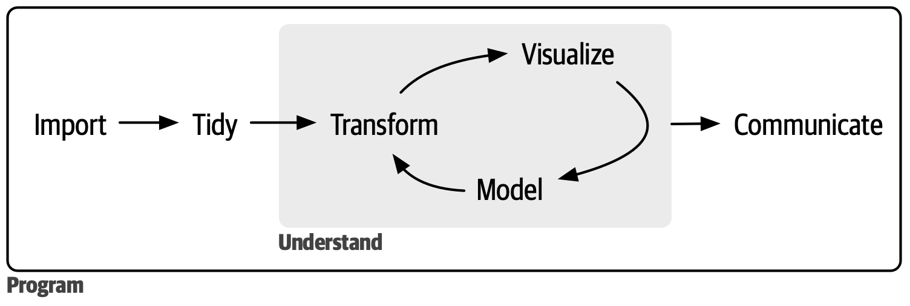

```{r setup, include = FALSE}
library(learnr)
library(tutorial.helpers)
library(tidyverse)

knitr::opts_chunk$set(echo = FALSE)
knitr::opts_chunk$set(out.width = '90%')
options(tutorial.exercise.timelimit = 60, 
        tutorial.storage = "local") 

scat_p <- ggplot(data = mpg, 
                 mapping = aes(x = displ, 
                               y = hwy)) +
  geom_point(alpha = 0.5, color = "steelblue") +
  labs(title = "Measurements for Engine Displacement and Highway Fuel Efficiency of Select Car Models",
       subtitle = "Cars with greater engineer displacement are less fuel efficient",
        x = "Engine Displacement (L)",
        y = "Highway Efficiency (mpg)", 
       caption = "EPA (2008)")
```

```{r copy-code-chunk, child = system.file("child_documents/copy_button.Rmd", package = "tutorial.helpers")}
```

```{r info-section, child = system.file("child_documents/info_section.Rmd", package = "tutorial.helpers")}
```

<!-- Took students 42 minutes on average, so could add a lot more material. 60 minutes is a good target. -->


<!-- Fix introduction and summary. DONE-->

<!-- Should the data pipe come before the plot? No need, I also add some plot excersises to the pipe-->

<!-- Make this tutorial better. Make sure there are no mistakes. Make sure it is clear. Drop a bunch of knowledge from Chapter 1. But also do some reminding of stuff from Getting Started from tutorial.helpers. -->

<!-- Explain to students how to move border pane around.  In the introduction to the setting of RStudio, there could be more information on how to manipulate the size of each pane (ex. to view the content of the tutorial, to have more space for coding). Necessary? Maybe no?-->


## Introduction
### 

This tutorial covers the [Introduction](https://r4ds.hadley.nz/intro.html) from [*R for Data Science (2e)*](https://r4ds.hadley.nz/) by Hadley Wickham, Mine Çetinkaya-Rundel, and Garrett Grolemund. You will learn how to work with data sets using 2 R packages **dplyr** and **ggplot2**. You will learn how to paste the result of one function to another using the pipe `|>` and make a cool plot using the `ggplot()` function then store it in an R script.

<!-- DK: What will they learn? Revisit: https://ppbds.github.io/tutorial.helpers/articles/books.html -->

### 

This tutorial assumes that you have already completed the "Getting Started with Tutorials" in the [**tutorial.helpers**](https://ppbds.github.io/tutorial.helpers/) package. If you haven't, do so now. It is quick!


## What you will learn
### 

You will learn how to explore new data sets using functions like `summary()`, `glimpse()`, and `slice_sample()` to get an overview of 2 data sets: `diamonds` and `midwest`. 

### Exercise 1

Data science is a vast field, and there’s no way you can master it all by reading a single book. This book aims to give you a solid foundation on the most important tools and enough knowledge to find the resources to learn more when necessary. The steps of a typical data science project looks something like this:

```{r what-you-will-learn-1}

```

### 

Looking at the graphic above, the first step in a data science project is to import your data into R. This typically means that you take data stored in a file, database, or web application programming interface (API) and load it into a data frame in R. If you can’t get your data into R, you can’t do data science on it!

### Exercise 2

Before you start doing data science, you must load the packages you are going to use. Use the function `library()` to load the **tidyverse** package.

```{r what-you-will-learn-2, exercise = TRUE}

```

```{r what-you-will-learn-2-hint-1, eval = FALSE}
library(...)
```

```{r what-you-will-learn-2-test, include = FALSE}
library(tidyverse)
```

### 

Nothing is returned, which is often the case with R code. But note the check mark which has appeared next to "Exercise 2" above. This indicates that you have only submitted your answer and doesn't verify if you have answered the question correctly.

### Exercise 3

Data frames, also referred to as "tibbles", are spreadsheet-type data sets. Type `diamonds` in the line below.

```{r what-you-will-learn-3, exercise = TRUE}

```

```{r what-you-will-learn-3-hint-1, eval = FALSE}
diamonds
```

```{r what-you-will-learn-3-test, include = FALSE}
diamonds
```

### 

After importing your data, it is a good idea to **tidy** it. Tidying your data means storing it in a consistent form that matches the semantics of the dataset with how it is stored. 

### Exercise 4

Run `summary()` on `diamonds`. This function provides a quick statistics overview of each variable in the data set. 

```{r what-you-will-learn-4, exercise = TRUE}

```

```{r what-you-will-learn-4-hint-1, eval = FALSE}
summary(...)
```

```{r what-you-will-learn-4-test, include = FALSE}
summary(diamonds)
```

### 

When your data is tidy, each column is a variable and each row is an observation. Tidy data is important because the consistent structure lets you focus your efforts on answering questions about the data, not fighting to get the data into the right form for different functions. 

### Exercise 5

**Visualization** is a fundamentally human activity. A good visualization will show you things you did not expect or raise new questions about the data. 

```{r echo = TRUE}
ggplot(data = diamonds, 
               mapping = aes(x = carat, 
                             y = price)) +
  geom_point(alpha = 0.5, color = "steelblue") +
  labs(title = "Price of Diamonds by Carat",
       x = "Carat",
       y = "Price",
       caption = "Diamonds (2008)")
```

### 

A good visualization might also hint that you’re asking the wrong question or that you need to collect different data. Visualizations can surprise you, but they don’t scale particularly well because they require a human to interpret them. 

### Exercise 6

Run `slice_sample()` on `diamonds`. This selects a random row from the data set.

```{r what-you-will-learn-6, exercise = TRUE}

```

```{r what-you-will-learn-6-hint-1, eval = FALSE}
slice_sample(...)
```

```{r what-you-will-learn-6-test, include = FALSE}
slice_sample(diamonds)
```

Once you have tidy data, a common next step is to **transform** it. Transformation includes narrowing in on observations of interest (like all people in one city or all data from the last year), creating new variables that are functions of existing variables (like computing speed from distance and time), and calculating a set of summary statistics (like counts or means). 

### Exercise 7

Copy paste the code above, but add the argument `n = 10` to `slice_sample()`. This will return 50 random rows from the `diamonds` data set.

```{r what-you-will-learn-7, exercise = TRUE}

```

<button onclick = "transfer_code(this)">Copy previous code</button>

```{r what-you-will-learn-7-hint-1, eval = FALSE}
slice_sample(..., n = 10)
```

```{r what-you-will-learn-7-test, include = FALSE}
slice_sample(diamonds, n = 10)
```

### 

Together, tidying and transforming are called **wrangling** because getting your data in a form that’s natural to work with often feels like a fight! 

### Exercise 8

Run `print()` on `diamonds`. This returns the same result as typing `diamonds` in the code block. 

```{r what-you-will-learn-8, exercise = TRUE}

```

```{r what-you-will-learn-8-hint-1, eval = FALSE}
...(diamonds)
```

```{r what-you-will-learn-8-test, include = FALSE}
print(diamonds)
```

### 

You can choose how many rows to display by using the `n` argument in the `print()` function, and how many columns to display by using the `width` argument.

### Exercise 9

Run `print()` on `diamonds` with the argument `n = 3`. This returns the first 3 rows of the `diamonds` data set.

```{r what-you-will-learn-9, exercise = TRUE}

```

```{r what-you-will-learn-9-hint-1, eval = FALSE}
print(..., n = 3)
```

```{r what-you-will-learn-9-test, include = FALSE}
print(diamonds, n = 3)
```

### 

The `diamonds` data set contains 53,940 rows and 10 columns. Each row represents a single diamond, and each column represents a different characteristic of the diamond. 

### Exercise 10

Type `?diamonds` to look up the help page for the `diamonds` tibble from the **ggplot2** package, which is one of the core packages in the *Tidyverse*.

```{r what-you-will-learn-10, exercise = TRUE}

```

```{r what-you-will-learn-10-hint-1, eval = FALSE}
?...
```

Copy/paste the Description from the help page into the box below.

```{r looking-at-data-4-b}
question_text(NULL,
	answer(NULL, correct = TRUE),
	allow_retry = TRUE,
	try_again_button = "Edit Answer",
	incorrect = NULL,
	rows = 3)
```

### 

You can find help about an entire package with `help(package = "ggplot2")`. It is confusing, but unavoidable, that package names are sometimes unquoted, as in `library(ggplot2)`, and sometimes quoted, as in `help(package = "ggplot2")`. If one does not work, try the other.

### Exercise 11

Run `glimpse()` on `diamonds`. 

```{r what-you-will-learn-11, exercise = TRUE}

```

```{r what-you-will-learn-11-hint-1, eval = FALSE}
...(diamonds)
```

```{r what-you-will-learn-11-test, include = FALSE}
glimpse(diamonds)
```

### 

`glimpse()` displays columns running down the page and the data running across across. Note how the "type" of each variable is listed next to the variable name. For example, `price` is listed as `<int>`, meaning that it is an integer variable. To learn more about the `glimpse()` function, run `?glimpse`.

### Exercise 12

Type `midwest` and hit "Run Code."

```{r what-you-will-learn-12, exercise = TRUE}

```

```{r what-you-will-learn-12-hint-1, eval = FALSE}
midwest
```

```{r what-you-will-learn-12-test, include = FALSE}
midwest
```

### 

**Models** are complementary tools to visualization. Once you have made your questions sufficiently precise, you can use a model to answer them. Models are fundamentally mathematical or computational tools, so they generally scale well. 

### Exercise 13

Run `summary()` on `midwest`. 

```{r what-you-will-learn-13, exercise = TRUE}

```

```{r what-you-will-learn-13-hint-1, eval = FALSE}
summary(...)
```

```{r what-you-will-learn-13-test, include = FALSE}
summary(midwest)
```

### 

Even when they don’t, it’s usually cheaper to buy more computers than it is to buy more brains! But every model makes assumptions, and by its very nature, a model cannot question its own assumptions. That means a model cannot fundamentally surprise you. 

### Exercise 14

Run `slice_sample()` on `midwest`. 

```{r what-you-will-learn-14, exercise = TRUE}

```

```{r what-you-will-learn-14-hint-1, eval = FALSE}
slice_sample(...)
```

```{r what-you-will-learn-14-test, include = FALSE}
slice_sample(midwest)
```

### 

Referring again to our graphic, the last step of data science is **communication**, an absolutely critical part of any data analysis project. It doesn’t matter how well your models and visualization have led you to understand the data unless you can also communicate your results to others.

### Exercise 15

Copy paste the code above, but add the argument `n = 50` to `slice_sample()`. 

```{r what-you-will-learn-15, exercise = TRUE}

```

<button onclick = "transfer_code(this)">Copy previous code</button>

```{r what-you-will-learn-15-hint-1, eval = FALSE}
slice_sample(..., n = 50)
```

```{r what-you-will-learn-15-test, include = FALSE}
slice_sample(midwest, n = 50)
```

### 

Surrounding all these tools is **programming**. Programming is a cross-cutting tool that you use in nearly every part of a data science project. You don’t need to be an expert programmer to be a successful data scientist, but learning more about programming pays off because becoming a better programmer allows you to automate common tasks and solve new problems with greater ease.

### Exercise 16

Run `glimpse()` on `midwest`. 

```{r what-you-will-learn-16, exercise = TRUE}

```

```{r what-you-will-learn-16-hint-1, eval = FALSE}
glimpse(...)
```

```{r what-you-will-learn-16-test, include = FALSE}
glimpse(midwest)
```

### 

`view()` is another useful function, but, just because it is interactive, we should not use it within a tutorial. 

### Exercise 17

If you are ever stuck while coding, R has *help pages*. Let's say we want to know what the function `sqrt()` does. Open the help page for `sqrt()` by typing `?sqrt` below.

```{r what-you-will-learn-17, exercise = TRUE}

```

```{r what-you-will-learn-17-hint-1, eval = FALSE}
?...
```

### 

Note that "library" and "package" mean the same thing in R. We have different words for historical reasons. However, only the `library()` command will load a package/library, giving us access to the functions and data which it contains.

### Exercise 18

Assign the value of `sqrt(144)` to the variable `x`. Remember to use the assignment operator `<-`.

```{r what-you-will-learn-18, exercise = TRUE}

```

```{r what-you-will-learn-18-hint-1, eval = FALSE}
x <- ...(144)
```

```{r what-you-will-learn-18-test, include = FALSE}
x <- sqrt(144)
```

### 

The assignment operator `<-` is used to assign values to variables. The left side of the operator is the variable name, and the right side is the value to be assigned. The value can be a number, a string, a logical value, or the result of a function. 

### Exercise 19

Type `x` in the exercise code block below. Note that it will return an error. 

```{r what-you-will-learn-19, exercise = TRUE}

```

```{r what-you-will-learn-19-hint-1, eval = FALSE}
x
```

### 

This is because the variable `x` is only available in the code block where it was created. If you want to use `x` in another code block, you must assign it again.

### Exercise 20

*Code comments* are text placed after a `#` symbol. Nothing will be run after a `#` symbol, which is useful if you want to write human readable comments in your code.

### 

Press "Run Code." Afterwards, add the `#` and re-run the code block. You should no longer see a result.

```{r what-you-will-learn-20, exercise = TRUE}
sqrt(144)
```

## How this book is organized
### 

The previous description of the tools of data science is organized roughly according to the order in which you use them in an analysis (although, of course, you’ll iterate through them multiple times). In our experience, however, learning data importing and tidying first is suboptimal because, 80% of the time, it’s routine and boring, and the other 20% of the time, it’s weird and frustrating. That’s a bad place to start learning a new subject!

Instead, we’ll start with visualization and transformation of data that’s already been imported and tidied. 

### 

Let's create the following scatterplot from the `mpg` dataset, which provides measurements of attributes from various car models.

```{r scat-p}
scat_p
```

### Exercise 1

Run `?mpg` to look up the help page for the `mpg` tibble from the **ggplot2** package. 

```{r how-this-book-is-organized-1, exercise = TRUE}

```

```{r how-this-book-is-organized-1-hint-1, eval = FALSE}
?mpg
```

### 

This dataset contains a subset of the fuel economy data that the EPA makes available on https://fueleconomy.gov/. It contains only models which had a new release every year between 1999 and 2008 - this was used as a proxy for the popularity of the car.

### Exercise 2

First, let's `glimpse()` the `mpg` data set. Looking at the axis titles above, can you determine what the names are for the two variables we will use?

```{r how-this-book-is-organized-2, exercise = TRUE}

```

```{r how-this-book-is-organized-2-hint-1, eval = FALSE}
glimpse(...)
```

```{r how-this-book-is-organized-2-test, include = FALSE}
glimpse(mpg)
```

### 

`glimpse()` is most effective when you want to see both all the variables in a data set and many observations.

We are going to use `displ` and `hwy` to create the plot.

### Exercise 3

Referring to what pops up when you run `?mpg`, describe in your own words what `displ` and `hwy` stand for? 

```{r how-this-book-is-organized-3}
question_text(NULL,
	message = "In the `mpg` data set, `displ` stands for engine displacement, measured in litres while `hwy` stands for highway miles per gallon.",
	answer(NULL, correct = TRUE),
	allow_retry = FALSE,
	incorrect = NULL,
	rows = 6)
```

### 

### Exercise 4

Run `ggplot()`, setting `data` equal to `mpg`.

```{r how-this-book-is-organized-4, exercise = TRUE}

```

```{r how-this-book-is-organized-4-hint-1, eval = FALSE}
...(data = mpg)
```

```{r how-this-book-is-organized-4-test, include = FALSE}
ggplot(data = mpg)
```

`ggplot()` initializes a ggplot object. Your output should be an empty screen.

### Exercise 5

The first argument to `ggplot()` is `data`, as above. The second argument is `mapping`. Set the `mapping` to equal `aes()`, which is the "aesthetics" function for plotting.

```{r how-this-book-is-organized-5, exercise = TRUE}

```

<button onclick = "transfer_code(this)">Copy previous code</button>

```{r how-this-book-is-organized-5-hint-1, eval = FALSE}
ggplot(data = mpg, ... = ...())
```

```{r how-this-book-is-organized-5-test, include = FALSE}
ggplot(data = mpg, mapping = aes())
```

This produces the same blank canvas as above. We need to specify some arguments to `aes()` in order to generate the plot.

### Exercise 6

The two most important arguments in `aes()` are `x` and `y`. Set `x` equal to `displ`. Set `y` equal to `hwy`.


```{r how-this-book-is-organized-6, exercise = TRUE}

```

<button onclick="transfer_code(this)">Copy previous code</button>

```{r how-this-book-is-organized-6-hint-1, eval = FALSE}
ggplot(data = mpg, 
       mapping = aes(x = ...,
                     y = ...))
```

```{r how-this-book-is-organized-6-test, include = FALSE}
ggplot(data = mpg, 
       mapping = aes(x = displ, 
                     y = hwy))
```

### 

Anything included in `aes()` brings some information from the data in our tibble onto the graph. In this case, R knows that `displ` (a measure of the size of a car's engine) goes on the x axis and `hwy` (miles per gallon for highway driving) goes on the y-axis. 

R can also see the range of values in `mpg` for both `displ` and `hwy`, thereby determining the range of values which the axes should cover.

### Exercise 7

Let's now add the layer `geom_point()`. Steps within a series of plotting commands are connected by plus signs (`+`).

```{r how-this-book-is-organized-7, exercise = TRUE}

```

<button onclick="transfer_code(this)">Copy previous code</button>

```{r how-this-book-is-organized-7-hint-1, eval = FALSE}
Remember when you add a layer you use `+`. 
```

```{r how-this-book-is-organized-7-hint-2, eval = FALSE}
ggplot(data = mpg, 
       mapping = aes(x = displ,
                     y = hwy)) +
  geom_...()
```

```{r how-this-book-is-organized-7-test, include = FALSE}
ggplot(data = mpg, 
       mapping = aes(x = displ,
                     y = hwy)) +
  geom_point()
```

### 

`geom_*` functions (such as `geom_point()`) add additional layers to the base ggplot. This allows us to create a graphic piece-by-piece.

### Exercise 8

The code above uses the `mpg` tibble to create a scatterplot that displays 126 points, however, it visualizes a data set that contains 234 points. Because many points share the same values, this causes individual data points to be hidden behind other points. This is also known as **overplotting.**

One method to fight overplotting is to make each point **semi-transparent**. Change the transparency of the points by setting `alpha` equal to `0.5` within the call to `geom_point()`.

```{r how-this-book-is-organized-8, exercise = TRUE}

```

<button onclick="transfer_code(this)">Copy previous code</button>

```{r how-this-book-is-organized-8-hint-1, eval = FALSE}
ggplot(data = mpg, 
       mapping = aes(x = displ, 
                     y = hwy)) +
  ...(alpha = 0.5)
```

```{r how-this-book-is-organized-8-test, include = FALSE}
ggplot(data = mpg, 
       mapping = aes(
         x = displ,
         y = hwy)) +
  geom_point(alpha = .5)
```

### 

`alpha` only changes the appearance of the graph and does not add new information from the data. Thus, this argument is within the `geom` and is not nested within a call to `aes()`.

### Exercise 9

Now, also within `geom_point()`, set `color` equal to `"steelblue"`.

```{r how-this-book-is-organized-9, exercise = TRUE}

```

<button onclick="transfer_code(this)">Copy previous code</button>

```{r how-this-book-is-organized-9-hint-1, eval = FALSE}
ggplot(data = mpg, 
       mapping = aes(x = displ, 
                     y = hwy)) +
  geom_point(alpha = ..., 
             color = "...")
```

```{r how-this-book-is-organized-9-test, include = FALSE}
ggplot(data = mpg, 
       mapping = aes(
         x = displ,
         y = hwy)) +
  geom_point(alpha = .5, 
             color = "steelblue")
```

### 

R has 657 (built in color names)[https://www.nceas.ucsb.edu/sites/default/files/2020-04/colorPaletteCheatsheet.pdf?page=3]. Like `alpha`, `color` also is not changing the data so the argument is within `geom`.

### Exercise 10

Now, use `labs()` to add the title to to the graph using the argument `title`. Reminder: This is what our graph should look like.

```{r}
scat_p
```

```{r how-this-book-is-organized-10, exercise = TRUE }

```

<button onclick="transfer_code(this)">Copy previous code</button>

```{r how-this-book-is-organized-10-hint-1, eval = FALSE}
... + 
  labs(title = "...")
```

```{r how-this-book-is-organized-10-test, include = FALSE}
ggplot(data = mpg, 
       mapping = aes(
         x = displ,
         y = hwy)) +
  geom_point(alpha = .5, 
             color = "steelblue") +
  labs(title = "Measurements for Engine Displacement and Highway Fuel Efficiency for Selected Car Models")
```

### 

This book proudly and primarily focuses on small, in-memory datasets. This is the right place to start because you can’t tackle big data unless you have experience with small data.

### Exercise 11

Add the `subtitle` to the graph using the argument `subtitle`. 

```{r how-this-book-is-organized-11, exercise = TRUE}

```

<button onclick = "transfer_code(this)">Copy previous code</button>

```{r how-this-book-is-organized-11-hint-1, eval = FALSE}
... +
  labs(title = "...", 
       subtitle = "...")
```

```{r how-this-book-is-organized-11-test, include = FALSE}
ggplot(data = mpg, 
       mapping = aes(
         x = displ,
         y = hwy)) +
  geom_point(alpha = .5, 
             color = "steelblue") +
  labs(title = "Measurements for Engine Displacement and Highway Fuel Efficiency for Selected Car Models",
       subtitle = "Cars with greater engine displacement are less fuel efficient")
```

### 

The subtitle should be the one sentence of information about the graph with which you would hope a reader walks away. What is the most important fact demonstrated in the graphic? 

### Exercise 12

Set `x` to `"Engine Displacement (L)"`.

```{r how-this-book-is-organized-12, exercise = TRUE}

```

<button onclick = "transfer_code(this)">Copy previous code</button>

```{r how-this-book-is-organized-12-hint-1, eval = FALSE}
... +
  labs(title = "...", 
       subtitle = "...", 
       x = "...")
```

```{r how-this-book-is-organized-12-test, include = FALSE}
ggplot(data = mpg, 
       mapping = aes(
         x = displ,
         y = hwy)) +
  geom_point(alpha = .5, 
             color = "steelblue") +
  labs(title = "Measurements for Engine Displacement and Highway Fuel Efficiency for Selected Car Models",
       subtitle = "Cars with greater engine displacement are less fuel efficient",
       x = "Engine Displacement (L)")
```

### 

The tools you’ll learn throughout the majority of this book and thue tutorials will easily handle hundreds of megabytes of data, and with a bit of care, you can typically use them to work with a few gigabytes of data.

### Exercise 13

Set `y` to `"Highway Efficiency (mpg)"`. 

```{r how-this-book-is-organized-13, exercise = TRUE}

```

<button onclick = "transfer_code(this)">Copy previous code</button>

```{r how-this-book-is-organized-13-hint-1, eval = FALSE}
... +
  labs(title = "...", 
       subtitle = "...", 
       x = "...", 
       y = "...")
```

```{r how-this-book-is-organized-13-test, include = FALSE}
ggplot(data = mpg, 
       mapping = aes(
         x = displ,
         y = hwy)) +
  geom_point(alpha = .5, 
             color = "steelblue") +
  labs(title = "Measurements for Engine Displacement and Highway Fuel Efficiency for Selected Car Models",
       subtitle = "Cars with greater engine displacement are less fuel efficient",
       x = "Engine Displacement (L)",
       y = "Highway Efficiency (mpg)")
```

### 

We’ll also show you how to get data out of databases and parquet files, both of which are often used to store big data. You won’t necessarily be able to work with the entire dataset, but that’s not a problem because you only need a subset or subsample to answer the question that you’re interested in.

### Exercise 14

Finally, set the `caption` to `"EPA (2008)"`. The caption is a place where you credit the source of your data.

```{r how-this-book-is-organized-14, exercise = TRUE}

```

<button onclick = "transfer_code(this)">Copy previous code</button>

```{r how-this-book-is-organized-14-hint-1, eval = FALSE}
... +
  labs(title = "...", 
       subtitle = "...", 
       x = "...", 
       y = "...", 
       caption = "...")
```

```{r how-this-book-is-organized-14-test, include = FALSE}
ggplot(data = mpg, 
       mapping = aes(
         x = displ,
         y = hwy)) +
  geom_point(alpha = .5, 
             color = "steelblue") +
  labs(title = "Measurements for Engine Displacement and Highway Fuel Efficiency for Selected Car Models",
       subtitle = "Cars with greater engine displacement are less fuel efficient",
       x = "Engine Displacement (L)",
       y = "Highway Efficiency (mpg)",
       caption = "EPA (2008)")
```

### 

Large data sets (10-100GB, say), uses a different interface than the tidyverse and requires you to learn some different conventions. If you are interested, we recommend learning more about [data.table](https://github.com/Rdatatable/data.table)

## What you won’t learn
### 

[*R for Data Science (2e)*](https://r4ds.hadley.nz/) and these associated tutorials cover a lot of material. But we can't cover everything. In particular, the book and these tutorials do not cover modeling, big data, or other programming languages like Python and Julia.

## Prerequisites
### 

If you are running this tutorial, then you probably already know about R and RStudio. If, for some reason you don't, this [Getting Started chapter](https://ppbds.github.io/primer/getting-started.html) is the best place to start.

If you plan to do several of the tutorials in this package, you may find it useful to install all the necessary packages. Simply copy/paste this code into the Console.


```
install.packages(
  c("arrow", "babynames", "curl", "duckdb", "gapminder", 
    "ggrepel", "ggridges", "ggthemes", "hexbin", "janitor", "Lahman", 
    "leaflet", "maps", "nycflights13", "openxlsx", "palmerpenguins", 
    "repurrrsive", "tidymodels", "writexl")
  )
```

<!-- Is the above really all the packages? What about the database ones? Or jsonlite? -->

Below are two background questions which are sometimes used by instructors in organizing their breakout rooms.

### Exercise 1

How old are you?

```{r prerequisites-1}
question_text(NULL,
	answer(NULL, correct = TRUE),
	allow_retry = TRUE,
	try_again_button = "Edit Answer",
	incorrect = NULL,
	rows = 1)
```

### Exercise 2

What is your highest level of education? (Just completed 10th grade. Sophomore in college. Et cetera.)

```{r prerequisites-2}
question_text(NULL,
	answer(NULL, correct = TRUE),
	allow_retry = TRUE,
	try_again_button = "Edit Answer",
	incorrect = NULL,
	rows = 1)
```

## Running R code
### 

Although the *Tidyverse* includes hundreds of commands, the most important are `filter()`, `select()`, `arrange()`, `mutate()`, and `summarize()`. Whenever you face a new problem, try to think about which one of these commands might be a good way to start.

### Exercise 1

Let's warm up by examining the `gss_cat` tibble from the **forcats** package. Since **forcats** is a core **tidyverse** package, you have already loaded it. Type `gss_cat` and hit "Run Code."

```{r running-r-code-1, exercise = TRUE}

```

```{r running-r-code-1-hint-1, eval = FALSE}
...
```

```{r running-r-code-1-test, include = FALSE}
gss_cat
```

### 

Whenever we print a tibble, the number of rows and columns is displayed at the top:

````
A tibble: 21,483 × 9
````

You can also see the variable type under each of the column names.

### Exercise 2

Run `summary()` on `gss_cat`. 

```{r running-r-code-2, exercise = TRUE}

```

```{r running-r-code-2-hint-1, eval = FALSE}
summary(...)
```

```{r running-r-code-2-test, include = FALSE}
summary(gss_cat)
```

### 

Note that there are missing values in some columns. The word `NA` stands for "Not Available" and is used to represent missing data in R.

### Exercise 3

Pipe `gss_cat` to `drop_na()`. This function removes rows with missing values. 

```{r running-r-code-3, exercise = TRUE}

```

```{r running-r-code-3-hint-1, eval = FALSE}
... |> 
  drop_na()
```

```{r running-r-code-3-test, include = FALSE}
gss_cat |> 
  drop_na()
```

### 

Note the number of rows in the tibble after `drop_na()`. Since `drop_na()` removes rows with missing values, the number of rows in the tibble will be less than the original number of rows.

````
A tibble: 11,299 × 9
````

### Exercise 4

Run `?forcats::gss_cat` in the Console. This should work even if you have not loaded the **forcats** package. The double colon --- `::` --- notation allows us to access the inside of a package even if we have not loaded it.

Copy/paste the Description.

```{r running-r-code-4}
question_text(NULL,
	answer(NULL, correct = TRUE),
	allow_retry = TRUE,
	try_again_button = "Edit Answer",
	incorrect = NULL,
	rows = 3)
```

### 

Throughout these tutorials, we use a consistent set of conventions to refer to code:

Functions are displayed in a code font and followed by parentheses, like `sum()` or `mean()`.

Other R objects (such as data or function arguments) are in a code font, without parentheses, like `flights` or `x`.

Sometimes, to make it clear which package an object comes from, we’ll use the package name followed by two colons, like `dplyr::mutate()` or `nycflights13::flights`. This is also valid R code.

### Exercise 5

Recall that the `+` sign is used to **"chain"** different pieces of plot creation code together. When doing data analysis, we use the "pipe" symbol --- `|>` --- to do the same thing between different pieces code which manipulate the data.

As a simple example, "pipe" the `gss_cat` tibble to the `print()` command.  


```{r running-r-code-5, exercise = TRUE}

```

```{r running-r-code-5-hint-1, eval = FALSE}
... |> 
  print()
```

```{r running-r-code-5-test, include = FALSE}
gss_cat |> 
  print()
```

### 

Note the language. We write "pipe this to that." That is, we pipe the `gss_cat` tibble to the `print()` command. This accomplishes the same effect as simply running `print(gss_cat)`, but allows us to string together several commands in a row.


### Exercise 6

Pipe `gss_cat` to `filter()`.  Within `filter()`, use the argument `age > 88`. 

```{r running-r-code-6, exercise = TRUE}

```

```{r running-r-code-6-hint-1, eval = FALSE}
gss_cat |> 
  ...(age > 88)
```

```{r running-r-code-6-test, include = FALSE}
gss_cat |> 
  filter(age > 88)
```

### 

This workflow --- in which we pipe a tibble to a function, which then outputs another tibble, which we can then pipe to another function, and so on --- is very common in R programming.

The resulting tibble has the same number of columns --- `filter()` only affects the rows --- as `gss_cat` but many fewer rows, because there are only 150 people in the data older than 88.

### Exercise 7

Continue the code and pipe with `select()`, using the argument `age, marital, race, relig, tvhours`.


```{r running-r-code-7, exercise = TRUE}

```

<button onclick = "transfer_code(this)">Copy previous code</button>

```{r running-r-code-7-hint-1, eval = FALSE}
... |> 
  select(age, ..., race, ..., tvhours)
```

```{r running-r-code-7-test, include = FALSE}
gss_cat |> 
  filter(age > 88) |> 
  select(age, marital, race, relig, tvhours)
```

### 

Note how the Hint only gives the most recent line of the pipe. Because `select()` does not affect the rows, we have the same number as after `filter()`. But we only have 5 columns now, consistent with what we told `select()` to do.

### Exercise 8

Copy previous code. Continue the pipe with `summary()`

```{r running-r-code-8, exercise = TRUE}

```

<button onclick = "transfer_code(this)">Copy previous code</button>

```{r running-r-code-8-hint-1, eval = FALSE}
... |> 
  summary()
```

```{r running-r-code-8-test, include = FALSE}
gss_cat |> 
  filter(age > 88) |> 
  select(age, marital, race, relig, tvhours) |>
  summary()
```

### 

Note that there are missing values in the `tvhours` column. Let's remove them.

### Exercise 9

Copy previous code. Replace the `summary()` with `drop_na()`.

```{r running-r-code-9, exercise = TRUE}

```

<button onclick = "transfer_code(this)">Copy previous code</button>

```{r running-r-code-9-hint-1, eval = FALSE}
... |> 
  drop_na()
```

```{r running-r-code-9-test, include = FALSE}
gss_cat |> 
  filter(age > 88) |> 
  select(age, marital, race, relig, tvhours) |>
  drop_na()
```

### 

Note that the number of rows has decreased as we removed rows with missing values.

### Exercise 10

Continue the pipe with `arrange()`, using `tvhours` as the argument.

```{r running-r-code-10, exercise = TRUE}

```

<button onclick = "transfer_code(this)">Copy previous code</button>

```{r running-r-code-10-hint-1, eval = FALSE}
... |> 
  arrange(...)
```

```{r running-r-code-10-test, include = FALSE}
gss_cat |> 
  filter(age > 88) |> 
  select(age, marital, race, relig, tvhours) |>
  drop_na() |>
  arrange(tvhours)
```

### 

The `arrange()` function sorts the rows of a tibble. By default, it sorts in ascending order.

### Exercise 11

Copy the previous code. Put `desc()` around `tvhours` to sort in descending order.

```{r running-r-code-11, exercise = TRUE}

```

<button onclick = "transfer_code(this)">Copy previous code</button>

```{r running-r-code-11-hint-1, eval = FALSE}
... |> 
  arrange(desc(...))
```

```{r running-r-code-11-test, include = FALSE}
gss_cat |> 
  filter(age > 88) |> 
  select(age, marital, race, relig, tvhours) |>
  drop_na() |>
  arrange(desc(tvhours))
```

### 

Got to respect someone who watches TV 18 hours a day!

### Exercise 12

Let's make a plot. Copy the previous code, and pipe to `ggplot()`. Set `aes(x = tvhours, y = age)`.

```{r running-r-code-12, exercise = TRUE}

```

<button onclick = "transfer_code(this)">Copy previous code</button>

```{r running-r-code-12-hint-1, eval = FALSE}
... |> 
  ggplot(mapping = aes(x = ..., y = ...))
```

```{r running-r-code-12-test, include = FALSE}
gss_cat |> 
  filter(age > 88) |> 
  select(age, marital, race, relig, tvhours) |>
  drop_na() |>
  arrange(desc(tvhours)) |>
  ggplot(aes(x = tvhours, y = age))
```

### 

Note that this will return a plain graph as we have not mapped any data to the graph yet.

### Exercise 13

Add another layer with `geom_point()` using the `+` sign. 

```{r running-r-code-13, exercise = TRUE}

```

<button onclick = "transfer_code(this)">Copy previous code</button>

```{r running-r-code-13-hint-1, eval = FALSE}
... + 
  geom_point()
```

```{r running-r-code-13-test, include = FALSE}
gss_cat |> 
  filter(age > 88) |> 
  select(age, marital, race, relig, tvhours) |>
  drop_na() |>
  arrange(desc(tvhours)) |>
  ggplot(aes(x = tvhours, y = age)) + 
  geom_point()
```

### 

This is a scatterplot of `tvhours` versus `age`. The x-axis is the number of hours of TV watched per day, and the y-axis is the age of the person.

### Exercise 14

Let's rescale the `y` axes. Add `scale_y_continuous(breaks = c(89), limits = c(89, 89))` to the code. 

```{r running-r-code-14, exercise = TRUE}

```

<button onclick = "transfer_code(this)">Copy previous code</button>

```{r running-r-code-14-hint-1, eval = FALSE}

```

```{r running-r-code-14-test, include = FALSE}
gss_cat |> 
  filter(age > 88) |> 
  select(age, marital, race, relig, tvhours) |>
  drop_na() |>
  arrange(desc(tvhours)) |>
  ggplot(aes(x = tvhours, y = age)) + 
  geom_point() + 
  scale_y_continuous(breaks = c(89), limits = c(89, 89))
```

### 

By looking at the graph, we can see that most people watch TV for less than 10 hours a day. However, there is one person who watches TV for 18 hours a day.

### Exercise 15

Finally, add a title, subtitle, labels for x and y axes using `labs()`. Remember this is what your graph should look like.

```{r}
gss_cat |> 
  filter(age > 88) |> 
  select(age, marital, race, relig, tvhours) |>
  drop_na() |>
  arrange(desc(tvhours)) |>
  ggplot(aes(x = tvhours, y = age)) + 
  geom_point() + 
  scale_y_continuous(breaks = c(89), limits = c(89, 89)) +
  labs(title = "TV Hours Watched by Age", 
       subtitle = "Got to respect someone who watches TV 18 hours a day!", 
       x = "TV Hours", 
       y = "Age")
```

```{r running-r-code-15, exercise = TRUE}

```

<button onclick = "transfer_code(this)">Copy previous code</button>

```{r running-r-code-15-hint-1, eval = FALSE}
... + 
  labs(title = "...", 
       subtitle = "...", 
       x = "...", 
       y = "...")
```

```{r running-r-code-15-test, include = FALSE}
gss_cat |> 
  filter(age > 88) |> 
  select(age, marital, race, relig, tvhours) |>
  drop_na() |>
  arrange(desc(tvhours)) |>
  ggplot(aes(x = tvhours, y = age)) + 
  geom_point() + 
  scale_y_continuous(breaks = c(89), limits = c(89, 89)) +
  labs(title = "TV Hours Watched by Age", 
       subtitle = "Got to respect someone who watches TV 18 hours a day!", 
       x = "TV Hours", 
       y = "Age")
```

### 

Note that the code in the code block is not saved. If you want to save the code, you can copy/paste it into an R script file.

### Exercise 16

On top of your RStudio window, click on "File" and then "New File." Choose "R Script." Save the script as `analysis.R`. 

On the Console, run:

```
list.files(pattern = "analysis")
```

CP/PR.

```{r running-r-code-16}
question_text(NULL,
	answer(NULL, correct = TRUE),
	allow_retry = TRUE,
	try_again_button = "Edit Answer",
	incorrect = NULL,
	rows = 3)
```

### 

Do not worry if this fails. Directory locations are tricky.

### Exercise 17

Copy/paste the code from the plot into the script. Hit "Run" on the script. This will return the plot in the Plots window. 

On the Console, run: 

```
show.files(pattern = "analysis.R")

```

```{r running-r-code-17}
question_text(NULL,
	answer(NULL, correct = TRUE),
	allow_retry = TRUE,
	try_again_button = "Edit Answer",
	incorrect = NULL,
	rows = 3)
```

## Summary
### 

This tutorial covers the [Introduction](https://r4ds.hadley.nz/intro.html) from [*R for Data Science (2e)*](https://r4ds.hadley.nz/) by Hadley Wickham, Mine Çetinkaya-Rundel, and Garrett Grolemund. You have learned how to work with data sets using 2 R packages **dplyr** and **ggplot2**. You also learned how to paste the result of one function to another using the pipe `|>` and make a cool plot using the `ggplot()` function then store it in an R script.

```{r download-answers, child = system.file("child_documents/download_answers.Rmd", package = "tutorial.helpers")}
```
