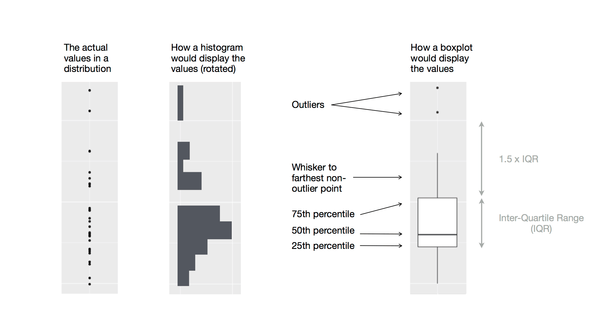

```{r setup, include = FALSE}
library(learnr)
library(tutorial.helpers)
library(tidyverse)
library(palmerpenguins)
library(ggthemes)

knitr::opts_chunk$set(echo = FALSE)
knitr::opts_chunk$set(out.width = '90%')
options(tutorial.exercise.timelimit = 60, 
        tutorial.storage = "local") 


plot_geom <- penguins |>   
  drop_na() |>
  ggplot(aes(x = flipper_length_mm, 
             y = body_mass_g)) +
    geom_point()

```

```{r copy-code-chunk, child = system.file("child_documents/copy_button.Rmd", package = "tutorial.helpers")}
```

```{r info-section, child = system.file("child_documents/info_section.Rmd", package = "tutorial.helpers")}
```

<!-- This tutorial stinks! It does not actually cover the material in the chapter! It is mostly a compilation of material from elsewhere. Note how the Sections don't even match R4DS! -->

<!-- Tutorial is sloppy because, instead of copy/pasting the most relevant/important portions of the chapter as knowledge drops, it mostly adds its own thoughts. Bad author! -->

<!-- Change the tutorial so that, first, the Sections match the book and, second, the knowledge drops come from the book.  -->

<!-- Might consider introducing new tricks for making the plots look better. Example: changing the title of the legend box in facet_wrap section. Also, what are good settings for viewing stuff on the web. -->


<!-- Summary should have a second, very brief paragraph (just a sentence or two) with further readings. Those readings should also have been knowledge dropped earlier, -->

<!-- Make hint code follow style guide and be consistent question to question. -->

## Introduction
### 

This tutorial covers [Chapter 1: Data visualization](https://r4ds.hadley.nz/data-visualize.html) from [*R for Data Science (2e)*](https://r4ds.hadley.nz/) by Hadley Wickham, Mine Çetinkaya-Rundel, and Garrett Grolemund. You will learn about the key functions from the [**ggplot2**](https://ggplot2.tidyverse.org/index.html) package for data visualization, including [`geom_point()`](https://ggplot2.tidyverse.org/reference/geom_point.html), [`geom_line()`](https://ggplot2.tidyverse.org/reference/geom_path.html), [`geom_bar()`](https://ggplot2.tidyverse.org/reference/geom_bar.html), [`geom_boxplot()`](https://ggplot2.tidyverse.org/reference/geom_boxplot.html), [`geom_histogram()`](https://ggplot2.tidyverse.org/reference/geom_histogram.html), and more.

## Creating first ggplot
### 

R has several systems for making graphs, but **ggplot2** is one of the most elegant and most versatile. **ggplot2** implements the *grammar of graphics*, a coherent system for describing and building graphs. With **ggplot2**, you can do more and faster by learning one system and applying it in many places.

In this Section, we will create this plot:

```{r}
intro_p <- penguins |>
  drop_na() |> 
  ggplot(mapping = aes(x = flipper_length_mm, 
                       y = body_mass_g)) +
    geom_point(mapping = aes(color = species, 
                             shape = species)) +
    geom_smooth(method = "lm", formula = y ~ x) +
    labs(title = "Body mass and flipper length",
         subtitle = "Dimensions for Adelie, Chinstrap, and Gentoo Penguins",
         x = "Flipper length (mm)", 
         y = "Body mass (g)",
         color = "Species", 
         shape = "Species")

intro_p
```

### Exercise 1

Load the **tidyverse** library using `library()`.

```{r creating-first-ggplot-1, exercise = TRUE}

```

```{r creating-first-ggplot-1-hint-1, eval = FALSE}
library(...)
```

```{r include = FALSE}
library(tidyverse)
```

### 

We almost always begin our work by loading the **tidyverse** package. Note that the terms "package" and "library" are used interchangeably but that there is no `package()` function. To load a package, you need to use `library()`.


### Exercise 2

Load the **palmerpenguins** package using `library()`.

```{r creating-first-ggplot-2, exercise = TRUE}

```

```{r creating-first-ggplot-2-hint-1, eval = FALSE}
library(...)
```

```{r creating-first-ggplot-2-test, include = FALSE}
library(palmerpenguins)
```

### 

Do penguins with longer flippers weigh more or less than penguins with shorter flippers? You probably already have an answer, but try to make your answer precise. What does the relationship between flipper length and body mass look like? Is it positive? Negative? Linear? Nonlinear? Does the relationship vary by the species of the penguin? How about by the island where the penguin lives?


### Exercise 3

In the Console, run `library(palmerpenguins)`. The Console and the Tutorial are separate environments. Loading a library in one does not load it in another.

Run `?palmerpenguins` in the Console after loading in the package. After doing so, copy and paste the description here.

```{r creating-first-ggplot-3}
question_text(NULL,
	answer(NULL, correct = TRUE),
	allow_retry = TRUE,
	try_again_button = "Edit Answer",
	incorrect = NULL,
	rows = 3)
```

### 

The data include size measurements, clutch observations, and blood isotope ratios for adult foraging Adélie, Chinstrap, and Gentoo penguins observed on islands in the Palmer Archipelago near Palmer Station, Antarctica. 

### Exercise 4

Run the `library()` command with `ggthemes` as the argument.

```{r creating-first-ggplot-4, exercise = TRUE}

```

```{r creating-first-ggplot-4-hint-1, eval = FALSE}
library(...)
```

```{r creating-first-ggplot-4-test, include = FALSE}
library(ggthemes)
```

### 

We can infer from the name of the package itself that `ggthemes` is used to make plots created with the **ggplot2** package look nicer.

### Exercise 5

Type `penguins` and hit Run Code.


```{r creating-first-ggplot-5, exercise = TRUE}

```

```{r creating-first-ggplot-5-hint-1, eval = FALSE}
penguins
```

```{r creating-first-ggplot-5-test, include = FALSE}
penguins
```

### 

Tabular data is a set of values, each associated with a variable and an observation. Tabular data is tidy if each value is placed in its own “cell”, each variable in its own column, and each observation in its own row. `penguins` is tabular data.

### Exercise 6

Run `glimpse()` with `penguins` as its argument.

```{r creating-first-ggplot-6, exercise = TRUE}

```

```{r creating-first-ggplot-6-hint-1, eval = FALSE}
glimpse(...)
```

```{r creating-first-ggplot-6-test, include = FALSE}
glimpse(penguins)
```

### 

Among the variables in penguins are:

* `species`: a penguin’s species (Adelie, Chinstrap, or Gentoo).

* `flipper_length_mm`: length of a penguin’s flipper, in millimeters.

* `body_mass_g`: body mass of a penguin, in grams.


### Exercise 7

The key command for making plots is `ggplot()` from the **ggplot2** package. Run `ggplot(data = penguins)`.

```{r creating-first-ggplot-7, exercise = TRUE}

```

```{r creating-first-ggplot-7-hint-1, eval = FALSE}
ggplot(data = penguins)
```

```{r creating-first-ggplot-7-test, include = FALSE}
ggplot(data = penguins)
```

### 

You should see a blank, grey square. R has set up the area in which it can place a plot, but we have yet to tell it what to plot.

### 

In the realm of data analysis, a fundamental concept is the notion of a variable. A variable represents a quantity, quality, or property that can be measured or observed. Variables can take different forms, depending on the nature of the data being studied. They can be numeric or categorical, continuous or discrete, qualitative or quantitative. 

### Exercise 8

Run `sqrt(16)`.

```{r creating-first-ggplot-8, exercise = TRUE}

```

```{r creating-first-ggplot-8-hint-1, eval = FALSE}
sqrt(16)
```

```{r creating-first-ggplot-8-test, include = FALSE}
sqrt(16)
```

### Exercise 9

Run `16 |> sqrt()`

```{r creating-first-ggplot-9, exercise = TRUE}

```

```{r creating-first-ggplot-9-hint-1, eval = FALSE}
16 |> sqrt()
```

```{r creating-first-ggplot-9-test, include = FALSE}
16 |> sqrt()
```

### 

The difference between the previous code was it that we are using the pipe operator `|>` which takes anything from the left side and plugs it into the function in the right side. It is preferred to use pipes in your code as it makes the progression of the variable you're using much more clear.

### Exercise 10

Type `penguins` with the pipe operator `|>` and plug it into `ggplot()` like this:

`penguins |> ggplot()`

```{r creating-first-ggplot-10, exercise = TRUE}

```

<button onclick = "transfer_code(this)">Copy previous code</button>

```{r creating-first-ggplot-10-hint-1, eval = FALSE}
penguins |>
  ...
```

```{r creating-first-ggplot-10-test, include = FALSE}
penguins |>
  ggplot()
```

### 

`penguins`, because it is the start of the pipe, becomes the input which is being plugged into the function `ggplot()`. This generates the same output as `ggplot(data = penguins)`. While indentation may not affect code, it is a good habit to do because it helps go through the code much faster. We start each command in a pipe on a new line. Each line of code in a pipe ends with the pipe itself: `|>`.

### Exercise 11

Copy the previous code and within `ggplot()`, run `mapping = aes(x = flipper_length_mm)` and see what you get.

```{r creating-first-ggplot-11, exercise = TRUE}

```

<button onclick = "transfer_code(this)">Copy previous code</button>

```{r creating-first-ggplot-11-hint-1, eval = FALSE}
penguins |>
  ggplot(... = aes(x = ...))
```

```{r creating-first-ggplot-11-test, include = FALSE}
penguins |>
  ggplot(mapping = aes(x = flipper_length_mm))
```

### 

`mapping = aes(x = flipper_length_mm)` specifies that the variable `flipper_length_mm` is mapped to the x-axis of a plot. This allows the length of the penguin's flipper to be plotted on the x-axis.

### Exercise 12

Copy the previous code, within the `aes()` set `y` equal to `body_mass_g` and run it.

```{r creating-first-ggplot-12, exercise = TRUE}

```

<button onclick = "transfer_code(this)">Copy previous code</button>

```{r creating-first-ggplot-12-hint-1, eval = FALSE}
penguins |>
  ggplot(mapping = aes(x = flipper_length_mm, 
                       y = ...))
```

```{r creating-first-ggplot-12-test, include = FALSE}
penguins |>
  ggplot(mapping = aes(x = flipper_length_mm, 
                       y = body_mass_g))
```

### 

To display the data points we need to add a geometric object, called a `geom`. We can define a `geom` as the geometrical object that a plot uses to represent data. These geometric objects are made available in **ggplot2** with functions that start with `geom_`. 

### Exercise 13

The function `geom_point()` adds a layer of points to your plot, which creates a scatterplot so copy the previous code and add `+ geom_point()`

```{r creating-first-ggplot-13, exercise = TRUE}

```

<button onclick = "transfer_code(this)">Copy previous code</button>

```{r creating-first-ggplot-13-hint-1, eval = FALSE}
penguins |>
  ggplot(mapping = aes(x = flipper_length_mm, 
                       y = body_mass_g)) +
  ...
```

```{r creating-first-ggplot-13-test, include = FALSE}
penguins |>
  ggplot(mapping = aes(x = flipper_length_mm, 
                       y = body_mass_g)) +
    geom_point() 
```

### 

Note the warning message. There are two problematic data points in the `penguins` data set. In a real data science project, we would investigate these further. For this tutorial, we will just discard them.

### Exercise 14

Insert `drop_na() |>` (i.e drop_na() followed by a pipe operator) in between the expressions, `penguins |>` and `ggplot(mapping = ...)`.

```{r creating-first-ggplot-14, exercise = TRUE}

```

<button onclick = "transfer_code(this)">Copy previous code</button>

```{r creating-first-ggplot-14-hint-1, eval = FALSE}
penguins |>
  ... |> 
  ggplot(mapping = aes(x = flipper_length_mm, 
                       y = body_mass_g)) +
    geom_point() 
```

```{r creating-first-ggplot-14-test, include = FALSE}
penguins |>
  drop_na() |> 
  ggplot(mapping = aes(x = flipper_length_mm, 
                       y = body_mass_g)) +
    geom_point() 
```

### 

`drop_na()` removes any row with NA values for any of the variables. If you provide `drop_na()` with the name of a variable as an argument, it will only remove rows that have an NA value for that variable.


### Exercise 15

Edit your code so that, within the call to `ggplot()`, you add `color = species` within `aes()`.

```{r creating-first-ggplot-15, exercise = TRUE}

```

<button onclick = "transfer_code(this)">Copy previous code</button>

```{r creating-first-ggplot-15-hint-1, eval = FALSE}
penguins |>
  drop_na() |> 
  ggplot(mapping = aes(x = flipper_length_mm, 
                       y = body_mass_g, 
                       color = ...)) +
    geom_point()
```

```{r creating-first-ggplot-15-test, include = FALSE}
penguins |>
  drop_na() |>
  ggplot(mapping = aes(x = flipper_length_mm, 
                       y = body_mass_g,
                       color = species)) +
    geom_point() 
```

### 

Scatter plots are useful for displaying relationships between `x` and `y` but it is also helpful to ask yourself if there are other variables which might contribute to the relationship. For example, does the relationship between `x` and `y` differ for different species of penguins?

When you ran it, you saw that the data points differ by the color of the species, thereby creating a more interesting plot. Color isn't just the only aesthetic. See [aesthetic mappings](https://ggplot2.tidyverse.org/reference/aes.html) for more examples.


### Exercise 16

Add `geom_smooth()` layer using `+`. Set `method` to `"lm"` within the call to `geom_smooth()`. 

```{r creating-first-ggplot-16, exercise = TRUE}

```

<button onclick = "transfer_code(this)">Copy previous code</button>

```{r creating-first-ggplot-16-hint-1, eval = FALSE}
penguins |>
  drop_na() |>
  ggplot(mapping = aes(x = flipper_length_mm, 
                       y = body_mass_g, 
                       color = species)) +
  geom_point() +
  geom_smooth(... = "lm")
```

```{r creating-first-ggplot-16-test, include = FALSE}
penguins |>
  drop_na() |>
  ggplot(mapping = aes(x = flipper_length_mm, 
                       y = body_mass_g,
                       color = species)) +
    geom_point() +
    geom_smooth(method = "lm") 
```

### 

The `"lm"` value for `method` stands for **l**inear **m**odel, meaning that R will fit a straight line through the points. 

Note that warning about "`geom_smooth()` using formula = 'y ~ x'". Since we failed to specify an argument for `formula`, `geom_smooth()` provides a sensible default, using the `x` and `y` variables specified in `aes()` above. But `geom_smooth()` thinks we are sloppy for not confirming this decision, so it provides a warning. As always, we want to address any warnings or messages which our code issues.

### Exercise 17

Address the warning by adding `formula = y ~ x` to the call to `geom_smooth()`. As always, different arguments to a function must be separated by a comma.

```{r creating-first-ggplot-17, exercise = TRUE}

```

<button onclick = "transfer_code(this)">Copy previous code</button>

```{r creating-first-ggplot-17-hint-1, eval = FALSE}
... +
  geom_smooth(method = "lm", ... = y ~ x) 
```

```{r creating-first-ggplot-17-test, include = FALSE}
penguins |>
  drop_na() |>
  ggplot(mapping = aes(x = flipper_length_mm, 
                       y = body_mass_g,
                       color = species)) +
    geom_point() +
    geom_smooth(method = "lm", formula = y ~ x) 
```

### 

`geom_smooth()` creates a fitted line or curve which can help identify trends and patterns in data. It offers different smoothing methods like linear or polynomial regression and loess smoothing. The shaded error around the fitted line represents uncertainty about the estimate.


### Exercise 18

We have added new lines to the plot, but it does not match the original plot, which displayed only one line for the entire data set instead of separate lines for each penguin species. To accomplish this effect, delete the `color` aesthetic within `ggplot()` and add it to `geom_point()` by running `geom_point(mapping = aes(color = species))`. 

```{r creating-first-ggplot-18, exercise = TRUE}

```

<button onclick = "transfer_code(this)">Copy previous code</button>

```{r creating-first-ggplot-18-hint-1, eval = FALSE}
penguins |>
  drop_na() |>
  ggplot(mapping = aes(x = flipper_length_mm, 
                       y = body_mass_g)) +
  geom_point(mapping = ...(color = ...)) +
  geom_smooth(method = "lm", formula = y ~ x)
```

```{r creating-first-ggplot-18-test, include = FALSE}
penguins |>
  drop_na() |>
  ggplot(mapping = aes(x = flipper_length_mm, 
                       y = body_mass_g)) +
    geom_point(mapping = aes(color = species, 
                             shape = species)) +
    geom_smooth(method = "lm", formula = y ~ x) 
```

### 

In **ggplot2**, when aesthetic mappings are defined at the global level, they are passed down to all subsequent geom layers in the plot. However, each geom function in **ggplot2** can also accept a mapping argument, allowing for local-level aesthetic mappings that are added to those inherited from the global level. 

### Exercise 19

Not all individuals perceive colors the same due to color blindness or other color vision differences. To help, we can map `species` to the `shape` aesthetic, in addition to the `color` aesthetic, within `geom_point()`.

```{r creating-first-ggplot-19, exercise = TRUE}

```

<button onclick = "transfer_code(this)">Copy previous code</button>

```{r creating-first-ggplot-19-hint-1, eval = FALSE}
penguins |>
  drop_na() |>
  ggplot(mapping = aes(x = flipper_length_mm, 
                       y = body_mass_g)) +
  geom_point(mapping = aes(color = species, ... = species)) +
  geom_smooth(method = "lm", formula = y ~ x)
```

```{r creating-first-ggplot-19-test, include = FALSE}
penguins |>
  drop_na() |>
  ggplot(mapping = aes(x = flipper_length_mm, 
                       y = body_mass_g)) +
    geom_point(mapping = aes(color = species, 
                             shape = species)) +
    geom_smooth(method = "lm", formula = y ~ x) 
```

### 

In addition to the built-in shapes, `ggplot()` also allows for custom shapes to be created and used in plots. This can be useful for creating unique visualizations or for incorporating custom symbols or logos into a plot.


### Exercise 20

Now that we have the data points, lets add the title, subtitle, labels, *et cetera*. Copy the previous code, add a new layer using `+` and run `labs()`. Within labs, set `title` equal to `"Body mass and flipper length"`.

```{r creating-first-ggplot-20, exercise = TRUE}

```

<button onclick = "transfer_code(this)">Copy previous code</button>

```{r creating-first-ggplot-20-hint-1, eval = FALSE}
penguins |>
  drop_na() |>
  ggplot(mapping = aes(x = flipper_length_mm, 
                       y = body_mass_g)) +
    geom_point(mapping = aes(color = species, ... = species)) +
    geom_smooth(method = "lm", formula = y ~ x) + 
    labs( ... = "Body mass and flipper length")
```

```{r creating-first-ggplot-20-test, include = FALSE}
penguins |>
  drop_na() |>
  ggplot(mapping = aes(x = flipper_length_mm, 
                       y = body_mass_g)) +
    geom_point(mapping = aes(color = species, 
                             shape = species)) +
    geom_smooth(method = "lm", formula = y ~ x) +
    labs(title = "Body mass and flipper length")
```

### 

The `labs()` function takes in several arguments to modify the plot labels, including x, y, title, subtitle, caption, and tag. The x and y arguments are used to modify the axis labels, while the title, subtitle, and caption arguments are used to modify the plot title, subtitle, and caption, respectively. The tag argument is used to add a label to the plot that can be used for reference in later code.


### Exercise 21

Copy the previous code, lets add the subtitle by running `subtitle = "Dimensions for Adelie, Chinstrap, and Gentoo Penguins"` after the title.

```{r creating-first-ggplot-21, exercise = TRUE}

```

<button onclick = "transfer_code(this)">Copy previous code</button>

```{r creating-first-ggplot-21-hint-1, eval = FALSE}
penguins |>
  drop_na() |>
  ggplot(mapping = aes(x = flipper_length_mm, 
                       y = body_mass_g)) +
  geom_point(mapping = aes(color = species, ... = species)) +
  geom_smooth(method = "lm", formula = y ~ x) +
  labs(title = "Body mass and flipper length", 
       subtitle = "...")
```

```{r creating-first-ggplot-21-test, include = FALSE}
penguins |>
  drop_na() |>
  ggplot(mapping = aes(x = flipper_length_mm, 
                       y = body_mass_g)) +
    geom_point(mapping = aes(color = species, 
                             shape = species)) +
    geom_smooth(method = "lm", formula = y ~ x) +
    labs(title = "Body mass and flipper length",
         subtitle = "Dimensions for Adelie, Chinstrap, and Gentoo Penguins")
```

### 

The labs() function can also be used with the ggtitle() function to modify the plot title. This can be useful when you want to have more control over the formatting of the plot title, such as changing the font size or color.

### Exercise 22

Lets modify the x and y axises, type a comma and then run `x` and set it to `"Flipper Length (mm)"`  Type another comma and a `y`, then set it equal to `"Body mass (g)"` in quotes.

```{r creating-first-ggplot-22, exercise = TRUE}

```

<button onclick = "transfer_code(this)">Copy previous code</button>

```{r creating-first-ggplot-22-hint-1, eval = FALSE}
penguins |>
  drop_na() |>
  ggplot(mapping = aes(x = flipper_length_mm, 
                       y = body_mass_g)) +
  geom_point(mapping = aes(color = species, ... = species)) +
  geom_smooth(method = "lm", formula = y ~ x) +
  labs(title = "Body mass and flipper length" +
       subtitle = "Dimensions for Adelie, Chinstrap, and Gentoo Penguins",
        x = ..., y = ...)
```

```{r creating-first-ggplot-22-test, include = FALSE}
penguins |>
  drop_na() |>
  ggplot(mapping = aes(x = flipper_length_mm, 
                       y = body_mass_g)) +
    geom_point(mapping = aes(color = species, 
                             shape = species)) +
    geom_smooth(method = "lm", formula = y ~ x) +
    labs( title = "Body mass and flipper length",
          subtitle = "Dimensions for Adelie, Chinstrap, and Gentoo Penguins",
          x = "Flipper length (mm)", 
          y = "Body mass (g)")
```

### 

You can use expressions within the `labs()` function to include mathematical symbols or other special characters in your plot labels. For example, you can use the `expression()` function to include a Greek letter in a plot title or axis label.

### 

Finally, it's worth noting that the labs() function is just one way to modify plot labels in ggplot. Other functions, such as xlab(), ylab(), and ggtitle(), can be used to modify specific plot labels without affecting others. It's important to choose the appropriate function for your needs depending on the level of customization you require.


### Exercise 23

You might see that it looks the same as the one in the beginning but we forgot one minor thing which is capitalizing the legend, we can do so by typing a comma and setting both `color` and `shape` equal to "Species" in quotes.

```{r creating-first-ggplot-23, exercise = TRUE}

```

<button onclick = "transfer_code(this)">Copy previous code</button>

```{r creating-first-ggplot-23-hint-1, eval = FALSE}
penguins |>
  drop_na() |>
  ggplot(mapping = aes(x = flipper_length_mm, 
                       y = body_mass_g)) +
  geom_point(mapping = aes(color = species, ... = species)) +
  geom_smooth(method = "lm", formula = y ~ x) +
  labs(title = "Body mass and flipper length" +
       subtitle = "Dimensions for Adelie, Chinstrap, and Gentoo Penguins",
       x = "Flipper Length (mm)", y = "Body Mass (g)", 
       color = ..., 
       shape = ...)
```

```{r creating-first-ggplot-23-test, include = FALSE}
penguins |>
  drop_na() |>
  ggplot(mapping = aes(x = flipper_length_mm, 
                       y = body_mass_g)) +
    geom_point(mapping = aes(color = species, 
                             shape = species)) +
    geom_smooth(method = "lm", formula = y ~ x) +
    labs(title = "Body mass and flipper length",
         subtitle = "Dimensions for Adelie, Chinstrap, and Gentoo Penguins",
         x = "Flipper length (mm)", 
         y = "Body mass (g)",
         color = "Species", 
         shape = "Species")
```

Reminder: This is what our graph should look like

```{r}
intro_p
```

## Geom point
### 

To practice the new skills we learned from the plot we made in the previous exercises, we will make another plot which displays the relationship between `bill_depth_mm` and `bill_length_mm`.

Below is what the end product will look like

```{r}
exercise_scatterplot_p <- penguins |>
  drop_na() |> 
  ggplot(mapping = aes(x = bill_length_mm, 
                       y = bill_depth_mm, 
                       color = species, 
                       shape = species)) +
    geom_point() +
    geom_smooth(method = "lm", formula = y ~ x) +
    labs(title = "Penguins Beak's Length and Depth", 
        subtitle = "Dimensions for Adelie, Chinstrap, and Gentoo Penguins",
        x = "Beak Length (mm)", 
        y = "Beak Depth (mm)",
        color = "Species", 
        shape = "Species")

exercise_scatterplot_p
```

### Exercise 1

Run `penguins` with the pipe operator `|>` and plug it into `ggplot()`.

```{r geom-point-1, exercise = TRUE}

```

```{r geom-point-1-hint-1, eval = FALSE}
... |>
  ggplot()
```

```{r geom-point-1-test, include = FALSE}

```

### 

With **ggplot2**, you begin a plot with the function `ggplot()`, defining a plot object that you can then add layers to. 

### Exercise 2

Within `ggplot()`, run `mapping = aes()` and in `aes()`set `x` to `bill_length_mm`.

```{r geom-point-2, exercise = TRUE}

```

<button onclick = "transfer_code(this)">Copy previous code</button>

```{r geom-point-2-hint-1, eval = FALSE}
... |>
  ggplot(... = aes(x = ...))
```

```{r geom-point-2-test, include = FALSE}

```

### 

The `x` and `y` arguments of `aes()` specify which variables to map to the x and y axes.

### Exercise 3

Within `aes()`, set `y` to `bill_depth_mm` and run it.

```{r geom-point-3, exercise = TRUE}

```

<button onclick = "transfer_code(this)">Copy previous code</button>

```{r geom-point-3-hint-1, eval = FALSE}
penguins |>   
  drop_na() |>
  ggplot(mapping = aes(x = bill_length_mm, y = ...))
```

```{r geom-point-3-test, include = FALSE}

```

### 

"bill depth" refers to the measurement of the maximum vertical depth of a bird's beak or bill, usually taken at a specific point along the bill. This measurement can provide important information about a bird's feeding behavior, ecology, and evolutionary adaptations.


### Exercise 4

To add the data points, add the `geom_point()` layer using `+`.

```{r geom-point-4, exercise = TRUE}

```

<button onclick = "transfer_code(this)">Copy previous code</button>

```{r geom-point-4-hint-1, eval = FALSE}
penguins |>   
  drop_na() |>
  ggplot(mapping = aes(x = bill_length_mm, y = bill_depth_mm)) + 
  geom_point()
```

```{r geom-point-4-test, include = FALSE}

```

### 

The warning message "Removed X rows containing missing values (geom_point())" is a common message in R.  Like R, **ggplot2** subscribes to the philosophy that missing values should never silently go missing. This type of warning is probably one of the most common types of warnings you will see when working with real data – missing values are a very common issue and you’ll learn more about them throughout the book.


### Exercise 5

In `ggplot()`, within `aes()`, run `color = species`.

```{r geom-point-5, exercise = TRUE}

```

<button onclick = "transfer_code(this)">Copy previous code</button>

```{r geom-point-5-hint-1, eval = FALSE}
penguins |>   
  drop_na() |>
  ggplot(mapping = aes(x = bill_length_mm, 
                       y = bill_depth_mm, 
                       ... = species)) +
  geom_point()
```

```{r geom-point-5-test, include = FALSE}

```

### 

When aesthetic mappings are defined in ggplot(), at the global level, they’re passed down to each of the subsequent geom layers of the plot. However, each geom function in **ggplot2** can also take a mapping argument, which allows for aesthetic mappings at the local level that are added to those inherited from the global level.

### Exercise 6

Add the `geom_smooth()` layer and within it, set `method` to `"lm"`. 

```{r geom-point-6, exercise = TRUE}

```

<button onclick = "transfer_code(this)">Copy previous code</button>

```{r geom-point-6-hint-1, eval = FALSE}

... |>
  geom_smooth(... = "lm")
```

```{r geom-point-6-test, include = FALSE}

```

### 

In the **ggplot2** package, the `geom_smooth()` function can be used to add a smoothed curve to a scatter plot to help visualize trends in the data. If no arguments are specified when using `geom_smooth()`, the function will use the default settings to determine the smoothing method and other parameters of the curve.

### Exercise 7

Add the `color` aesthetic within `ggplot()` to `geom_point()` by running `geom_point(mapping = aes(color = species))` to get one line for each species.

```{r geom-point-7, exercise = TRUE}

```

<button onclick = "transfer_code(this)">Copy previous code</button>

```{r geom-point-7-hint-1, eval = FALSE}
... + 
  geom_point(mapping = ...(color = species)) +
  geom_smooth(method = "lm")
```

```{r geom-point-7-test, include = FALSE}

```

### 

When aesthetic mappings are defined in ggplot(), at the global level, they’re passed down to each of the subsequent geom layers of the plot. However, each geom function in "ggplot2" can also take a mapping argument, which allows for aesthetic mappings at the local level that are added to those inherited from the global level. So that's why we use `color = species` for `geom_point()`.

### Exercise 8

In addition to color, we can also map species to the shape aesthetic. Map the `species` variable to the `shape` aesthetic in addition to `color` within `geom_point()` by running `shape = species`.

```{r geom-point-8, exercise = TRUE}

```

<button onclick = "transfer_code(this)">Copy previous code</button>

```{r geom-point-8-hint-1, eval = FALSE}
... +
  geom_point(mapping = aes(color = ..., shape = ...)) +
  geom_smooth(method = "lm")
```

```{r geom-point-8-test, include = FALSE}

```

### 

Note that the legend is automatically updated to reflect the different shapes of the points as well.

There are also other ways to edit the legend. Some are the following: `scale_*_discrete()` functions: These functions allow you to modify the appearance of the legend for discrete variables (i.e., factors). For example, `scale_color_discrete()` can be used to change the colors of the legend, while `scale_shape_discrete()` can be used to change the shapes of the legend symbols.

### Exercise 9

Now that we have the data points, lets add the title, subtitle, labels and etc. Copy the previous code, add a new layer using `+` and run `labs()`. Within labs, set `title` equal to "Penguins Beak's Length and Depth" , `subtitle` to "Dimensions for Adelie, Chinstrap, and Gentoo Penguins" , `x` to  "Beak Length (mm)", `y = "Beak Depth (mm)"`, `color` to "Species" and `shape` to "Species".

```{r geom-point-9, exercise = TRUE}

```

<button onclick = "transfer_code(this)">Copy previous code</button>

```{r geom-point-9-hint-1, eval = FALSE}
... +
  labs(title = "Penguins Beak's Length and Depth", 
       subtitle = ...,
       x = ... , 
       ... = "Beak Depth (mm)",
       color = "Species", 
       ... = "Species")

```

```{r geom-point-9-test, include = FALSE}

```

Reminder: This is what your graph should look like

```{r}
exercise_scatterplot_p
```

## Geom bar
### 

To examine the distribution of a categorical variable, variables that represent categories or groups of items, we can use the bar chart to do so.

Our ultimate goal in this chapter is to recreate the following visualization displaying the relationship between the islands and the species populpation.

```{r}
geom_bar_p <- penguins |>  
  drop_na() |>
  ggplot(aes(x = island, fill = species)) +
    geom_bar(position = "fill") +
    labs(title = "Percentage of Penguins on Different Islands",
         subtitle = "The Adelie species is the only species on Torgersen",
         x = "Island",
         y = "Percentage",
         caption = "Data: PalmerPenguins",
         fill = "Species")

geom_bar_p
```

### Exercise 1

Run `penguins` and pipe it to a `ggplot()` call.

```{r geom-bar-1, exercise = TRUE}

```

```{r geom-bar-1-hint-1, eval = FALSE}
penguins |>
  ...
```

```{r geom-bar-1-test, include = FALSE}

```

### 

`geom_bar()` is used to represent categorical data: Bar charts are commonly used to represent categorical data. The x-axis represents the categories and the height of the bars represents the frequency or count of the observations in each category.

The **palmerpenguins** package was created by Allison Horst, a marine biologist turned data scientist, who wanted to create a modern and updated version of the classic iris dataset often used in data science and statistics courses.


### Exercise 2

Within `ggplot()`, set `x` to `island` inside of `aes()`. Note that, because `mapping` is the first argument in `ggplot()`, we do not to mention it explicitly.

```{r geom-bar-2, exercise = TRUE}

```

<button onclick = "transfer_code(this)">Copy previous code</button>

```{r geom-bar-2-hint-1, eval = FALSE}
... |>
  ggplot(aes(x = ...))
```

```{r geom-bar-2-test, include = FALSE}

```

### 

By default, `geom_bar()` counts the number of observations in each category: If you use `geom_bar()` without specifying any other arguments, it will count the number of observations in each category and create a bar chart showing the frequency of each category.


### Exercise 3

To make the bar graph, add `geom_bar()` using `+` and run it.`

```{r geom-bar-3, exercise = TRUE}

```

<button onclick = "transfer_code(this)">Copy previous code</button>

```{r geom-bar-3-hint-1, eval = FALSE}
... +
  geom_bar()
```

```{r geom-bar-3-test, include = FALSE}

```

### 

You can use the `stat = "identity"` argument to plot the values of a numerical variable directly, rather than counting occurrences. In this case, the y aesthetic should be mapped to the numerical variable. Finally, it's worth noting that `geom_col()` is a shortcut for `geom_bar(stat = "identity")`, which can be useful for creating simple bar charts without having to specify the stat argument.

### Exercise 4

Lets integrate another categorical variable, so set `fill` to `species` within `aes()` in `ggplot()`.

```{r geom-bar-4, exercise = TRUE}

```

<button onclick = "transfer_code(this)">Copy previous code</button>

```{r geom-bar-4-hint-1, eval = FALSE}
... |>
  ggplot(aes(x = island, fill = ...)) +
    geom_bar()
```

```{r geom-bar-4-test, include = FALSE}

```

### 

If you wanted to customize the order of the bars, you can: By default, geom_bar orders the bars in ascending order based on the category. However, you can customize the order of the bars using the reorder function.

### Exercise 5

Let's find the percentages of each penguins species on each island, so run `position = "fill"` within `geom_bar()`.

```{r geom-bar-5, exercise = TRUE}

```

<button onclick = "transfer_code(this)">Copy previous code</button>

```{r geom-bar-5-hint-1, eval = FALSE}
... +
  geom_bar(... = "fill")
```

```{r geom-bar-5-test, include = FALSE}

```

### 

`geom_bar()` can be used with faceted data: `geom_bar()` can create faceted bar charts, where the bars are split into multiple panels based on a third variable. To do this, you can use the `facet_wrap()` or `facet_grid()` functions. 

### Exercise 6

Now use `labs()` to set an appropriate title, subtitle, axes labels, and caption for the graph.

```{r geom-bar-6, exercise = TRUE}

```

<button onclick = "transfer_code(this)">Copy previous code</button>

```{r geom-bar-6-hint-1, eval = FALSE}
... +
  labs(title = "...",
       subtitle = "...",
       x = "...",
       y = "...",
       caption = "...",
       fill = "...")
```

```{r geom-bar-6-test, include = FALSE}

```

Reminder : This is what our graph should look like.

```{r}
geom_bar_p
```

## Geom histogram
### 

To visualize the distribution of a continuous variable, we will be using `geom_histogram()`. We will construct this plot:

```{r}
hist_p <- penguins |>   
  drop_na() |> 
  ggplot(aes(x = body_mass_g)) +
  geom_histogram(binwidth = 200) +
  labs(title = "Weight for Penguins for the Palmer Peninsula",
       subtitle = "There is a 'bump' on the right tail because Gentoo penguins are much larger",
       x = "Weight (grams)",
       y = "Number of Penguins",
       caption = "palmerpenguins R package")

hist_p
```

### Exercise 1

Pipe `penguins` to `drop_na()` and then on to a `ggplot()` call.

```{r geom-histogram-1, exercise = TRUE}

```

```{r geom-histogram-1-hint-1, eval = FALSE}
penguins |>   
  drop_na() |> 
  ggplot()
```

```{r geom-histogram-1-test, include = FALSE}
penguins |>   
  drop_na() |> 
  ggplot()
```

### 

There is no output but a blank square.

### 

`geom_histogram()` creates a histogram, used to visualize the distribution of a single continuous variable. Histograms show the frequency of values within a certain range, which are typically represented by bins along the x-axis.

### Exercise 2

Within ggplot(), set `x` to `body_mass_g` inside of `aes()`.

```{r geom-histogram-2, exercise = TRUE}

```

<button onclick = "transfer_code(this)">Copy previous code</button>

```{r geom-histogram-2-hint-1, eval = FALSE}
...|> 
  ggplot(...(x = ...)
```

```{r geom-histogram-2-test, include = FALSE}
penguins |>   
  drop_na() |> 
  ggplot(aes(x = body_mass_g))
```

### 

This just adds the x-axis to out plot. We have still not told `ggplot()` which type of plot --- which "geom" --- we want to use.

### 

A continuous variable is a variable that can take on any value within a certain range or interval. Examples include time, distance, weight, height, temperature, or any other quantity that can be measured on a numerical scale.

### 

You can add a density curve to the histogram to show the underlying distribution of the data. To do this, you can use the `stat_density()` function. The `..density..` aesthetic is used to scale the histogram bars to be a density instead of a count, and the `alpha` parameter is used to make the bars semi-transparent so that the density curve is visible.


### Exercise 3

Add the `geom_histogram()` layer using `+` to make the plot.

```{r geom-histogram-3, exercise = TRUE}

```

<button onclick = "transfer_code(this)">Copy previous code</button>

```{r geom-histogram-3-hint-1, eval = FALSE}
... + 
  geom_...()
```

```{r geom-histogram-3-test, include = FALSE}
penguins |>   
  drop_na() |> 
  ggplot(aes(x = body_mass_g)) +
    geom_histogram()
```

### 

You can adjust the position of the bars using the position parameter.

### Exercise 4

Within `geom_histogram()`, set `binwidth` to 20.

```{r geom-histogram-4, exercise = TRUE}

```

<button onclick = "transfer_code(this)">Copy previous code</button>

```{r geom-histogram-4-hint-1, eval = FALSE}
... +
  geom_histogram(binwidth = ...)
```

```{r geom-histogram-4-test, include = FALSE}
penguins |>   
  drop_na() |> 
  ggplot(aes(x = body_mass_g)) +
    geom_histogram(binwidth = 20)
```

### 

<!-- DK: Confusing use of bins and binwidth. -->

The `binwidth` parameter controls the width of the bins: The `binwidth` parameter controls the width of the bins used in the histogram. By default, `geom_histogram()` uses 30 `bins`, adjusting the `bindwidth` to match. Compared to the previews histogram, the 20 binwidth is too narrow, resulting in too many bars, making it difficult to determine the shape of the distribution. 

### Exercise 5

Now, set `binwidth` to 200 and see the difference.

```{r geom-histogram-5, exercise = TRUE}

```

<button onclick = "transfer_code(this)">Copy previous code</button>

```{r geom-histogram-5-hint-1, eval = FALSE}
... +
  geom_histogram(binwidth = ...)
```

```{r geom-histogram-5-test, include = FALSE}
penguins |>   
  drop_na() |> 
  ggplot(aes(x = body_mass_g)) +
    geom_histogram(binwidth = 200)
```

### 

This histogram is much better because we can actually see the shape of the distribution.

### Exercise 6

Now use `labs()` to set an appropriate title, subtitle, axes labels, and caption for the graph.

```{r geom-histogram-6, exercise = TRUE}

```

<button onclick = "transfer_code(this)">Copy previous code</button>

```{r geom-histogram-6-hint-1, eval = FALSE}
... +
  labs(title = "...",
       subtitle = "...",
       x = "...",
       y = "...")
```

```{r geom-histogram-6-test, include = FALSE}
penguins |>   
  drop_na() |> 
  ggplot(aes(x = body_mass_g)) +
    geom_histogram(binwidth = 200) +
    labs(title = "Weight for Penguins for the Palmer Peninsula",
         subtitle = "There is a 'bump' on the right tail because Gentoo pe  nguins are much larger",
         x = "Weight (grams)",
         y = "Number of Penguins",
         caption = "palmerpenguins R package")
```

Reminder: Your graph should look like this:


```{r}
hist_p
```

## Geom density
### 

An alternate way to visualize the distributions of data on a continuous variable is to use `geom_density()`, which is smoothed-out-version of a histogram.

Our ultimate goal in this section is to create a plot displaying the distribution of body masses of these penguins, taking into consideration the species of the penguin.

Below is what the end product will look like:

```{r}
density_p <- penguins |>   
  drop_na() |>
  ggplot(aes(x = body_mass_g, 
             color = species, 
             fill = species)) +
    geom_density(alpha = .5) +
    labs(title = "Distribution of Body Mass by Penguin Species",
         x = "Body Mass (g)",
         y = "Density",
         fill = "Species",
         color = "Species")

density_p
```

### Exercise 1

Pipe `penguins` to `drop_na()` and then continue the pipe to a `ggplot()` call.

```{r geom-density-1, exercise = TRUE}

```

```{r geom-density-1-hint-1, eval = FALSE}
penguins |>
  drop_na() |> 
  ...
```

```{r geom-density-1-test, include = FALSE}
penguins |> 
  drop_na() |> 
  ggplot()
```

### 

A density plot is a smoothed-out version of a histogram and a practical alternative, particularly for continuous data that comes from an underlying smooth distribution. 


### Exercise 2

In `ggplot()`, set `x` to `body_mass_g` within `aes()`.

```{r geom-density-2, exercise = TRUE}

```

<button onclick = "transfer_code(this)">Copy previous code</button>

```{r geom-density-2-hint-1, eval = FALSE}
...|>
  ggplot(...(x = ...))
```

```{r geom-density-2-test, include = FALSE}
penguins |>   
  drop_na() |>
  ggplot(aes(x = body_mass_g))
```

### 

A density plot is a graphical representation of the distribution of a continuous variable. It shows the density of data points along the x-axis, where the height of the curve represents the density of data points at that particular point on the x-axis.

### Exercise 3

`geom_density()` is a function in the **ggplot2** package used for creating density plots.

Add `geom_density()` to the pipe.

```{r geom-density-3, exercise = TRUE}

```

<button onclick = "transfer_code(this)">Copy previous code</button>

```{r geom-density-3-hint-1, eval = FALSE}
... +
  geom_density()
```

```{r geom-density-3-test, include = FALSE}
penguins |>   
  drop_na() |>
  ggplot(aes(x = body_mass_g)) +
    geom_density()
```

### 

The `geom_density()` function takes in a data frame, and then maps the x-axis to a continuous variable in that data frame. It calculates the density of data points for each x-value and creates a smooth curve to represent the density distribution.


### Exercise 4

The previous graph shows the distribution for all the species combined, so now lets show distribution for the three species. Within `aes()`, set `color` to `species`.

```{r geom-density-4, exercise = TRUE}

```

<button onclick = "transfer_code(this)">Copy previous code</button>

```{r geom-density-4-hint-1, eval = FALSE}
... |>
  ggplot(aes(x = body_mass_g, color = ...)) +
  geom_density()
```

```{r geom-density-4-test, include = FALSE}
penguins |>   
  drop_na() |>
  ggplot(aes(x = body_mass_g, color = species)) +
    geom_density()
```

### 

The `geom_density()` function can be customized using various arguments, such as `adjust` to control the smoothness of the curve, and `bw` to set the bandwidth of the kernel density estimate used to generate the curve.

### Exercise 5

Run `fill = species` within `aes()` in `ggplot()`.

```{r geom-density-5, exercise = TRUE}

```

<button onclick = "transfer_code(this)">Copy previous code</button>

```{r geom-density-5-hint-1, eval = FALSE}
... |>
  ggplot(aes(x = body_mass_g, color = species, fill = ...)) +
    geom_density()
```

```{r geom-density-5-test, include = FALSE}
penguins |>   
  drop_na() |>
  ggplot(aes(x = body_mass_g, color = species, fill = species)) +
    geom_density()
```

### 

Density plots are useful for visualizing the distribution of a continuous variable, especially when you have a large number of data points. They can be used to identify the location and spread of the data, as well as any outliers or skewness in the distribution.


### Exercise 6

To make the graph transparent, add `alpha = 0.5` within `geom_density()` call.

```{r geom-density-6, exercise = TRUE}

```

<button onclick = "transfer_code(this)">Copy previous code</button>

```{r geom-density-6-hint-1, eval = FALSE}
... +
  geom_density(alpha = ...)
```

```{r geom-density-6-test, include = FALSE}
penguins |>   
  drop_na() |>
  ggplot(aes(x = body_mass_g, color = species, fill = species)) +
    geom_density(alpha = 0.5)
```

### 

We map variables to aesthetics if we want the visual attribute represented by that aesthetic to vary based on the values of that variable. Otherwise, we set the value of an aesthetic.

### Exercise 7

Create an appropriate title, axes labels, and legend for the graph. See the hint for help.

```{r geom-density-7, exercise = TRUE}

```

<button onclick = "transfer_code(this)">Copy previous code</button>

```{r geom-density-7-hint-1, eval = FALSE}
... +
  labs(title = "Distribution of Body Mass by Penguin Species",
       ... = "Bill Length (mm)",
       y = "...",
       fill = "Species",
       ... = "Species")
```

```{r geom-density-7-test, include = FALSE}
penguins |>   
  drop_na() |>
  ggplot(aes(x = body_mass_g, 
             color = species, 
             fill = species)) +
    geom_density(alpha = .5) +
    labs(title = "Distribution of Body Mass by Penguin Species",
         x = "Body Mass (g)",
         y = "Density",
         fill = "Species",
         color = "Species")
```

Reminder: This is what your graph should look like.

```{r}
density_p
```

## Geom boxplot
### 

To visualize the relationship between a numerical and a categorical variable we can use `geom_boxplot()`. A box plot is a type of visual shorthand for measures of position (percentiles) that describe a distribution.


```{r}

```

Box plots are a type of data visualization that summarize the distribution of a continuous variable using five key statistics: minimum, lower quartile (Q1), median, upper quartile (Q3), and maximum. The box itself in the plot represents the middle 50% of the data, with the median shown as a horizontal line inside the box. The whiskers extend from the box to show the range of the data, and individual data points that fall outside of the whiskers are shown as individual points (outliers).

### 

We will construct this plot:

```{r}
box_plot_p <- penguins |>   
  drop_na() |>
  ggplot( aes(x = species, y = body_mass_g)) +
    geom_boxplot() +
    labs(title = "Body Mass Distribution of Palmer Penguins by Species: A Bo  xplot Analysis",
         subtitle = "Comparing the Median and Variability of Body Mass for Adelie, Chinstrap, and Gentoo Penguins",
         x = "Species",
         y = "Body Mass(g)")

box_plot_p
```

### Exercise 1

Pipe `penguins` through `drop_na()` and on to a `ggplot()` call.

```{r geom-boxplot-1, exercise = TRUE}

```

```{r geom-boxplot-1-hint-1, eval = FALSE}
... |>
  ggplot()
```

```{r geom-boxplot-1-test, include = FALSE}
penguins |> 
  drop_na() |> 
  ggplot()
```

### 

Box plots, also known as box-and-whisker plots, are a type of data visualization used to display the distribution of a continuous variable. They were first introduced by John W. Tukey in 1977.

The `geom_boxplot()` function can be customized using various arguments, such as alpha to adjust the transparency of the box, and notch to create a notch in the box to indicate the confidence interval of the median.

### Exercise 2

In `ggplot()` within `aes()`, set `x` to `species`.

```{r geom-boxplot-2, exercise = TRUE}

```

<button onclick = "transfer_code(this)">Copy previous code</button>

```{r geom-boxplot-2-hint-1, eval = FALSE}
... |>
  ggplot(...(x = ...))
```

```{r geom-boxplot-2-test, include = FALSE}
penguins |>   
  drop_na() |>
  ggplot(aes(x = species)) 
```

### 

A box which indicates the range of the middle half of the data, a distance known as the interquartile range (IQR), stretching from the 25th percentile of the distribution to the 75th percentile. In the middle of the box is a line that displays the median, i.e. 50th percentile, of the distribution. These three lines give you a sense of the spread of the distribution and whether or not the distribution is symmetric about the median or skewed to one side.


### Exercise 3

In `ggplot()`,set `y` to `body_mass_g`.

```{r geom-boxplot-3, exercise = TRUE}

```

<button onclick = "transfer_code(this)">Copy previous code</button>

```{r geom-boxplot-3-hint-1, eval = FALSE}
... |>
  ggplot(aes(x = species, 
             y = ...))
```

```{r geom-boxplot-3-test, include = FALSE}
penguins |>   
  drop_na() |>
  ggplot(aes(x = species, 
             y = body_mass_g)) 
```

### 

Box plots are useful for comparing the distribution of a continuous variable across different categories or groups. They can help identify differences in the median, spread, and skewness of the data for each group.


### Exercise 4

Add `geom_boxplot()` layer using `+` to demonstrate the distribution of body mass for different species.

```{r geom-boxplot-4, exercise = TRUE}

```

<button onclick = "transfer_code(this)">Copy previous code</button>

```{r geom-boxplot-4-hint-1, eval = FALSE}
... +
  geom_boxplot()
```

```{r geom-boxplot-4-test, include = FALSE}
penguins |>   
  drop_na() |>
  ggplot(aes(x = species, 
             y = body_mass_g)) +
    geom_boxplot()
```

### 

By default, `geom_boxplot()` does not display the underlying data points that fall outside of the whiskers (i.e., the outliers). However, it can be useful to visualize these points, especially if they are few in number or if they represent important values. One way to do this is to add the `outlier.color` and `outlier.shape` arguments to `geom_boxplot()`, which will display the outlier points in a different color and shape.

### Exercise 5

Create an appropriate title, subtitle, and axes labels for the graph.

```{r geom-boxplot-5, exercise = TRUE}

```

<button onclick = "transfer_code(this)">Copy previous code</button>

```{r geom-boxplot-5-hint-1, eval = FALSE}
... +
  labs(title = "...",
       subtitle = "...",
       x = "Species",
       y = "Body Mass(g)")

```

```{r geom-boxplot-5-test, include = FALSE}
penguins |>   
  drop_na() |>
  ggplot( aes(x = species, y = body_mass_g)) +
    geom_boxplot() +
    labs(title = "Body Mass Distribution of Palmer Penguins by Species: A Bo  xplot Analysis",
         subtitle = "Comparing the Median and Variability of Body Mass for Adelie, Chinstrap, and Gentoo Penguins",
         x = "Species",
         y = "Body Mass(g)")
```

Reminder: This is what your graph should look like.

```{r}
box_plot_p
```

## Facet Wrap
### 

As we saw in `geom_point()` plot, we can incorporate more variables into a plot by mapping them to additional aesthetics. However adding too many aesthetic mappings to a plot makes it cluttered and difficult to make sense of. Another way, which is particularly useful for categorical variables, is to split your plot into facets, subplots that each display one subset of the data.

Our ultimate goal in this section is to create a subplot displaying the relationship between flipper lengths and body masses of  penguins, taking into consideration the species of the penguin.

Below is what the final plot will look like:

```{r}
facet_p <- penguins |>
  drop_na() |> 
  ggplot(aes(x = flipper_length_mm, 
             y = body_mass_g)) +
    geom_point(aes(color = species, 
                   shape = species)) +
    facet_wrap(~island) +
    labs(x = "Flipper Length(mm)",
         y = "Body Mass(g)")

facet_p
```

`facet_wrap()` can be especially useful for exploring complex data sets that have multiple variables or groups, and for comparing patterns and trends across different subsets of the data.

### Exercise 1

Pipe `penguins` to `drop_na()` and the pipe it to `ggplot()`.

```{r facet-wrap-1, exercise = TRUE}

```

```{r facet-wrap-1-hint-1, eval = FALSE}
... |>
  ggplot()
```

```{r facet-wrap-1-test, include = FALSE}
penguins |> 
  drop_na() |> 
  ggplot()
```

### 

You can use the scales argument to control the scale of the y-axis in each panel of the grid. For example, you can use `scales = free_y` to allow each panel to have its own y-axis scale.

### Exercise 2

Within `ggplot()`, add `aes(x = flipper_length_mm)`.

```{r facet-wrap-2, exercise = TRUE}

```

<button onclick = "transfer_code(this)">Copy previous code</button>

```{r facet-wrap-2-hint-1, eval = FALSE}
...|>
  ggplot(...(x = ...))
```

```{r facet-wrap-2-test, include = FALSE}
penguins |>
  drop_na() |> 
  ggplot(aes(x = flipper_length_mm)) 
```

### 

`facet_wrap()` can be combined with other **ggplot2** functions like `geom_point()`, `geom_line()`, `geom_bar()`, and `geom_histogram()` to create a wide range of visualizations that explore different aspects of the data.

### Exercise 3

Let's specify the `y`, so within `ggplot()`, run `aes(y = body_mass_g)`.

```{r facet-wrap-3, exercise = TRUE}

```

<button onclick = "transfer_code(this)">Copy previous code</button>

```{r facet-wrap-3-hint-1, eval = FALSE}
...|>
  ggplot(aes(x = flipper_length_mm, 
             y = ...))
```

```{r facet-wrap-3-test, include = FALSE}
penguins |>
  drop_na() |> 
  ggplot(aes(x = flipper_length_mm, 
             y = body_mass_g)) 
```

### 

When using `facet_wrap()` it's important to consider the purpose of the visualization and the audience that will be viewing it. Choosing the right combination of input variables and customizing the appearance of the panels can help to convey the message more effectively and make the visualization more engaging for the viewer.

### Exercise 4

Add the `geom_point()` using `+`.

```{r facet-wrap-4, exercise = TRUE}

```

<button onclick = "transfer_code(this)">Copy previous code</button>

```{r facet-wrap-4-hint-1, eval = FALSE}
... +
  geom_point()
```

```{r facet-wrap-4-test, include = FALSE}
penguins |>
  drop_na() |> 
  ggplot(aes(x = flipper_length_mm, 
             y = body_mass_g)) +
    geom_point()
```

### 

### Exercise 5

Within `geom_point()`, add another aesthetic layer and run `color = species`.

```{r facet-wrap-5, exercise = TRUE}

```

<button onclick = "transfer_code(this)">Copy previous code</button>

```{r facet-wrap-5-hint-1, eval = FALSE}
... +
  geom_point(...(color = ...))
```

```{r facet-wrap-5-test, include = FALSE}
penguins |>
  drop_na() |> 
  ggplot(aes(x = flipper_length_mm, 
             y = body_mass_g)) +
    geom_point(aes(color = species))
```

### 

If you want to explore more about the different aesthesitics within geom function check out [Aesthetics](https://ggplot2.tidyverse.org/reference/index.html#aesthetics).

### Exercise 6

Within `geom_point()`, run `shape = species` in `aes()`.

```{r facet-wrap-6, exercise = TRUE}

```

<button onclick = "transfer_code(this)">Copy previous code</button>

```{r facet-wrap-6-hint-1, eval = FALSE}
... + 
  geom_point(aes(color = species, shape = ...))
```

```{r facet-wrap-6-test, include = FALSE}
penguins |>
  drop_na() |> 
  ggplot(aes(x = flipper_length_mm, 
             y = body_mass_g)) +
    geom_point(aes(color = species, 
                   shape = species))
```

### 

Fun Fact: Data visualization has a rich history dating back centuries. One of the earliest known examples of data visualization can be traced back to the 17th century when astronomer Galileo Galilei used diagrams to illustrate his observations of the moon. He sketched detailed drawings showcasing the varying phases of the moon, providing a visual representation of his scientific findings.

### Exercise 7

To facet your plot by a single variable, run `facet_wrap()`. The first argument of `facet_wrap()` is `island`, which you create with `~` followed by the variable name. The variable that you pass to `facet_wrap()` should be categorical.


```{r facet-wrap-7, exercise = TRUE}

```

<button onclick = "transfer_code(this)">Copy previous code</button>

```{r facet-wrap-7-hint-1, eval = FALSE}
... +
  facet_wrap(...)
```

```{r facet-wrap-7-test, include = FALSE}

```

### 

The arguments `ncol` and `nrow` can be used to control the layout of the facet panels. `ncol` sets the number of columns in the grid of panels, and `nrow` sets the number of rows. By default, `facet_wrap()` tries to create a square grid of panels that fits all the subplots.

### Exercise 8

Create axes labels.

```{r facet-wrap-8, exercise = TRUE}

```

<button onclick = "transfer_code(this)">Copy previous code</button>

```{r facet-wrap-8-hint-1, eval = FALSE}
... +
  labs(x = "Flipper Length(mm)", 
       y = "Body Mass(g)")
```

```{r facet-wrap-8-test, include = FALSE}
penguins |>
  drop_na() |> 
  ggplot(aes(x = flipper_length_mm, 
             y = body_mass_g)) +
    geom_point(aes(color = species, 
                   shape = species)) +
    facet_wrap(~island) +
    labs(x = "Flipper Length(mm)",
         y = "Body Mass(g)")

```

### 

The argument `labeller` can be used to customize the labels for the facet panels. By default, `facet_wrap()` uses the names of the categorical variables to label each panel. However, it is possible to create custom labels using functions like `label_parsed()` or `label_bquote()`.

Reminder: This is what your graph should look like.

```{r}
facet_p
```

## Saving Plots
### 

Once you’ve made a plot, you might want to get it out of R by saving it as an image that you can use elsewhere. That’s the job of `ggsave()`, which will save the plot most recently created to disk.

### Exercise 1

Before we save a plot we need to make one. Start a pipe with `penguins` to `drop_na()` and on to `ggplot()`.

```{r saving-plots-1, exercise = TRUE}

```

```{r saving-plots-1-hint-1, eval = FALSE}
penguins |> 
  ...() |> 
  ggplot()
```

```{r saving-plots-1-test, include = FALSE}
penguins |> 
  drop_na() |> 
  ggplot()
```

### 

`ggsave()` is a function in R's "ggplot2" package that allows you to save your "ggplot2" plots to a file in various formats. It provides a convenient way to export your visualizations for sharing or further analysis.

### Exercise 2

Add `aes()` within `ggplot()` and specify `x` to `flipper_length_mm` and `y` to `body_mass_g`.

```{r saving-plots-2, exercise = TRUE}

```

<button onclick = "transfer_code(this)">Copy previous code</button>

```{r saving-plots-2-hint-1, eval = FALSE}
... |>
  ggplot(aes(x = ..., 
             y = ...))
```

```{r saving-plots-2-test, include = FALSE}
penguins |>   
  drop_na() |>
  ggplot(aes(x = flipper_length_mm, 
             y = body_mass_g))
```

### 

In R, the `<-` operator (also known as the leftward assignment operator) is used to assign values to variables. It assigns the value on the right-hand side to the variable on the left-hand side.

### Exercise 3

To finish the plot, add `geom_point` function with `+`.

```{r saving-plots-3, exercise = TRUE}

```

<button onclick = "transfer_code(this)">Copy previous code</button>

```{r saving-plots-3-hint-1, eval = FALSE}
... +
  geom_point()
```

```{r saving-plots-3-test, include = FALSE}
penguins |>   
  drop_na() |>
  ggplot(aes(x = flipper_length_mm, 
             y = body_mass_g)) +
    geom_point()
```

### 

Assigning a plot to a variable provides flexibility and reusability in your code. It allows you to easily refer to the plot for further modifications or reuse it in different contexts without recreating the entire plot.

### Exercise 4

Here comes the last part, assign the whole plot to a variable `plot_geom` using `<-`.

```{r saving-plots-4, exercise = TRUE}

```

<button onclick = "transfer_code(this)">Copy previous code</button>

```{r saving-plots-4-hint-1, eval = FALSE}
... <- penguins |>   
  drop_na() |>
  ggplot(aes(x = flipper_length_mm, 
             y = body_mass_g)) +
    geom_point()
```

```{r saving-plots-4-test, include = FALSE}
plot_geom <- penguins |>   
  drop_na() |>
  ggplot(aes(x = flipper_length_mm, 
             y = body_mass_g)) +
    geom_point()
```

### 

When you save plots using `ggsave()`, it will save your plot to your working directory.

### Exercise 5

Here is the part where we save the plot, so type `ggsave()` and within it set `filename` to `"penguin_plot.png"` and then set `plot` to `plot_geom` which was our plot that we made previously.

```{r saving-plots-5, exercise = TRUE}

```

```{r saving-plots-5-hint-1, eval = FALSE}
ggsave(filename = ..., plot = plot_geom)
```

<!-- DK: Test case here? -->

### 

If you don’t specify the width and height they will be taken from the dimensions of the current plotting device. 

## Summary
### 

This tutorial covered [Chapter 1: Data visualization](https://r4ds.hadley.nz/data-visualize.html) from [*R for Data Science (2e)*](https://r4ds.hadley.nz/) by Hadley Wickham, Mine Çetinkaya-Rundel, and Garrett Grolemund. You learned about the key functions from the [**ggplot2**](https://ggplot2.tidyverse.org/index.html) package for data visualization, including [`geom_point()`](https://ggplot2.tidyverse.org/reference/geom_point.html), [`geom_line()`](https://ggplot2.tidyverse.org/reference/geom_path.html), [`geom_bar()`](https://ggplot2.tidyverse.org/reference/geom_bar.html), [`geom_boxplot()`](https://ggplot2.tidyverse.org/reference/geom_boxplot.html), [`geom_histogram()`](https://ggplot2.tidyverse.org/reference/geom_histogram.html), and more.


```{r download-answers, child = system.file("child_documents/download_answers.Rmd", package = "tutorial.helpers")}
```
