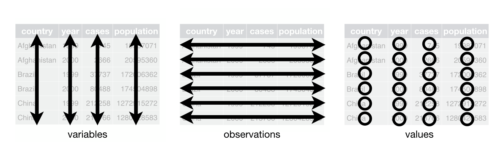

```{r setup, include = FALSE}
library(learnr)
library(tutorial.helpers)
library(knitr)
library(tidyverse)
library(palmerpenguins)
library(ggthemes) 

knitr::opts_chunk$set(echo = FALSE)
knitr::opts_chunk$set(out.width = '90%')
options(tutorial.exercise.timelimit = 60, 
        tutorial.storage = "local") 
```

```{r copy-code-chunk, child = system.file("child_documents/copy_button.Rmd", package = "tutorial.helpers")}
```

```{r info-section, child = system.file("child_documents/info_section.Rmd", package = "tutorial.helpers")}
```

<!-- The First steps section should be revisited. I don't think it maps as closely to the chapter as it should, especially in terms of the knowledge drops. -->

<!-- The Visualization relationships section could also be expanded. There is lot of material from the chapter which really ought to be added. -->

<!-- Also, consider expanding the questions in later sections so that, instead of having students "run" a block of code, they have to build it up step by step. That would allow more knowledge drop opportunities. -->

## Introduction
### 

This tutorial covers [Chapter 1: Data visualization](https://r4ds.hadley.nz/data-visualize.html) from [*R for Data Science (2e)*](https://r4ds.hadley.nz/) by Hadley Wickham, Mine Çetinkaya-Rundel, and Garrett Grolemund. You will learn about the key functions from the [**ggplot2**](https://ggplot2.tidyverse.org/index.html) package for data visualization, including [`gggplot()`](https://ggplot2.tidyverse.org/reference/ggplot.html), [`geom_point()`](https://ggplot2.tidyverse.org/reference/geom_point.html), [`geom_bar()`](https://ggplot2.tidyverse.org/reference/geom_bar.html), [`geom_boxplot()`](https://ggplot2.tidyverse.org/reference/geom_boxplot.html), [`geom_histogram()`](https://ggplot2.tidyverse.org/reference/geom_histogram.html), and more.

## First steps
### 

R has several systems for making graphs, but [**ggplot2**](https://ggplot2.tidyverse.org/index.html) is one of the most elegant and most versatile. **ggplot2** implements the *grammar of graphics*, a coherent system for describing and building graphs. With **ggplot2**, you can do more and faster by learning one system and applying it in many places.

We will create this plot:

```{r}
intro_p <- penguins |>
  drop_na() |> 
  ggplot(mapping = aes(x = flipper_length_mm, 
                       y = body_mass_g)) +
    geom_point(mapping = aes(color = species, 
                             shape = species)) +
    geom_smooth(method = "lm", formula = y ~ x) +
    labs(title = "Body Mass and Flipper Length",
         subtitle = "Dimensions for Adelie, Chinstrap, and Gentoo Penguins",
         x = "Flipper Length (mm)", 
         y = "Body Mass (g)",
         color = "Species", 
         shape = "Species")

intro_p
```

### Exercise 1

Load the [**tidyverse**](https://tidyverse.tidyverse.org/) library using `library()`.

```{r first-steps-1, exercise = TRUE}

```

```{r first-steps-1-hint-1, eval = FALSE}
library(...)
```

```{r first-steps-1-test, include = FALSE}
library(tidyverse)
```

### 

We almost always begin our work by loading the **tidyverse** package. Note that the terms "package" and "library" are used interchangeably and that there is no `package()` function. To load a package, you need to use `library()`.

### Exercise 2

Load the [**palmerpenguins**](https://allisonhorst.github.io/palmerpenguins/) package using `library()`. This is the package which holds the data which we will be using.

```{r first-steps-2, exercise = TRUE}

```

```{r first-steps-2-hint-1, eval = FALSE}
library(...)
```

```{r first-steps-2-test, include = FALSE}
library(palmerpenguins)
```

### 

Do penguins with longer flippers weigh more or less than penguins with shorter flippers? What does the relationship between flipper length and body mass look like? Is it positive? Negative? Linear? Nonlinear? Does the relationship vary by the species of the penguin? How about by the island where the penguin lives?

### Exercise 3

In the Console, run `library(palmerpenguins)`. The Console and the Tutorial are separate environments. Loading a library in one does not load it in another.

Run `?palmerpenguins` in the Console after loading in the package. After doing so, copy and paste the description here. (As a reminder, running `?something` in the console will open the help page for `something`. Running `??something`, though, will search for help pages with `something`). 

```{r first-steps-3}
question_text(NULL,
	answer(NULL, correct = TRUE),
	allow_retry = TRUE,
	try_again_button = "Edit Answer",
	incorrect = NULL,
	rows = 3)
```

### 

The data includes size measurements, clutch observations, and blood isotope ratios for adult foraging Adélie, Chinstrap, and Gentoo penguins observed on islands in the Palmer Archipelago near Palmer Station, Antarctica.

### Exercise 4

Load the [**ggthemes**](https://jrnold.github.io/ggthemes/) package by running the `library()` command with `ggthemes` as the argument. 

```{r first-steps-4, exercise = TRUE}

```

```{r first-steps-4-hint-1, eval = FALSE}
library(...)
```

```{r first-steps-4-test, include = FALSE}
library(ggthemes)
```

### 

[**ggthemes**](https://jrnold.github.io/ggthemes/) is one of many packages which add functionality to [**ggplot2**](https://ggplot2.tidyverse.org/index.html).


### Exercise 5

Type `penguins` and hit Run Code. `penguins` is the table that holds the data we'll be using to make the plot.

```{r first-steps-5, exercise = TRUE}

```

```{r first-steps-5-hint-1, eval = FALSE}
penguins
```

```{r first-steps-5-test, include = FALSE}
penguins
```

### 

**Tabular data** is data organized in a table. A table is a group of cells, organized in rows and columns. Tabular data is considered *tidy* if and only if it satisfies the following rules:

1.  Each variable is a column; each column is a variable.
2.  Each observation is a row, each row is an observation.
3.  Each value is a cell, each cell is a single value.

```{r}

```

`penguins` is an example of tidy data. 

### Exercise 6

Run `glimpse()` with `penguins` as its argument.

```{r first-steps-6, exercise = TRUE}

```

```{r first-steps-6-hint-1, eval = FALSE}
glimpse(...)
```

```{r first-steps-6-test, include = FALSE}
glimpse(penguins)
```

### 

Among the variables in `penguins` are:

-   `species`: a penguin’s species (Adelie, Chinstrap, or Gentoo).

-   `flipper_length_mm`: length of a penguin’s flipper, in millimeters.

-   `body_mass_g`: body mass of a penguin, in grams.

### Exercise 7

`ggplot()` is the core function of the [**ggplot2**](https://ggplot2.tidyverse.org/index.html) package. It creates a *ggplot object* that serves as a canvas for visualizations, like scatter and box plots. 

Run `ggplot(data = penguins)`.

```{r first-steps-7, exercise = TRUE}

```

```{r first-steps-7-hint-1, eval = FALSE}
ggplot(...)
```

```{r first-steps-7-test, include = FALSE}
ggplot(data = penguins)
```

### 

You should see a blank, grey square. R has set up the area in which it can place a plot, but we have yet to tell it what to plot.

### 

<!-- DK: Reorder knowledge drops as you see fit. -->

In the realm of data analysis, a fundamental concept is the notion of a variable. A variable represents a quantity, quality, or property that can be measured or observed. Variables can take different forms, depending on the nature of the data being studied. They can be numeric or categorical, continuous or discrete, qualitative or quantitative.


### Exercise 8

Pipe `penguins` into `ggplot()`. 

```{r first-steps-8, exercise = TRUE}

```

```{r first-steps-8-hint-1, eval = FALSE}
penguins |> 
  ...
```

```{r first-steps-8-test, include = FALSE}
penguins |>
  ggplot()
```

### 

`penguins`, on the left of the pipe, becomes the input to `ggplot()`, on the right side. This generates the same output as `ggplot(data = penguins)`. While indentation may not affect how the code performs, it does make the code more readable. We start each command in a pipe on a new line. Each line of code in a pipe ends with the pipe itself: `|>`.


### 

When you're working with `ggplot()`, you typically won't be using just the `data` **parameter** (input into a function). You'll be using the `mapping` parameter as well. The `mapping` parameter lets you set, among other things, variables for the x- and y-axis.

<!-- MP: Not sure if the below 2 sentences and code chunk are the best way to explain `aes()`. Needs input.  DK: Use your judgment. How does the book to it? -->

To use the `mapping` parameter, you have to give `ggplot()` an *aesthetic*, which you get by calling the `aes()` function. For example, if you wanted to set the variable for the x-axis to be `foo`, you would add `mapping = aes(x = foo)` in your call to `ggplot()`. 

### Exercise 9

Copy the previous code. Within the call to `ggplot()`, set the mapping to an aesthetic and set the `x` parameter to be `flipper_length_mm` and run your code. 

```{r first-steps-9, exercise = TRUE}

```

<button onclick="transfer_code(this)">Copy previous code</button>

```{r first-steps-9-hint-1, eval = FALSE}
penguins |>
  ggplot(... = aes(x = ...))
```

```{r first-steps-9-test, include = FALSE}
penguins |>
  ggplot(mapping = aes(x = flipper_length_mm))
```

### 

`mapping = aes(x = flipper_length_mm)` specifies that the variable `flipper_length_mm` is mapped to the x-axis of a plot. This causes the length of the penguin's flipper to be plotted on the x-axis.

<!-- DK: Note how the plot changes! -->

### Exercise 10

Copy the previous code. Within the `aes()` set `y` equal to `body_mass_g` and run the code.

```{r first-steps-10, exercise = TRUE}

```

<button onclick="transfer_code(this)">Copy previous code</button>

```{r first-steps-10-hint-1, eval = FALSE}
penguins |>
  ggplot(mapping = aes(x = flipper_length_mm, 
                       y = ...))
```

```{r first-steps-10-test, include = FALSE}
penguins |>
  ggplot(mapping = aes(x = flipper_length_mm, 
                       y = body_mass_g))
```

### 

To display the data points, we need to add a geometric object, or, in ggplot terms, a `geom`. A `geom` is the geometrical object that a plot uses to represent data. These geometric objects are made available in **ggplot2** with functions that start with `geom_`.

### Exercise 11

The function `geom_point()` adds a layer of points to your plot, which creates a scatterplot. Copy the previous code and add `+ geom_point()`. 

```{r first-steps-11, exercise = TRUE}

```

<button onclick="transfer_code(this)">Copy previous code</button>

```{r first-steps-11-hint-1, eval = FALSE}
penguins |>
  ggplot(mapping = aes(x = flipper_length_mm, 
                       y = body_mass_g)) +
  ...
```

```{r first-steps-11-test, include = FALSE}
penguins |>
  ggplot(mapping = aes(x = flipper_length_mm, 
                       y = body_mass_g)) +
    geom_point() 
```

### 

Note the warning message. There are two problematic data points in the `penguins` data set. In a real data science project, we would investigate these further. For this tutorial, we will just discard them. We do that with the `drop_na()` function.  

`drop_na()` removes any row with NA values for any of the variables. If you provide `drop_na()` with the name of a variable as an argument, it will only remove rows that have an NA value for that variable.

### Exercise 12

Insert `drop_na() |>` (`drop_na()` with a pipe) in between the expressions, `penguins |>` and `ggplot(mapping = ...)`.

```{r first-steps-12, exercise = TRUE}

```

<button onclick="transfer_code(this)">Copy previous code</button>

```{r first-steps-12-hint-1, eval = FALSE}
penguins |>
  ... |> 
  ggplot(mapping = aes(x = flipper_length_mm, 
                       y = body_mass_g)) +
    geom_point() 
```

```{r first-steps-12-test, include = FALSE}
penguins |>
  drop_na() |> 
  ggplot(mapping = aes(x = flipper_length_mm, 
                       y = body_mass_g)) +
    geom_point() 
```

### 

<!-- DK: Highlight difference between \> and +. -->

The aesthetic function, `aes()`, has more parameters than just `x` and `y`. `aes()` has parameters like `color`, `shape`, and `size` as well! You can add them in the same way you added the `x` and `y` parameters: add `color = foo` or `shape = bar(baz)` to your `aes()` call in `ggplot()`. 

### Exercise 13

Copy your previous code. Set the `color` to `species` and run your code. 

```{r first-steps-13, exercise = TRUE}

```

<button onclick="transfer_code(this)">Copy previous code</button>

```{r first-steps-13-hint-1, eval = FALSE}
penguins |>
  drop_na() |> 
  ggplot(mapping = aes(x = flipper_length_mm, 
                       y = body_mass_g, 
                       color = ...)) +
    geom_point()
```

```{r first-steps-13-test, include = FALSE}
penguins |>
  drop_na() |>
  ggplot(mapping = aes(x = flipper_length_mm, 
                       y = body_mass_g,
                       color = species)) +
    geom_point() 
```

### 

Scatter plots are useful for displaying relationships between `x` and `y` but it is also helpful to ask yourself if there are other variables which might contribute to the relationship. For example, does the relationship between `x` and `y` differ for different species of penguins?

When you ran it, you saw that the data points differ by the color of the species, thereby creating a more interesting plot. Color isn't just the only aesthetic. See [aesthetic mappings](https://ggplot2.tidyverse.org/reference/aes.html) for more examples.

### Exercise 14

Let's add another geom, `geom_smooth()`. `geom_smooth()` "smoothes out" data into a line or curve to make patterns easier to see. `geom_smooth()`, though, is a geom that requires you to give it another parameter. In this case, it's `method`: the method used to smooth the data. Different methods are used for different purposes. You'll learn about them later on. 

Add the `geom_smooth()` layer using `+`. Set `method` to `"lm"` within the call to `geom_smooth()`.

```{r first-steps-14, exercise = TRUE}

```

<button onclick="transfer_code(this)">Copy previous code</button>

```{r first-steps-14-hint-1, eval = FALSE}
penguins |>
  drop_na() |>
  ggplot(mapping = aes(x = flipper_length_mm, 
                       y = body_mass_g, 
                       color = species)) +
  geom_point() +
  geom_smooth(...)
```

```{r first-steps-14-test, include = FALSE}
penguins |>
  drop_na() |>
  ggplot(mapping = aes(x = flipper_length_mm, 
                       y = body_mass_g,
                       color = species)) +
    geom_point() +
    geom_smooth(method = "lm") 
```

### 

The `"lm"` method stands for **l**inear **m**odel, meaning that R do its best to fit a straight line through the points.

Note that warning about "`geom_smooth()` using formula = 'y ~ x'". Since we failed to specify an argument for `formula`, `geom_smooth()` provides a sensible default, using the `x` and `y` variables specified in `aes()` above. But `geom_smooth()` thinks we are sloppy for not confirming this decision, so it provides a warning. As always, we want to address any warnings or messages which our code issues.

### Exercise 15

Address the warning by adding `formula = y ~ x` to the call to `geom_smooth()`. As always, different arguments to a function must be separated by a comma.

```{r first-steps-15, exercise = TRUE}

```

<button onclick="transfer_code(this)">Copy previous code</button>

```{r first-steps-15-hint-1, eval = FALSE}
... +
  geom_smooth(method = "lm", ...) 
```

```{r first-steps-15-test, include = FALSE}
penguins |>
  drop_na() |>
  ggplot(mapping = aes(x = flipper_length_mm, 
                       y = body_mass_g,
                       color = species)) +
    geom_point() +
    geom_smooth(method = "lm", formula = y ~ x) 
```

### 

`geom_smooth()` creates a fitted line or curve which can help identify trends and patterns in data. It offers different smoothing methods like linear or polynomial regression and *loess* smoothing. The shaded error around the fitted line represents uncertainty about the estimate.

### Exercise 16

Our current plot shows one line for the entire data set instead of separate lines for each penguin species. To accomplish this effect, delete the `color` aesthetic within `ggplot()` and add it to `geom_point()` by running `geom_point(mapping = aes(color = species))`.

```{r first-steps-16, exercise = TRUE}

```

<button onclick="transfer_code(this)">Copy previous code</button>

```{r first-steps-16-hint-1, eval = FALSE}
penguins |>
  drop_na() |>
  ggplot(mapping = aes(x = flipper_length_mm, 
                       y = body_mass_g)) +
  geom_point(mapping = ...) +
  geom_smooth(method = "lm", formula = y ~ x)
```

```{r first-steps-16-test, include = FALSE}
penguins |>
  drop_na() |>
  ggplot(mapping = aes(x = flipper_length_mm, 
                       y = body_mass_g)) +
    geom_point(mapping = aes(color = species, 
                             shape = species)) +
    geom_smooth(method = "lm", formula = y ~ x) 
```

### 

<!-- DK: Does geom_smooth inherit the color maping from geom_point? If so, and I think it is, then the below is confusing. -->

In **ggplot2**, when aesthetic mappings are defined at the global level, they are passed down to all subsequent geom layers in the plot. However, each geom function in **ggplot2** can also accept a mapping argument, allowing for local-level aesthetic mappings that are added to those inherited from the global level.

### Exercise 17

Not all individuals perceive colors the same due to color blindness or other color vision differences. To help, we can map `species` to the `shape` aesthetic, in addition to the `color` aesthetic, within `geom_point()`.

```{r first-steps-17, exercise = TRUE}

```

<button onclick="transfer_code(this)">Copy previous code</button>

```{r first-steps-17-hint-1, eval = FALSE}
penguins |>
  drop_na() |>
  ggplot(mapping = aes(x = flipper_length_mm, 
                       y = body_mass_g)) +
  geom_point(mapping = aes(color = species, ... = species)) +
  geom_smooth(method = "lm", formula = y ~ x)
```

```{r first-steps-17-test, include = FALSE}
penguins |>
  drop_na() |>
  ggplot(mapping = aes(x = flipper_length_mm, 
                       y = body_mass_g)) +
    geom_point(mapping = aes(color = species, 
                             shape = species)) +
    geom_smooth(method = "lm", formula = y ~ x) 
```

### 

In addition to the built-in shapes, `ggplot()` also allows for custom shapes to be created and used in plots. This can be useful for creating unique visualizations or for incorporating custom symbols or logos into a plot.

### Exercise 18

Now that we have the data points, let's add the title, subtitle, labels, *et cetera*. Copy the previous code, add a new layer using `+` and add `labs()`. Within labs, set `title` equal to `"Body Mass and Flipper Length"`.

```{r first-steps-18, exercise = TRUE}

```

<button onclick="transfer_code(this)">Copy previous code</button>

```{r first-steps-18-hint-1, eval = FALSE}
penguins |>
  drop_na() |>
  ggplot(mapping = aes(x = flipper_length_mm, 
                       y = body_mass_g)) +
    geom_point(mapping = aes(color = species, ... = species)) +
    geom_smooth(method = "lm", formula = y ~ x) + 
    labs(...)
```

```{r first-steps-18-test, include = FALSE}
penguins |>
  drop_na() |>
  ggplot(mapping = aes(x = flipper_length_mm, 
                       y = body_mass_g)) +
    geom_point(mapping = aes(color = species, 
                             shape = species)) +
    geom_smooth(method = "lm", formula = y ~ x) +
    labs(title = "Body Mass and Flipper Length")
```

### 

The `labs()` function takes in several arguments to modify the plot labels, including `x`, `y`, `title`, `subtitle`, `caption`, and `tag`. The `x` and `y` arguments are used to modify the axis labels, while the `title`, `subtitle`, and `caption` arguments are used to modify the plot title, subtitle, and caption, respectively. The `tag` argument is used to add a label to the plot that can be used for reference in later code.

### Exercise 19

Copy the previous code. Add the subtitle by adding `subtitle = "Dimensions for Adelie, Chinstrap, and Gentoo Penguins"` after the title in the call to `labs()` (separated by a comma).

```{r first-steps-19, exercise = TRUE}

```

<button onclick="transfer_code(this)">Copy previous code</button>

```{r first-steps-19-hint-1, eval = FALSE}
penguins |>
  drop_na() |>
  ggplot(mapping = aes(x = flipper_length_mm, 
                       y = body_mass_g)) +
  geom_point(mapping = aes(color = species, ... = species)) +
  geom_smooth(method = "lm", formula = y ~ x) +
  labs(title = "Body Mass and Flipper Length", 
       ...)
```

```{r first-steps-19-test, include = FALSE}
penguins |>
  drop_na() |>
  ggplot(mapping = aes(x = flipper_length_mm, 
                       y = body_mass_g)) +
    geom_point(mapping = aes(color = species, 
                             shape = species)) +
    geom_smooth(method = "lm", formula = y ~ x) +
    labs(title = "Body Mass and Flipper Length",
         subtitle = "Dimensions for Adelie, Chinstrap, and Gentoo Penguins")
```

### 

The `labs()` function can also be used with the `ggtitle()` function to modify the plot title. This can be useful when you want to have more control over the formatting of the plot title, such as changing the font size or color.

### Exercise 20

Lets modify the x and y axes. In the call to `labs()`, type a comma, then add the `x` parameter and set it to `"Flipper Length (mm)"` Type another comma and a `y`, then set it equal to `"Body Mass (g)"`.

```{r first-steps-20, exercise = TRUE}

```

<button onclick="transfer_code(this)">Copy previous code</button>

```{r first-steps-20-hint-1, eval = FALSE}
penguins |>
  drop_na() |>
  ggplot(mapping = aes(x = flipper_length_mm, 
                       y = body_mass_g)) +
  geom_point(mapping = aes(color = species, ... = species)) +
  geom_smooth(method = "lm", formula = y ~ x) +
  labs(title = "Body mass and Flipper Length" +
       subtitle = "Dimensions for Adelie, Chinstrap, and Gentoo Penguins",
        ...)
```

```{r first-steps-20-test, include = FALSE}
penguins |>
  drop_na() |>
  ggplot(mapping = aes(x = flipper_length_mm, 
                       y = body_mass_g)) +
    geom_point(mapping = aes(color = species, 
                             shape = species)) +
    geom_smooth(method = "lm", formula = y ~ x) +
    labs( title = "Body Mass and Flipper Length",
          subtitle = "Dimensions for Adelie, Chinstrap, and Gentoo Penguins",
          x = "Flipper Length (mm)", 
          y = "Body Mass (g)")
```

### 

You can use the `expression()` function within the `labs()` function to include mathematical symbols or other special characters (like Greek letters) in your plot labels.

### 

Finally, it's worth noting that the `labs()` function is just one way to modify plot labels in **ggplot2**. Other functions, such as `xlab()`, `ylab()`, and `ggtitle()`, can be used to modify specific plot labels without affecting others. It's important to choose the appropriate function for your needs depending on the level of customization you require.

### Exercise 21

You might see that it looks the same as the one in the beginning but we forgot one minor thing which is capitalizing the legend, we can do so by typing a comma and setting both `color` and `shape` equal to `"Species"` (in quotes).

```{r first-steps-21, exercise = TRUE}

```

<button onclick="transfer_code(this)">Copy previous code</button>

```{r first-steps-21-hint-1, eval = FALSE}
penguins |>
  drop_na() |>
  ggplot(mapping = aes(x = flipper_length_mm, 
                       y = body_mass_g)) +
  geom_point(mapping = aes(color = species, ... = species)) +
  geom_smooth(method = "lm", formula = y ~ x) +
  labs(title = "Body Mass and Flipper Length" +
       subtitle = "Dimensions for Adelie, Chinstrap, and Gentoo Penguins",
       x = "Flipper Length (mm)", y = "Body Mass (g)", 
       ...)
```

```{r first-steps-21-test, include = FALSE}
penguins |>
  drop_na() |>
  ggplot(mapping = aes(x = flipper_length_mm, 
                       y = body_mass_g)) +
    geom_point(mapping = aes(color = species, 
                             shape = species)) +
    geom_smooth(method = "lm", formula = y ~ x) +
    labs(title = "Body Mass and Flipper Length",
         subtitle = "Dimensions for Adelie, Chinstrap, and Gentoo Penguins",
         x = "Flipper Length (mm)", 
         y = "Body Mass (g)",
         color = "Species", 
         shape = "Species")
```

Reminder: This is what our graph should look like

```{r}
intro_p
```

## ggplot2 calls
### 

As we move on from these introductory sections, we’ll transition to a more concise expression of **ggplot2** code.

### Exercise 1

Run this code:

````
ggplot(
  data = penguins,
  mapping = aes(x = flipper_length_mm, y = body_mass_g)
) +
  geom_point()
````

```{r ggplot2-calls-1, exercise = TRUE}

```

```{r ggplot2-calls-1-test, include = FALSE}
ggplot(
  data = penguins,
  mapping = aes(x = flipper_length_mm, y = body_mass_g)
) +
  geom_point()
```

### 

Typically, the first one or two arguments to a function are so important that you should know them by heart. The first two arguments to `ggplot()` are data and mapping, in the remainder of the book, we won’t supply those names. 

### Exercise 2

Run this code:

````
ggplot(penguins, aes(x = flipper_length_mm, y = body_mass_g)) + 
  geom_point()
````

```{r ggplot2-calls-2, exercise = TRUE}

```

```{r ggplot2-calls-2-test, include = FALSE}
ggplot(penguins, aes(x = flipper_length_mm, y = body_mass_g)) + 
  geom_point()
```

### 

Leaving out the `data` and `mapping` arguments saves typing, and, by reducing the amount of extra text, makes it easier to see what’s different between plots. 

### Exercise 3

Plots are often the last step on a pipeline which includes various sorts of data manipulation. Run this code:

````
penguins |> 
  drop_na() |> 
  ggplot(aes(x = flipper_length_mm, y = body_mass_g)) + 
  geom_point()
````

```{r ggplot2-calls-3, exercise = TRUE}

```

```{r ggplot2-calls-3-test, include = FALSE}
penguins |> 
  drop_na() |> 
  ggplot(aes(x = flipper_length_mm, y = body_mass_g)) + 
  geom_point()
```

### 

By including `drop_na()` in the pipeline, we prevent that annoying warning.

Always keep in mind that steps in the pipeline are separated by `|>` while steps in the construction of your `ggplot()` object are separated with `+`. 


## Visualizating distributions
### 

How you visualize the distribution of a variable depends on the type of variable: categorical or numerical.

### Exercise 1

A variable is categorical if it can only take one of a small set of values. To examine the distribution of a categorical variable, you can use a bar chart. 

Run this code:

````
ggplot(penguins, aes(x = species)) +
  geom_bar()
````

```{r visualizating-distributions-1, exercise = TRUE}

```

```{r visualizating-distributions-1-test, include = FALSE}
ggplot(penguins, aes(x = species)) +
  geom_bar()
```

### 

The height of the bars displays how many observations occurred with each x value.

### Exercise 2

In bar plots of categorical variables with non-ordered levels, like the penguin species above, it’s often preferable to reorder the bars based on their frequencies. Doing so requires transforming the variable to a factor (how R handles categorical data) and then reordering the levels of that factor.

Replace `species` in the previous exercise with `fct_infreq(species)`.

```{r visualizating-distributions-2, exercise = TRUE}

```

<button onclick = "transfer_code(this)">Copy previous code</button>


```{r visualizating-distributions-2-test, include = FALSE}
ggplot(penguins, aes(x = fct_infreq(species))) +
  geom_bar()
```

### 

The [**forcats**](https://forcats.tidyverse.org/) package, which is part of the *Tidyverse* provides a variety of functions for these sorts of manipulations.


### Exercise 3

A variable is numerical (or quantitative) if it can take on a wide range of numerical values, and it is sensible to add, subtract, or take averages with those values. Numerical variables can be continuous or discrete. One commonly used visualization for distributions of continuous variables is a histogram. Run this code:

````
ggplot(penguins, aes(x = body_mass_g)) +
  geom_histogram(binwidth = 200)
````

```{r visualizating-distributions-3, exercise = TRUE}

```

```{r visualizating-distributions-3-test, include = FALSE}
ggplot(penguins, aes(x = body_mass_g)) +
  geom_histogram(binwidth = 200)
```

### 

A histogram divides the x-axis into equally spaced bins and then uses the height of a bar to display the number of observations that fall in each bin. In the graph above, the tallest bar shows that 39 observations have a `body_mass_g` value between 3,500 and 3,700 grams, which are the left and right edges of the bar.

### Exercise 4

You can set the width of the intervals in a histogram with the `binwidth` argument, which is measured in the units of the x variable. You should always explore a variety of binwidths when working with histograms, as different binwidths can reveal different patterns. Change the value of the `binwidth` argument from 200 to 20.


```{r visualizating-distributions-4, exercise = TRUE}

```

<button onclick = "transfer_code(this)">Copy previous code</button>

```{r visualizating-distributions-4-hint-1, eval = FALSE}
ggplot(penguins, aes(x = body_mass_g)) +
  geom_histogram(... = 20)
```

```{r visualizating-distributions-4-test, include = FALSE}
ggplot(penguins, aes(x = body_mass_g)) +
  geom_histogram(binwidth = 20)
```

### 

A binwidth of 20 is too narrow, resulting in too many bars, making it difficult to determine the shape of the distribution. 

### Exercise 5

Change the value of the `binwidth` argument from 20 to 2000.

```{r visualizating-distributions-5, exercise = TRUE}

```

<button onclick = "transfer_code(this)">Copy previous code</button>

```{r visualizating-distributions-5-hint-1, eval = FALSE}
ggplot(penguins, aes(x = body_mass_g)) +
  geom_histogram(... = 2000)
```

```{r visualizating-distributions-5-test, include = FALSE}
ggplot(penguins, aes(x = body_mass_g)) +
  geom_histogram(binwidth = 2000)
```

### 

A `binwidth` of 2,000 is too high, resulting in all data being binned into only three bars, and also making it difficult to determine the shape of the distribution. A `binwidth` of 200 provides a sensible balance.

### Exercise 6

An alternative visualization for distributions of numerical variables is a density plot. A density plot is a smoothed-out version of a histogram and a practical alternative, particularly for continuous data that comes from an underlying smooth distribution. Replace `geom_histogram(binwidth = 2000)` in the previous exercise with `geom_density()`.


```{r visualizating-distributions-6, exercise = TRUE}

```

<button onclick = "transfer_code(this)">Copy previous code</button>

```{r visualizating-distributions-6-hint-1, eval = FALSE}
ggplot(penguins, aes(x = body_mass_g)) +
  ..._density()
```

```{r visualizating-distributions-6-test, include = FALSE}
ggplot(penguins, aes(x = body_mass_g)) +
  geom_density()
```

### 

We won’t go into how `geom_density()` estimates the density (you can read more about that in the function documentation), but let’s explain how the density curve is drawn with an analogy. Imagine a histogram made out of wooden blocks. Then, imagine that you drop a cooked spaghetti string over it. The shape the spaghetti will take draped over blocks can be thought of as the shape of the density curve. It shows fewer details than a histogram but can make it easier to quickly glean the shape of the distribution, particularly with respect to modes and skewness.

## Visualizating relationships
### 

To visualize a relationship we need to have at least two variables mapped to aesthetics of a plot. In the following exercises you will learn about commonly used plots for visualizing relationships between two or more variables and the geoms used for creating them.


### Exercise 1

To visualize the relationship between a numerical and a categorical variable we can use side-by-side box plots. A boxplot is a type of visual shorthand for measures of position (percentiles) that describe a distribution. It is also useful for identifying potential outliers. 

Let's start by running `ggplot()` with `penguins` as the first argument.


```{r visualizating-relationships-1, exercise = TRUE}

```

```{r visualizating-relationships-1-hint-1, eval = FALSE}
ggplot(...)
```

```{r visualizating-relationships-1-test, include = FALSE}
ggplot(penguins)
```

### 

As usual, we get a blank plot.

### Exercise 2

Add `aes(x = species, y = body_mass_g)` as the second argument to the `ggplot(penguins)` call. 

```{r visualizating-relationships-2, exercise = TRUE}

```

<button onclick = "transfer_code(this)">Copy previous code</button>

```{r visualizating-relationships-2-hint-1, eval = FALSE}
ggplot(penguins, ...(x = species, ... = body_mass_g))
```

```{r visualizating-relationships-2-test, include = FALSE}
ggplot(penguins, aes(x = species, y = body_mass_g))
```

### 

The axes are now specified. A boxplot consists of:

* A box that indicates the range of the middle half of the data, a distance known as the interquartile range (IQR), stretching from the 25th percentile of the distribution to the 75th percentile. In the middle of the box is a line that displays the median, i.e. 50th percentile, of the distribution. These three lines give you a sense of the spread of the distribution and whether or not the distribution is symmetric about the median or skewed to one side.

* Visual points that display observations that fall more than 1.5 times the IQR from either edge of the box. These outlying points are unusual so are plotted individually.

* A line (or whisker) that extends from each end of the box and goes to the farthest non-outlier point in the distribution.


### Exercise 3

Extend the plot by adding `geom_boxplot()`.

```{r visualizating-relationships-3, exercise = TRUE}

```

<button onclick = "transfer_code(this)">Copy previous code</button>

```{r visualizating-relationships-3-hint-1, eval = FALSE}
ggplot(penguins, aes(x = species, y = body_mass_g)) +
  ...()
```

```{r visualizating-relationships-3-test, include = FALSE}
ggplot(penguins, aes(x = species, y = body_mass_g)) +
  geom_boxplot()
```

### 

```{r echo = FALSE}
knitr::include_graphics("images/EDA-boxplot.png")
```

### Exercise 4

Another way to look at this data is with `geom_density()`. Run this code:

````
ggplot(penguins, aes(x = body_mass_g, color = species)) +
  geom_density(linewidth = 0.75)
````

```{r visualizating-relationships-4, exercise = TRUE}

```

```{r visualizating-relationships-4-test, include = FALSE}
ggplot(penguins, aes(x = body_mass_g, color = species)) +
  geom_density(linewidth = 0.75)
```

### 

We’ve also customized the thickness of the lines using the linewidth argument in order to make them stand out a bit more against the background.

### Exercise 5

Additionally, we can map species to both color and fill aesthetics and use the `alpha` aesthetic to add transparency to the filled density curves. This aesthetic takes values between 0 (completely transparent) and 1 (completely opaque). In the following plot it’s set to 0.5. Run this code:

````
ggplot(penguins, aes(x = body_mass_g, color = species, fill = species)) +
  geom_density(alpha = 0.5)
````


```{r visualizating-relationships-5, exercise = TRUE}

```

```{r visualizating-relationships-5-test, include = FALSE}
ggplot(penguins, aes(x = body_mass_g, color = species, fill = species)) +
  geom_density(alpha = 0.5)
```

### 

Note the terminology we have used here:

* We map variables to aesthetics if we want the visual attribute represented by that aesthetic to vary based on the values of that variable.

* Otherwise, we set the value of an aesthetic.

### Exercise 6

We can use stacked bar plots to visualize the relationship between two categorical variables. Run this code:

````
ggplot(penguins, aes(x = island, fill = species)) +
  geom_bar()
````

```{r visualizating-relationships-6, exercise = TRUE}

```

```{r visualizating-relationships-6-test, include = FALSE}
ggplot(penguins, aes(x = island, fill = species)) +
  geom_bar()
```

### 

This plot shows the frequencies of each species of penguins on each island. The plot of frequencies shows that there are equal numbers of Adelies on each island. But we don’t have a good sense of the percentage balance within each island.

### Exercise 7

Change the code by adding `position = "fill"` as an argument to `geom_bar()`. In creating these bar charts, we map the variable that will be separated into bars to the x aesthetic, and the variable that will change the colors inside the bars to the fill aesthetic.


```{r visualizating-relationships-7, exercise = TRUE}

```

<button onclick = "transfer_code(this)">Copy previous code</button>

```{r visualizating-relationships-7-hint-1, eval = FALSE}
ggplot(penguins, aes(x = island, fill = species)) +
  geom_bar(... = "fill")
```

```{r visualizating-relationships-7-test, include = FALSE}
ggplot(penguins, aes(x = island, fill = species)) +
  geom_bar(position = "fill")
```

### 

Using this plot we can see that Gentoo penguins all live on Biscoe island and make up roughly 75% of the penguins on that island, Chinstrap all live on Dream island and make up roughly 50% of the penguins on that island, and Adelie live on all three islands and make up all of the penguins on Torgersen.


### Exercise 8

So far you’ve learned about scatterplots (created with `geom_point()`) and smooth curves (created with `geom_smooth()`) for visualizing the relationship between two numerical variables. Run this code:

````
ggplot(penguins, aes(x = flipper_length_mm, y = body_mass_g)) +
  geom_point()
````

```{r visualizating-relationships-8, exercise = TRUE}

```

```{r visualizating-relationships-8-test, include = FALSE}
ggplot(penguins, aes(x = flipper_length_mm, y = body_mass_g)) +
  geom_point()
```

### 

A scatterplot is probably the most commonly used plot for visualizing the relationship between two numerical variables.


### Exercise 9

We can incorporate more variables into a plot by mapping them to additional aesthetics. For example, in the following scatterplot the colors of points represent species and the shapes of points represent islands. Run this code:

````
ggplot(penguins, aes(x = flipper_length_mm, y = body_mass_g)) +
  geom_point(aes(color = species, shape = island))
````

```{r visualizating-relationships-9, exercise = TRUE}

```

```{r visualizating-relationships-9-test, include = FALSE}
ggplot(penguins, aes(x = flipper_length_mm, y = body_mass_g)) +
  geom_point(aes(color = species, shape = island))
```

### 

However adding too many aesthetic mappings to a plot makes it cluttered and difficult to make sense of. Another way, which is particularly useful for categorical variables, is to split your plot into **facets**, subplots that each display one subset of the data.

### Exercise 10

To facet your plot by a single variable, use `facet_wrap()`.  Run this code:

````
ggplot(penguins, aes(x = flipper_length_mm, y = body_mass_g)) +
  geom_point(aes(color = species, shape = species)) +
  facet_wrap(~island)
````

```{r visualizating-relationships-10, exercise = TRUE}

```

```{r visualizating-relationships-10-test, include = FALSE}
ggplot(penguins, aes(x = flipper_length_mm, y = body_mass_g)) +
  geom_point(aes(color = species, shape = species)) +
  facet_wrap(~island)
```

### 

The first argument of `facet_wrap()` is a formula, which you create with `~` followed by a variable name. The variable that you pass to `facet_wrap()` should be categorical.

## Saving your plots
### 

Once you’ve made a plot, you might want to get it out of R by saving it as an image that you can use elsewhere. That’s the job of [`ggsave()`](https://ggplot2.tidyverse.org/reference/ggsave.html), which will save the plot most recently created to disk.

### Exercise 1

Run this code:

````
ggplot(penguins, aes(x = flipper_length_mm, 
                     y = body_mass_g)) +
  geom_point()
````  


```{r saving-your-plots-1, exercise = TRUE}

```

```{r saving-your-plots-1-hint-1, eval = FALSE}
ggplot(penguins, aes(x = flipper_length_mm, 
                     y = body_mass_g)) +
  geom_point()
```

```{r saving-your-plots-1-test, include = FALSE}
ggplot(penguins, aes(x = flipper_length_mm, 
                     y = body_mass_g)) +
  geom_point()
```

### 

This creates a simple scatter plot. Ignore the warning about missing values. 

If your code produces an error message, carefully read it. Sometimes the answer will be buried there! But when you’re new to R, even if the answer is in the error message, you might not yet know how to understand it. Another great tool is Google: try googling the error message, as it’s likely someone else has had the same problem, and has gotten help online.

### Exercise 2

In order to save a copy of this plot, we use the `ggsave()` by running `ggsave(filename = "penguin-plot.png")` immediately after creating the plot.


```{r saving-your-plots-2, exercise = TRUE}
ggplot(penguins, aes(x = flipper_length_mm, 
                     y = body_mass_g)) +
  geom_point()


```

<!-- DK: This hint is not appearing. Why? -->

```{r saving-your-plots-2-hint-1, eval = FALSE}
ggplot(penguins, aes(x = flipper_length_mm, 
                     y = body_mass_g)) +
  geom_point()

ggsave(... = "penguin-plot.png")
```

```{r saving-your-plots-2-test, include = FALSE}
ggplot(penguins, aes(x = flipper_length_mm, 
                     y = body_mass_g)) +
  geom_point()

ggsave(filename = "penguin-plot.png")

file.remove("penguin-plot.png")
```

### 

By default, `ggsave()` saves the most recently created plot.

If you don’t specify the width and height they will be taken from the dimensions of the current plotting device. For reproducible code, you’ll want to specify them. 

### Exercise 3

Run this code:

````
my_plot <- ggplot(penguins, aes(x = flipper_length_mm, 
                     y = body_mass_g)) +
  geom_point()

my_plot
````  


```{r saving-your-plots-3, exercise = TRUE}

```

```{r saving-your-plots-3-hint-1, eval = FALSE}
my_plot <- ...(penguins, aes(x = flipper_length_mm, 
                     y = body_mass_g)) +
  geom_point()

...
```

```{r saving-your-plots-3-test, include = FALSE}
my_plot <- ggplot(penguins, aes(x = flipper_length_mm, 
                     y = body_mass_g)) +
  geom_point()

my_plot
```

### 

When creating plots to save, it is best practice to explicitly create an object. Don't count on the fact that `ggsave()` saves the last plot you created. What happens when you move the plotting code to another location? Instead, make it certain which object you are saving. 

### Exercise 4

Use the code from the last exercise, but replace `my_plot` with `ggsave(filename = "penguin-plot.png", plot = my_plot)`.

```{r saving-your-plots-4, exercise = TRUE}

```

<button onclick = "transfer_code(this)">Copy previous code</button>

```{r saving-your-plots-4-hint-1, eval = FALSE}
my_plot <- ggplot(penguins, aes(x = flipper_length_mm, 
                     y = body_mass_g)) +
  geom_point()

ggsave(... = "penguin-plot.png", plot = ...)
```

```{r saving-your-plots-4-test, include = FALSE}
my_plot <- ggplot(penguins, aes(x = flipper_length_mm, 
                     y = body_mass_g)) +
  geom_point()

ggsave(filename = "penguin-plot.png", plot = my_plot)

file.remove("penguin-plot.png")
```

### 

R is extremely picky, and a misplaced character can make all the difference. Make sure that every `(` is matched with a `)` and every `"` is paired with another `"`. Sometimes you’ll run the code and nothing happens. Check the left-hand of your console: if it’s a `+`, it means that R doesn’t think you’ve typed a complete expression and it’s waiting for you to finish it. In this case, it’s usually easy to start from scratch again by pressing ESCAPE to abort processing the current command.

### Exercise 5

One common problem when creating **ggplot2** graphics is to put the `+` in the wrong place: it has to come at the end of the line, not the start. For example, run this code:

````
ggplot(data = mpg) 
+ geom_point(mapping = aes(x = displ, y = hwy))
````

```{r saving-your-plots-5, exercise = TRUE}

```

### 

Note how the error message explains the problem.

If you get stuck when coding, try the help. You can get help about any R function by running `?function_name` in the Console, or highlighting the function name and pressing F1 in RStudio. Don’t worry if the help doesn’t seem that helpful - instead skip down to the examples and look for code that matches what you’re trying to do.


## Summary
### 

This tutorial covered [Chapter 1: Data visualization](https://r4ds.hadley.nz/data-visualize.html) from [*R for Data Science (2e)*](https://r4ds.hadley.nz/) by Hadley Wickham, Mine Çetinkaya-Rundel, and Garrett Grolemund. You learned about the key functions from the [**ggplot2**](https://ggplot2.tidyverse.org/index.html) package for data visualization, including [`geom_point()`](https://ggplot2.tidyverse.org/reference/geom_point.html), [`geom_line()`](https://ggplot2.tidyverse.org/reference/geom_path.html), [`geom_bar()`](https://ggplot2.tidyverse.org/reference/geom_bar.html), [`geom_boxplot()`](https://ggplot2.tidyverse.org/reference/geom_boxplot.html), [`geom_histogram()`](https://ggplot2.tidyverse.org/reference/geom_histogram.html), and more.

```{r download-answers, child = system.file("child_documents/download_answers.Rmd", package = "tutorial.helpers")}
```
