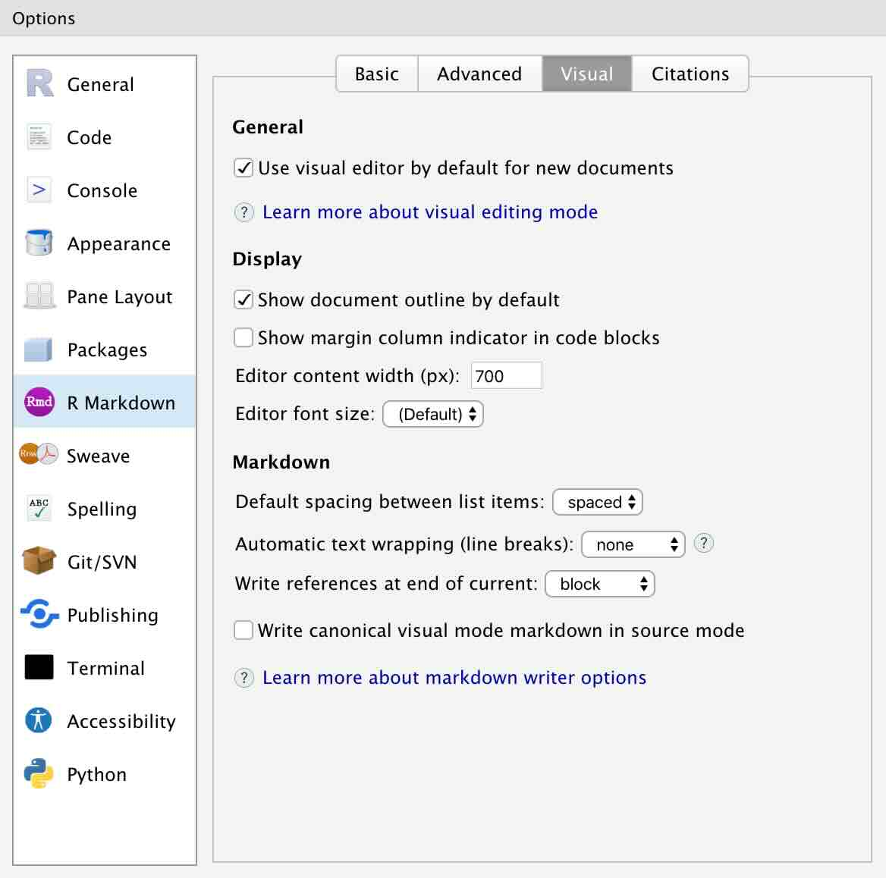

```{r setup, include = FALSE}
library(learnr)
library(tutorial.helpers)
library(tidyverse)
library(knitr)
knitr::opts_chunk$set(echo = FALSE)
knitr::opts_chunk$set(out.width = '90%')
options(tutorial.exercise.timelimit = 60, 
        tutorial.storage = "local")
```

```{r copy-code-chunk, child = system.file("child_documents/copy_button.Rmd", package = "tutorial.helpers")}
```

```{r info-section, child = system.file("child_documents/info_section.Rmd", package = "tutorial.helpers")}
```

<!-- All images are too big. Should be sized to fit in small Tutorial tab. -->

 <!-- Tutorial R and Code: Quarto 3: Exercise 7: mentioned about automatic saving of rendered files, which can be mentioned earlier when first introducing render for better experience. -->
 
 <!-- At first, my Quarto document was rendered and previewed in Windows instead of the viewer - could add instructions on how to switch to preview in the viewer pane. Explain the settings (gear) button and how we can change it. Maybe default should be the Viewer tab, expecially given how much copy/pasting the students need to do. -->

<!-- Given the changes we have made to default settings, lots of these images should be redone. -->

<!-- Will we ever move from RPubs to Quarto Pub? Maybe. The help page for the quarto package does not look useful, but ChatGPT assures me that this is possible with quarto_render() and quarto_publish(). But, maybe not . . . I think that, for now, you need to issue a terminal command to put a Quarto document on Quarto Pub. So, for now, we keep RPubs. We will revisit when the Quarto 1.4 is included by default. Or maybe we should replace RPubs with Posit Cloud, which is now one of the default RStudio Publish options. -->

<!-- Do more to bring the new RStudio user docs into the discussion. -->

<!-- There are often two or more ways to do the same thing: like create a new project or a new script. We should mention and explain this throughout. We should also standardize the approach we use, at least the first time through. -->

<!-- Hardest part is creating an R project the first time. We can break it into separate steps? Can we show them the two different Project drop down methods? Actually, this should be taught from the File menu. Fix the gif to do that!  -->

<!-- Always remember that this tutorial is completed before the terminal tutorial. Although, like with RStudio and Code, we might just a brief terminal session, enough to do basic stuff. Would it be sensible to make an R project from the Console? Probably not . . . -->


## Introduction
### 

This tutorial covers [Chapter 2 Workflow: basics](https://r4ds.hadley.nz/workflow-basics.html),  [Chapter 4 Workflow: code style](https://r4ds.hadley.nz/workflow-style.html), [Chapter 6  Workflow: scripts and projects](https://r4ds.hadley.nz/workflow-scripts.html), and some material from [Chapter 28  Quarto](https://r4ds.hadley.nz/quarto.html) from [*R for Data Science (2e)*](https://r4ds.hadley.nz/) by Hadley Wickham, Mine Çetinkaya-Rundel, and Garrett Grolemund.

Until now, you have been typing your code into the neat boxes in our tutorials. What if you want to start working on your own? In this tutorial you will learn how to use R scripts and Quarto documents, and how to publish your work with RPubs!

## Checking your setup
### 

This tutorial assumes that you have read and completed all the steps in the "Getting Started" tutorial from the [**tutorial.helpers**](https://ppbds.github.io/tutorial.helpers/) package. We will ask you to **c**opy/**p**aste the **c**ommand/**r**esponse so often, we will be shortening this instruction to CP/CR.

### Exercise 1

You should have installed the **tidyverse** package, among others. Load the `tidyverse` package into your R Console using the `library()` function.

### 

Run `search()` in the Console to see the libraries that you've currently loaded. CP/CR. That is, copy and paste that command and the result into the space below.

```{r checking-your-setup-ex-1}
question_text(NULL,
    answer(NULL, correct = TRUE),
    allow_retry = TRUE,
    try_again_button = "Edit Answer",
    incorrect = NULL,
    rows = 3)
```

### 

There should be strings such as "package:tidyverse" in the output. These are the packages that are currently loaded in your workspace.

### Exercise 2

In the Console, run:

````
rstudioapi::readRStudioPreference(
  name = "load_workspace",
  default = "Code failed."
  )
````

CP/CR.

```{r checking-your-setup-ex-2}
question_text(NULL,
    answer(NULL, correct = TRUE),
    allow_retry = TRUE,
    try_again_button = "Edit Answer",
    incorrect = NULL,
    rows = 3)
```

### 

The result should be FALSE. If the result was not FALSE, you should run this command in the Console:

````
tutorial.helpers::set_rstudio_settings()
````

This function ensures that your settings for RStudio are sensible.


### Exercise 3

Look at the top left of your R Console. Here you should see the version of R you are running. It should look something like the image below.

```{r}
include_graphics("images/r_version.png")
```

Type `R.version$version.string` into the Console and hit return. CP/CR.

```{r checking-your-setup-ex-3}
question_text(NULL,
    answer(NULL, correct = TRUE),
    allow_retry = TRUE,
    try_again_button = "Edit Answer",
    incorrect = NULL,
    rows = 3)
```

### 

This should be the same as the version you saw at the top left of the Console.


### Exercise 4

Shortly, we will create a new project for you to start working in. Before we do this, it might be useful to understand where you are right now.

In the R Console, run `getwd()`. CP/CR.

```{r checking-your-setup-ex-4}
question_text(NULL,
    answer(NULL, correct = TRUE),
    allow_retry = TRUE,
    try_again_button = "Edit Answer",
    incorrect = NULL,
    rows = 3)
```

### 

This function returns the "path" to your current R working directory. A path is simply the information which allows you to reach a location on your computer. In this case, if you wanted to find the folder from which R is running, you would follow the path returned by `getwd()`.

More info on paths can be found on the [UC Berkeley website](https://people.ischool.berkeley.edu/~kevin/unix-tutorial/section3.html).

### Exercise 5

Whenever you start a new R project, you will want to store it in a location which you can easily find. Right now, you are likely in an arbitrary location on your computer. It would be much more useful to have a location dedicated to your R projects.

From the Console, run `dir.exists("~/Desktop/")`. CP/CR.

```{r checking-your-setup-ex-5}
question_text(NULL,
	answer(NULL, correct = TRUE),
	allow_retry = TRUE,
	try_again_button = "Edit Answer",
	incorrect = NULL,
	rows = 3)
```

### 

If this returns `TRUE`, then you have a "typical" computer set up, with a Desktop in your home directory. (The tilda symbol, `~`, refers to a user's home directory.) We recommend that you store your R projects there. However, more experienced computer users should feel free to ignore this advice. If the return is `FALSE`, you will need to create a location by hand.

### Exercise 6

Let's make a folder, and call it `projects`, and store it on our desktop. From the Console, run `dir.create("~/Desktop/projects/")`. CP/CR. (This command will only work if `dir.exists("~/Desktop/")` returned `TRUE`.)

```{r checking-your-setup-ex-6}
question_text(NULL,
	answer(NULL, correct = TRUE),
	allow_retry = TRUE,
	try_again_button = "Edit Answer",
	incorrect = NULL,
	rows = 3)
```

### 

If that command works, you are all set. If not, you will need to create a `projects` directory by hand. Helpful resources can be found [here](https://support.microsoft.com/en-us/office/create-a-new-folder-cbbfb6f5-59dd-4e5d-95f6-a12577952e17) for Windows, and [here](https://support.apple.com/guide/mac-help/organize-files-using-folders-mh26885/mac) for macOS.

**NOTE: Do not store this folder inside of a cloud storage directory such as OneDrive.** This can cause heaps of unforeseen problems for you in the future.

The path to your R projects should not include any folders with spaces (or other weird characters) in their names. For example, this is a reasonable location for R projects:

````
/Users/dkane/Desktop/projects/
````

The next example is bad. Do you use spaces or weird characters!

````
/Users/dkane/Desktop/my projects/
````

## R Projects
### 

Good data scientists keep their work organized. You should place your work in different R projects, which are simply folders (that is, directories) on your computer with some helper files. Each separate R project is a folder within your main folder for your R work, i.e.,  `/Users/dkane/Desktop/projects/`

See this [Posit resource](https://support.posit.co/hc/en-us/articles/200526207-Using-RStudio-Projects) for more information about R projects.

### Exercise 1

<!-- These images are excellent and work quite well. -->

**Read all of the instructions before starting this exercise.**

You will be locked out of this tutorial while making your project.

The first step is to click `File -> New Project` from the main menu:

```{r}
include_graphics("images/new_project.png")
```

Select `New Directory`:

```{r}
include_graphics("images/new_project_2.png")
```

Select `New Project`:

```{r}
include_graphics("images/new_project_3.png")
```

Yes, it is confusing that this is the second time you have selected `New Project`! Name the Project `analysis-1` and change the project subdirectory to your new `projects` folder.

```{r}
include_graphics("images/new_project_4.png")
```

Ensure that all the check boxes are unchecked. Click "Create Project." 

Now that you have read all the directions, we can go through the steps. But note that, when you first click `File -> New Project`, you will get the "Terminate Jobs" warning. (Recall the discussion from the "Getting Started" tutorial in the **tutorial.helpers** package.)

And that is OK! Go ahead and click "Terminate Jobs" and follow the above steps. You will need to restart the tutorial but, once you do, your RStudio session will be located in this new project. For the rest of this tutorial, we will be working in `analysis-1`.

### 

Once you restart the tutorial, run `getwd()` in the Console. CP/CR.

```{r r-projects-ex-1}
question_text(NULL,
    answer(NULL, correct = TRUE),
    allow_retry = TRUE,
    try_again_button = "Edit Answer",
    incorrect = NULL,
    rows = 3)
```

### 

This path should now be different than our previous path, similar to the path below. Creating/opening an R project moves the R session to that directory.


````
/Users/dkane/Desktop/projects/analysis-1/
````


### 

If your path does not include your `projects` folder, you probably did not fill in the "Create project as subdirectory of:" box correctly. It should be the path to your `projects` folder, including `projects` itself.


### Exercise 2

Run `list.files()`. CP/CR.

```{r r-projects-ex-2}
question_text(NULL,
    answer(NULL, correct = TRUE),
    allow_retry = TRUE,
    try_again_button = "Edit Answer",
    incorrect = NULL,
    rows = 3)
```

### 

`list.files()` returns files contained in your current R project. This should return only the file `analysis-1.Rproj`.

Keeping all the files associated with a given project --- input data, R scripts, analytic results, and figures --- together in one directory is such a wise and common practice that RStudio has built-in support for this via projects.

Everything you need is in one place and cleanly separated from all the other projects that you are working on.

### Exercise 3

Run `readr::read_lines("analysis-1.Rproj") |> cat(sep = "\n")` in the R Console. CP/CR.

```{r r-projects-ex-3}
question_text(NULL,
    answer(NULL, correct = TRUE),
    allow_retry = TRUE,
    try_again_button = "Edit Answer",
    incorrect = NULL,
    rows = 3)
```

### 

This should return lines containing some basic settings for your R project. For example, `RestoreWorkspace` is set to `default`. Each R project has its own `Rproj` file in which its settings are recorded. 

Indeed, the *definition* of an R project --- from the point of view of RStudio --- is a folder with an associated `Rproj` file.

## Script 1
### 

So far, we have only worked in the R Console, but it's quite difficult to type more than a few lines of code into the Console at once.

One solution is **R scripts**. These are files which contain a permanent copy of our code.

### Exercise 1

Create an R script by clicking the `File -> New File` drop down menu at the top left of your RStudio Session, and selecting `R Script`.

### 

An untitled, empty file should pop up above the R Console in the Source pane. By opening a script, you have caused the Source pane to open, the fourth [common pane within RStudio](https://docs.posit.co/ide/user/ide/guide/ui/ui-panes.html). (The three other panes are Console, Environment and Output. Within each pane, there are usually multiple tabs.)

You can also create a new R script using the keyboard shortcut `Command/Ctrl + Shift + N`. 

Type `5 * 5` into your R script file. Save the file. Name it `script-1.R`. (Note that R will provide the `.R` suffix, so you only need to type `script-1`.) 

Run `readLines("script-1.R")`. CP/CR.

```{r script-1-ex-1}
question_text(NULL,
	answer(NULL, correct = TRUE),
	allow_retry = TRUE,
	try_again_button = "Edit Answer",
	incorrect = NULL,
	rows = 3)
```

### 

You might have gotten this warning:

````
Warning message:
In readLines("script-1.R") : incomplete final line found on 'script-1.R'
````

This means that your file need a blank line at the end. As a rule of thumb, it is always a good idea to have the last line of any text file be blank.

R scripts are permanent copies of your code. You can save them and also work with them interactively.

### Exercise 2

Note the "Source" button, which is in the top right corner of the Source pane. Press it. Note what happens in the Console. CP/CR.


```{r script-1-ex-2}
question_text(NULL,
    answer(NULL, correct = TRUE),
    allow_retry = TRUE,
    try_again_button = "Edit Answer",
    incorrect = NULL,
    rows = 2)
```

You answer should look like this:

````
> source("~/Desktop/projects/analysis-1/script-1.R", echo=TRUE)

> 5 * 5
[1] 25
> 
````

### 

Whenever you run an R script file by hitting the "Source" button, Rstudio will send all the code in the file to the R Console. Because `echo=TRUE`, the Console prints out both the code itself (that is the "echo") and the result of executing that code.


### Exercise 3

There are often "shortcut key" combinations which perform the same task as clicking a button. Placing your cursor inside the R script window and using the keyboard shortcut `Command/Ctrl + Shift + Return/Enter` is the same as hitting the "Source" button. 

Note that `Return` is the name of a Mac key and Enter the name of the corresponding Windows key. In other words, on the Mac, we hit `Command + Shift + Return` while on Windows it is `Ctrl + Shift + Enter`. However, typing `Return/Enter` all the time is annoying, so, going forward, we will just use `Enter`. Mac users are expected to remember that this means the `Return` key.

Try it now. CP/CR.


```{r script-1-ex-3}
question_text(NULL,
    answer(NULL, correct = TRUE),
    allow_retry = TRUE,
    try_again_button = "Edit Answer",
    incorrect = NULL,
    rows = 2)
```

### 

Using shortcut keys is quicker and more professional than clicking buttons. 

### Exercise 4

In your R script, type `6 + 3` in the line after `5 * 5`. Save the file with `Command/Ctrl + S`. (Note that the `S` in that shortcut key just refers to the "S" key on your keyboard. You don't need to capitalize it.)

"Source" this file. CP/CR.

```{r script-1-ex-4}
question_text(NULL,
    answer(NULL, correct = TRUE),
    allow_retry = TRUE,
    try_again_button = "Edit Answer",
    incorrect = NULL,
    rows = 2)
```

The answer is what you might expect:

````
> source("~/Desktop/projects/analysis-1/script-1.R", echo=TRUE)

> 5 * 5
[1] 25

> 6 + 3
[1] 9
> 
````

### 

Each line is echoed. Each line is executed.  Finally, the results of each line, if there are any, are printed.

The output you see is the same as what would happen if you copied each line to the Console and hit return after each one.

### Exercise 5

Instead of sourcing the entire file, we can just execute (or "run") a single line. In your R script, place your cursor on the same line as `6 + 3` and click the "Run" button to the left of the "Source" button. CP/CR.

```{r script-1-ex-5}
question_text(NULL,
    answer(NULL, correct = TRUE),
    allow_retry = TRUE,
    try_again_button = "Edit Answer",
    incorrect = NULL,
    rows = 2)
```

You should get:

````
> 6 + 3
[1] 9
> 
````

### 

Instead of both lines in the script executing, only the second line does. And the process by which this happens has nothing to do with the entire script. **Run is not the same thing as Source.** With Run, you are just copying/pasting one line from the script to the Console at a time.

### Exercise 6

The shortcut key for running a single line of code is `Command/Ctrl + Enter`. In your R script, place your cursor on the same line as `5 * 5` and hit `Command/Ctrl + Enter`. CP/CR.

```{r script-1-ex-6}
question_text(NULL,
    answer(NULL, correct = TRUE),
    allow_retry = TRUE,
    try_again_button = "Edit Answer",
    incorrect = NULL,
    rows = 2)
```

### 

Only the first line of the script is executed. `Command/Ctrl + Enter` is probably the single most commonly used shortcut key because it is very handy to execute your code line-by-line.

### Exercise 7

Go back to the first line in your R script. Change `5 * 5` to `x <- 5 * 5`, thereby creating an object named `x` with a value of 25. Save the file. Click the "Source" button. CP/CR.

```{r script-1-ex-7}
question_text(NULL,
	answer(NULL, correct = TRUE),
	allow_retry = TRUE,
	try_again_button = "Edit Answer",
	incorrect = NULL,
	rows = 3)
```

Your answer should look like:

````
> source("~/Desktop/projects/analysis-1/script-1.R", echo=TRUE)

> x <- 5 * 5

> 6 + 3
[1] 9
> 
````

### 

Note how the `x <- 5 * 5` is executed (and echoed) but nothing is printed. The assignment operator (`<-`) does not generate a printed result.


### Exercise 8

In the Console tab, run `ls()`. CP/CR.

```{r script-1-ex-8}
question_text(NULL,
    answer(NULL, correct = TRUE),
    allow_retry = TRUE,
    try_again_button = "Edit Answer",
    incorrect = NULL,
    rows = 2)
```

### 

`ls()` returns a list of objects present in your environment. These are the same objects displayed in your Environment tab in the Environment pane in the top right corner of RStudio. You should see that it returned `x`, since you defined `x` using your R script.


## Script 2
### 

Let's create this plot:

```{r}
hist_p <- ggplot(data = diamonds,
                 mapping = aes(x = carat)) +
  geom_histogram(bins = 100,
                 color = "white") +
  labs(title = "Histogram of Carat (Weight) among 50,000 Diamonds",
       subtitle = "Carats just at or above meaningful numbers are very common",
       x = "Carat",
       y = "Count",
       caption = "diamonds data set from ggplot2 package")

hist_p
```

### Exercise 1

Click `File -> New File -> R Script`. At the top of the Source pane, the file should be called `Untitled1`. You will see that the text is in red, with an asterisk. This indicates that there are unsaved changes in the file.

```{r}
include_graphics("images/untitled_script.png")
```

### 

Click the save icon -- the disk image next to "Source on Save" box and below the script title. Or use the shortcut `Command/Ctrl + S` to save the script. Let's call this file `script-2`. The `.R` suffix is added automatically.

In the Console, run `list.files()`. CP/CR.

```{r script-2-ex-1}
question_text(NULL,
    answer(NULL, correct = TRUE),
    allow_retry = TRUE,
    try_again_button = "Edit Answer",
    incorrect = NULL,
    rows = 2)
```

### 

Save your scripts (with informative names) in the project, edit them, run them line-by-line or in their entirety. Restart R frequently to make sure you’ve captured everything in your scripts.

Scripts and projects give you a solid workflow that will serve you well in the future. Always remember to create one RStudio project for each data analysis project. That project may contain multiple scripts files, along with other material.

### Exercise 2

Restart your R session using `Session -> Restart R`. This will cause R to bring up the "Terminate Jobs" box. Go ahead and terminate the tutorial. Then, restart the tutorial once R restarts. 

From the Console, run `list.files()`. CP/CR.

```{r script-2-ex-2}
question_text(NULL,
	answer(NULL, correct = TRUE),
	allow_retry = TRUE,
	try_again_button = "Edit Answer",
	incorrect = NULL,
	rows = 3)
```

### 

All the files we had from before --- `analysis-1.Rproj`, `script-1.R`, and `script-2.R` --- still exist. Our work, if we have saved it, is preserved even when R (or RStudio) restarts. 

### Exercise 3

From the Console, run `ls()`. CP/CR.

```{r script-2-ex-3}
question_text(NULL,
	answer(NULL, correct = TRUE),
	allow_retry = TRUE,
	try_again_button = "Edit Answer",
	incorrect = NULL,
	rows = 3)
```

### 

`x` is gone! The environment --- the place in the computer where R creates and uses objects --- is cleaned, by default, each time R restarts. This is a good thing! For our work to be "reproducible," we want to be able to start from nothing except our code.   

### Exercise 4

At the top of `script-2.R`, type

````
library(tidyverse)
````

Run the entire file with `Command/Ctrl + Shift + Enter`. Note how much material --- the "Attaching core tidyverse packages" and so on --- is produced because, by default, we are sourcing the file with `echo=TRUE`. 

### 

Run `search()` in the Console. CP/CR.

```{r script-2-ex-4}
question_text(NULL,
    answer(NULL, correct = TRUE),
    allow_retry = TRUE,
    try_again_button = "Edit Answer",
    incorrect = NULL,
    rows = 2)
```

### 

This function returns a list of loaded packages. This should include the string `package:tidyverse`.

### Exercise 5

Skip a line and add the following comment to the file:

````
# This is an example of a code comment within an R script.
````

Save the file. In the Console, run `readLines("script-2.R")`. CP/CR.

```{r script-2-5}
question_text(NULL,
    answer(NULL, correct = TRUE),
    allow_retry = TRUE,
    try_again_button = "Edit Answer",
    incorrect = NULL,
    rows = 2)
```

### 

Comments begin with a hash (also known as a "pound sign"): `#`. R will ignore everything after the hash when trying to run the code.

Use comments to explain the why of your code, not the how or the what. The what and how of your code are always possible to figure out, even if it might be tedious, by carefully reading it. If you describe every step in the comments, and then change the code, you will have to remember to update the comments as well or it will be confusing when you return to your code in the future.

For data analysis code, use comments to explain your overall plan of attack and record important insights as you encounter them. There’s no way to re-capture this knowledge from the code itself.


### Exercise 6

Change the code comment in `script-2.R` from "This is an example of a code comment within an R script." to a one sentence description of one of your recent meals.

Save the file. In the Console, run `readLines("script-2.R")`. CP/CR.

```{r script-2-6}
question_text(NULL,
    answer(NULL, correct = TRUE),
    allow_retry = TRUE,
    try_again_button = "Edit Answer",
    incorrect = NULL,
    rows = 2)
```

### 

Get in the habit of adding comments.

Figuring out *why* something was done is much more difficult than understanding *how* it was done. For example, `geom_smooth()` has an argument called `span`, which controls the smoothness of the curve, with larger values yielding a smoother curve. Suppose you decide to change the value of `span` from its default of 0.75 to 0.9: it’s easy for a future reader to understand what is happening, but unless you note your thinking in a comment, no one will understand why you changed the default.


### Exercise 7

Skip a line after your comment. Call `ggplot()`, setting `data` to `diamonds` and mapping `x` to `carat` with the following code.

````
ggplot(data = diamonds,
       mapping = aes(x = carat))
````

Run the entire file again. This should generate a blank plot in the Plots tab at the bottom right of your RStudio session, in the Output pane.

### 

In the Console, run `readLines("script-2.R")`. CP/CR.

```{r script-2-7}
question_text(NULL,
    answer(NULL, correct = TRUE),
    allow_retry = TRUE,
    try_again_button = "Edit Answer",
    incorrect = NULL,
    rows = 2)
```

### 

`ggplot()` will generate a blank plot, at least until a `geom` layer is added. 

### Exercise 8

Add a layer with `geom_histogram()`. Change the border color in our graph by setting `color` to `"white"` within `geom_histogram`, and change the number of columns in our plot by setting the `bins` argument to `100`. Remember that, to connect the `ggplot()` call to `geom_histogram()`, we need a `+`. 

````
geom_histogram(bins = 100,
               color = "white")
````

Run the file. (Note the sloppiness of this instruction.) To "run" a script generally means to "execute" it, meaning sending it to the R process. We have learned two ways to (easily) execute an entire file: pressing the "Source" button or hitting the associated shortcut key: `Command/Ctrl + Shift + Enter`.

### 

This should generate bars on your plot. Did you remember to place a `+` after the `ggplot()` call and before the `geom_histogram()` layer?

### 

In the Console tab, run `readLines("script-2.R")`. CP/CR.

```{r script-2-8}
question_text(NULL,
    answer(NULL, correct = TRUE),
    allow_retry = TRUE,
    try_again_button = "Edit Answer",
    incorrect = NULL,
    rows = 2)
```

### 

The `color` argument used here modifies the border color of our columns. To change the fill color, use the `fill` argument.

### Exercise 9

Now let's make our graph look a little nicer by adding a `labs()` layer with an appropriate title, subtitle, and axis labels.

Reminder, this is what our graph should look like

```{r}
hist_p
```

Run your R script file to see your completed plot. Again, note the language here! Above, we made a distinction between the "Source" and "Run" buttons above --- and that distinction is real. However, in casual language, we use the word "run" to generically mean "Tell the computer to execute the commands in this file." We don't necessarily care how that is achieved.

### 

In the Console tab, run `readLines("script-2.R")`. CP/CR.

```{r script-2-9}
question_text(NULL,
    answer(NULL, correct = TRUE),
    allow_retry = TRUE,
    try_again_button = "Edit Answer",
    incorrect = NULL,
    rows = 8)
```

### 

Good coding style is like correct punctuation: you can manage without it, butitsuremakesthingseasiertoread. Even as a very new programmer, it’s a good idea to work on your code style. Using a consistent style makes it easier for others (including future-you!) to read your work and is particularly important if you need to get help from someone else. 

Your plotting code should look something like:

````
ggplot(data = diamonds,
       mapping = aes(x = carat)) +
  geom_histogram(bins = 100,
                 color = "white") +
  labs(title = "Histogram of Carat (Weight) among 50,000 Diamonds",
       subtitle = "Carats just at or above meaningful numbers are very common",
       x = "Carat",
       y = "Count",
       caption = "diamonds data set from ggplot2 package")
````

Note the nice formatting. After the `ggplot()` call, the next two commands --- `geom_histogram()` and `labs()` --- are both indented the same amount. Similarly, arguments to a given function --- like `bins` and `color` --- are lined up with each other.


### Exercise 10

Now we have the code which creates a plot in `script-2.R`. How do we use this plot for other things? Right now we have to run `script-2.R` every time we want to see the plot, which is a little inconvenient.

### 

We can use the `ggsave()` function. Type `?ggsave` in the R Console. This will open the help page for `ggsave()`. Copy and paste the Description from the help page into the space below.

```{r script-2-10}
question_text(NULL,
    answer(NULL, correct = TRUE),
    allow_retry = TRUE,
    try_again_button = "Edit Answer",
    incorrect = NULL,
    rows = 2)
```

`ggsave()` is used to save plots as individual files, separate from the code which created the plot. In this case we will be using the "png" format.

### Exercise 11

We want to save our entire graph to an object, which can be done by setting our plot equal to a variable. Call this variable `hist_p`.

Now using the `ggsave()` function we can create a png of our plot from our code. In `ggsave()`, set `plot` to `hist_p`, `file` to `"diamonds.png"`.

Your entire file should look like:

````
library(tidyverse)

# Had an OK filet mignon at Cheesecake Factory.
hist_p <- ggplot(data = diamonds,
                 mapping = aes(x = carat)) +
  geom_histogram(bins = 100,
                 color = "white") +
  labs(title = "Histogram of Carat (Weight) among 50,000 Diamonds",
       subtitle = "Carats just at or above meaningful numbers are very common",
       x = "Carat",
       y = "Count",
       caption = "diamonds data set from ggplot2 package")

ggsave(plot = hist_p, file = "diamonds.png")
````

Run your code.

### 

In the Console, run `list.files()`. CP/CR.

```{r script-2-11}
question_text(NULL,
    answer(NULL, correct = TRUE),
    allow_retry = TRUE,
    try_again_button = "Edit Answer",
    incorrect = NULL,
    rows = 2)
```

### 

You should see the `diamonds.png` file which contains your plot. In the bottom right corner of your workspace in the Files tab, click on the `diamonds.png` file to view your plot.

If the title text flows out of the image, you might want to modify the `scale` argument in `ggsave()` to find a better image size. `scale` is set to 1 by default.

## Quarto 1
### 

Quarto is a file format for making dynamic documents with R and other languages, like Python. To learn more about Quarto and how to use it, check out the [official webpage](https://quarto.org/). Quarto is the successor technology to [R Markdown](https://rmarkdown.rstudio.com/).

### Exercise 1

Click `File -> New File -> Quarto Document...` at the top left of your RStudio window. 

This will bring up the "New Quarto Document" box.

Add “My First Quarto Document” as the "Title." Add your name as the "Author." 

Toward the bottom of the "New Quarto Document" box is the "Use visual markdown editor" check box. Make sure that this is **not** checked. Uncheck it if it is checked.

Click "Create."

### 

Run `list.files()` in the Console. CP/CR.

```{r quarto-1-ex-1}
question_text(NULL,
    answer(NULL, correct = TRUE),
    allow_retry = TRUE,
    try_again_button = "Edit Answer",
    incorrect = NULL,
    rows = 2)
```

### 

Since we have not saved the file yet, it does not appear in this listing.

Quarto is a command line interface tool, not an R package. This means that help is, by-and-large, not available through `?` at the R Console. Instead, as you work through this tutorial, and use Quarto in the future, you should refer to the [Quarto documentation](https://quarto.org/).


### Exercise 2

Save the Quarto document with `File -> Save`. You can also click the disk icon toward the upper right of the Source pane or by use the shortcut `Command/Ctrl + S`. 

Name the file `quarto-1`. The `.qmd` file extension is added automatically.

Now that the document is saved, run `list.files()`. CP/CR.

```{r quarto-1-ex-2}
question_text(NULL,
    answer(NULL, correct = TRUE),
    allow_retry = TRUE,
    try_again_button = "Edit Answer",
    incorrect = NULL,
    rows = 2)
```

### 

This should return `quarto-1.qmd`, as well as `analysis-1.Rproj`, `script-1.R`, `script-2.R`, and `diamonds.png`. Note how different suffixes are used for different types of files.

### Exercise 3

Run `readLines("quarto-1.qmd") |> head(n = 2)` in the Console. CP/CR.

```{r quarto-1-ex-3}
question_text(NULL,
	answer(NULL, correct = TRUE),
	allow_retry = TRUE,
	try_again_button = "Edit Answer",
	incorrect = NULL,
	rows = 3)
```

### 

`readLines()` reads in each line in a text file into a character vector. Each line in `quarto-1.qmd` is placed in its own element in the vector. With `head(n = 2)`, we only see the first 2 lines.

Again, there is no necessary connection between the **title** of a Quarto document --- which “My First Quarto Document” in this case --- and the **name** of the file --- which is `quarto-1.qmd`.


### Exercise 4

In the top left corner above your Quarto document, you should see the buttons "Source", and "Visual". Click back and forth between them. Note how the display of the Quarto document changes.

Finish with "Source" selected. 

This will revert how we see our Quarto document to be more similar to our R script. We will explore the "Visual" option later.

Run `readLines("quarto-1.qmd") |> tail()` in the Console. CP/CR.


```{r quarto-1-ex-4}
question_text(NULL,
	answer(NULL, correct = TRUE),
	allow_retry = TRUE,
	try_again_button = "Edit Answer",
	incorrect = NULL,
	rows = 3)
```

### 

Note the several different ways in which we use the word "Source." First, there is there "Source" pane, the 1/4 of the RStudio workspace which displays your code for editing. Second, there is the "Source" button, the thing to click when you want to source your R script. Third, you can edit a Quarto document in either "Source" or "Visual" mode.

### Exercise 5

The default Quarto file should look like this:

<!-- The "file =" trick works well, but I sure wish there were a way to just include text directly without this hackery. It is a pain to keep track of a bunch of separate text files. -->

```{r file = "images/quarto-example.txt", echo = TRUE, eval = FALSE}
```

### 

As you can see, a lot of the text is regular plain text, not code. However, there are code chunks which allow us to execute code when the document is rendered. Here's an example of an R code chunk:

```{r file = "images/chunk-example.txt", echo = TRUE, eval = FALSE}
```

Quarto documents utilize Markdown (an easy-to-write plain text format), which can contain chunks of embedded code. These code chunks can be written in many languages, including R and Python. Code chunks allow you to use R to create plots and other graphics.

### 

The [YAML header](https://bookdown.org/yihui/rmarkdown-cookbook/rmarkdown-anatomy.html) is everything between the dashed lines at the top of the file, including the dashed lines themselves. Copy-and-paste the YAML header of the file below.

```{r quarto-1-ex-5}
question_text(NULL,
    answer(NULL, correct = TRUE),
    allow_retry = TRUE,
    try_again_button = "Edit Answer",
    incorrect = NULL,
    rows = 4)
```

### 

The YAML header includes "metadata" about the document itself, things like the title and the author. In this case, `format: html` means that the document will be rendered as an HTML file.

Depending on your RStudio set up, the YAML header might include  the line `editor: visual`. This would tell RStudio, when opening the file on a new occasion, to set the editor to "Visual" mode. This is the same thing as pressing the "Visual" button. If this line is not present, don't worry about it. We recommend working in "Source" mode, at least at the start of your data science journey. Read [this](https://quarto.org/docs/visual-editor/) to learn more about the visual editor.


### Exercise 6

To "render" our Quarto document, click the "Render" arrow at the top of the Source pane, or use the shortcut `Command/Ctrl + Shift + K`.

Run `list.files()`. CP/CR.

```{r quarto-1-ex-6}
question_text(NULL,
	answer(NULL, correct = TRUE),
	allow_retry = TRUE,
	try_again_button = "Edit Answer",
	incorrect = NULL,
	rows = 3)
```

### 

You should see a new file, `quarto-1.html`. This is the file created by rendering. The Viewer tab in the Output pane in the lower right of your workspace should also display the file.

### Exercise 7

Note how the HTML document shows both the code `1 + 1` and the result of the addition. This is the magic of Quarto. We can easily document and reproduce our work. In `quarto-1.qmd`, change `1 + 1` to `6 + 3`. Save the file. Render it again.

Run `readLines("quarto-1.qmd")[grepl("6", readLines("quarto-1.qmd"))]`. CP/CR.


```{r quarto-1-ex-7}
question_text(NULL,
	answer(NULL, correct = TRUE),
	allow_retry = TRUE,
	try_again_button = "Edit Answer",
	incorrect = NULL,
	rows = 17)
```

### 

This should return a single character vector with `"6 + 3"`, the line which you added to the file. Apologies for the complexity of the call needed to pull out that line.

### Exercise 8

Delete everything except the YAML header, which is the text in the box at the top of the file, including the dashes. Add "This is my first Markdown text." at the bottom of the document.

### 

Save the file and run `readLines("quarto-1.qmd")`. CP/CR.

```{r quarto-1-ex-8}
question_text(NULL,
	answer(NULL, correct = TRUE),
	allow_retry = TRUE,
	try_again_button = "Edit Answer",
	incorrect = NULL,
	rows = 3)
```

### 

This should return the last 6 lines of your Quarto document. If you do not have an empty line at the end of your file, you will get a warning message like this:

<span style="color: red;">
Warning message:
In readLines("quarto-1.qmd") :
  incomplete final line found on 'quarto-1.qmd'
</span>

The solution is to add an empty line to the end of the file. This is always a good idea with text files.

### Exercise 9

Render the document. This will replace the current `quarto-1.html` file, both in the current directory and in the Viewer pane.

In the following box, copy all of the text from your rendered Quarto document, from the Viewer tab within the Output pane.


```{r quarto-1-ex-9}
question_text(NULL,
	answer(NULL, correct = TRUE),
	allow_retry = TRUE,
	try_again_button = "Edit Answer",
	incorrect = NULL,
	rows = 3)
```

### 

Quarto files are designed to be used in three ways:

* For communicating to decision-makers, who want to focus on the conclusions, not the code behind the analysis.

* For collaborating with other data scientists (including future you!), who are interested in both your conclusions, and how you reached them (i.e. the code).

* As an environment in which to do data science, as a modern-day lab notebook where you can capture not only what you did, but also what you were thinking.


### Exercise 10

In Quarto documents, you can use [Markdown syntax](https://quarto.org/docs/authoring/markdown-basics.html). You can use this to create **bold** or *italic* text, and headers.

### 

Make the text created in the previous exercise a header by adding `##` at the beginning of the line (followed by a space), then adding this text under that new header: 

````
You can do a lot of cool things in Quarto like **bold** and *italic* text.
````

Render the file again. Does everything look good in the Viewer?

### 

Run `readLines("quarto-1.qmd") |> tail()` in the Console. CP/CR.

```{r quarto-1-ex-10}
question_text(NULL,
    answer(NULL, correct = TRUE),
    allow_retry = TRUE,
    try_again_button = "Edit Answer",
    incorrect = NULL,
    rows = 2)
```

### 

You can find a full list of Markdown formatting styles and commands [here](https://www.markdownguide.org/basic-syntax/).

### Exercise 11

In the top left corner of the Source pane, you should be able to see two buttons: "Source" and "Visual". "Source" shows you all the code while "Visual" shows you (mostly) how the document will look after being rendered. You can edit a Quarto document while in either "Source" or "Visual" mode.

### 

We are going to switch to "Visual" and explore how we can edit while still in "Visual". Switch to "Visual" by clicking on it.

### 

Type "I made this through Quarto" below "This is my first Markdown text" while still in "Visual". Copy and paste everything in your document (while still in "Visual") into the box below.

```{r quarto-1-ex-11}
question_text(NULL,
    answer(NULL, correct = TRUE),
    allow_retry = TRUE,
    try_again_button = "Edit Answer",
    incorrect = NULL,
    rows = 2)
```

### 

Save the file. Render the document, just to make sure it worked.

For the most part, we work in Source mode because it is easier to see how things work. Visual mode is most useful when you are adding images to the document.

If RStudio continues to insert `editor: visual` in the YAML header of new documents, you can try to [edit the option by hand](https://rstudio.github.io/visual-markdown-editing/options.html): 

* Click `Tools -> Global Options...` to bring up the "Options" box. 

```{r}

```

* Select "R Markdown" from the left-column choices. 
* Select the "Visual" tab from the top four choices.
* At the top of the Visual tab, uncheck the box next to "Use visual editor by default for new documents."


## Quarto 2
### 

Restart your R session. (Recall that we do this from the "Session" menu. This is not the same thing as restarting RStudio.) This will require you to Terminate this tutorial. And that is OK! All your work is saved. Just restart the tutorial from the Tutorial tab once your R session restarts.

Let's create another Quarto document so that we can explore how to include R code within the document.

### Exercise 1

Follow the same procedure to create a new Quarto document. `File -> New File -> Quarto Document...`. Use "My Second Quarto Document" as the title and your name for the author. Save the document as `quarto-2.qmd`. Render the document.

Run `list.files()`. CP/CR.

```{r quarto-2-ex-1}
question_text(NULL,
	answer(NULL, correct = TRUE),
	allow_retry = TRUE,
	try_again_button = "Edit Answer",
	incorrect = NULL,
	rows = 3)
```

### 

The listing should include `quarto-2.qmd` and `quarto-2.html`.

### Exercise 2

Delete everything in `quarto-2.qmd` except for the YAML header. Do not delete the dashes which provide the border for the YAML header. The file should look like this:

````
---
title: "My Second Quarto Document"
author: "David Kane"
format: html
---
````

Run `readLines("quarto-2.qmd") |> head(6)` in the Console. CP/CR

```{r quarto-2-ex-2}
question_text(NULL,
	answer(NULL, correct = TRUE),
	allow_retry = TRUE,
	try_again_button = "Edit Answer",
	incorrect = NULL,
	rows = 6)
```

### 

If you have unchecked the "Editor: Use visual markdown editor" box at the bottom of the "New Quarto Document" box, then the `editor: visual` line will not appear in the initial YAML header. If it did appear, delete it.


### Exercise 3

Add a code chunk either by pressing the Add Chunk command at the top of the Source pane on the right (the green C button with a plus sign next to it) or by using the shortcut key combination: `Command/Ctry + Option/Alt + i`. (In other words, on the Mac, the shortcut key is `Command + Option + i` while on Windows it is `Ctry + Alt + i`.)

The newly created code chunk will be empty, looking like:

```{r file = "images/empty-chunk-example.txt", echo = TRUE, eval = FALSE}
```

Save the file, and run `readLines("quarto-2.qmd") |> tail()` in the Console. CP/CR.

```{r quarto-2-ex-3}
question_text(NULL,
    answer(NULL, correct = TRUE),
    allow_retry = TRUE,
    try_again_button = "Edit Answer",
    incorrect = NULL,
    rows = 6)
```

### 

Note the curly braces `{}` at the top of the chunk, with an `r` inside. The `r` indicates that the language which Quarto should use with the code is R.

In this tutorial, we will only include R code within our code chunks. But you can also use Python and other languages. You simply switch "python" for "r" within the curly brackets.


### Exercise 4

Put `2 * 2` within the code chunk. Render the document. Copy and paste the entire HTML document here. (This allows us to confirm that your HTML file is correct.)


```{r quarto-2-ex-4}
question_text(NULL,
	answer(NULL, correct = TRUE),
	allow_retry = TRUE,
	try_again_button = "Edit Answer",
	incorrect = NULL,
	rows = 8)
```

### 

We see both the code itself and the result of the code. This is an example of a "reproducible" analysis. We can re-render the document anytime we like, thereby confirming our results.

### Exercise 5

You can add options to executable code. For example, add `#| echo: false` within the code chunk, above the `2 * 2` calculation. It should look like:


```{r file = "images/label-chunk-example.txt", echo = TRUE, eval = FALSE}
```

Render the document. Copy/paste the HTML below.

```{r quarto-2-ex-5}
question_text(NULL,
	answer(NULL, correct = TRUE),
	allow_retry = TRUE,
	try_again_button = "Edit Answer",
	incorrect = NULL,
	rows = 6)
```

### 

`echo: false` prevents code, but not the results, from appearing in the finished file. Use this when writing reports aimed at people who don’t want to see the underlying R code. Note that this same example appears in the bottom of the default for new Quarto documents.

### Exercise 6

Code chunk options are always proceeded by `#|` -- pronounced "hash-pipe". This is followed by an option/value pair, separated by a colon.

Add another code option for this code chunk: `#| label: calculation`. You can have multiple code chunk options for a single code chunk. The order does not matter, but each belongs on its own line and must be proceeded by `#|`. Render the document. Copy/paste the HTML below.

```{r quarto-2-ex-6}
question_text(NULL,
	answer(NULL, correct = TRUE),
	allow_retry = TRUE,
	try_again_button = "Edit Answer",
	incorrect = NULL,
	rows = 3)
```

### 

The `label` option has no effect on the output. Your chunk labels should be short but evocative and should not contain spaces. We recommend using dashes (`-`) to separate words (instead of underscores, `_`) and avoiding other special characters in chunk labels.

<!-- DK: Explain why labels are good. -->

### Exercise 7

Delete the current code chunk. Add a new one. In this new code chunk, put `library(tidyverse)`. Render the document. A message about "Attaching core tidyverse packages" should appear in the HTML file. Copy/paste that message below.


```{r quarto-2-ex-7}
question_text(NULL,
	answer(NULL, correct = TRUE),
	allow_retry = TRUE,
	try_again_button = "Edit Answer",
	incorrect = NULL,
	rows = 10)
```

### 

We will include the **tidyverse** package in almost very Quarto document which we create. Indeed, the top of most Quarto document includes a code chunk which loads all the packages which we use in the analysis.

### Exercise 8

Add `#| message: false` to the code chunk. Render the document. Copy/paste the entire HTML file below.

```{r quarto-2-ex-8}
question_text(NULL,
	answer(NULL, correct = TRUE),
	allow_retry = TRUE,
	try_again_button = "Edit Answer",
	incorrect = NULL,
	rows = 5)
```

### 

We want to make our Quarto HTML files beautiful. That means we will almost always "mask" ugly messages like this. Our readers don't care about such a**R**cana. They care about our analysis.

### Exercise 9

Add another code chunk option: `echo: false`. Don't forget to preface with the hash-pipe: `#|`. Render the document. Copy/paste the HTML below.

```{r quarto-2-ex-9}
question_text(NULL,
	answer(NULL, correct = TRUE),
	allow_retry = TRUE,
	try_again_button = "Edit Answer",
	incorrect = NULL,
	rows = 3)
```

### 

The HTML is empty, except for title and author.

`echo: false` prevents the code from being "echoed," from appearing in the final document. We generally want this because most readers don't know R and don't care about our code. 


### Exercise 10

Add another code chunk option: `label: setup`. Don't forget to preface with the hash-pipe: `#|`. It is conventional to label the code chunk which loads libraries and takes care of other housekeeping as the "setup" code chunk.

Render the document. Copy/paste the HTML below.

```{r quarto-2-ex-10}
question_text(NULL,
	answer(NULL, correct = TRUE),
	allow_retry = TRUE,
	try_again_button = "Edit Answer",
	incorrect = NULL,
	rows = 3)
```

### 

You are generally free to label your chunk however you like, but there is one chunk name that imbues special behavior: `setup`. When you’re in a notebook mode, the chunk named setup will be run automatically once, before any other code is run.

Additionally, chunk labels cannot be duplicated. Each chunk label must be unique.


### Exercise 11

**Important Point**: There are two different "worlds" with which we are dealing. First is the world of the Quarto document, the QMD file. Second is the world of the Console in our current RStudio session. **These worlds only connect when we connect them**. Something written in a Quarto document --- or an R script --- is not part of our current R session.

### 

Right now, the **tidyverse** package has not been loaded into the current R session. To load it, you must run the code chunk. This can be done using the Run button in the top right of the editor, or with the shortcut `Command/Ctrl + Shift + Enter`.

Run the code chunk. Run `pull(mtcars, 1)` in the Console. CP/CR.

```{r quarto-2-ex-11}
question_text(NULL,
	answer(NULL, correct = TRUE),
	allow_retry = TRUE,
	try_again_button = "Edit Answer",
	incorrect = NULL,
	rows = 3)
```

If you run this command without running `library(tidyverse)` in the Console, you will get an error about not finding the "pull" function. The fact that `library(tidyverse)` exists in the QMD, and that you have "used" it there by rendering the document, has no bearing on the world of the Console.

### Exercise 12

Let's create the following scatterplot in our Quarto document:

```{r}
scat_p <- ggplot(data = iris,
                 mapping = aes(x = Sepal.Width,
                               y = Sepal.Length,
                              color = Species)) +
  geom_point() +
  labs(title = "Measurements for Different Species of Iris",
       subtitle = "Virginica has the longest sepals",
        x = "Sepal.Width",
        y = "Sepal.Length",
       caption = "Fisher (1936)")
scat_p
```

### 

Create a new code chunk. Add this code.

````
ggplot(data = iris,
       mapping = aes(x = Sepal.Width,
                     y = Sepal.Length,
                     color = Species))
````

### 

Render the file. You should now see your R code (since we did not set `echo: false`), as well as a blank plot (since we have not added a geom layer).

Run `readLines("quarto-2.qmd") |> tail(10)` in the Console. CP/CR.

```{r quarto-2-ex-12}
question_text(NULL,
    answer(NULL, correct = TRUE),
    allow_retry = TRUE,
    try_again_button = "Edit Answer",
    incorrect = NULL,
    rows = 10)
```

Make sure to format your code so that it looks neat and tidy. Specifically:

* Put spaces on either side of mathematical operators apart from `^` (i.e. `+`, `-`, `==`, `<`, …), and around the assignment operator (`<-`).

* Don’t put spaces inside or outside parentheses for regular function calls. Always put a space after a comma, just like in standard English.

* `|>` should always have a space before it and should typically be the last thing on a line.

* If the function you’re piping into has named arguments (like `mutate()` or `summarize()`), put each argument on a new line. If the function doesn’t have named arguments (like `select()` or `filter()`), keep everything on one line unless it doesn’t fit, in which case you should put each argument on its own line.

<!-- DK: Maybe split the above points up into separate knowledge drops. -->

### Exercise 13

To add a geom layer, add `geom_point()` to your plot. Render the file again. Now our plot isn't empty! It shows a scatterplot!

### 

Run `readLines("quarto-2.qmd") |> tail(10)` in the Console. CP/CR.

```{r quarto-2-ex-13}
question_text(NULL,
    answer(NULL, correct = TRUE),
    allow_retry = TRUE,
    try_again_button = "Edit Answer",
    incorrect = NULL,
    rows = 10)
```

### 

RStudio automatically saves the contents of the editor when you quit, and automatically reloads it when you re-open. Nevertheless, it’s a good idea to avoid Untitled1, Untitled2, Untitled3, and so on. Instead, save your documents and give them informative names.

### Exercise 14

We just built the basic graph, but it still looks a little ugly. Labels are important for adding context to the graph and making it easier to understand.

Use the `labs()` function to add appropriate title and axis labels to the graph.

Reminder, this is what our plot should look like

```{r echo = FALSE}
scat_p
```

### 

Render the file again to see your completed graph.

### 

Run `readLines("quarto-2.qmd") |> tail(10)` in the Console. CP/CR.

```{r quarto-2-ex-14}
question_text(NULL,
    answer(NULL, correct = TRUE),
    allow_retry = TRUE,
    try_again_button = "Edit Answer",
    incorrect = NULL,
    rows = 2)
```

### 

We recommend you always start your Quarto documents with the packages you need. That way, if you share your code with others, they can easily see which packages they need to install. Note, however, that you should never include `install.packages()` in a Quarto document or R script which you share. It’s inconsiderate to hand off something that will change something on their computer if they’re not being careful!

## Quarto 3
### 

This section will teach you how to use *inline* R code, allowing you to insert calculated results in the middle of text.

### Exercise 1

Create a new Quarto document with "My Third Quarto Document" as the title and you as the author. Save the file as `quarto-3.qmd'. Render it.

Run `list.files()`. CP/CR.

```{r quarto-3-ex-1}
question_text(NULL,
	answer(NULL, correct = TRUE),
	allow_retry = TRUE,
	try_again_button = "Edit Answer",
	incorrect = NULL,
	rows = 3)
```

### 

The files `quarto-3.qmd` and `quarto-3.html` should appear in this list.  

### Exercise 2

Look at all the default material in the Quarto document. Note the section headers, each defined with two hash hmarks: `##`. This is an example of the [markdown syntax](https://quarto.org/docs/authoring/markdown-basics.html) which is supported by Quarto. 

Copy/paste the last sentence of the HTML file here.

```{r quarto-3-ex-2}
question_text(NULL,
	answer(NULL, correct = TRUE),
	allow_retry = TRUE,
	try_again_button = "Edit Answer",
	incorrect = NULL,
	rows = 3)
```

### 

Remember that variable names (those created by `<-` and those created by `mutate()`) should use only lowercase letters, numbers, and `_`. Use `_` to separate words within a name.
 
As a general rule of thumb, it’s better to prefer long, descriptive names that are easy to understand rather than concise names that are fast to type.
 
### Exercise 3

We are now going to learn how to include the results of R calculations *inline*, that is in the middle of sentence. But, first, delete everything in `quarto-3.qmd` after the YAML header. Then, add a new code chunk. Add `x <- 123456789` to that code chunk. Render the document.

Copy/paste the HTML file below.

```{r quarto-3-ex-3}
question_text(NULL,
	answer(NULL, correct = TRUE),
	allow_retry = TRUE,
	try_again_button = "Edit Answer",
	incorrect = NULL,
	rows = 3)
```

### 

Because we have not added any code chunk options, we see the code in the HTML file, along with the title and author. But there is no output because assignment of a value does not result in printed output in R.

### Exercise 4

Instead of using the `echo: false` code chunk option in every code chunk in a document, we can set this option in the YAML header itself. Add

````
execute:
  echo: false
````

to the botton of the YAML header. This sets `echo` to `false` throughout the document. Render `quarto-3.qmd`. The resulting HTML is empty, other than the title and author.

Run `readLines("quarto-3.qmd") |> tail(10)` at the Console. CP/CR.


```{r quarto-3-ex-4}
question_text(NULL,
	answer(NULL, correct = TRUE),
	allow_retry = TRUE,
	try_again_button = "Edit Answer",
	incorrect = NULL,
	rows = 6)
```

### 

If we are just using a code option for one or two code chunks, then we can just place them in the relevant code chunks, using the hash-pipe: `#|`. However, any code chunk option which applies to most/all code chunks should be placed in the YAML header under the `execute:` category.

Be careful of the formatting of the YAML header. It is very fussy! For example, if you forget to indent the `echo: false` line, you will get an error.

### Exercise 5

Below the code chunk, add the following sentence to the QMD: `The value of x is ?, a surprisingly high value.` Render the document.

Run `readLines("quarto-3.qmd") |> tail(6)` at the Console. CP/CR.

```{r quarto-3-ex-5}
question_text(NULL,
	answer(NULL, correct = TRUE),
	allow_retry = TRUE,
	try_again_button = "Edit Answer",
	incorrect = NULL,
	rows = 6)
```

### 

We want the actual value of `x` to appear in the document, in place of the `?`. To do so, we need to make use of *inline* code.

### Exercise 6

<!-- DK: Formatting this in this Rmd is very tricky. If you try to include the inline code in the middle of a sentence, all hell breaks loose, even if you comment out that line! So, we hack. -->

Replace the `?` in your sentence with:

```{r file = "images/inline-example-1.txt", echo = TRUE, eval = FALSE}
```

Include the backticks. They tell Quarto that you want to evaluate the code `x` using the R lanaguge. In this case, that code is just the letter `x`, which evaluates to (i.e., prints out) the number we have assigned to it. Render the document.

Copy/paste the resulting HTML.

```{r quarto-3-ex-6}
question_text(NULL,
	answer(NULL, correct = TRUE),
	allow_retry = TRUE,
	try_again_button = "Edit Answer",
	incorrect = NULL,
	rows = 3)
```

### 

This *inline* code has the desired effect. It "looks up" the value of `x` defined in the preceeding code chunk. R then prints that value within the sentence, which is what we want.

But, depending on your system and settings, the result is often ugly. I get "1.2345679^{8}", which makes use of scientific notation.

### Exercise 7

Replace the inline code in your sentence with 


```{r file = "images/inline-example-2.txt", echo = TRUE, eval = FALSE}
```

Render the document. You might notice that, strictly speaking, you do not need to save the document before you render it. With the usual default settings, RStudio will automatically save a document which you try to render.

Copy/paste the resulting HTML.

```{r quarto-3-ex-7}
question_text(NULL,
	answer(NULL, correct = TRUE),
	allow_retry = TRUE,
	try_again_button = "Edit Answer",
	incorrect = NULL,
	rows = 3)
```

### 

The `comma()` function, which comes from the **scales** package --- hence our use of the double colon (`::`) notation --- causes the value of `x` to be formatted nicely.

With *inline* code, we can insert R code of arbitrary complexity directly in the text of a Quarto document, although it is often better to keep the code itself in a code chunk, assign the final value to a variable like `x` and then have a simple piece of *inline* code, as we do here.

## Quarto 4
### 

Restart your R session. (Recall that we do this from the "Session" menu. This is not the same thing as restarting RStudio.) This will require you to Terminate this tutorial. And that is OK! All your work is saved. Just restart the tutorial from the Tutorial tab once your R session restarts.

### Exercise 1

Run `search()` in the Console. CP/CR.

```{r quarto-4-ex-1}
question_text(NULL,
	answer(NULL, correct = TRUE),
	allow_retry = TRUE,
	try_again_button = "Edit Answer",
	incorrect = NULL,
	rows = 3)
```

### 

The shortcut key to restart R is `Command/Ctrl + Shift + 0`. You should restart your R session regularly. Indeed, one of our catch phrases is:

**You can't restart R too often.**

`search()` should **not** return packages like **tidyverse**. (However, the default packages like **stats** and **graphics** should be there.) This is a new R session, and you have not loaded any non-default packages yet.


### Exercise 2

Make a new Quarto document. The title is "My Fourth Quarto Document". You are the author. Name the document `quarto-4.qmd`, and instead of creating the document as normal, hit "Create Empty Document", in the bottom left corner of the "New Quarto Document" box. Delete the `editor: visual` line from the YAML header if necessary.

Save the document as `quarto-4.qmd`. Run `readLines("quarto-4.qmd")`. CP/CR.

```{r quarto-4-ex-2}
question_text(NULL,
    answer(NULL, correct = TRUE),
    allow_retry = TRUE,
    try_again_button = "Edit Answer",
    incorrect = NULL,
    rows = 5)
```

### 

It might be tempting to name your files `code.R` or `myscript.R`, but you should think a bit harder before choosing a name for your file. Three important principles for file naming are as follows:

* File names should be machine readable: avoid spaces, symbols, and special characters. Don’t rely on case sensitivity to distinguish files.

* File names should be human readable: use file names to describe what’s in the file.

* File names should play well with default ordering: start file names with numbers so that alphabetical sorting puts them in the order they get used.


### Exercise 3

We are going to make a setup code chunk, where you can load your libraries. 

Add a new code chunk. In the first line, write `#| label: setup` in order to give the code chunk the label/name "setup."

Put `library(tidyverse)` and `library(knitr)` in the code chunk.

### 

**Notice the sloppy language!** There are two ways in which we can "load" **tidyverse** and **knitr**, corresponding to the two worlds we are working in simultaneous: QMD World and Console World.

### 

Putting the character strings `library(tidyverse)` and `library(knitr)` inside the `setup` code chunk is enough to "load" these packages in QMD World because, whenever we render a file, every line of code in the file is sent to R for processing. Those characters, however, have no connection to Console World until we explicitly execute them by hand, generally with `Command/Ctrl + Enter`.

Do that now. Place the cursor next to the `library()` calls and hit `Command/Ctrl + Enter` twice.

### 

Once all that is done, run `search()` in the Console. CP/CR

```{r quarto-4-ex-3}
question_text(NULL,
    answer(NULL, correct = TRUE),
    allow_retry = TRUE,
    try_again_button = "Edit Answer",
    incorrect = NULL,
    rows = 2)
```

### 

The output of the call to `search()` should include the strings `package:tidyverse` and  `package:knitr`, indicating that both **tidyverse** and **knitr** are loaded.

The key lesson is that we are operating in two worlds simultaneously: QMD World and Console World. We are responsible for keeping them in sync with tools like `Command/Ctrl + Enter`.

### Exercise 4

Our HTML file looks ugly, both because of the annoying message and because it shows the R code. We want neither. Add `echo: false` and `message: false` to the code chunk options. Render the document. Copy/paste the HTML, which should include nothing but a title and author.

```{r quarto-4-ex-4}
question_text(NULL,
	answer(NULL, correct = TRUE),
	allow_retry = TRUE,
	try_again_button = "Edit Answer",
	incorrect = NULL,
	rows = 5)
```

### 

There is a great pair of keyboard shortcuts that will work together to make sure you’ve captured the important parts of your code in the editor:

* Press `Command/Ctrl + Shift + 0` to restart R.
* Press `Command/Ctrl + Shift + k` to re-render the current Quarto document.

We collectively use this pattern hundreds of times a week.

Alternatively, if you don’t use keyboard shortcuts, you can go to `Session > Restart R` and then press the "Render" button.

### Exercise 5

Make a new header with the title "Diamonds Histogram". Remember we do this using `##`, followed by a space. Skip a line under this header, and then create a new code chunk. Use the code chunk option `echo: false` to stop your code from showing up when you render the file.

### 

In your new code chunk, use the function `knitr::include_graphics()`. Set the argument to the name of your PNG. Remember to use quotes. The command should look like

````
knitr::include_graphics("diamonds.png")
````

Render the document. Run `readLines("quarto-4.qmd") |> tail(6)`. CP/CR.

```{r quarto-4-ex-5}
question_text(NULL,
	answer(NULL, correct = TRUE),
	allow_retry = TRUE,
	try_again_button = "Edit Answer",
	incorrect = NULL,
	rows = 3)
```

### 

This should cause the graphic to appear in the HTML file. If you get an error, make sure that you have a file called `diamonds.png` in your working directory.

## Publishing
### 

We'll be publishing our Quarto documents on the web by using [RPubs](https://rpubs.com/), a free web publishing service. RPubs is managed by [Posit](https://posit.co/) (formerly RStudio), a leading company in the data science world. You will need to create a free account. Do not give them your credit card number.

### Exercise 1

[Register](https://rpubs.com/users/new) for a free RPubs account. When choosing a user name, follow [this advice](https://happygitwithr.com/github-acct#username-advice).

Write down the main URL for your account. It should look something like:

````
https://rpubs.com/dkane
````


```{r publishing-ex-1}
question_text(NULL,
	answer(NULL, correct = TRUE),
	allow_retry = TRUE,
	try_again_button = "Edit Answer",
	incorrect = NULL,
	rows = 3)
```

### 

There are other free (and paid) services for publishing on the web. We make use of [Quarto Pub](https://quartopub.com/) in other tutorials in this package.


### Exercise 2

Render the `quarto-4.qmd` file. By rendering, you are generating an HTML file, which is what is actually published on the web.

Run `list.files()` in the Console. CP/CR.

```{r publishing-ex-2}
question_text(NULL,
    answer(NULL, correct = TRUE),
    allow_retry = TRUE,
    try_again_button = "Edit Answer",
    incorrect = NULL,
    rows = 2)
```

### 

You should see a `quarto-4.html` file, which was generated after your rendered your QMD. (Note that the "qmd" file extension stands for **Q**uarto **M**arkdown **D**document.)

### 

We sometimes edit the YAML header to get rid of information like the date and title, as it sometimes looks bad in the final render. However, make sure not to mess with the rest of the YAML formatting because it is a very structurally sensitive language. You can learn more about YAML editing at [bookdown.org](https://bookdown.org/yihui/bookdown/r-markdown.html).

### Exercise 3

Notice a blue icon in the upper right-hand corner of your Quarto document. It should look like the image below.

```{r}
include_graphics("images/publish_button.png")
```

Press that button.

You will be asked whether you want to publish to RPubs or to Posit Connect. Use RPubs. (Posit Connect costs money.) You will get a reminder that all documents you publish on RPubs are publicly visible. Click "Publish".

```{r}
include_graphics("images/rpubs-6.png")
```

### Exercise 4

This will take you to the RPubs website. You will may need to sign into your account. 

Add document details. Name your document. Add a meaningful slug (a unique website name that's often just the name of your project), otherwise you will end up with an ugly, long address you didn't choose and can't remember. You can leave the description blank if you don't want to add one.

Put the link to your new RPubs page in the space below.

```{r publishing-ex-4}
question_text(NULL,
    answer(NULL, correct = TRUE),
    allow_retry = TRUE,
    try_again_button = "Edit Answer",
    incorrect = NULL,
    rows = 2)
```

### 

Keep in mind that this is now a website that can be found on the internet, for anyone to see.

## Summary
### 

This tutorial covered [Chapter 2 Workflow: basics](https://r4ds.hadley.nz/workflow-basics.html),  [Chapter 4 Workflow: code style](https://r4ds.hadley.nz/workflow-style.html), [Chapter 6 Workflow: scripts and projects](https://r4ds.hadley.nz/workflow-scripts.html), and some material in [Chapter 28 Quarto](https://r4ds.hadley.nz/quarto.html) from [*R for Data Science (2e)*](https://r4ds.hadley.nz/) by Hadley Wickham, Mine Çetinkaya-Rundel, and Garrett Grolemund.

You now know how to use R projects, R scripts, Quarto documents, how to publish a page on the internet using RPubs, and how to use a plethora of useful R commands!

```{r download-answers, child = system.file("child_documents/download_answers.Rmd", package = "tutorial.helpers")}
```
