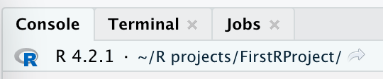
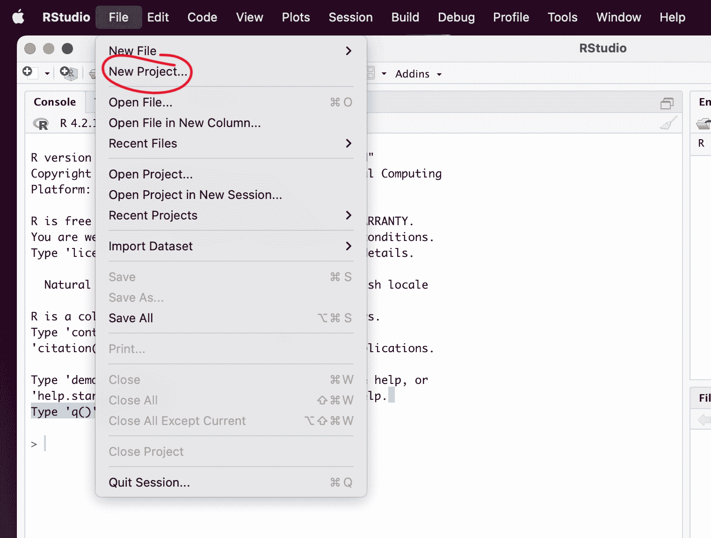
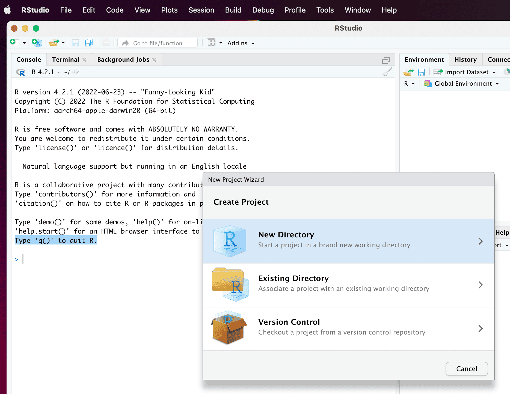
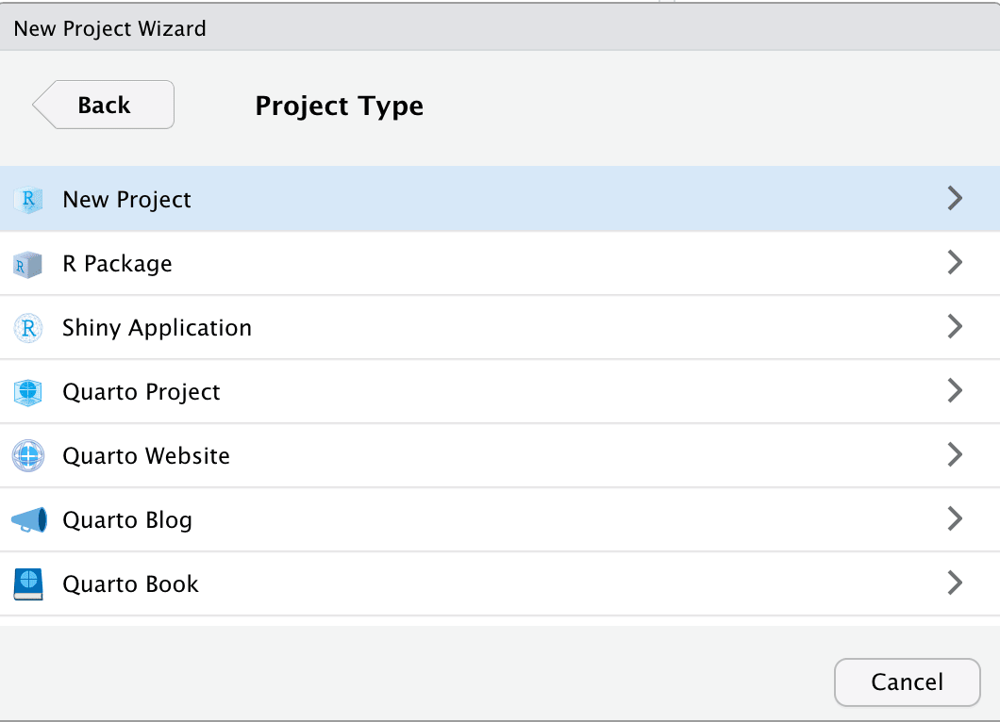
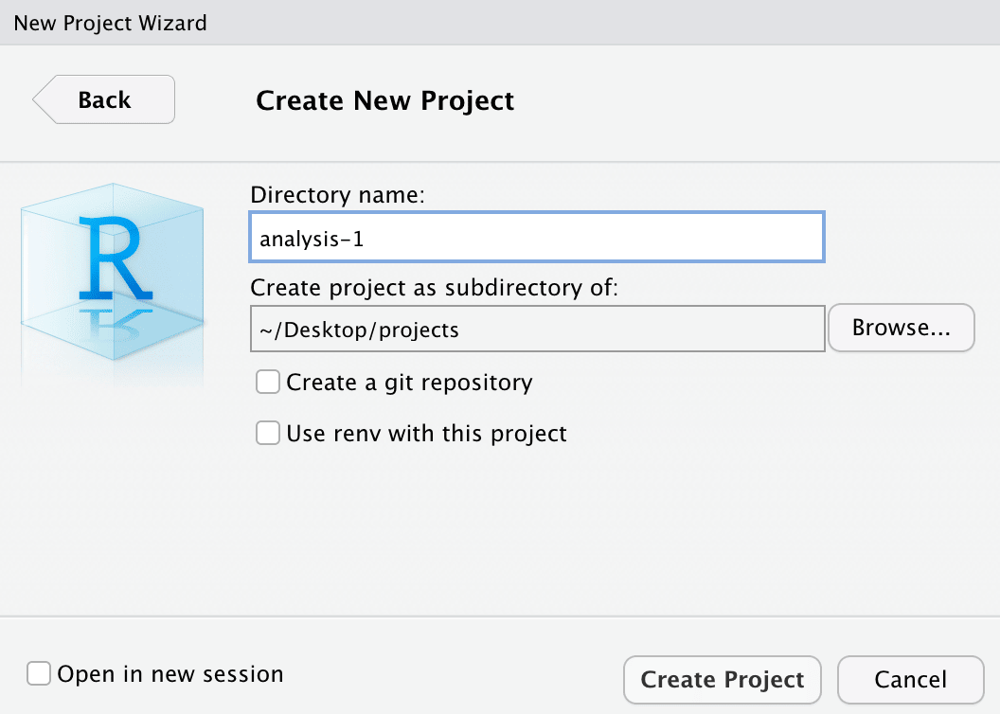
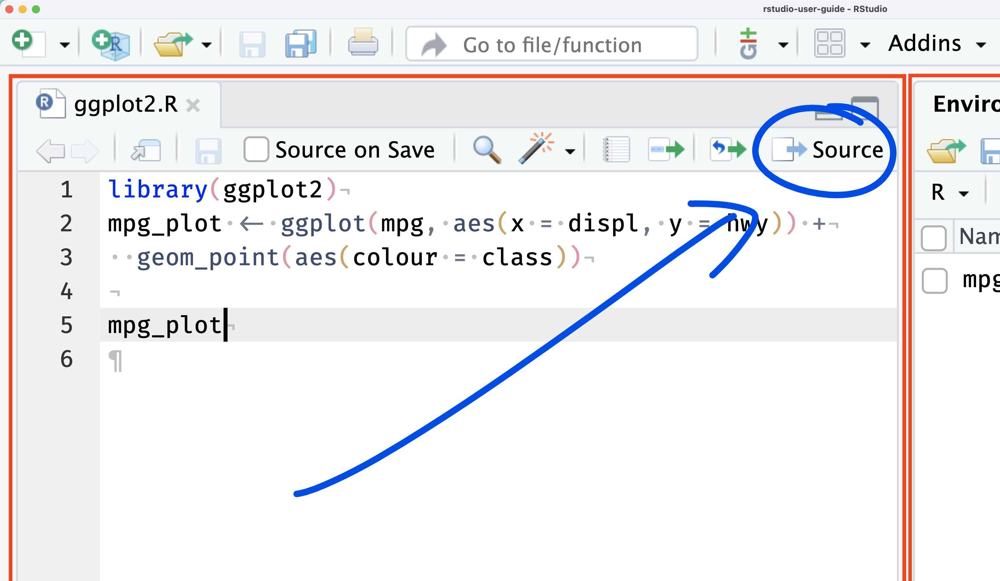
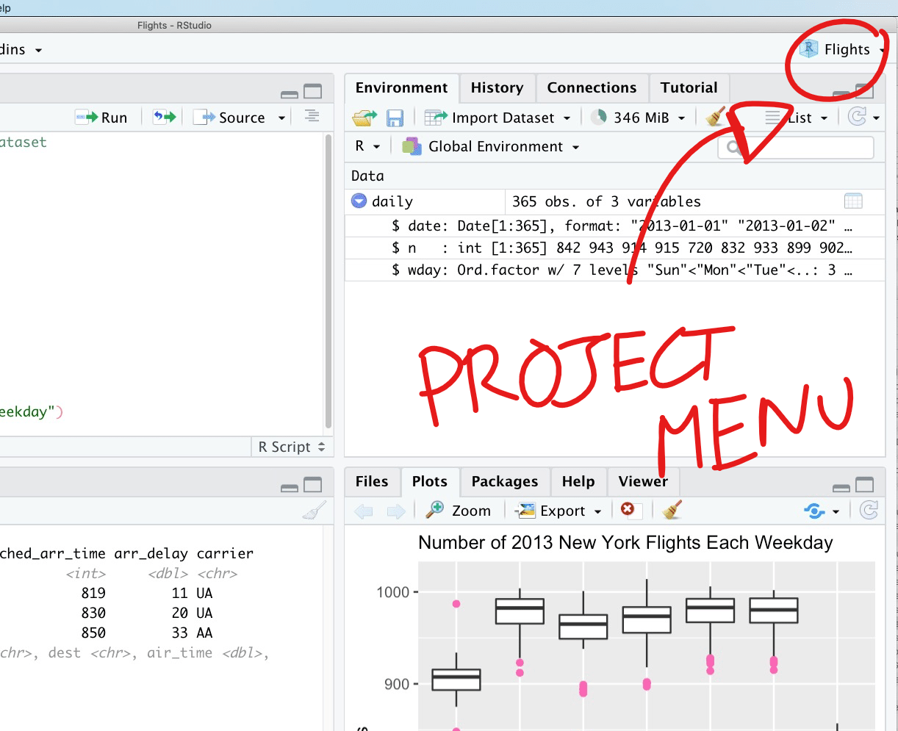
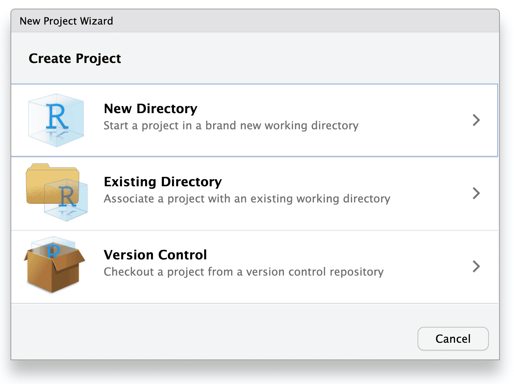
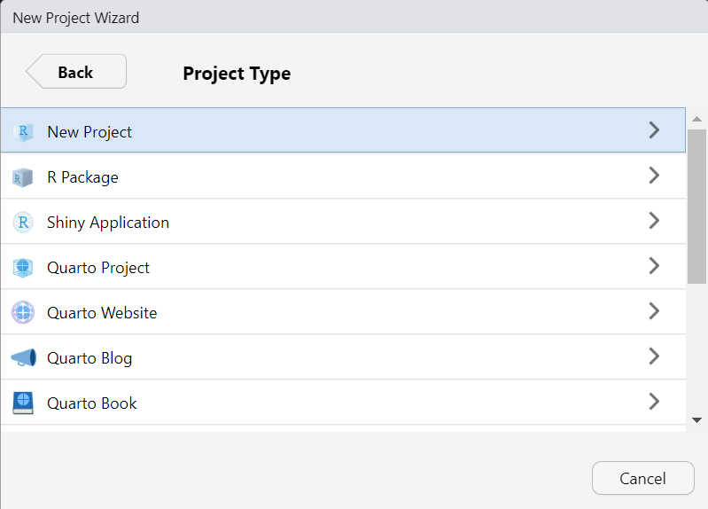

```{r setup, include = FALSE}
library(learnr)
library(tutorial.helpers)
library(tidyverse)
library(knitr)
knitr::opts_chunk$set(echo = FALSE)
knitr::opts_chunk$set(out.width = '90%')
options(tutorial.exercise.timelimit = 60, 
        tutorial.storage = "local")
```

```{r copy-code-chunk, child = system.file("child_documents/copy_button.Rmd", package = "tutorial.helpers")}
```

```{r info-section, child = system.file("child_documents/info_section.Rmd", package = "tutorial.helpers")}
```

<!-- DK: Unless there is a good reason not to, make Script 3 section like Script 2, except with different knowledge drops. -->

<!-- DK: Project is not capitalized. Fix everywhere. -->

<!-- DK: Work with Mark to make the experience good for Windows users. Key issue is adding Windows hints/clarifications to questions which are written implicitly assuming students are on a Mac. -->

<!-- DK: Add Script 3. But, in that section, begin by making a second project. -->

<!-- What about Chromebooks??!! Maybe just send them to Posit Cloud. -->


<!-- Teach about show_file() and how it won't work without doing library(tutorial.helpers) in the Console. First, show it fails. Second, do library() command in Console. Third, show it works now. Fourth, restart R and show it now fails. Lesson: Whenever you get "function not found," it probably means a failure to load a library. -->


<!-- To Format the chunk labels you need to comment out the example comment line in Script 1. And there is at least one more example later. -->

<!-- We do not use the Terminal in this tutorial. Maybe mention it, though? -->

<!-- Given the changes we have made to default settings, lots of these images should be redone. -->

<!-- Do more to bring the new RStudio user docs into the discussion. -->

<!-- There are often two or more ways to do the same thing: like create a new project or a new script. We should mention and explain this throughout. We should also standardize the approach we use, at least the first time through. -->

<!-- Hardest part is creating an R project the first time. We can break it into separate steps? Can we show them the two different Project drop down methods? Actually, this should be taught from the File menu. Fix the gif to do that!  -->


## Introduction
### 

This tutorial covers [Chapter 2 Workflow: basics](https://r4ds.hadley.nz/workflow-basics.html),  [Chapter 4 Workflow: code style](https://r4ds.hadley.nz/workflow-style.html), [Chapter 6  Workflow: scripts and projects](https://r4ds.hadley.nz/workflow-scripts.html), and some material from [Chapter 28  Quarto](https://r4ds.hadley.nz/quarto.html) from [*R for Data Science (2e)*](https://r4ds.hadley.nz/) by Hadley Wickham, Mine Çetinkaya-Rundel, and Garrett Grolemund. You will learn how to use [R scripts](https://r4ds.hadley.nz/workflow-scripts.html#scripts) and how to create [RStudio projects](https://docs.posit.co/ide/user/ide/guide/code/projects.html).


## Checking your setup
### 

<!-- DK: Do the below. Make it as easy to use for Windows students. For example, the use of forward versus backward slashes. -->

<!-- MP: I can help out with this! (Even with my system doing God-knows-what most of the time). -->

<!-- Should provide better guidance for Windows students. I think that their ~ directories are actually their Documents/ folders, which are often backed up on One Drive. So, have them put, by hand, a projects directory on their Desktop and then use that. Or maybe dir.create("~/../Desktop/projects) would work. -->

<!-- MP: I remember that when I first set up R/RStudio/RTools, my ~ directory was C:\\Users\\mark.p\\. It seems like RS typically defaults ~ to %USERPROFILE% -- see https://tinyurl.com/gpt-default-tilde.  -->

Until now, you have been typing your code into the neat boxes in our tutorials. What if you want to start working on your own? 

This tutorial assumes that you have read and completed all the steps in the "Getting Started wth Tutorials" tutorial from the [**tutorial.helpers**](https://ppbds.github.io/tutorial.helpers/) package. We will ask you to **c**opy/**p**aste the **c**ommand/**r**esponse so often, we will be shortening this instruction to CP/CR.

### Exercise 1

You should have installed the **tidyverse** package, among others. If you haven't yet, run `install.package('tidyverse')` in the Console. 

Load the `tidyverse` package into your R Console using the `library()` function.

### 

Run `search()` in the Console to see the libraries that you've currently loaded. CP/CR. That is, copy and paste that command and the result into the space below.

```{r checking-your-setup-1}
question_text(NULL,
    answer(NULL, correct = TRUE),
    allow_retry = TRUE,
    try_again_button = "Edit Answer",
    incorrect = NULL,
    rows = 3)
```

### 

There should be strings such as "package:tidyverse" in the output. These are the packages that are currently loaded in your workspace.

### Exercise 2

In the Console, run:

````
rstudioapi::readRStudioPreference(
  name = "load_workspace",
  default = "Code failed."
  )
````

CP/CR.

```{r checking-your-setup-2}
question_text(NULL,
    answer(NULL, correct = TRUE),
    allow_retry = TRUE,
    try_again_button = "Edit Answer",
    incorrect = NULL,
    rows = 3)
```

### 

The result should be FALSE. If the result was not FALSE, you should run this command in the Console:

````
tutorial.helpers::set_rstudio_settings()
````

This function ensures that your settings for RStudio are sensible.


### Exercise 3

Look at the top left of your Console pane. Here you should see the version of R you are running. It should look something like the image below.

```{r}

```

Type `R.version$version.string` into the Console and hit `Enter`. CP/CR.

```{r checking-your-setup-3}
question_text(NULL,
    answer(NULL, correct = TRUE),
    allow_retry = TRUE,
    try_again_button = "Edit Answer",
    incorrect = NULL,
    rows = 3)
```

### 

This should be the same as the version you saw at the top left of the Console pane. Make sure it is the [most recently released](https://cran.r-project.org/) version of R.


### Exercise 4

Shortly, we will create a new [RStudio project](https://docs.posit.co/ide/user/ide/guide/code/projects.html) for you to work in. Before we do this, it might be useful to understand where you are right now.

In the R Console, run `getwd()`. CP/CR.

```{r checking-your-setup-4}
question_text(NULL,
    answer(NULL, correct = TRUE),
    allow_retry = TRUE,
    try_again_button = "Edit Answer",
    incorrect = NULL,
    rows = 3)
```

### 

This function returns the "path" to your current R working directory. A path is simply the information which allows you to reach a location on your computer. In this case, if you wanted to find the folder from which R is running, you would follow the path returned by `getwd()`.

More info on paths can be found [here](https://people.ischool.berkeley.edu/~kevin/unix-tutorial/section3.html).

### Exercise 5

Whenever you start a new RStudio project, you will want to store it in a location which you can easily find. Right now, you are likely in an arbitrary location on your computer. It would be much more useful to have a location dedicated to your RStudio projects.

From the Console, run `dir.exists("~/Desktop/")`. CP/CR.

```{r checking-your-setup-5}
question_text(NULL,
	answer(NULL, correct = TRUE),
	allow_retry = TRUE,
	try_again_button = "Edit Answer",
	incorrect = NULL,
	rows = 3)
```

### 

If this returns `TRUE`, then you have a "typical" computer set up, with a Desktop in your home directory. (The tilde symbol, `~`, refers to a user's home directory.) We recommend that you store your RStudio projects there. If the return value is `FALSE`, you will need to create a location by hand. However, more experienced computer users should feel free to ignore this advice and set up their project directories as they see fit, at their own risk. 

### Exercise 6

Let's make a folder, and call it `projects`, and store it on our desktop. From the Console, run `dir.create("~/Desktop/projects/")`. CP/CR. (This command will only work if `dir.exists("~/Desktop/")` returned `TRUE`.)

```{r checking-your-setup-6}
question_text(NULL,
	answer(NULL, correct = TRUE),
	allow_retry = TRUE,
	try_again_button = "Edit Answer",
	incorrect = NULL,
	rows = 3)
```

### 

If that command works, you are all set. (If you get a message about the directory already exists, then you are also all set.) If not, you will need to create a `projects` directory by hand. Helpful resources can be found [here](https://support.microsoft.com/en-us/office/create-a-new-folder-cbbfb6f5-59dd-4e5d-95f6-a12577952e17) for Windows, and [here](https://support.apple.com/guide/mac-help/organize-files-using-folders-mh26885/mac) for macOS.

**NOTE: Do not store this folder inside of a cloud storage directory such as OneDrive.** This can cause heaps of unforeseen problems for you in the future.

The path to your R projects should not include any folders with spaces (or other weird characters) in their names. For example, this is a reasonable location for R projects if you are using a Mac:

````
/Users/dkane/Desktop/projects/
````

<!-- And if you are using Windows . . . -->

The next example is bad. Do not use spaces or weird characters!

````
/Users/dkane/Desktop/my projects/
````

## R Projects
### 

Good data scientists keep their work organized. You should place your work in different [RStudio projects](https://docs.posit.co/ide/user/ide/guide/code/projects.html), which are simply folders (that is, directories) on your computer with some helper files. Each separate RStudio project is a folder within your main folder for your R work, i.e.,  `/Users/dkane/Desktop/projects/`. We use the terms "RStudio project" and "R project" interchangeably. 


### Exercise 1

**Read all of the instructions before starting this exercise.**

You will be forced to close the tutorial during Project creation. You'll be able to re-open the tutorial and get back to where you left off once the Project is created. 

The first step is to click `File -> New Project` from the main menu:

```{r}

```

Select `New Directory`:

```{r}

```

Select `New Project`:

```{r}

```

Yes, it is confusing that this is the second time you have selected `New Project`! But that's only due to the fact that RStudio offers many options for projects. 

### 

Use `analysis-1` for the "Directory name". In the "Create project as subdirectory of" box, use your new `projects` folder.

```{r}

```

Ensure that all the check boxes are unchecked. Click "Create Project." 

### 

Now that you have read all the directions, we can go through the steps. But note that, when you first click `File -> New Project`, you will get the "Terminate Jobs" warning. (Recall the discussion from the "Getting Started with Tutorials" tutorial in the **tutorial.helpers** package.)

And that is OK! Go ahead and click "Terminate Jobs" and follow the above steps. **You will need to restart the tutorial**. Your R session will be located in this new project. For the rest of this tutorial, we will be working in `analysis-1`.

### 

Once you restart the tutorial, run `getwd()` in the Console. CP/CR.

```{r r-projects-1}
question_text(NULL,
    answer(NULL, correct = TRUE),
    allow_retry = TRUE,
    try_again_button = "Edit Answer",
    incorrect = NULL,
    rows = 3)
```

### 

This path should now be different than our previous path, similar to the path below. Creating/opening an R project moves the R session to that directory.


````
/Users/dkane/Desktop/projects/analysis-1/
````


### 

If your path does not include your `projects` folder, you probably did not fill in the "Create project as subdirectory of:" box correctly. It should be the path to your `projects` folder, including `projects` itself.


### Exercise 2

Run `list.files()`. CP/CR.

```{r r-projects-2}
question_text(NULL,
    answer(NULL, correct = TRUE),
    allow_retry = TRUE,
    try_again_button = "Edit Answer",
    incorrect = NULL,
    rows = 3)
```

### 

`list.files()` returns files contained in your current R project. This should return only the file `analysis-1.Rproj`.

Keeping all the files associated with a given project --- input data, R scripts, analytic results, and figures --- together in one directory is such a wise and common practice that RStudio has built-in support for this via projects.

Everything you need is in one place and cleanly separated from all the other projects that you are working on.


### Exercise 3

In the Console, run:

````
tutorial.helpers::show_file("analysis-1.Rproj")
````

CP/CR.

`show_file()` is a function which we have written which makes it easy for you to demonstrate, and for us to check, that you have done what we wanted you to do.

```{r r-projects-3}
question_text(NULL,
    answer(NULL, correct = TRUE),
    allow_retry = TRUE,
    try_again_button = "Edit Answer",
    incorrect = NULL,
    rows = 3)
```

### 

This should return lines containing some basic settings for your R project. For example, `RestoreWorkspace` is set to `Default`. Each R project has its own `Rproj` file in which its settings are recorded. 

### 

Indeed, the *definition* of an R project --- from the point of view of RStudio --- is a directory with an associated `Rproj` file. ("Folder" and "directory" are used interchangeably.)

## Script 1
### 

So far, we have only worked in the R Console, but it's quite difficult to type more than a few lines of code into the Console at once. One solution is to use [R scripts](https://r4ds.hadley.nz/workflow-scripts.html#scripts), files which contain a permanent copy of our code.

### Exercise 1

Create an R script by clicking the `File -> New File` drop down menu at the top left of your RStudio Session, and then selecting `R Script`.

### 

An untitled, empty file should pop up above the R Console in the Source pane. By opening a script, you have caused the Source pane to open, the fourth [common pane within RStudio](https://docs.posit.co/ide/user/ide/guide/ui/ui-panes.html). (The three other panes are Console, Environment and Output. Within each pane, there are usually multiple tabs.)

You can also create a new R script using the keyboard shortcut `Command/Ctrl + Shift + N`. 

Type `5 * 5` into your R script file. Save the file. Name it `script-1.R`. (Note that R will provide the `.R` suffix, so you only need to type `script-1`.) 

In the Console, run:

````
tutorial.helpers::show_file("script-1.R")
````

CP/CR.

```{r script-1-1}
question_text(NULL,
	answer(NULL, correct = TRUE),
	allow_retry = TRUE,
	try_again_button = "Edit Answer",
	incorrect = NULL,
	rows = 3)
```

### 

You might have gotten this warning:

````
Warning message:
In readLines("script-1.R") : incomplete final line found on 'script-1.R'
````

This means that your file need a blank line at the end. As a rule of thumb, it is always a good idea to have the last line of any text file be blank.

R scripts are permanent copies of your code. You can save them and also work with them interactively.

### Exercise 2

Note the "Source" button, which is in the top right corner of the Source pane. If you hover your cursor over it, you will see "Source the contents of the active document." Press the Source button. (We will sometimes shorten the instruction "press the source button" to just "source" the script.)

```{r}

```

Note what happens in the Console. CP/CR.


```{r script-1-2}
question_text(NULL,
    answer(NULL, correct = TRUE),
    allow_retry = TRUE,
    try_again_button = "Edit Answer",
    incorrect = NULL,
    rows = 2)
```

### 

You answer should look like this:

````
> source("~/Desktop/projects/analysis-1/script-1.R", echo=TRUE)

> 5 * 5
[1] 25
> 
````

### 

Whenever you run an R script file by hitting the "Source" button, Rstudio will send all the code in the file to the R Console. Because `echo=TRUE`, the Console prints out both the code itself (that is the "echo") and the result of executing that code.


### Exercise 3

There are often "shortcut key" combinations which perform the same task as clicking a button. Placing your cursor inside the R script window and using the keyboard shortcut `(Cmd/Ctrl) + Shift + (Return/Enter)` is the same as hitting the "Source" button. 

Note that `Return` is the name of a Mac key and `Enter` the name of the corresponding Windows key, just like `Cmd` ("Command") is a Mac key and `Ctrl` ("Control") is the equivalent Windows key. In other words, on the Mac, we hit `Cmd + Shift + Return` while on Windows it is `Ctrl + Shift + Enter`. However, typing `Return/Enter` all the time is annoying, so, going forward, we will just use `Enter`. Mac users are expected to remember that this means the `Return` key.

Try it now. CP/CR.


```{r script-1-3}
question_text(NULL,
    answer(NULL, correct = TRUE),
    allow_retry = TRUE,
    try_again_button = "Edit Answer",
    incorrect = NULL,
    rows = 2)
```

### 

Using shortcut keys is quicker and more professional than clicking buttons. 

### Exercise 4

In your R script, type `6 + 3` in the line after `5 * 5`. Save the file with `Command/Ctrl + S`. (Note that the `S` in that shortcut key just refers to the "S" key on your keyboard. You don't need to capitalize it.)

"Source" this file. CP/CR.

```{r script-1-4}
question_text(NULL,
    answer(NULL, correct = TRUE),
    allow_retry = TRUE,
    try_again_button = "Edit Answer",
    incorrect = NULL,
    rows = 2)
```

### 

The answer is what you might expect:

````
> source("~/Desktop/projects/analysis-1/script-1.R", echo=TRUE)

> 5 * 5
[1] 25

> 6 + 3
[1] 9
> 
````

### 

Each line is echoed. Each line is executed.  Finally, the results of each line, if there are any, are printed.

The output you see is the same as what would happen if you copied each line to the Console and hit `Enter` after each one.

### Exercise 5

Instead of sourcing the entire file, we can just execute (or "run") a single line. In `script-1.R`, place your cursor on the same line as `6 + 3` and click the "Run" button to the left of the "Source" button. CP/CR.

```{r script-1-5}
question_text(NULL,
    answer(NULL, correct = TRUE),
    allow_retry = TRUE,
    try_again_button = "Edit Answer",
    incorrect = NULL,
    rows = 2)
```

You should get:

````
> 6 + 3
[1] 9
> 
````

### 

Instead of both lines in the script executing, only the second line does. And the process by which this happens has nothing to do with the entire script. **Run is not the same thing as Source.** With Run, you are just copy/pasting one line from the script to the Console at a time. With Source, you're copy/pasting *all* lines from the script, but executing them one at a time. 

### Exercise 6

The shortcut key for running a single line of code is `Command/Ctrl + Enter`. In your R script, place your cursor on the same line as `5 * 5` and hit `Command/Ctrl + Enter`. CP/CR.

```{r script-1-6}
question_text(NULL,
    answer(NULL, correct = TRUE),
    allow_retry = TRUE,
    try_again_button = "Edit Answer",
    incorrect = NULL,
    rows = 2)
```

### 

Only the first line of the script is executed. `Command/Ctrl + Enter` is probably the single most commonly used shortcut key because it is very handy to execute your code line-by-line.

### Exercise 7

Go back to the first line in your R script. Change `5 * 5` to `x <- 5 * 5`, thereby creating an object named `x` with a value of 25. Save the file. Click the "Source" button. CP/CR.

```{r script-1-7}
question_text(NULL,
	answer(NULL, correct = TRUE),
	allow_retry = TRUE,
	try_again_button = "Edit Answer",
	incorrect = NULL,
	rows = 3)
```

Your answer should look like:

````
> source("~/Desktop/projects/analysis-1/script-1.R", echo=TRUE)

> x <- 5 * 5

> 6 + 3
[1] 9
> 
````

### 

Note how the `x <- 5 * 5` is executed (and echoed) but nothing is printed. The assignment operator (`<-`) does not generate a printed result.


### Exercise 8

In the Console tab, run `ls()`. CP/CR.

```{r script-1-8}
question_text(NULL,
    answer(NULL, correct = TRUE),
    allow_retry = TRUE,
    try_again_button = "Edit Answer",
    incorrect = NULL,
    rows = 2)
```

### 

`ls()` returns a list of objects present in your environment. These are the same objects displayed in your Environment tab in the Environment pane in the upper right window in RStudio. You should see that it returned `x`, since you defined `x` using your R script.

<!-- DK/MP: Anything more we might do here? Maybe restart R session, see the object x disappear and source whole script? We would then need to edit one comment/question in the next session. Maybe a bit more about projects?  Switching between them, exiting, difference between being in a project and not, etc. -->


## Script 2
### 

Let's create this plot:

```{r}
hist_p <- ggplot(data = diamonds,
                 mapping = aes(x = carat)) +
  geom_histogram(bins = 100,
                 color = "white") +
  scale_y_continuous(labels = scales::comma_format()) +
  labs(title = "Histogram of Carat (Weight) among 50,000 Diamonds",
       subtitle = "Carats just at or above meaningful numbers are very common",
       x = "Carat",
       y = "Number",
       caption = "diamonds data set from ggplot2 package")

hist_p
```

### Exercise 1

Click `File -> New File -> R Script`. At the top of the Source pane, the file should be called `Untitled1` (or something similar). 

### 

Click the "Save current document" icon -- the disk image to the left of the "Source on Save" box and below the script title. Or use the shortcut `Command/Ctrl + S` to save the script. Let's call this file `script-2`. The `.R` suffix is added automatically.

In the Console, run `list.files()`. CP/CR.

```{r script-2-1}
question_text(NULL,
    answer(NULL, correct = TRUE),
    allow_retry = TRUE,
    try_again_button = "Edit Answer",
    incorrect = NULL,
    rows = 2)
```

### 

Save your scripts (with informative names) in the project, edit them, run them line-by-line or in their entirety. Restart R frequently to make sure you’ve captured everything in your scripts.

Scripts and projects give you a solid workflow that will serve you well in the future. Always remember to create one RStudio project for each data analysis project. That project may contain multiple scripts files, along with other material.

### Exercise 2

Restart your R session using `Session -> Restart R`. This will cause R to bring up the "Terminate Jobs" box. Go ahead and terminate the tutorial. Then, restart the tutorial once R restarts. 

From the Console, run `list.files()`. CP/CR.

```{r script-2-2}
question_text(NULL,
	answer(NULL, correct = TRUE),
	allow_retry = TRUE,
	try_again_button = "Edit Answer",
	incorrect = NULL,
	rows = 3)
```

### 

All the files we had from before --- `analysis-1.Rproj`, `script-1.R`, and `script-2.R` --- still exist. Our work, if we have saved it, is preserved even when R (or RStudio) restarts. 

### Exercise 3

From the Console, run `ls()`. CP/CR.

```{r script-2-3}
question_text(NULL,
	answer(NULL, correct = TRUE),
	allow_retry = TRUE,
	try_again_button = "Edit Answer",
	incorrect = NULL,
	rows = 3)
```

### 

`x` is gone! The environment --- the place in the computer where R creates and uses objects --- is cleaned, by default, each time R restarts. This is a good thing! For our work to be "reproducible," we want to be able to start from nothing except our code.   

### Exercise 4

At the top of `script-2.R`, type

````
library(tidyverse)
````

You will see, in the top bar of the Source pane, that `script-2.R`, the name of the file, is now a different color, and has an asterisk. This indicates that there are unsaved changes in the file.

### 

Run the entire file with `Ctrl + Shift + Enter`. Note how much material --- the "Attaching core tidyverse packages" and so on --- is produced because, by default, we are sourcing the file with `echo=TRUE`. 

### 

Run `search()` in the Console. CP/CR.

```{r script-2-4}
question_text(NULL,
    answer(NULL, correct = TRUE),
    allow_retry = TRUE,
    try_again_button = "Edit Answer",
    incorrect = NULL,
    rows = 2)
```

### 

This function returns a list of loaded packages. This should include the string `package:tidyverse`.

### Exercise 5

Skip a line and add the following comment to the file:

````
# This is an example of a code comment within an R script.
````

Save the file. 

In the Console, run:

````
tutorial.helpers::show_file("script-2.R")`
````

CP/CR.


```{r script-2-5}
question_text(NULL,
    answer(NULL, correct = TRUE),
    allow_retry = TRUE,
    try_again_button = "Edit Answer",
    incorrect = NULL,
    rows = 2)
```

### 

Did you remember to have a blank line at the end of the file? If not, you got a warning. Always have a blank line at the end of any text file.

### 

Comments begin with a hash (also known as a "pound sign"): `#`. R will ignore everything on the line to the right of the hash when trying to run the code.

Comments are an extremely useful tool when writing code. If they're placed well, it becomes much easier to *debug* (find and fix mistakes) if something goes wrong. 

There are a few "guidelines" to writing comments, for example:

  - Comments should be used sparingly. 
  - Comments are unnecessary and in fact distracting if they state the obvious. 
  - Comments that contradict the code are worse than no comments. Always make a priority of keeping the comments up-to-date when the code changes!

Typically, when reading code, you should be able to answer 3 questions fairly easily, for every line: 

  - **What** is this code doing, 
  - **How** is it doing it, and
  - **Why** is it being done. 
  
The **what** and **how** can be deduced from the code itself. The **why**, though, is a bit trickier, and it is highly recommended that you use comments to make it easier to tell **why** something is being done. 

```{r echo = T, eval = F}
# This is an example of a poor comment:
...
x <- x + 1    # Increment x
...

# This is an example of a good comment:
...
x <- x + 1    # Account for borders
...
```

### Exercise 6

Change the code comment in `script-2.R` from "This is an example of a code comment within an R script." to a one sentence description of one of your recent meals. Save the file. 

In the Console, run:

````
tutorial.helpers::show_file("script-2.R")
````

CP/CR.


```{r script-2-6}
question_text(NULL,
    answer(NULL, correct = TRUE),
    allow_retry = TRUE,
    try_again_button = "Edit Answer",
    incorrect = NULL,
    rows = 2)
```

### 

Get in the habit of adding comments.

Figuring out *why* something was done is much more difficult than understanding *how* it was done. For example, `geom_smooth()` has an argument called `span`, which controls the smoothness of the curve, with larger values yielding a smoother curve. Suppose you decide to change the value of `span` from its default of 0.75 to 0.9: it’s easy for a future reader to understand what is happening, but unless you note your thinking in a comment, no one will understand *why* you changed the default.


### Exercise 7

Skip a line after your comment. Call `ggplot()`, setting `data` to `diamonds` and mapping `x` to `carat` within `aes()`. 

<!-- DK: Add back the code. -->

Run the entire file again. Note the sloppiness of the word "run" in this instruction. It is not always clear what "run" means. For example, it does *not* mean to click the "Run" button! In general, "run" means to "execute" all the code in the file, most commonly by either using `Ctrl + Shift + Enter` or by pressing the "Source" button.

### 

This should generate a blank plot in the Plots tab in the Output pane at the bottom right of your RStudio session.

### 

In the Console, run:

````
tutorial.helpers::show_file("script-2.R")
````

CP/CR.


```{r script-2-7}
question_text(NULL,
    answer(NULL, correct = TRUE),
    allow_retry = TRUE,
    try_again_button = "Edit Answer",
    incorrect = NULL,
    rows = 2)
```

### 

`ggplot()` will generate a blank plot, at least until a `geom` layer is added. 

### Exercise 8

Add a layer with `geom_histogram()`. Change the border color in our graph by setting `color` to `"white"` within `geom_histogram`, and change the number of columns in our plot by setting the `bins` argument to `100`. Remember that, to connect the `ggplot()` call to `geom_histogram()`, we need a `+`. 

Run the file. Again, to "run" a script generally means to "execute" it, meaning sending it to the R process. We have learned two ways to (easily) execute an entire file: pressing the "Source" button or hitting the associated shortcut key: `Ctrl + Shift + Enter`.

### 

This should generate bars on your plot. Did you remember to place a `+` after the `ggplot()` call and before the `geom_histogram()` layer?

### 

In the Console, run:

````
tutorial.helpers::show_file("script-2.R")
````

CP/CR.


```{r script-2-8}
question_text(NULL,
    answer(NULL, correct = TRUE),
    allow_retry = TRUE,
    try_again_button = "Edit Answer",
    incorrect = NULL,
    rows = 2)
```

### 

The `color` argument used here modifies the *border* color of our columns. To change the *fill* color, use the `fill` argument.

### Exercise 9

It would be nice if the numbers on the Y-axis were formatted better, i.e., with commas. The easiest way to do that is to add this line to the script.

````
scale_y_continuous(labels = scales::comma_format())
````

Do so. Run the file. Note that you don't need to save the file first. If you execute a file with either "Source" or `Ctrl + Shift + Enter`, RStudio will save the file automatically.

Don't forget that you will need a `+` after the call to `geom_histogram()`.

In the Console, run:

````
tutorial.helpers::show_file("script-2.R")
````

CP/CR.

```{r script-2-9}
question_text(NULL,
	answer(NULL, correct = TRUE),
	allow_retry = TRUE,
	try_again_button = "Edit Answer",
	incorrect = NULL,
	rows = 3)
```

### 

We use `scale_y_continuous()` (and `scale_x_continuous()`) to modify the labels and the breaks in numeric axes. The **scales** package provides a variety of useful formatting tools, including `comma_format()`, `dollar_format()` and others.


### Exercise 10

Now let's make our graph look a little nicer by adding a `labs()` layer with an appropriate title, subtitle, and axis labels.

Reminder, this is what our graph should look like

```{r}
hist_p
```

Run your R script file to see your completed plot. Again, note the language here! Above, we made a distinction between the "Source" and "Run" buttons above --- and that distinction is real. However, in casual language, we use the word "run" to generically mean "Tell the computer to execute the commands in this file." We don't necessarily care how that is achieved.

### 

In the Console, run:

````
tutorial.helpers::show_file("script-2.R")
````

CP/CR.

```{r script-2-10}
question_text(NULL,
    answer(NULL, correct = TRUE),
    allow_retry = TRUE,
    try_again_button = "Edit Answer",
    incorrect = NULL,
    rows = 8)
```

### 

Good coding style is like correct punctuation: you can manage without it, butitsuremakesthingseasiertoread. Even as a very new programmer, it’s a good idea to work on your code style. Using a consistent style makes it easier for others (including future-you!) to read your work and is particularly important if you need to get help from someone else. 

Note the nice formatting. After the `ggplot()` call, the next two commands --- `geom_histogram()` and `labs()` --- are both indented the same amount. Similarly, arguments to a given function --- like `bins` and `color` --- are lined up with each other.


### Exercise 11

Now we have the code which creates a plot in `script-2.R`. How do we use this plot for other things? Right now we have to run `script-2.R` every time we want to see the plot, which is a little inconvenient.

### 

We can use the `ggsave()` function. Type `?ggsave` in the R Console. This will open the help page for `ggsave()`. Copy and paste the Description from the help page into the space below.

```{r script-2-11}
question_text(NULL,
    answer(NULL, correct = TRUE),
    allow_retry = TRUE,
    try_again_button = "Edit Answer",
    incorrect = NULL,
    rows = 5)
```

`ggsave()` is used to save plots as individual files, separate from the code which created the plot. In this case we will be using the "png" format.

### Exercise 12

We want to save our entire graph to an object, which can be done by setting our plot equal to a variable. Call this variable `hist_p`.

Now using the `ggsave()` function we can create a png of our plot from our code. In `ggsave()`, set `plot` to `hist_p`, `file` to `"diamonds.png"`.

Your entire file should look like:

```{r}
library(tidyverse)

# Had an OK filet mignon at Cheesecake Factory.
hist_p <- ggplot(data = diamonds,
                 mapping = aes(x = carat)) +
  geom_histogram(bins = 100,
                 color = "white") +
  scale_y_continuous(labels = scales::comma_format()) +                
  labs(title = "Histogram of Carat (Weight) among 50,000 Diamonds",
       subtitle = "Carats just at or above meaningful numbers are very common",
       x = "Carat",
       y = "Count",
       caption = "diamonds data set from ggplot2 package")

ggsave(plot = hist_p, file = "diamonds.png")
```

<!-- MP: From our end, the above code chunk makes "diamonds.png" show up in the tutorial folder whenever we source the .Rmd file. Maybe add it to the .gitignore? This is (somewhat) fine the way it is, although adding to .gitignore will be nice. -->

Run your code.

### 

In the Console, run `list.files()`. CP/CR.

```{r script-2-12}
question_text(NULL,
    answer(NULL, correct = TRUE),
    allow_retry = TRUE,
    try_again_button = "Edit Answer",
    incorrect = NULL,
    rows = 2)
```

### 

You should see the `diamonds.png` file which contains your plot. Look in the bottom right corner of your workspace (i.e., in the Output pane) in the Files tab. Click on the `diamonds.png` file to view your plot.

If the title text flows out of the image, you might want to modify the `scale` argument in `ggsave()` to find a better image size. `scale` is set to 1 by default.

## Script 3
### 

<!-- DK: Make this the same creation process as Scripts 1 and 2. -->

<!-- MP: Just noting the process here: -->
<!-- 1. Create the script.  -->
<!-- 2. Put something in it and save it. See that it's there (list.files() and such).  -->
<!-- 3. Run/Source the script.  -->
<!-- 4. Repeat "put something in" and "run/source" as needed.  -->

Let's make another plot, this time in a script inside of a *different* RStudio project. We'll be making this plot:

```{r script-3-0}
car_plot <- ggplot(mpg, aes(displ, hwy, colour = class)) + 
  geom_point()

car_plot
```

### Exercise 1

Type `getwd()` into the Console. CP/CR. 

```{r script-3-1}
question_text(NULL,
    answer(NULL, correct = TRUE),
    allow_retry = TRUE,
    try_again_button = "Edit Answer",
    incorrect = NULL,
    rows = 5)
```

### 

Your answer should look like this:

```
"/Users/dkane/Desktop/projects/project-1"
```

Somewhere in the path should be `project-1`, the name of the RStudio Project you're in right now. 

<!-- DK: The below is good stuff! But it is too much in one place. We need at least one other question -->

### Exercise 2

Type `list.files()` into the Console. CP/CR. 

```{r script-3-2}
question_text(NULL,
	answer(NULL, correct = TRUE),
	allow_retry = TRUE,
	try_again_button = "Edit Answer",
	incorrect = NULL,
	rows = 3)
```

### 

This command shows the files in the directory.

Note that "project" has multiple meanings. First, "project" is a generic term for an RStudio project, generally with a sensible name. Second, `project-1`, note the use of typewriter font, is the name of a specific RStudio project. Third, `project-1` --- the same string in the same font --- can refer to the directory in which the RStudio Project is located.

### Exercise 3

<!-- DK: Change this so that we only create a new project. This process magically moves us from project-1 to project-3. MP: Done -->

<!-- DK: Make this simpler. Never close a project without explaining all the steps. MP: No project being closed now, this commment N/A -->

***Do not start this exercise until you have read all the instructions. This exercise will force you to close the tutorial, so you won't be able to access the instructions while completing the exercise. Once you're done with all the steps in this exercise, re-open the tutorial to continue.***

We want to make the plot in a script that's inside of a different RStudio project. To do that, we need to actually *create* the new project! The way to do that is quite simple, as RStudio has a handy menu for managing projects:

```{r}

```

To make a new project, press the "New Project..." button. You'll be asked to close the tutorial here. Do so, and you'll soon see the New Project Wizard. 

```{r}

```

We want to make a project in a new directory, so select that option. 

Now, you'll be asked for a *project type*. Keep it simple and select "New Project". Name it `project-2` and create it as a *subdirectory* of (folder inside of) your Projects folder. Make sure all the checkboxes are **un**checked, and hit "Create Project"!

```{r}

```

Don't forget to open up the tutorial from the menu in the top right again once you're done. 

### Exercise 4

Type `getwd()` into the Console. CP/CR.

```{r script-3-4}
question_text(NULL,
    answer(NULL, correct = TRUE),
    allow_retry = TRUE,
    try_again_button = "Edit Answer",
    incorrect = NULL,
    rows = 5)
```

### 

Your answer should look like this:

```
"/Users/dkane/Desktop/projects/project-2"
```

Somewhere in the path should be `project-2`, the name of the RStudio Project you just made and are now in. 

### Exercise 5

<!-- DK: Exercises without instructions are bad exercises. MP: Fixed -->

<!-- DK: In this whole tutorial, we only  -->
<!-- MP: DK -- is the above a thought? Should it stay unfinished or is it one you're willing to lose? -->

Now, we have to create the script where we'll be creating our plot. 

In the menu bar on the top of the window, press `File -> New File -> R Script`. Type `5 * 5` and a newline into the file and hit `Ctrl/Cmd + S` to save it. Save it as `script-3.r` (the `.r` is automatically supplied by the dialog box when you save, so you only need to type `script-3`). 

In the console, run `list.files()`. CP/CR. 


```{r script-3-5}
question_text(NULL,
	answer(NULL, correct = TRUE),
	allow_retry = TRUE,
	try_again_button = "Edit Answer",
	incorrect = NULL,
	rows = 3)
```

###

You should see `script-3.r` somewhere in the output. 

 
<!-- DK: Have we explained the RStudio panes? -->
<!-- MP: They've been seen by the student multiple times for sure. (I know I made multiple images that use them.) -->

### Exercise 6

<!-- DK: `Ctrl-S` (`Cmd-S` on Mac) is bad. MP: Fixed -->

Go back to editing `script-3.r`. Get rid of everything that's already there. Copy-paste the below code into the script, and save with `Ctrl/Cmd + S`. 

```{r echo = T, eval = F}
car_plot <- ggplot(mpg, aes(displ, hwy, colour = class)) + 
  geom_point()

car_plot

```

Don't forget to have an empty line at the end of the file! 

Once you're done, source the script with the "Source" button in the top right. 

###

Back in the Console, run `tutorial.helpers::show_file('script-3.r')`. CP/CR. 

```{r script-3-6}
question_text(NULL,
	answer(NULL, correct = TRUE),
	allow_retry = TRUE,
	try_again_button = "Edit Answer",
	incorrect = NULL,
	rows = 3)
```

The output should have the same chunk of code as the one you were given to copy-paste above. 

## Summary
### 

This tutorial covered [Chapter 2 Workflow: basics](https://r4ds.hadley.nz/workflow-basics.html),  [Chapter 4 Workflow: code style](https://r4ds.hadley.nz/workflow-style.html), [Chapter 6 Workflow: scripts and projects](https://r4ds.hadley.nz/workflow-scripts.html), and some material in [Chapter 28 Quarto](https://r4ds.hadley.nz/quarto.html) from [*R for Data Science (2e)*](https://r4ds.hadley.nz/) by Hadley Wickham, Mine Çetinkaya-Rundel, and Garrett Grolemund. You learned how to use [R scripts](https://r4ds.hadley.nz/workflow-scripts.html#scripts) and how to create [RStudio projects](https://docs.posit.co/ide/user/ide/guide/code/projects.html).


```{r download-answers, child = system.file("child_documents/download_answers.Rmd", package = "tutorial.helpers")}
```
