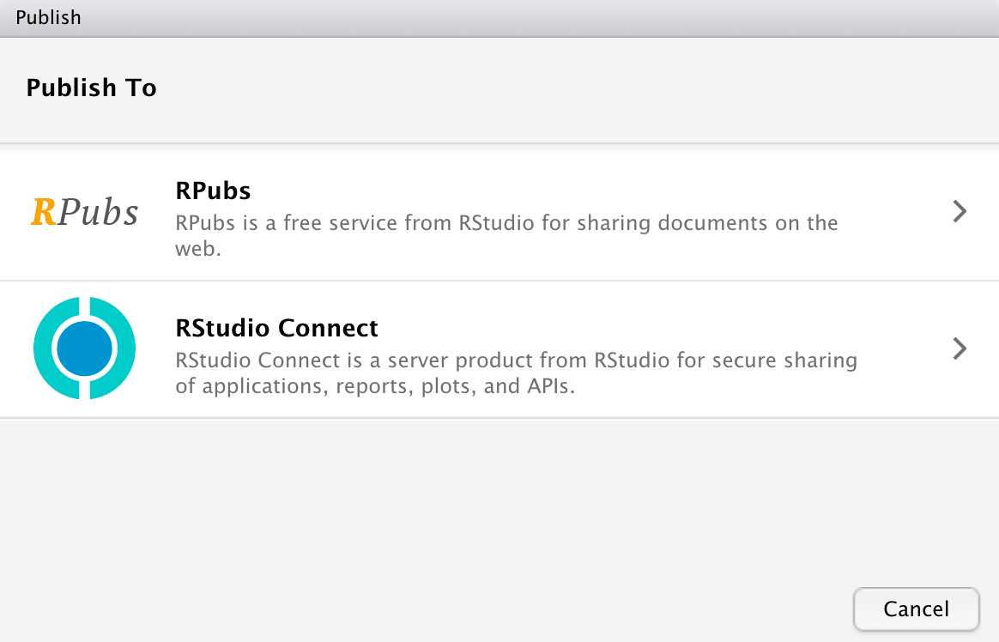

```{r setup, include = FALSE}
library(learnr)
library(tutorial.helpers)
library(tidyverse)
library(knitr)
knitr::opts_chunk$set(echo = FALSE)
knitr::opts_chunk$set(out.width = '90%')
options(tutorial.exercise.timelimit = 60, 
        tutorial.storage = "local")
```

```{r copy-code-chunk, child = system.file("child_documents/copy_button.Rmd", package = "tutorial.helpers")}
```

```{r info-section, child = system.file("child_documents/info_section.Rmd", package = "tutorial.helpers")}
```

<!-- Dealing with RPubs versus Quarto Pub versus Posit Cloud is annoying!  -->

<!-- RPubs works well, just as it always has! It works from the publish button, which is nice for the initial learning. It produces a nice URL, which you can edit. The main page of your account is a nice portfolio of work. The only reason to move away is a fear that Rpubs will be going away. With luck, it isn't!-->

<!-- Posit Cloud is available from the Publish button in RStudio. That is convenient! But sharing it more broadly is annoying. You have to click on the circle with three dots in the center, located in the upper right. Select the "Open Solo" option. This produces a super long and weird url, which does work for anyone. I can't find anyway to give someone a url for your main account, which they could then go to and see lots of your work. -->

<!-- Quarto Pub is not available from the Publish button. Nor does the quarto package currently supporting publishing. -->

<!-- MP: Comments moved from tutorial 02a are above this line.  -->

## Introduction
### 

This tutorial covers [Chapter 2 Workflow: basics](https://r4ds.hadley.nz/workflow-basics.html),  [Chapter 4 Workflow: code style](https://r4ds.hadley.nz/workflow-style.html), [Chapter 6  Workflow: scripts and projects](https://r4ds.hadley.nz/workflow-scripts.html), and some material from [Chapter 28  Quarto](https://r4ds.hadley.nz/quarto.html) from [*R for Data Science (2e)*](https://r4ds.hadley.nz/) by Hadley Wickham, Mine Çetinkaya-Rundel, and Garrett Grolemund. You will learn how to create [Quarto documents](https://docs.posit.co/ide/user/ide/guide/documents/quarto-project.html#creating-new-documents) and how to publish your work to the web using [Rpubs](https://rpubs.com/).

## Quarto 1
### 

Quarto is a file format for making dynamic documents with R and other languages, like Python. To learn more about Quarto and how to use it, check out the [official webpage](https://quarto.org/). Quarto is the successor technology to [R Markdown](https://rmarkdown.rstudio.com/). This section introduces [Quarto documents](https://docs.posit.co/ide/user/ide/guide/documents/quarto-project.html#creating-new-documents).

### Exercise 1

Click `File -> New File -> Quarto Document...` at the top left of your RStudio window. 

This will bring up the "New Quarto Document" box.

Add “My First Quarto Document” as the "Title." Add your name as the "Author." 

Toward the bottom of the "New Quarto Document" box is the "Use visual markdown editor" check box. Make sure that this is **not** checked. Uncheck it if it is checked.

Click "Create."

### 

Run `list.files()` in the Console. CP/CR.

```{r quarto-1-1}
question_text(NULL,
    answer(NULL, correct = TRUE),
    allow_retry = TRUE,
    try_again_button = "Edit Answer",
    incorrect = NULL,
    rows = 2)
```

### 

Since we have not saved the file yet, it does not appear in this listing.

Quarto is a command line interface tool, not an R package. This means that help is, by-and-large, not available through `?` at the R Console. Instead, as you work through this tutorial, and use Quarto in the future, you should refer to the [Quarto documentation](https://quarto.org/).


### Exercise 2

Save the Quarto document with `File -> Save`. You can also click the disk icon toward the upper left of the Source pane or by use the shortcut `Command/Ctrl + S`. 

Name the file `quarto-1`. The `.qmd` file extension is added automatically.

Now that the document is saved, run `list.files()`. CP/CR.

```{r quarto-1-2}
question_text(NULL,
    answer(NULL, correct = TRUE),
    allow_retry = TRUE,
    try_again_button = "Edit Answer",
    incorrect = NULL,
    rows = 2)
```

### 

This should return `quarto-1.qmd`, as well as `analysis-1.Rproj`, `script-1.R`, `script-2.R`, and `diamonds.png`. Note how different suffixes are used for different types of files.

### Exercise 3

In the Console, run:

````
tutorial.helpers::show_file("quarto-1.qmd", end = 2)
````

CP/CR.

```{r quarto-1-3}
question_text(NULL,
	answer(NULL, correct = TRUE),
	allow_retry = TRUE,
	try_again_button = "Edit Answer",
	incorrect = NULL,
	rows = 3)
```

### 

The argument `end = 2` to `show_file()` causes just the first two lines of `quarto-1.qmd` to be printed.

Again, there is no necessary connection between the **title** of a Quarto document --- which is “My First Quarto Document” in this case --- and the **name** of the file --- which is `quarto-1.qmd`.


### Exercise 4

In the top left corner above your Quarto document, you should see the buttons "Source", and "Visual". Click back and forth between them. Note how the display of the Quarto document changes.

Finish with "Source" selected. 

The "Source" option displays our Quarto document in a similar fashion to our R scripts. We don't spend much time with the "Visual" option.

In the Console, run:

````
tutorial.helpers::show_file("quarto-1.qmd", start = -5)
````

CP/CR.


```{r quarto-1-4}
question_text(NULL,
	answer(NULL, correct = TRUE),
	allow_retry = TRUE,
	try_again_button = "Edit Answer",
	incorrect = NULL,
	rows = 3)
```

### 

The `start = -5` argument to `show_file()` causes just the last 5 lines from `quarto-1.Rmd` to be printed, with any empty lines removed.

### 

Note the several different ways in which we use the word "Source." First, there is the "Source" pane, the 1/4 of the RStudio workspace, located in the upper left, which displays your code for editing. Second, there is the "Source" button, the thing to click when you want to source your R script. Third, you can edit a Quarto document in either "Source" or "Visual" mode.

### Exercise 5

The default Quarto file should look like this:


```{r file = "images/quarto-example.txt", echo = TRUE, eval = FALSE}
```

### 

As you can see, a lot of the text is regular plain text, not code. However, there are code chunks which allow us to execute code when the document is "rendered." (To "render" a Quarto document is to transform it into an html/pdf/docx or other output file format while also running any embedded code.) Here's an example of an R code chunk:

```{r file = "images/chunk-example.txt", echo = TRUE, eval = FALSE}
```

Quarto documents utilize Markdown (an easy-to-write plain text format), which can contain chunks of embedded code. These code chunks can be written in many languages, including R and Python. Code chunks allow you to use R to create plots and other graphics.

### 

The [YAML header](https://bookdown.org/yihui/rmarkdown-cookbook/rmarkdown-anatomy.html) is everything between the dashed lines at the top of the file, including the dashed lines themselves. Copy-and-paste the YAML header of the file below.

```{r quarto-1-5}
question_text(NULL,
    answer(NULL, correct = TRUE),
    allow_retry = TRUE,
    try_again_button = "Edit Answer",
    incorrect = NULL,
    rows = 4)
```

### 

The YAML header includes "metadata" about the document itself, things like the title and the author. In this case, `format: html` means that the document will be rendered as an HTML file.

Depending on your RStudio set up, the YAML header might include  the line `editor: visual`. This would tell RStudio, when opening the file on a new occasion, to set the editor to "Visual" mode. This is the same thing as pressing the "Visual" button. If this line is not present, don't worry about it. We recommend working in "Source" mode, at least at the start of your data science journey. Read [this](https://quarto.org/docs/visual-editor/) to learn more about the visual editor.


### Exercise 6

To "render" our Quarto document, click the "Render" arrow at the top of the Source pane, or use the shortcut `Command/Ctrl + Shift + K`.

Run `list.files()`. CP/CR.

```{r quarto-1-6}
question_text(NULL,
	answer(NULL, correct = TRUE),
	allow_retry = TRUE,
	try_again_button = "Edit Answer",
	incorrect = NULL,
	rows = 3)
```

### 

You should see a new file, `quarto-1.html`. This is the file created by rendering. The Viewer tab in the Output pane in the lower right of your workspace should also display the file.

### 

You should also see a new directory: `quarto-1_files`. Anytime you render a Quarto document, you create a directory like this, with the same name as the file plus `_files`. Quarto uses this directory to store intermediate work products associated with the creation of the associated HTML files.


### Exercise 7

Note how the HTML document shows both the code `1 + 1` and the result of the addition. This is the magic of Quarto. We can easily document and reproduce our work. In `quarto-1.qmd`, change `1 + 1` to `6 + 3`. Save the file. Render it again.

In the Console, run:

````
tutorial.helpers::show_file("quarto-1.qmd", pattern = "6")
````

CP/CR.


```{r quarto-1-7}
question_text(NULL,
	answer(NULL, correct = TRUE),
	allow_retry = TRUE,
	try_again_button = "Edit Answer",
	incorrect = NULL,
	rows = 17)
```

### 

This should return a single character vector with `"6 + 3"`, the line which you added to the file. Apologies for the complexity of the call needed to pull out that line.

Strictly speaking, you did not need to save the file before rendering it. Clicking the "Render" arrow saves the file automatically.

### Exercise 8

Delete everything except the YAML header, which is the text in the box at the top of the file, including the dashes. Add `This is my first Markdown text.` two lines below the YAML header. Save the file.

In the Console, run:

````
tutorial.helpers::show_file("quarto-1.qmd")
````

CP/CR.

```{r quarto-1-8}
question_text(NULL,
	answer(NULL, correct = TRUE),
	allow_retry = TRUE,
	try_again_button = "Edit Answer",
	incorrect = NULL,
	rows = 3)
```

### 

This should return your entire Quarto document. If you do not have an empty line at the end of your file, you will get a warning message like this:

<span style="color: red;">
Warning message:
In readLines("quarto-1.qmd") :
  incomplete final line found on 'quarto-1.qmd'
</span>

The solution is to add an empty line to the end of the file. This is always a good idea with text files.

### Exercise 9

Render the document. It is good to get in the practice of using the shortcut key `Command/Ctrl + Shift + K` instead of the Render button. Cool people use shortcut keys. They don't press buttons.

This will replace the current `quarto-1.html` file, both in the current directory and in the Viewer pane.

In the following box, copy all of the text from your rendered Quarto document, from the Viewer tab within the Output pane.


```{r quarto-1-9}
question_text(NULL,
	answer(NULL, correct = TRUE),
	allow_retry = TRUE,
	try_again_button = "Edit Answer",
	incorrect = NULL,
	rows = 6)
```

### 

Quarto files are designed to be used in three ways:

* For communicating to decision-makers, who want to focus on the conclusions, not the code behind the analysis.

* For collaborating with other data scientists (including future you!), who are interested in both your conclusions, and how you reached them (i.e. the code).

* As an environment in which to do data science, as a modern-day lab notebook where you can capture not only what you did, but also what you were thinking.


### Exercise 10

In Quarto documents, you can use [Markdown syntax](https://quarto.org/docs/authoring/markdown-basics.html). You can use this to create **bold** or *italic* text, and headers.

### 

Replace the one sentence in `quarto-1.qmd` with `## My Header`. Skip a line and add this text. 

````
You can do a lot of cool things in Quarto like **bold** and *italic* text.
````

Render the file again. Does everything look good in the Viewer?

### 

In the Console, run:

````
tutorial.helpers::show_file("quarto-1.qmd")
````

CP/CR.


```{r quarto-1-10}
question_text(NULL,
    answer(NULL, correct = TRUE),
    allow_retry = TRUE,
    try_again_button = "Edit Answer",
    incorrect = NULL,
    rows = 6)
```

### 

You can find a full list of Markdown formatting styles and commands [here](https://www.markdownguide.org/basic-syntax/).

### Exercise 11

In the top left corner of the Source pane, you should be able to see two buttons: "Source" and "Visual". "Source" shows you all the code while "Visual" shows you (mostly) how the document will look after being rendered. You can edit a Quarto document while in either "Source" or "Visual" mode.

### 

We are going to switch to "Visual" and explore how we can edit while still in "Visual". Switch to "Visual" by clicking on it.

### 

Type `I made this through Quarto.` below `## My Header` while still in "Visual" mode. Copy and paste everything in your document except the YAML header --- while still in "Visual" mode --- into the box below.

```{r quarto-1-11}
question_text(NULL,
    answer(NULL, correct = TRUE),
    allow_retry = TRUE,
    try_again_button = "Edit Answer",
    incorrect = NULL,
    rows = 5)
```

### 

Render the document, just to make sure it worked. Note that rendering automatically causes the document to be saved. To encourage the use of shortcut keys going forward, we will start using them directly in our instructions to you. So, instead of writing "Render the document," we will just write `Command/Ctrl + Shift + K`. 

### 

For the most part, we work in "Source" mode because it is easier to see how things work. "Visual" mode is most useful when you are adding images to the document.

If RStudio continues to insert `editor: visual` in the YAML header of new documents, you can try to [edit the option by hand](https://rstudio.github.io/visual-markdown-editing/options.html): 

* Click `Tools -> Global Options...` to bring up the "Options" box. 

```{r}
include_graphics("images/visual-editing-options.jpg")
```

* Select "R Markdown" from the left-column choices. 
* Select the "Visual" tab from the top four choices.
* At the top of the Visual tab, uncheck the box next to "Use visual editor by default for new documents."


## Quarto 2
### 

Restart your R session. (Recall that we do this from the "Session" menu. This is not the same thing as restarting RStudio.) This will require you to Terminate this tutorial. And that is OK! All your work is saved. Just restart the tutorial from the Tutorial tab once your R session restarts.

Let's create another Quarto document so that we can explore how to include R code within the document.

### Exercise 1

Follow the same procedure to create a new Quarto document. `File -> New File -> Quarto Document...`. Use "My Second Quarto Document" as the title and your name for the author. Save the document as `quarto-2.qmd`. `Command/Ctrl + Shift + K`

Run `list.files()`. CP/CR.

```{r quarto-2-1}
question_text(NULL,
	answer(NULL, correct = TRUE),
	allow_retry = TRUE,
	try_again_button = "Edit Answer",
	incorrect = NULL,
	rows = 3)
```

### 

The listing should include `quarto-2.qmd`, `quarto-2.html` and the `quarto-2_files` directory. 

### Exercise 2

Delete everything in `quarto-2.qmd` except for the YAML header. Do not delete the dashes which provide the border for the YAML header. The file should look like this:

````
---
title: "My Second Quarto Document"
author: "David Kane"
format: html
---
````

In the Console, run:

````
tutorial.helpers::show_file("quarto-1.qmd", end = 6)
````

CP/CR.


```{r quarto-2-2}
question_text(NULL,
	answer(NULL, correct = TRUE),
	allow_retry = TRUE,
	try_again_button = "Edit Answer",
	incorrect = NULL,
	rows = 6)
```

### 

If you have unchecked the "Editor: Use visual markdown editor" box at the bottom of the "New Quarto Document" box, then the `editor: visual` line will not appear in the initial YAML header. If it did appear, delete it.


### Exercise 3

Add a code chunk either by pressing the Add Chunk command at the top of the Source pane on the right (the green C button with a plus sign next to it) or by using the shortcut key combination: `Command/Ctrl + Option/Alt + i`. (In other words, on the Mac, the shortcut key is `Command + Option + i` while on Windows it is `Ctrl + Alt + i`.)

The newly created code chunk will be empty, looking like:

```{r file = "images/empty-chunk-example.txt", echo = TRUE, eval = FALSE}
```

Save the file.

In the Console, run:

````
tutorial.helpers::show_file("quarto-2.qmd")
````

CP/CR.


```{r quarto-2-3}
question_text(NULL,
    answer(NULL, correct = TRUE),
    allow_retry = TRUE,
    try_again_button = "Edit Answer",
    incorrect = NULL,
    rows = 6)
```

### 

Note the curly braces `{}` at the top of the chunk, with an `r` inside. The `r` indicates that the language which Quarto should use with the code is R.

In this tutorial, we will only include R code within our code chunks. But you can also use Python and other languages. You simply, for example, switch "python" for "r" within the curly brackets.


### Exercise 4

Put `2 * 2` within the code chunk. `Command/Ctrl + Shift + K`. Copy and paste the entire HTML document, as it appears in the Viewer tab, below. (This allows us to confirm that your HTML file is correct.)


```{r quarto-2-4}
question_text(NULL,
	answer(NULL, correct = TRUE),
	allow_retry = TRUE,
	try_again_button = "Edit Answer",
	incorrect = NULL,
	rows = 8)
```

### 

We see both the code itself and the result of the code. This is an example of a "reproducible" analysis. We can re-render the document anytime we like, thereby confirming our results.

### Exercise 5

You can add options to executable code. For example, add `#| echo: false` within the code chunk, above the `2 * 2` calculation. It should look like:


```{r file = "images/label-chunk-example.txt", echo = TRUE, eval = FALSE}
```

`Command/Ctrl + Shift + K`. Copy/paste the HTML below.

```{r quarto-2-5}
question_text(NULL,
	answer(NULL, correct = TRUE),
	allow_retry = TRUE,
	try_again_button = "Edit Answer",
	incorrect = NULL,
	rows = 6)
```

### 

`echo: false` prevents code, but not the results, from appearing in the finished file. Use this when writing reports aimed at people who don’t want to see the underlying R code. Note that this same example appears in the bottom of the default for new Quarto documents.

### Exercise 6

Code chunk options are always proceeded by `#|` -- pronounced "hash-pipe". This is followed by an option/value pair, separated by a colon.

Add another code option for this code chunk: `#| label: calculation`. You can have multiple code chunk options for a single code chunk. The order does not matter, but each belongs on its own line and must be proceeded by `#|`. `Command/Ctrl + Shift + K`. Copy/paste the HTML below.

```{r quarto-2-6}
question_text(NULL,
	answer(NULL, correct = TRUE),
	allow_retry = TRUE,
	try_again_button = "Edit Answer",
	incorrect = NULL,
	rows = 5)
```

### 

The `label` option has no effect on the output. Your chunk labels should be short but evocative and should not contain spaces. We recommend using dashes (`-`) to separate words (instead of underscores, `_`) and avoiding other special characters in chunk labels.


Code chunk labels are good because they help us to monitor the rendering of Quarto documents.

<!-- DK: Is the above really still true? I don't see the "calculation" label appear in the Background Jobs tab when we render this document. Delete this, here and everywhere? -->

### Exercise 7

Delete the current code chunk. Add a new one. In this new code chunk, put `library(tidyverse)`. `Command/Ctrl + Shift + K`. A message about "Attaching core tidyverse packages" should appear in the HTML file. Copy/paste that message below.


```{r quarto-2-7}
question_text(NULL,
	answer(NULL, correct = TRUE),
	allow_retry = TRUE,
	try_again_button = "Edit Answer",
	incorrect = NULL,
	rows = 10)
```

### 

We will include the **tidyverse** package in almost every Quarto document which we create. Indeed, the top of most Quarto documents includes a code chunk which loads all the packages which we use in the analysis.

### Exercise 8

Add `#| message: false` to the code chunk. `Command/Ctrl + Shift + K`. Copy/paste the entire HTML file below.

```{r quarto-2-8}
question_text(NULL,
	answer(NULL, correct = TRUE),
	allow_retry = TRUE,
	try_again_button = "Edit Answer",
	incorrect = NULL,
	rows = 5)
```

### 

We want to make our Quarto HTML files beautiful. That means we will almost always "mask" ugly messages like this. Our readers don't care about such a**R**cana. They care about our analysis.

### Exercise 9

Add another code chunk option: `echo: false`. Don't forget to preface with the hash-pipe: `#|`. `Command/Ctrl + Shift + K`. Copy/paste the HTML below.

```{r quarto-2-9}
question_text(NULL,
	answer(NULL, correct = TRUE),
	allow_retry = TRUE,
	try_again_button = "Edit Answer",
	incorrect = NULL,
	rows = 3)
```

### 

The HTML is empty, except for the title and author.

`echo: false` prevents the code from being "echoed," from appearing in the final document. We generally want this because most readers don't know R and don't care about our code. 


### Exercise 10

Add another code chunk option: `label: setup`. Don't forget to preface with the hash-pipe: `#|`. It is conventional to label the code chunk which loads libraries and takes care of other housekeeping as the "setup" code chunk.

`Command/Ctrl + Shift + K`. Copy/paste the HTML below.

```{r quarto-2-10}
question_text(NULL,
	answer(NULL, correct = TRUE),
	allow_retry = TRUE,
	try_again_button = "Edit Answer",
	incorrect = NULL,
	rows = 3)
```

### 

You are generally free to label your chunk however you like, but there is one chunk name that imbues special behavior: `setup`. When you’re in a notebook mode, the chunk named `setup` will be run automatically once, before any other code is run.

Chunk labels cannot be duplicated. Each chunk label must be unique.


<!-- DK: Split into two questions. The first runs pull(mtcars, 1) and explains the error. The second loads the tidyverse first and then tries again. -->

### Exercise 11

**Important Point**: There are two different "worlds" with which we are dealing. First is the world of the Quarto document, the QMD file. Second is the world of the Console in our current RStudio session. **These worlds only connect when we connect them**. Something written in a Quarto document --- or an R script --- is not, by default, part of our current R session.

### 

Right now, the **tidyverse** package has not been loaded into the current R session. To load it, you must run the code chunk. To do so, first place your cursor inside the code chunk. Then, you have multiple options, including:

* `Command/Ctrl + Shift + Enter` will run all the code in the code chunk.

* `Command/Ctrl + Enter` will run just the code at the line in which the cursor is located.

* Pressing the small green triangle --- hover to see its name, which is "Run Current Chunk" --- at the upper right of the code chunk will run all the code in the chunk.

Run the code chunk. Run `pull(mtcars, 1)` in the Console. CP/CR.

```{r quarto-2-11}
question_text(NULL,
	answer(NULL, correct = TRUE),
	allow_retry = TRUE,
	try_again_button = "Edit Answer",
	incorrect = NULL,
	rows = 3)
```

### 

If you run this command without running `library(tidyverse)` in the Console, you will get an error about not finding the "pull" function. The fact that `library(tidyverse)` exists in the QMD, and that you have "used" it there by rendering the document, has no bearing on the world of the Console.

### Exercise 12

Let's create the following scatterplot in our Quarto document:

```{r}
scat_p <- ggplot(data = iris,
                 mapping = aes(x = Sepal.Width,
                               y = Sepal.Length,
                              color = Species)) +
  geom_point() +
  labs(title = "Measurements for Different Species of Iris",
       subtitle = "Virginica has the longest sepals",
        x = "Sepal Width",
        y = "Sepal Length",
       caption = "Fisher (1936)")
scat_p
```

### 

Create a new code chunk. Add this code.

````
ggplot(data = iris,
       mapping = aes(x = Sepal.Width,
                     y = Sepal.Length,
                     color = Species))
````

### 

Render the file. You should now see your R code (since we did not set `echo: false`), as well as a blank plot (since we have not added a geom layer).

In the Console, run:

````
tutorial.helpers::show_file("quarto-2.qmd", chunk = "Last")
````

CP/CR.


```{r quarto-2-12}
question_text(NULL,
    answer(NULL, correct = TRUE),
    allow_retry = TRUE,
    try_again_button = "Edit Answer",
    incorrect = NULL,
    rows = 10)
```

### 

Make sure to format your code so that it looks neat and tidy. Specifically:

* Put spaces on either side of mathematical operators apart from `^` (i.e. `+`, `-`, `==`, `<`, …), and around the assignment operator (`<-`).

* Don’t put spaces inside or outside parentheses for regular function calls. Always put a space after a comma, just like in standard English.

* `|>` should always have a space before it and should typically be the last thing on a line.

* If the function you’re piping into has named arguments (like `mutate()` or `summarize()`), put each argument on a new line. If the function doesn’t have named arguments (like `select()` or `filter()`), keep everything on one line unless it doesn’t fit, in which case you should put each argument on its own line.

<!-- DK: Maybe split the above points up into separate knowledge drops. -->

### Exercise 13

To add a geom layer, add `geom_point()` to your plot. Render the file again. Now our plot isn't empty! It shows a scatterplot!

### 

In the Console, run:

````
tutorial.helpers::show_file("quarto-2.qmd", chunk = "Last")
````

CP/CR.

```{r quarto-2-13}
question_text(NULL,
    answer(NULL, correct = TRUE),
    allow_retry = TRUE,
    try_again_button = "Edit Answer",
    incorrect = NULL,
    rows = 10)
```

### 

RStudio automatically saves the contents of the editor when you quit, and automatically reloads it when you re-open. Nevertheless, it’s a good idea to avoid Untitled1, Untitled2, Untitled3, and so on. Instead, save your documents and give them informative names.

### Exercise 14

We just built the basic graph, but it still looks a little ugly. Labels are important for adding context to the graph and making it easier to understand.

Use the `labs()` function to add appropriate title and axis labels to the graph.

Reminder, this is what our plot should look like

```{r echo = FALSE}
scat_p
```

### 

Render the file again to see your completed graph.

### 

In the Console, run:

````
tutorial.helpers::show_file("quarto-2.qmd", chunk = "Last")
````

CP/CR.

```{r quarto-2-14}
question_text(NULL,
    answer(NULL, correct = TRUE),
    allow_retry = TRUE,
    try_again_button = "Edit Answer",
    incorrect = NULL,
    rows = 2)
```

### 

We recommend you always start your Quarto documents with the packages you need. That way, if you share your code with others, they can easily see which packages they need to install. Note, however, that you should never include `install.packages()` in a Quarto document or R script which you share. It’s inconsiderate to hand off something that will change something on their computer if they’re not being careful!

## Quarto 3
### 

This section will teach you how to use *inline* R code, allowing you to insert calculated results in the middle of text.

### Exercise 1

Create a new Quarto document with "My Third Quarto Document" as the title and you as the author. Save the file as `quarto-3.qmd`. `Command/Ctrl + Shift + K`.

Run `list.files()`. CP/CR.

```{r quarto-3-1}
question_text(NULL,
	answer(NULL, correct = TRUE),
	allow_retry = TRUE,
	try_again_button = "Edit Answer",
	incorrect = NULL,
	rows = 3)
```

### 

The files `quarto-3.qmd` and `quarto-3.html` should appear in this list.  

### Exercise 2

Look at all the default material in the Quarto document. Note the section headers, each defined with two hash hmarks: `##`. This is an example of the [markdown syntax](https://quarto.org/docs/authoring/markdown-basics.html) which is supported by Quarto. 

Copy/paste the last sentence of the HTML file here.

```{r quarto-3-2}
question_text(NULL,
	answer(NULL, correct = TRUE),
	allow_retry = TRUE,
	try_again_button = "Edit Answer",
	incorrect = NULL,
	rows = 3)
```

### 

Remember that variable names (those created by `<-` and those created by `mutate()`) should use only lowercase letters, numbers, and `_`. Use `_` to separate words within a name.
 
As a general rule of thumb, it’s better to prefer long, descriptive names that are easy to understand rather than concise names that are fast to type.
 
### Exercise 3

We are now going to learn how to include the results of R calculations *inline*, that is in the middle of sentence. But, first, delete everything in `quarto-3.qmd` after the YAML header. Add a new code chunk. Add `x <- 123456789` to that code chunk. `Command/Ctrl + Shift + K`.

Copy/paste the HTML file below.

```{r quarto-3-3}
question_text(NULL,
	answer(NULL, correct = TRUE),
	allow_retry = TRUE,
	try_again_button = "Edit Answer",
	incorrect = NULL,
	rows = 5)
```

### 

Because we have not added any code chunk options, we see the code in the HTML file, along with the title and author. But there is no output because assignment of a value does not result in printed output in R.

### Exercise 4

Instead of using the `echo: false` code chunk option in every code chunk in a document, we can set this option in the YAML header itself. Add

````
execute:
  echo: false
````

to the bottom of the YAML header. This sets `echo` to `false` throughout the document. `Command/Ctrl + Shift + K`. The resulting HTML is empty, other than the title and author.

In the Console, run:

````
tutorial.helpers::show_file("quarto-3.qmd", start = -5)
````

CP/CR.

```{r quarto-3-4}
question_text(NULL,
	answer(NULL, correct = TRUE),
	allow_retry = TRUE,
	try_again_button = "Edit Answer",
	incorrect = NULL,
	rows = 6)
```

### 

If we are just using a code option for one or two code chunks, then we can just place them in the relevant code chunks, using the hash-pipe: `#|`. However, any code chunk option which applies to most/all code chunks should be placed in the YAML header under the `execute:` category.

Be careful of the formatting of the YAML header. It is very fussy! For example, if you forget to indent the `echo: false` line, you will get an error.

<!-- DK: Add an exercise which demonstrates this error. -->

### Exercise 5

Below the code chunk, add the following sentence to `quarto-3.qmd`: `The value of x is ?, a surprisingly high value.` `Command/Ctrl + Shift + K`.

In the Console, run:

````
tutorial.helpers::show_file("quarto-3.qmd", start = -6)
````

CP/CR.

```{r quarto-3-5}
question_text(NULL,
	answer(NULL, correct = TRUE),
	allow_retry = TRUE,
	try_again_button = "Edit Answer",
	incorrect = NULL,
	rows = 6)
```

### 

We want the actual value of `x` to appear in the document, in place of the `?`. To do so, we need to make use of *inline* code.

### Exercise 6

<!-- Formatting this in this Rmd is very tricky. If you try to include the inline code in the middle of a sentence, all hell breaks loose, even if you comment out that line! So, we hack. -->

Replace the `?` in your sentence with:

```{r file = "images/inline-example-1.txt", echo = TRUE, eval = FALSE}
```

Include the backticks. They tell Quarto that you want to evaluate the code `x` using the R language. In this case, that code is just the letter `x`, which evaluates to (i.e., prints out) the number we have assigned to it. `Command/Ctrl + Shift + K`.

Copy/paste the resulting HTML.

```{r quarto-3-6}
question_text(NULL,
	answer(NULL, correct = TRUE),
	allow_retry = TRUE,
	try_again_button = "Edit Answer",
	incorrect = NULL,
	rows = 3)
```

### 

This *inline* code has the desired effect. It "looks up" the value of `x` defined in the preceding code chunk. R then prints that value within the sentence, which is what we want.

But, depending on your system and settings, the result is often ugly. I get "1.2345679^{8}", which makes use of scientific notation.

### Exercise 7

Replace the inline code in your sentence with 


```{r file = "images/inline-example-2.txt", echo = TRUE, eval = FALSE}
```

`Command/Ctrl + Shift + K`. Notice that, strictly speaking, you do not need to save the document before you render it. With the usual default settings, RStudio will automatically save a document which you try to render.

Copy/paste the resulting HTML.

```{r quarto-3-7}
question_text(NULL,
	answer(NULL, correct = TRUE),
	allow_retry = TRUE,
	try_again_button = "Edit Answer",
	incorrect = NULL,
	rows = 3)
```

### 

The `comma()` function, which comes from the **scales** package --- hence our use of the double colon (`::`) notation --- causes the value of `x` to be formatted nicely.

With *inline* code, we can insert R code of arbitrary complexity directly in the text of a Quarto document, although it is often better to keep the code itself in a code chunk, assign the final value to a variable like `x` and then have a simple piece of *inline* code, as we do here.

## Quarto 4
### 

Restart your R session. (Recall that we do this from the "Session" menu. This is not the same thing as restarting RStudio.) This will require you to Terminate this tutorial. And that is OK! All your work is saved. Just restart the tutorial from the Tutorial tab once your R session restarts.

### Exercise 1

Run `search()` in the Console. CP/CR.

```{r quarto-4-1}
question_text(NULL,
	answer(NULL, correct = TRUE),
	allow_retry = TRUE,
	try_again_button = "Edit Answer",
	incorrect = NULL,
	rows = 3)
```

### 

The shortcut key to restart R is `Command/Ctrl + Shift + 0`. You should restart your R session regularly. Indeed, one of our catch phrases is:

**You can't restart R too often.**

`search()` should **not** return packages like **tidyverse**. (However, the default packages like **stats** and **graphics** should be there.) This is a new R session, and you have not loaded any non-default packages yet.


### Exercise 2

Make a new Quarto document. The title is "My Fourth Quarto Document". You are the author. Name the document `quarto-4.qmd`, and instead of creating the document as normal, hit "Create Empty Document", in the bottom left corner of the "New Quarto Document" box. Delete the `editor: visual` line from the YAML header if necessary.

Save the document as `quarto-4.qmd`. 

In the Console, run:

````
tutorial.helpers::show_file("quarto-4.qmd")
````

CP/CR.


```{r quarto-4-2}
question_text(NULL,
    answer(NULL, correct = TRUE),
    allow_retry = TRUE,
    try_again_button = "Edit Answer",
    incorrect = NULL,
    rows = 5)
```

### 

It might be tempting to name your files `code.R` or `myscript.R`, but you should think a bit harder before choosing a name for your file. Three important principles for file naming are as follows:

* File names should be machine readable: avoid spaces, symbols, and special characters. Don’t rely on case sensitivity to distinguish files.

* File names should be human readable: use file names to describe what’s in the file.

* File names should play well with default ordering: start file names with numbers so that alphabetical sorting puts them in the order they get used.


### Exercise 3

We are going to make a `setup` code chunk, where you can load your libraries. 

Add a new code chunk. In the first line, write `#| label: setup` in order to give the code chunk the label/name `setup`.

Put `library(tidyverse)` and `library(knitr)` in the code chunk.

### 

**Notice the sloppy language!** There are two ways in which we can "load" **tidyverse** and **knitr**, corresponding to the two worlds we are working in simultaneous: QMD World and Console World.

### 

Putting the character strings `library(tidyverse)` and `library(knitr)` inside the `setup` code chunk is enough to "load" these packages in QMD World because, whenever we render a file, every line of code in the file is sent to R for processing. Those characters, however, have no connection to Console World until we explicitly execute them by hand, generally with `Command/Ctrl + Enter`, run once for each line of R code we want executed in the Console.

Do that now. Place the cursor next to the `library()` calls and hit `Command/Ctrl + Enter` twice.

### 

Once all that is done, run `search()` in the Console. CP/CR.

```{r quarto-4-3}
question_text(NULL,
    answer(NULL, correct = TRUE),
    allow_retry = TRUE,
    try_again_button = "Edit Answer",
    incorrect = NULL,
    rows = 2)
```

### 

The output of the call to `search()` should include the strings `package:tidyverse` and  `package:knitr`, indicating that both **tidyverse** and **knitr** are loaded.

The key lesson is that we are operating in two worlds simultaneously: QMD World and Console World. We are responsible for keeping them in sync with tools like `Command/Ctrl + Enter`.

### Exercise 4

Our HTML file looks ugly, both because of the annoying message and because it shows the R code. We want neither. Add `echo: false` and `message: false` to the code chunk options. `Command/Ctrl + Shift + K`. 

In the Console, run:

````
tutorial.helpers::show_file("quarto-4.qmd", chunk = "Last")
````

CP/CR.

```{r quarto-4-4}
question_text(NULL,
	answer(NULL, correct = TRUE),
	allow_retry = TRUE,
	try_again_button = "Edit Answer",
	incorrect = NULL,
	rows = 5)
```

### 

There is a great pair of keyboard shortcuts that will work together to make sure you’ve captured the important parts of your code in the editor:

* Press `Command/Ctrl + Shift + 0` to restart R.
* Press `Command/Ctrl + Shift + K` to re-render the current Quarto document.

We collectively use this pattern hundreds of times a week.

Alternatively, if you don’t use keyboard shortcuts, you can go to `Session > Restart R` and then press the "Render" button.

### Exercise 5

Make a new header with the title "Diamonds Histogram". Remember we do this using `##`, followed by a space. Skip a line under this header, and then create a new code chunk. Use the code chunk option `echo: false` to stop your code from showing up when you render the file.

### 

In your new code chunk, use the function `knitr::include_graphics()`. Set the argument to the name of your PNG. Remember to use quotes. The command should look like

````
knitr::include_graphics("diamonds.png")
````

`Command/Ctrl + Shift + K`. 


In the Console, run:

````
tutorial.helpers::show_file("quarto-4.qmd", chunk = "Last")
````

CP/CR.

```{r quarto-4-5}
question_text(NULL,
	answer(NULL, correct = TRUE),
	allow_retry = TRUE,
	try_again_button = "Edit Answer",
	incorrect = NULL,
	rows = 3)
```

### 

This should cause the graphic to appear in the HTML file. If you get an error, make sure that you have a file called `diamonds.png` in your working directory.

## Publishing
### 

We'll be publishing our Quarto documents on the web by using [RPubs](https://rpubs.com/), a free web publishing service. RPubs is managed by [Posit](https://posit.co/) (formerly RStudio), a leading company in the data science world. You will need to create a free account. Do not give them your credit card number.

### Exercise 1

[Register](https://rpubs.com/users/new) for a free RPubs account. When choosing a user name, follow [this advice](https://happygitwithr.com/github-acct#username-advice).

Write down the main URL for your account. It should look something like:

````
https://rpubs.com/dkane
````


```{r publishing-1}
question_text(NULL,
	answer(NULL, correct = TRUE),
	allow_retry = TRUE,
	try_again_button = "Edit Answer",
	incorrect = NULL,
	rows = 3)
```

### 

There are other free (and paid) services for publishing on the web. We make use of [Quarto Pub](https://quartopub.com/) in other tutorials in this package.


### Exercise 2

Render the `quarto-4.qmd` file. By rendering, you are generating an HTML file, which is what is actually published on the web.

Run `list.files()` in the Console. CP/CR.

```{r publishing-2}
question_text(NULL,
    answer(NULL, correct = TRUE),
    allow_retry = TRUE,
    try_again_button = "Edit Answer",
    incorrect = NULL,
    rows = 2)
```

### 

You should see a `quarto-4.html` file, which was generated after you rendered your QMD. (Note that the "qmd" file extension stands for **Q**uarto **M**arkdown **D**ocument.)

### 

We sometimes edit the YAML header to get rid of information like the date and title, as it sometimes looks bad in the final render. However, make sure not to mess with the rest of the YAML formatting because it is a very structurally sensitive language. You can learn more about YAML editing at [bookdown.org](https://bookdown.org/yihui/bookdown/r-markdown.html).

### Exercise 3

Notice a blue icon in the upper right-hand corner of your Quarto document. It should look like the image below.

```{r}

```

Press that button.

You will be asked whether you want to publish to RPubs or to Posit Connect. Use RPubs. (Posit Connect costs money.) You will get a reminder that all documents you publish on RPubs are publicly visible. Click "Publish".

```{r}

```

### Exercise 4

This will take you to the RPubs website. You may need to sign into your account. 

Add document details. Name your document. Add a meaningful slug (a unique website name that's often just the name of your project), otherwise you will end up with an ugly, long address you didn't choose and can't remember. You can leave the description blank if you don't want to add one.

Put the link to your new RPubs page in the space below.

```{r publishing-4}
question_text(NULL,
    answer(NULL, correct = TRUE),
    allow_retry = TRUE,
    try_again_button = "Edit Answer",
    incorrect = NULL,
    rows = 2)
```

### 

Keep in mind that this is now a website that can be found on the internet, for anyone to see.

## Summary
### 

This tutorial covered [Chapter 2 Workflow: basics](https://r4ds.hadley.nz/workflow-basics.html),  [Chapter 4 Workflow: code style](https://r4ds.hadley.nz/workflow-style.html), [Chapter 6 Workflow: scripts and projects](https://r4ds.hadley.nz/workflow-scripts.html), and some material in [Chapter 28 Quarto](https://r4ds.hadley.nz/quarto.html) from [*R for Data Science (2e)*](https://r4ds.hadley.nz/) by Hadley Wickham, Mine Çetinkaya-Rundel, and Garrett Grolemund. You learned how to create [Quarto documents](https://docs.posit.co/ide/user/ide/guide/documents/quarto-project.html#creating-new-documents) and how to publish your work to the web using [Rpubs](https://rpubs.com/).


```{r download-answers, child = system.file("child_documents/download_answers.Rmd", package = "tutorial.helpers")}
```
