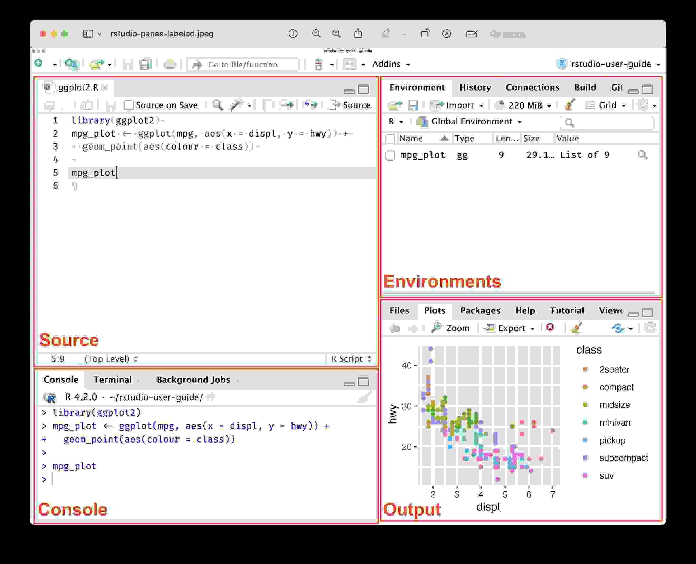

```{r setup, include = FALSE}
library(learnr)
library(tutorial.helpers)
library(tidyverse)
library(knitr)
library(usethis)
library(palmerpenguins)
library(gert)
library(gitcreds)

knitr::opts_chunk$set(echo = FALSE)
knitr::opts_chunk$set(out.width = '90%')
options(tutorial.exercise.timelimit = 60, 
        tutorial.storage = "local")
```

```{r copy-code-chunk, child = system.file("child_documents/copy_button.Rmd", package = "tutorial.helpers")}
```

```{r info-section, child = system.file("child_documents/info_section.Rmd", package = "tutorial.helpers")}
```

<!-- Median time was 95 minutes, which is probably too long. Should split in two and add some material: rstudio-and-github-i and rstudio-and-github-ii. The first loses the second project. The second starts with the second project and adds one (the fork) or maybe two more. -->

<!-- DK: Add some questions to load the needed libraries, like usethis, gert, and gitconfig at the beginning. -->

<!-- Add a new example at the end which requires users to fork a repo. -->

<!-- Here are some functions which might allow us to get rid of more Terminal commands in this tutorial: git_sitrep("git", "user") for git --version. Perhaps git_config_global() and/or git_config_set(name, value, repo = ".") for setting name and email values. -->

<!-- What about git remote -v (gert::git_remote_info()),  git log (gert::git_log()) -->

<!-- This would allow us to get rid of the Terminal Section. -->


<!-- When we say, your answer should look like, we often don't include the command even though your actual answer started with the command, since the instruction was CP/CR. -->

<!-- Took Jade 2 hours. -->

<!-- KNOWLEDGE DROPS: -->

<!-- Discuss the meaning of the lines which are in the .gitignore by default. -->

<!-- The Quarto chapter has a bunch of individual sections. Surely, we can find a place to knowledge drop a little bit about each of them! -->

<!-- Pull all the material out of r4ds-material-to-add.txt, especially everything in Chapter 29 section.  -->

<!-- Should we be making much bigger use of the **gert** package? Allows you to execute most git commands. Or maybe we should only show students **usethis**, at least until the end of this tutorial. But I can't find **usethis** equivalents to functions like gert::git_log(). Maybe Terminal commands like git log are fine. -->

<!-- Can we add some tests? Currently, seems like lots of commands, like gert::git_log(), don't work in testing. Maybe set up a test environment of some type, perhaps by setting up all sets of scaffolding for testthat? -->

<!-- Update all the images. For example, the first one shows the project as existing in OneDrive, which is a bad idea! Make sure that the png file size is small. -->

<!-- It is annoying that we can't do all this from the Console. Specifically, I hate having to use `git --version`. Wish that usethis::git_version() were exported. Maybe library(credentials) would work? Wish there were equivalents for things like git config --global user.name. But there don't seem to be! We set values with usethis::use_git_config(), but we can't check them. Annoying!  -->

## Introduction
### 

This tutorial mostly covers material which is not actually in [*R for Data Science (2e)*](https://r4ds.hadley.nz/quarto.html) by Hadley Wickham, Mine Çetinkaya-Rundel, and Garrett Grolemund. But the material is in keeping with the spirit of that book, especially [Chapter 28 Quarto](https://r4ds.hadley.nz/quarto.html). The material covered in [Chapter 4 Workflow: code style](https://r4ds.hadley.nz/workflow-style.html) appears in the "RStudio and Code" tutorial in this package.

Professionals store their work on Github, or a similar "source control" tool. If your computer blows up, you don't want to lose your work. Github is like Google Drive --- both live in the cloud --- but for your computational work rather than your documents.

This tutorial will introduce you to Github and to Git, a program for keeping track of changes in your code.

The most useful reference for Git/Github/RStudio is [*Happy Git and GitHub for the useR*](https://happygitwithr.com/). Refer to that book whenever you have a problem.

## Terminal Overview
### 

The RStudio [Terminal](https://docs.posit.co/ide/user/ide/guide/tools/terminal.html) is how you directly communicate with the computer using commands, whereas the RStudio [Console](https://docs.posit.co/ide/user/ide/guide/code/console.html) is how you talk to R.

This section will help introduce you to the Terminal so that you'll be up to speed for the commands needed later.

### Exercise 1

Start by clicking on the Terminal tab in RStudio. This is next to the Console tab, within the Console pane.

You should see some text, which is a portion of the path to the current working directory, followed by a prompt such as a dollar sign. Copy (by highlighting, then right clicking and selecting the "copy" option) and paste the entire prompt into the box below.

We abbreviate the instructions **c**opy/**p**aste the **c**ommand/**r**esponse as CP/CR throughout this tutorial.

```{r terminal-overview-1}
question_text(NULL,
    answer(NULL, correct = TRUE),
    allow_retry = TRUE,
    try_again_button = "Edit Answer",
    incorrect = NULL,
    rows = 2)
```

### 

Your answer should look something like:

```         
Davids-MBP:projects dkane$ 
```

The path begins with the hostname of my computer: `Davids-MBP`. After a `:`, we have the current working director, which happens to be named `projects` in this case. After a space, we have my username. The entire prompt ends with a dollar sign, which indicates that I am logged in as regular user.

On Windows, your answer would be more like:

```
C:\Users\Alan\Documents\R\Projects
```

### Exercise 2

Type the command `pwd` in your Terminal and hit return. CP/CR.

```{r terminal-overview-2}
question_text(NULL,
    answer(NULL, correct = TRUE),
    allow_retry = TRUE,
    try_again_button = "Edit Answer",
    incorrect = NULL,
    rows = 2)
```

### 

Your answer should look like:

```         
Davids-MacBook-Pro:projects dkane$ pwd
/Users/dkane/Desktop/projects
Davids-MacBook-Pro:projects dkane$ 
```

Your answer will be different, not least because your username is unlikely to be `dkane`. This is the location on your computer where the R program started up when you opened RStudio.

Going forward, make sure to pay special attention to whether given commands are supposed to be run in the *Console* or the *Terminal*.

### Exercise 3

What are the names of the [four default panes](https://docs.posit.co/ide/user/ide/guide/ui/ui-panes.html) in RStudio?

```{r terminal-overview-3}
question_text(NULL,
	message = "Come on! The answer is right in the link: Source, Console, Environment, and Output.",
	answer(NULL, correct = TRUE),
	allow_retry = FALSE,
	incorrect = NULL,
	rows = 6)
```

### 

Recall:

```{r}

```

### 

That's all you need to know about the Terminal for this tutorial. The **r4ds.tutorials** package includes another tutorial entirely dedicated to using the Terminal, which is also sometimes referred to as the "command line."

## Setting up GitHub
### 

GitHub is an online drive for all your R code and projects. In the professional world, what you have on your GitHub account is more important than what you have on your resume. It is a verifiable demonstration of your abilities.

### Exercise 1

Install [Git](https://git-scm.com/) by following the instructions of the [Install Git](https://happygitwithr.com/install-git.html) chapter in [*Happy Git and GitHub for the useR*](https://happygitwithr.com/).

### 

After you install Git, you should quit and then restart RStudio so that it has a chance to "recognize" that Git is installed. (Note that restarting RStudio is **not** the same as restarting your R session **within** your RStudio instance. To quit RStudio you need to go to the `RStudio -> Quit RStudio` menu item.)

After restarting RStudio, click on the Terminal tab. Run `git --version` in the Terminal to make sure that Git is installed and accessible. CP/CR.

```{r setting-up-github-1}
question_text(NULL,
    answer(NULL, correct = TRUE),
    allow_retry = TRUE,
    try_again_button = "Edit Answer",
    incorrect = NULL,
    rows = 2)
```

### 

Your answer should look like:

```         
Davids-MacBook-Pro:r4ds.tutorials dkane$ git --version
git version 2.39.3 (Apple Git-145)
Davids-MacBook-Pro:r4ds.tutorials dkane$ 
```

The details will differ. Don't worry if you have a different version of Git installed.

[*Pro Git*](https://git-scm.com/book/en/v2) is the best reference book for Git and Github.

### Exercise 2

The next step is to create a GitHub account by following the instructions at the [GitHub homepage](https://github.com/). Follow [this advice](https://happygitwithr.com/github-acct.html#username-advice) **when choosing your username.** We recommend using a permanent email address for this account, not one which you lose access to when, for example, you change schools or jobs.

Copy your GitHub account URL in the field below.

```{r setting-up-github-2}
question_text(NULL,
    answer(NULL, correct = TRUE),
    allow_retry = TRUE,
    try_again_button = "Edit Answer",
    incorrect = NULL,
    rows = 2)
```

### 

Your answer should look like this:

```         
https://github.com/your-username
```

[Git](https://en.wikipedia.org/wiki/Git) is "software for tracking changes in any set of files, usually used for coordinating work among programmers collaboratively developing source code during software development."

### Exercise 3

Now that you have your GitHub account, you need to connect it to RStudio. The first step of doing this is to give RStudio your GitHub account user name and email.

### 

<!-- Ran into an issue here where `usethis::use_git_config(user.name = "your-username", user.email = "your@email.org")` would produce an error if you had multiple `user.name`s or `user.email`s saved (this can be checked using `usethis::git_sitrep()`). To fix this, I first used the terminal command `git config --global --replace-all user.name "newname"`. However, there seemed to be an issue where the terminal would say it is replaced but it wasn't being recognized. In the end, I was able to locate the actual global git config file under `C:/User/username/` and edit it directly. In the file, there were fields formatted like `name = ...` and `email = ...`. Deleting these lines completely seemed to work correctly. Afterwards (Good to restart R session here), running `usethis::git_sitrep()` will show that the fields are not set and you should now be able to run `usethis::use_git_config(user.name = "your-username", user.email = "your@email.org")` without error. -->

In the Console, run this command, substituting the email and user name you used for your GitHub account:

```         
usethis::use_git_config(user.name = "your-username", user.email = "your@email.org")
```

Note that this will not return anything. As long as you don't get an error message, it (probably) worked.

### 

Run `git config --global user.name` in the *Terminal* to make sure your computer remembers your GitHub username. CP/CR.

```{r setting-up-github-3}
question_text(NULL,
    answer(NULL, correct = TRUE),
    allow_retry = TRUE,
    try_again_button = "Edit Answer",
    incorrect = NULL,
    rows = 2)
```

### 

You answer should look like this:

```         
Davids-MBP:project-2 dkane$ git config --global user.name
davidkane9
Davids-MBP:project-2 dkane$ 
```

Of course, it should be your username, not mine!

### Exercise 4

Run `git config --global user.email` in the *Terminal* to make sure your GitHub email is stored too. CP/CR.

```{r setting-up-github-4}
question_text(NULL,
    answer(NULL, correct = TRUE),
    allow_retry = TRUE,
    try_again_button = "Edit Answer",
    incorrect = NULL,
    rows = 3)
```

### 

Your answer should look like:

```         
Davids-MacBook-Pro:r4ds.tutorials dkane$ git config --global user.email
dave.kane@gmail.com
Davids-MacBook-Pro:r4ds.tutorials dkane$ 
```

Now, your GitHub username and email are stored so that your computer can automate a lot of the tedious steps required to communicate with GitHub.

### Exercise 5

**Note:** Make sure you received the expected outputs of the name and email associated with your Github account in the previous two exercises.

If GitHub is your Google Drive, then GitHub repositories, or "repos," are the Google folders, the location in which we store our work. Let's make a practice repo!

To begin, sign into GitHub and go to the homepage: `www.github.com`. Click the green "New" button on the upper left side of the page.

```{r out.width = "700px"}
include_graphics("images/github_new_repo.png")
```

Name your repository `First_Repo`. Then, select the "public" option for your repo and check the box saying "Add a README file". [README](https://en.wikipedia.org/wiki/README) is a document where programmers explain details of their project. When in doubt follow [these instructions](https://happygitwithr.com/push-pull-github.html#make-a-repo-on-github).

After you've done that, go ahead and click "Create repository" to create your first repo!

```{r out.width = "700px"}
include_graphics("images/repo_detail.png")
```

### 

GitHub should have directed you to a page called the project page after creating the repo. Copy and paste the URL of the project page below.

```{r setting-up-github-5}
question_text(NULL,
    answer(NULL, correct = TRUE),
    allow_retry = TRUE,
    try_again_button = "Edit Answer",
    incorrect = NULL,
    rows = 2)
```

### 

Your answer should look like:

```         
github.com/davidkane9/First_Repo
```

The "public" option means that anyone will be able to view the repository. But only you can edit it. You might have noticed "Add .gitignore" as another option, but we will never check this box because RStudio will automatically create a `.gitignore` file for us when we connect the Github repo to an R project on our computer.

Note that things work slightly differently on [Posit Cloud](https://posit.cloud/). See [our discussion](https://ppbds.github.io/tutorial.helpers/articles/cloud.html) if you are working there.

### Exercise 6

The next step will be to create the exact same project in your local computer through the process of **cloning**. By having a local and a GitHub version, you can edit your project on your computer and send all the changes you've made to GitHub. This process ensures that the GitHub version is synced up with your local version.

To clone the repo, click on the green button that says "Code". Then, copy the link shown. You can use the clipboard button on the right to automatically copy it.

```{r}
include_graphics("images/repo_clone.png")
```

Paste the link below.

```{r setting-up-github-6}
question_text(NULL,
    answer(NULL, correct = TRUE),
    allow_retry = TRUE,
    try_again_button = "Edit Answer",
    incorrect = NULL,
    rows = 2)
```

### 

It should look something like:

```         
https://github.com/davidkane9/First_Repo.git
```

This link points to your project folder on GitHub. It is slightly different from the URL of the project page because the `.git` suffix tells you that it's a special GitHub object and not a webpage.

### Exercise 7

To connect your Github repo to an R project, we first make a new project. While you are making a new project, you will not be able to access this tutorial.

**Read all instructions before making your project.**

### 

-   Click the `File` dropdown menu in the top left of the R Studio window.

-   Click `New Project ...`.

-   Instead of clicking `New Directory`, as we did previously, click on `Version Control`.

-   Click on `Git`.

-   Paste the link you copied from GitHub into `Repository URL`. Make sure your project is in the `projects` directory you made in the "RStudio and Code" tutorial in order to maintain a single location in which you have placed all your R projects. If it is not, click on "Browse...", and select your `projects` folder.

-   Hit the `tab` key. This will copy the name of the repo into the box for the "Project directory name." It is a good idea for your repos and project names to be identical.

-   Click "Create Project."

This last step will cause RStudio to restart. Go ahead and follow these steps now. Then, return to the tutorial.

### Exercise 8

Reminder: You just completed these steps:

-   `File -> New Project ... -> Version Control -> Git`

-   Paste repo URL. Hit `tab` key.

-   Click "Create Project."

Let's now confirm that your setup is correct. In the Terminal, run `git remote -v`. CP/CR.

```{r setting-up-github-8}
question_text(NULL,
    answer(NULL, correct = TRUE),
    allow_retry = TRUE,
    try_again_button = "Edit Answer",
    incorrect = NULL,
    rows = 2)
```

Your answer should look something like:

```         
Davids-MBP:First_Repo dkane$ git remote -v
origin  https://github.com/davidkane9/First_Repo.git (fetch)
origin  https://github.com/davidkane9/First_Repo.git (push)
Davids-MBP:First_Repo dkane$ 
```

Don't worry too much about the details. You've successfully linked a repo to an RStudio Project!

### Exercise 9

You have linked your GitHub repo to your R project, but you haven't proven that you are someone with editing access to the project. If we just let anyone with the GitHub link edit our repo, that's obviously going to lead to problems. This is why we use something called a **p**ersonal **a**ccess **t**oken, or a **PAT**.

### 

A PAT is just a special computer-generated password between your computer and GitHub that lets GitHub connect your GitHub account and your computer. If you want to learn more, see "[Personal access token for HTTPS](https://happygitwithr.com/https-pat.html)" from [*Happy Git and GitHub for the useR*](https://happygitwithr.com/)

### 

Create a PAT by using the `usethis::create_github_token()` function in the Console. This should redirect you to a GitHub page about creating a PAT.

### 

Set the "Note" field to "My First PAT" and keep the scopes the same as the **default**. It should look something like the picture below (Doesn't have to be exact).

```{r out.width = "625px"}
include_graphics("images/pat.png")
```

### 

Press "Generate Token" at the bottom of the page to finalize your PAT. If you have trouble, the function `usethis::gh_token_help()` may be helpful.

### Exercise 10

Now that we've created our PAT, first temporarily copy it somewhere you have easy access to. We will need to store it somewhere so that RStudio can "see" it.

Run `gitcreds::gitcreds_set()` in the Console and follow the prompts, providing your token when asked.

### 

Restart your R session with `Session -> Restart R`. (This is not the same thing as restarting RStudio.) You could also use `Command/Ctrl + Shift + 0` to restart R. Using the shortcut key is always a good idea. (On Windows, this would be `Ctrl + Shift + F10`.)

Run `usethis::git_sitrep()` in the Console. CP/CR.

```{r setting-up-github-10}
question_text(NULL,
    answer(NULL, correct = TRUE),
    allow_retry = TRUE,
    try_again_button = "Edit Answer",
    incorrect = NULL,
    rows = 12)
```

### 

The key "Github user" section should look something like:

```         
── GitHub user 
• Default GitHub host: 'https://github.com'
• Personal access token for 'https://github.com': '<discovered>'
• GitHub user: 'davidkane9'
```

See "[Managing Git(Hub) Credentials](https://usethis.r-lib.org/articles/git-credentials.html)" for more details.

## Updating .gitignore
### 

The `.gitignore` file determines which files **git** should **ignore**. You should be able to see your `.gitignore` file in the Files tab in the Output pane.

(To see any files which are "hidden" --- those that begin with a period `.` --- you may need to click on the gear symbol in the Files tab (next to the "Rename" button) and then select "Show Hidden Files".)

### Exercise 1

From the Console, run `list.files()`. CP/CR.

```{r updating-gitignore-1}
question_text(NULL,
	answer(NULL, correct = TRUE),
	allow_retry = TRUE,
	try_again_button = "Edit Answer",
	incorrect = NULL,
	rows = 3)
```

```{r updating-gitignore-1-test, include = FALSE}
list.files()
```

### 

In the "RStudio and Code" tutorial, we saw that an R project begins with just one file, the `Rproj` file, which is `First_Repo.Rproj` in this case. But, because this R project started by connecting to a Github repo --- and because we initialized that repo with a README --- we also have a `README.md` file.

### Exercise 2

From the Console, run `list.files(all.files = TRUE)`. CP/CR.

```{r updating-gitignore-2}
question_text(NULL,
	answer(NULL, correct = TRUE),
	allow_retry = TRUE,
	try_again_button = "Edit Answer",
	incorrect = NULL,
	rows = 3)
```

```{r updating-gitignore-2-test, include = FALSE}
list.files(all.files = TRUE)
```

### 

Because `.gitignore` is a "hidden" file, since its name begins with a `.`, we need to set `all.files = TRUE` in `list.files()` if we want it to be returned. Don't worry about hidden directories like `.git` and `.Rproj.user`. We won't be using them.

### Exercise 3

The purpose of `.gitignore` is to list all the files that you don't want to be uploaded to GitHub. This is especially useful when you are working with big datasets or files with private information.

Open the `.gitignore` and add a new line with `First_Repo.Rproj`. This tells Git to ignore any file named `First_Repo.Rproj`. Save the file, but make sure that the last line in the file is blank.

In the Console, run:

```         
tutorial.helpers::show_file(".gitignore")
```

CP/CR.

```{r updating-gitignore-3}
question_text(NULL,
	answer(NULL, correct = TRUE),
	allow_retry = TRUE,
	try_again_button = "Edit Answer",
	incorrect = NULL,
	rows = 3)
```

<!-- No test case because .gitignore won't exist in testing. -->

### 

This should output all of the lines in your `.gitignore` file, which should include `First_Repo.Rproj`.

We could also have used `*.Rproj`. The \* tells your computer that we want to prevent all files ending in `Rproj` from being uploaded.

### Exercise 4

Navigate to the Git tab in the Environment pane. You should see `.gitignore` listed but not `First_Repo.Rproj`. The Git tab shows all the changes you have made on your local computer. Since you added `First_Repo.Rproj` in `.gitignore`, `First_Repo.Rproj` should not show up as one of the changed files that the GitHub version needs to be synced with.

If you do see `First_Repo.Rproj`, try clicking on the refresh button --- a small clockwise swirl --- in the upper right. Or make sure you have it spelled correctly.

```{r}
include_graphics("images/updated_gitignore.png")
```

### Exercise 5

Now that we've updated our `.gitignore` file, we want to upload this new version to GitHub. Otherwise, GitHub doesn't know that we want to hide our `First_Repo.Rproj` file.

### 

To do so, go to the Git tab in the Environment pane toward the top right of your screen. Click the check box next to the `.gitignore` file and then click on the "Commit" button.

```{r}
include_graphics("images/commit.png")
```

### 

This will open a new window where you will write a commit message. The message is meant to note what you're adding/changing within the repo. And yes, it's mandatory. Just a few (sensible) words are enough.

### Exercise 6

In the Console, run:

```         
gert::git_log() |> select(-commit, -merge, -files) |> dplyr::slice(1)
```

CP/CR.

This returns the author, time, and message of the last commit.

```{r updating-gitignore-6}
question_text(NULL,
    answer(NULL, correct = TRUE),
    allow_retry = TRUE,
    try_again_button = "Edit Answer",
    incorrect = NULL,
    rows = 2)
```

If you get an error about a function like `slice` or `select` not being found, then load the **dplyr** package with `library(dplyr)` and try again.

### Exercise 7

Next, press `Push`, i.e., the green arrow on the top right. This pushes or uploads the changes to GitHub. Open up GitHub and refresh the project page to see the commit message you just made at the top of your repo page.

### 

Run `gert::git_ahead_behind()$ahead` in the Console. CP/CR.

```{r updating-gitignore-7}
question_text(NULL,
    answer(NULL, correct = TRUE),
    allow_retry = TRUE,
    try_again_button = "Edit Answer",
    incorrect = NULL,
    rows = 2)
```

### 

This should return `0`, showing that you are 0 commits out of sync with the GitHub version.

## Publishing to R Pubs
### 

Let's publish a file from our project onto the internet using [R Pubs](https://rpubs.com/).

### Exercise 1

First let's make a new Quarto document. Select `File -> New File -> Quarto Document ...`. Change the title to "Example". You are the author. Keep the other fields as the default values. Save the file with `Command/Ctrl + S` and name the file `example`. RStudio will automatically add the `.qmd` extension.

Run `list.files()`. CP/CR.

```{r publishing-to-r-pubs-1}
question_text(NULL,
    answer(NULL, correct = TRUE),
    allow_retry = TRUE,
    try_again_button = "Edit Answer",
    incorrect = NULL,
    rows = 2)
```

### 

You should see `example.qmd` somewhere in the output. Recall that the title inside of the document ("Example") has no *necessary* connection to the name of the file (`example.qmd`). However, it is often the case that they will be similar, as here.

### Exercise 2

Render this Quarto document by pressing the "Render" button or, better, with `Command/Ctrl + Shift + K`. Run `list.files()` in the Console. CP/CR.

```{r publishing-to-r-pubs-2}
question_text(NULL,
    answer(NULL, correct = TRUE),
    allow_retry = TRUE,
    try_again_button = "Edit Answer",
    incorrect = NULL,
    rows = 2)
```

### 

`example.html` should be one of the files outputted.

### Exercise 3

Notice the blue button at the top of your QMD. Click that and select RPubs. (If you completed the "RStudio and Code" tutorial, you should already have an RPubs account.) If you do not have an account, you will need to create one. Always choose the free option.

Create a slug --- the file name for the last part of the URL --- like "my-project" and publish. Put the URL of your RPubs Page below:

```{r publishing-to-r-pubs-3}
question_text(NULL,
    answer(NULL, correct = TRUE),
    allow_retry = TRUE,
    try_again_button = "Edit Answer",
    incorrect = NULL,
    rows = 2)
```

### 

If you did not select a slug, then RPubs provided a meaningless slug, most likely a string of numbers. That does not look cool! Much better to have a slug which describes the file.

### Exercise 4

In the Git tab in the top right corner, check the boxes next to "example.qmd", and "example.html" to stage them. Do not check the box next to `example_files`. Press the commit button and add the commit message "published webpage".

### 

Now, press the `Push` button with the green arrow. Your changes have now been saved to Github! No need to worry about `example_files` right now. Quarto always creates a directory named `filename_files` and uses it for the tools/residues of the rendering process. Nothing in such files is worth saving.

### 

Run `gert::git_ahead_behind()$ahead` in the Console. This should return "0" just like before. CP/CR.

```{r publishing-to-r-pubs-4}
question_text(NULL,
    answer(NULL, correct = TRUE),
    allow_retry = TRUE,
    try_again_button = "Edit Answer",
    incorrect = NULL,
    rows = 2)
```

Nice work! You've created an RPubs page. All your work is backed up to GitHub.

### 

We now understand the entire data science work cycle. Begin with Github repository, connect to an RStudio project, create a Quarto document (including a plot or other analysis), publish your results to RPubs, and, finally, commit/push all your work to Github. Let's practice these skills in some new projects.

## Project 1
### 

Restart the R session with `Command/Ctrl + Shift + 0`.

This first project will simply review the steps which we have already learned. Making the data science work cycle second nature requires practice.

We don't need to set up Git/Github/RPubs again, having already done so above. In this section, our goal is to publish this plot to RPubs:

```{r warning = FALSE}
penguins |> 
  ggplot(aes(x = body_mass_g, y = flipper_length_mm, color = species)) +
    geom_point() +
    labs(title = "Penguins Body Mass compared to Flipper Length", 
         x = "Body Mass", 
         y = "Flipper Length")
```

### Exercise 1

Create a Github repo (called `project-1`). Make sure to click the "Add a README file" check box. Copy/paste the URL for its Github location.

```{r project-1-1}
question_text(NULL,
	answer(NULL, correct = TRUE),
	allow_retry = TRUE,
	try_again_button = "Edit Answer",
	incorrect = NULL,
	rows = 3)
```

### 

Your answer should look something like:

```         
https://github.com/davidkane9/project-1
```

Always start a new data science project with a new Github repo.

### Exercise 2

Connect the `project-1` Github repo to an R project on your computer. Recall the steps:

-   `File -> New Project ... -> Version Control -> Git`

-   Paste the repo URL into the "Repository URL" box.

-   Hit the "tab" key so that the "Project directory name" box is filled in. This should generate the same name for the R project as for the Github repo, which is `project-1` in this case.

-   Click "Create Project."

That "tab" key trick is very handy! Keeping the names of repos/projects aligned makes organization simpler.

From the Console, run `list.files()`. CP/CR.

```{r project-1-2}
question_text(NULL,
	answer(NULL, correct = TRUE),
	allow_retry = TRUE,
	try_again_button = "Edit Answer",
	incorrect = NULL,
	rows = 3)
```

```{r project-1-2-test, include = FALSE}
list.files()
```

### 

Your answer should look something like this:

```         
> list.files()
[1] "project-1.Rproj" "README.md"      
> 
```

The default README has an "md" suffix to indicate that it is a **M**ark**d**own document.

RStudio has automatically restarted and placed you within the `project-1` R project. The `project-1` directory should be in the location in which you store your all your R projects.

### Exercise 3

Go to `File -> New File -> Quarto Document...`. Title it "Quarto 1". You are the author. Save it with the name `quarto-1`. RStudio will automatically add the `qmd` suffix.

From the Console, run `list.files()`. CP/CR.


```{r project-1-3}
question_text(NULL,
	answer(NULL, correct = TRUE),
	allow_retry = TRUE,
	try_again_button = "Edit Answer",
	incorrect = NULL,
	rows = 6)
```

### 

Your answer should look like this:

```         
> list.files()
[1] "project-1.Rproj" "quarto-1.qmd"    "README.md"      
```

Titles should be in title case, obviously. File names are usually all lower case. Spaces in titles are fine, but there should never be spaces (or other weird characters --- other than underlines, `_`, and, less commonly, dashes `-`) in file names.

### Exercise 4

To produce a complete report containing all text, code, and results, click “Render” or press `Command/Ctrl + Shift + K`.

This will create an HTML file and display it in the Viewer tab in the Output pane.

From the Console, run `list.files()`. CP/CR.

```{r project-1-4}
question_text(NULL,
	answer(NULL, correct = TRUE),
	allow_retry = TRUE,
	try_again_button = "Edit Answer",
	incorrect = NULL,
	rows = 3)
```

### 

Your answer should look like this:

```         
> list.files()
[1] "project-1.Rproj" "quarto-1_files"  "quarto-1.html"   "quarto-1.qmd"    "README.md"      
>    
```

The `quarto-1.html` is our rendered file, as expected. The `quarto-1_files` directory contains a variety of files which were involved in the transformation of `quarto-1.qmd` into `quarto-1.html`. None of the files in `quarto-1_files` are worth understanding, at least at this point in your data science education.

### Exercise 5

Edit the `.gitignore` file to include two new lines: `project-1.Rproj` and `quarto-1_files`. Save the file.

In the Console, run:

```         
tutorial.helpers::show_file(".gitignore")
```

CP/CR.

```{r project-1-5}
question_text(NULL,
	answer(NULL, correct = TRUE),
	allow_retry = TRUE,
	try_again_button = "Edit Answer",
	incorrect = NULL,
	rows = 3)
```

### 

Your answer should look like:

```         
> tutorial.helpers::show_file(".gitignore")
.Rproj.user
.Rhistory
.RData
.Ruserdata

project-1.Rproj
quarto-1_files
>
```

Every time that you render a Quarto document, RStudio creates a directory in which it places the supporting files which we used in that rendering. The name of that directory is `name-of-your-file-without-the-suffx` plus `_files`. The material in this directory is not worth backing up on GitHub. They are neither the original source material (`quarto-1.qmd`) which we will edit to make changes nor the final product (`quarto-1.html`) which we will show to others.

### Exercise 6

Go to the Git tab within the Environment pane. Commit all the files --- `.gitignore`, `quarto-1.qmd` and `quarto-1.html` --- which have not been committed yet. Your commit message should be something like "Initial version." Push all the files.

From the Terminal, run `git log`. CP/CR.

```{r project-1-6}
question_text(NULL,
	answer(NULL, correct = TRUE),
	allow_retry = TRUE,
	try_again_button = "Edit Answer",
	incorrect = NULL,
	rows = 3)
```

### 

The output of `git log` is somewhat confusing, but you should see your commit message in the top (most recent) commit.

### Exercise 7

Note the "Source" and "Visual" boxes in the menu above the Source pane. As you are getting used to Quarto documents, it is best to look at the actual source, at least at the start. By default, the "Source" box should be selected. If you click on the "Visual" box, you will see a [WYSIWYG](https://en.wikipedia.org/wiki/WYSIWYG) display of what your document should look like after rendering.

Delete everything in `quarto-1.qmd` except the YAML header.

In the Console, run:

```         
tutorial.helpers::show_file("quarto-1.qmd")
```

CP/CR.

```{r project-1-7}
question_text(NULL,
	answer(NULL, correct = TRUE),
	allow_retry = TRUE,
	try_again_button = "Edit Answer",
	incorrect = NULL,
	rows = 6)
```

### 

Your answer should look like this:

```         
> tutorial.helpers::show_file("quarto-1.qmd")
---                                            
title: "Quarto 1"
author: "David Kane"
format: html
---
```

When you render the document, Quarto sends the QMD file to **knitr**, which executes all of the code chunks and creates a new Markdown (`.md`) document which includes the code and its output. The Markdown file generated by **knitr** is then processed by [pandoc](https://pandoc.org/), which is responsible for creating the finished HTML file.

### Exercise 8

Add a code chunk within your document which includes `library(tidyverse)` and `library(palmerpenguins)`. Render the document to ensure that everything works. (Fix any errors if it doesn't.)

In the Console, run:

```         
tutorial.helpers::show_file("quarto-1.qmd", chunk = "Last")
```

CP/CR.

```{r project-1-8}
question_text(NULL,
	answer(NULL, correct = TRUE),
	allow_retry = TRUE,
	try_again_button = "Edit Answer",
	incorrect = NULL,
	rows = 8)
```

### 

Your answer should look like:

```{r file = "images/quarto-1-example.txt", echo = TRUE, eval = FALSE}
```

### 

Recall that you can add a code chunk by either pressing the “Insert” button icon in the editor toolbar (the green button with the letter C and a tiny plus sign) or by using the shortcut key combination: `Command + Option + i` or `Ctrl + Alt + i`.

You could also manually type the chunk delimiters ```` ```{r} ```` and ```` ``` ````, but, obviously, that is the worst option.

### Exercise 9

<!-- DK: Need more standardized words for "copy the HTML here" instruction. -->

Add a new code chunk, which just includes `penguins`. Render the document. Copy the displayed bottom contents of `quarto-1.html` below, starting with `penguins`.

```{r project-1-9}
question_text(NULL,
	answer(NULL, correct = TRUE),
	allow_retry = TRUE,
	try_again_button = "Edit Answer",
	incorrect = NULL,
	rows = 15)
```

### 

Your answer should look like this (although some hash marks were removed):

```         
penguins

A tibble: 344 × 8
   species island    bill_length_mm bill_depth_mm flipper_length_mm body_mass_g
   <fct>   <fct>              <dbl>         <dbl>             <int>       <int>
 1 Adelie  Torgersen           39.1          18.7               181        3750
 2 Adelie  Torgersen           39.5          17.4               186        3800
 3 Adelie  Torgersen           40.3          18                 195        3250
 4 Adelie  Torgersen           NA            NA                  NA          NA
 5 Adelie  Torgersen           36.7          19.3               193        3450
 6 Adelie  Torgersen           39.3          20.6               190        3650
 7 Adelie  Torgersen           38.9          17.8               181        3625
 8 Adelie  Torgersen           39.2          19.6               195        4675
 9 Adelie  Torgersen           34.1          18.1               193        3475
10 Adelie  Torgersen           42            20.2               190        4250
 ℹ 334 more rows
 ℹ 2 more variables: sex <fct>, year <int>
```

Because the code is just the name of the tibble, R prints out the first 10 rows of the tibble, along with some other information, just like it would if you typed `penguins` at the Console.


### Exercise 10

Change the code to pipe `penguins` into `ggplot()`, and within `ggplot()`, set `mapping = aes()`. Set `x` to `body_mass_g`. `Command/Ctrl + Shift + K`

In the Console, run:

```         
tutorial.helpers::show_file("quarto-1.qmd", chunk = "Last")
```

CP/CR.

```{r project-1-10}
question_text(NULL,
	answer(NULL, correct = TRUE),
	allow_retry = TRUE,
	try_again_button = "Edit Answer",
	incorrect = NULL,
	rows = 6)
```

### 

Inserting images and customizing how they are displayed is also facilitated with the visual editor. You can either paste an image from your clipboard directly into the visual editor (and RStudio will place a copy of that image in the project directory and link to it) or you can use the visual editor’s `Insert -> Figure / Image ...` menu to browse to the image you want to insert or paste it’s URL. In addition, using the same menu you can resize the image as well as add a caption, alternative text, and a link.

### Exercise 11

Set `y` to `flipper_length_mm` within `aes()`. `Command/Ctrl + Shift + K`

In the Console, run:

```         
tutorial.helpers::show_file("quarto-1.qmd", chunk = "Last")
```

CP/CR.

```{r project-1-11}
question_text(NULL,
	answer(NULL, correct = TRUE),
	allow_retry = TRUE,
	try_again_button = "Edit Answer",
	incorrect = NULL,
	rows = 6)
```

### 

In the Visual editor you can either use the buttons on the menu bar to insert images, tables, cross-references, etc. or you can use the catch-all `Command/Ctrl + /` shortcut to insert just about anything. If you are at the beginning of a line, you can also enter just `/` to invoke the shortcut.

### Exercise 12

Within `aes()`, set `color` to `species` to sort the graph by the species and add the `geom_point()` function. Don't forget `+`.

In the Console, run:

```         
tutorial.helpers::show_file("quarto-1.qmd", chunk = "Last")
```

CP/CR.

```{r project-1-12}
question_text(NULL,
	answer(NULL, correct = TRUE),
	allow_retry = TRUE,
	try_again_button = "Edit Answer",
	incorrect = NULL,
	rows = 6)
```

### 

The "Visual" editor has many more features that we haven’t enumerated here that you might find useful as you gain experience authoring with it.

Most importantly, while the Visual editor displays your content with formatting, under the hood, it saves your content in plain Markdown and you can switch back and forth between the Visual and Source editors to view and edit your content using either tool.

### Exercise 13

Add `labs()` with `+`. Set `title` to `"Penguins Body Mass compared to Flipper Length"`, `x` to `"Body Mass"`, and `y` to `"Flipper Length"`. 

In the Console, run:

````
tutorial.helpers::show_file("quarto-1.qmd", chunk = "Last")
````

CP/CR.


```{r project-1-13}
question_text(NULL,
	answer(NULL, correct = TRUE),
	allow_retry = TRUE,
	try_again_button = "Edit Answer",
	incorrect = NULL,
	rows = 6)
```

### 

Inserting images and customizing how they are displayed is also facilitated with the Visual editor. You can either paste an image from your clipboard directly into the Visual editor (and RStudio will place a copy of that image in the project directory and link to it) or you can use the Visual editor’s `Insert > Figure / Image` menu to browse to the image you want to insert or paste it’s URL. In addition, using the same menu you can resize the image as well as add a caption, alternative text, and a link.

But, since we rarely make use of this image functionality, we will almost always select the "Source" editor.

### Exercise 14

Render `quarto-1.qmd`, either by hitting the "Render" button or by using `Command/Ctrl + Shift + K`.

Run `list.files()` from the Console. CP/CR.

```{r project-1-14}
question_text(NULL,
	answer(NULL, correct = TRUE),
	allow_retry = TRUE,
	try_again_button = "Edit Answer",
	incorrect = NULL,
	rows = 3)
```

### 

Each time you render a Quarto document, RStudio should create an HTML and then send you to view the HTML, either in the Viewer tab within the Outputs pane or in your default browser.

You can toggle between these two options by clicking the gear symbol just to the right of the "Render" button and selecting either "Preview in Window" (which uses your browser) or "Preview in Viewer Pane." By running `tutorial.helpers::set_rstudio_settings()` in a previous tutorial, you have probably set the default to the latter.

### Exercise 15

Near to the green code chunk button at the top right of your Quarto Doc and next to the "Run" button, you should see a blue circle button. That is the publish button. Click that, then click RPubs, then click publish. Copy the URL of your website below.

```{r project-1-15}
question_text(NULL,
	answer(NULL, correct = TRUE),
	allow_retry = TRUE,
	try_again_button = "Edit Answer",
	incorrect = NULL,
	rows = 6)
```

### 

And that is it! You have completed a simple example of the data science workflow cycle. You started with nothing, created a Github repository, connected it to an R project on your computer, created a Quarto document, rendered it into a plot and published it on RPubs.

But we still haven't backed up our work on GitHub.

### Exercise 16

Commit the changes in `quarto-1.qmd` and `quarto-1.html`. Ignore other files and directories like `rsconnect`. (We will discuss them in the next Section.) Use a sensible commit message. At the Terminal, run `git log`. CP/CR.

```{r project-1-16}
question_text(NULL,
	answer(NULL, correct = TRUE),
	allow_retry = TRUE,
	try_again_button = "Edit Answer",
	incorrect = NULL,
	rows = 3)
```

### 

This plot is not perfect. In particular, we don't want to see any code, much less any ugly package startup messages. Nor do we like the warning message. The next section will address these issues, but in the context of a new repo/project.

## Project 2
### 

Restart the R session with `Command/Ctrl + Shift + 0`.

### Exercise 1

Create a Github repo called `project-2`. Make sure to click the "Add a README file" check box. Copy/paste the URL for its Github location.

```{r project-2-1}
question_text(NULL,
	answer(NULL, correct = TRUE),
	allow_retry = TRUE,
	try_again_button = "Edit Answer",
	incorrect = NULL,
	rows = 3)
```

### 

Your answer should look something like:

```         
https://github.com/davidkane9/project-2
```

### 

Note that Github looks different depending on which page you go to, whether it is the main page (`github.com`), your account page (`github.com/your-user-name`) or the repository tab on your account page `github.com/your-user-name?tab=repositories`. The green button to create a new repo only appears on the main page (upper left) and on the repository tab on your account page (upper right).

### Exercise 2

Connect the `project-2` Github repo to an R project on your computer. Name the R project `project-2` also. (Don't forget the "tab" key trick.) Keeping the names of repos/projects aligned makes organization simpler.

In the Console, run:

````
list.files()
````

CP/CR.


```{r project-2-2}
question_text(NULL,
	answer(NULL, correct = TRUE),
	allow_retry = TRUE,
	try_again_button = "Edit Answer",
	incorrect = NULL,
	rows = 3)
```

### 

Your answer should include two files: `README.md` and `project-2.Rproj`.

RStudio will automatically restart and place you within the `project-2` R project. Recall that the definition of an R project is a directory which includes a `Rproj` file. If you run `tutorial.helpers::show_file("project-2.Rproj")` you will see that a `Rproj` file does not include the name of the project. The name of the project is taken from the directory in which it is located, i.e., the directory which contains the `Rproj` file.

### Exercise 3

Select `File -> New File -> Quarto Document ...`. Provide a title ("Quarto 2") and an author (you). Save the document as `quarto-2.qmd`. `Command/Ctrl + Shift + K`.

In the Console, run:

````
list.files(all.files = TRUE)
````

CP/CR.

The `all.files = TRUE` argument for `list.files()` generates all the files/directories, including the "hidden" ones whose names begin with a period, `.`. 

```{r project-2-3}
question_text(NULL,
	answer(NULL, correct = TRUE),
	allow_retry = TRUE,
	try_again_button = "Edit Answer",
	incorrect = NULL,
	rows = 6)
```

### 

Your answer should look like this:

```         
> list.files(all.files = TRUE)
 [1] "."               ".."              ".git"            ".gitignore"      ".Rproj.user"     "project-2.Rproj"
 [7] "quarto-2_files"  "quarto-2.html"   "quarto-2.qmd"    "README.md"      
> 
```

The single `.` refers to this directory while `..` refers to the directory above, which is `/Users/dkane/Desktop/projects` in this case. `.Rproj.user` and `.git` are directories, meant solely for the use of RStudio and Git, respectively. The only other directory is `quarto-2_files`, a junk directory, created for the use of Quarto. We have discussed the other 5 files above.

### Exercise 4

Edit the `.gitignore` by adding `*Rproj` and `*_files`.

In the Console, run:

````
tutorial.helpers::show_file(".gitignore")
````

CP/CR.


```{r project-2-4}
question_text(NULL,
	answer(NULL, correct = TRUE),
	allow_retry = TRUE,
	try_again_button = "Edit Answer",
	incorrect = NULL,
	rows = 6)
```

### 

Your answer should look like this:

```         
> tutorial.helpers::show_file(".gitignore")
.Rproj.user                                          
.Rhistory
.RData
.Ruserdata

*Rproj
*_files
>
```

We could have specified the file/directory to ignore more precisely by using their exact names: `project-2.Rproj` and `quarto-2_files`. Doing so would avoid any weird complications if we end up adding other files to the project which, by coincidence, happen to have names which end with `Rproj` or `_files`.

But that never (?) happens! And it is just easier to use the `*` versions. Note that `*` is a "regular expression" which matches any characters. So, Git will ignore any files or directories which end with `Rproj` or `_files`, including `project-2.Rproj` and `quarto-2_files`.

### Exercise 5

Using the Git tab in the Environment pane, add, commit and push the three remaining files: `.gitignore`, `quarto-2.qmd`, and `quarto-2.html`. Use a sensible commit message.

From the Terminal, run `git log`. CP/CR.

```{r project-2-5}
question_text(NULL,
	answer(NULL, correct = TRUE),
	allow_retry = TRUE,
	try_again_button = "Edit Answer",
	incorrect = NULL,
	rows = 3)
```

### 

Your answer should look like this:

```         
Davids-MBP:project-2 dkane$ git log
commit 8f414d418c039a79364b6fbe4c6de32acb1e6235 (HEAD -> main, origin/main, origin/HEAD)
Author: davidkane9 <dave.kane@gmail.com>
Date:   Tue Feb 20 14:38:54 2024 -0500

    initial version

commit 4abced5c8c5b3dcd3a26d9efdce126031d8a0a0b
Author: David Kane <dave.kane@gmail.com>
Date:   Tue Feb 20 14:26:05 2024 -0500

    Initial commit
Davids-MBP:project-2 dkane$ 
```

There have been two commits in this repo. The first was generated automatically when we create the repo. The second was the one we just committed by hand, along with the commit message "initial version." Note how, next to the word "commit" there is a 40 character string of letters and numbers. This is the "hash" by which Github identifies each commit. The hash is always unique.

### Exercise 6

Remove everything below the YAML header from `quarto-2.qmd`. Add the code chunks from the previous section:

```{r file = "images/quarto-2-start.txt", echo = TRUE, eval = FALSE}
```

Render the document. Copy-and-paste the "Warning" message which appears in `quarto-2.html`.

```{r project-2-6}
question_text(NULL,
	answer(NULL, correct = TRUE),
	allow_retry = TRUE,
	try_again_button = "Edit Answer",
	incorrect = NULL,
	rows = 3)
```

### 

Your answer should look like this:

```         
Warning: Removed 2 rows containing missing values (`geom_point()`).
```

### 

There are at least three problems with `quarto-2.html`:

First, it displays the R code. Very few readers understand R code and even fewer want it to clutter up our pretty plot.

Second, it shows the startup message printed by the **tidyverse** package. This is never useful to our viewers. They care about our data and graphics.

Third, there is a warning message. We need to handle this sensibly, lest readers think that our results are suspect.

### Exercise 7

We need to make it so that we do not see this code or the output in the render `quarto-2.html` document. To do this, we will put `#| echo: false` and `#| message: false` before `library(tidyverse)` in the first code chunk. Render.

In the Console, run:

````
tutorial.helpers::show_file("quarto-2.qmd")
````

CP/CR.

```{r project-2-7}
question_text(NULL,
	answer(NULL, correct = TRUE),
	allow_retry = TRUE,
	try_again_button = "Edit Answer",
	incorrect = NULL,
	rows = 8)
```

### 

`#| echo: false` makes it so that the code in the code chunk does not appear in the rendered HTML file.`#| message: false` prevents the display of any R messages, in this case ones generated by loading the **tiydverse** package. So, the previous code makes the whole code chunk with the libraries in it not visible in `quarto-2.html`.

### Exercise 8

Unfortunately, `quarto-2.html` still shows the code which creates the plot. So, before `penguins` in the second code chunk, add `#| echo: false`. Render the document.

In the Console, run:

````
tutorial.helpers::show_file("quarto-2.qmd")
````

CP/CR.


```{r project-2-8}
question_text(NULL,
	answer(NULL, correct = TRUE),
	allow_retry = TRUE,
	try_again_button = "Edit Answer",
	incorrect = NULL,
	rows = 3)
```

### 

The `#| echo: false` makes it so that the code in the code chunk --- in this case, the code which create our plot --- does not appear in the rendered HTML. Except for the Warning, `quarto-2.html` is starting to look professional.

### Exercise 9

It is annoying to have to include `#| echo: false` in multiple code chunks. So, Quarto allows us to include a command in the YAML which will then be applied in every code chunk.

Delete `#| echo: false` from the two code chunks. In the YAML header, add

```         
execute: 
  echo: false
```

In the Console, run:

````
tutorial.helpers::show_file("quarto-2.qmd")
````

CP/CR.


```{r project-2-9}
question_text(NULL,
	answer(NULL, correct = TRUE),
	allow_retry = TRUE,
	try_again_button = "Edit Answer",
	incorrect = NULL,
	rows = 8)
```

### 

Your answer should look like:

```{r file = "images/quarto-2-example.txt", echo = TRUE, eval = FALSE}
```

Render `quarto-2.qmd` to make sure everything still works. Fix anything which doesn't.

### Exercise 10

We still have the Warning to deal with. From the Console, type `penguins` and hit Enter. (This will probably produce an error.) CP/CR.

```{r project-2-10}
question_text(NULL,
	answer(NULL, correct = TRUE),
	allow_retry = TRUE,
	try_again_button = "Edit Answer",
	incorrect = NULL,
	rows = 3)
```

### 

Here is what I got:

```         
> penguins
Error: object 'penguins' not found
> 
```

Recall the distinction between QMD World and Console World. In the QMD World, we have loaded the **tidyverse** and **palmerpenguins** packages. The latter contains the `penguins` tibble and the former includes the functions for printing tibbles nicely.

But in Console world, we haven't done those things. We restarted R at the beginning of this section. We need to explicitly `library()` those two packages.

### Exercise 11

Put your cursor in `quarto-2.qmd` on the `library(tidyverse)` line. Hit `Command/Ctrl + Enter`. Note how the code is pasted down in the Console and then run there. Your cursor automatically moves down one line in `quarto-2.qmd` to the `library(palmerpenguins)` line. Hit `Command/Ctrl + Enter` again.

From the Console, run `search()`. CP/CR.

```{r project-2-11}
question_text(NULL,
	answer(NULL, correct = TRUE),
	allow_retry = TRUE,
	try_again_button = "Edit Answer",
	incorrect = NULL,
	rows = 3)
```

### 

The return value from `search()` should include `"package:palmerpenguins"` along with all the packages which make up the *Tidyverse*, like **lubridate** and **forcats**.

The key lesson is that the Console does not know about the QMD file and the QMD file does not know about the Console. You need to keep them in sync.

### Exercise 12

We have forgotten to label the code chunks. Not good! Add `#| label: setup` to the first code chunk and `#| label: make-plot` to the second. `Command/Ctrl + Shift + K`

In the Console, run:

````
tutorial.helpers::show_file("quarto-2.qmd", chunk = "Last")
````

CP/CR.


```{r project-2-12}
question_text(NULL,
	answer(NULL, correct = TRUE),
	allow_retry = TRUE,
	try_again_button = "Edit Answer",
	incorrect = NULL,
	rows = 3)
```

### 

`quarto-2.html` is unchanged. Label'ing code chunk does not affect the output, but it is still good practice.

<!-- DK: I used to think it was good practice because RStudio told you which section it was working on by printing out the code chunk label. But it no longer does that? Really? If so, what is the point of labels?! And how do you keep track of things which take some time to run? -->

### Exercise 13

From the Console, run `summary(penguins$body_mass_g)`. CP/CR.

```{r project-2-13}
question_text(NULL,
	answer(NULL, correct = TRUE),
	allow_retry = TRUE,
	try_again_button = "Edit Answer",
	incorrect = NULL,
	rows = 3)
```

### 

Your answer should look like this:

```         
> summary(penguins$body_mass_g)
   Min. 1st Qu.  Median    Mean 3rd Qu.    Max.    NA's 
   2700    3550    4050    4202    4750    6300       2 
> 
```

Note the two missing values. This is what is causing the warning message.

### Exercise 14

There are two standard ways to get rid of a warning message. First, we can make deal with the substance of the issue, determine the problem with our code/data which is causing the warning and solve it. Second (and much easier) we can simply hide the warning, although in that case, we should really add a code comment explaining what is going on.

Because this section has gone on long enough, we take the second approach. To the `make-plot` code chunk, add `#| warning: false`. Render `quarto-2.qmd`.

In the Console, run:

````
tutorial.helpers::show_file("quarto-2.qmd", chunk = "Last")
````

CP/CR.


```{r project-2-14}
question_text(NULL,
	answer(NULL, correct = TRUE),
	allow_retry = TRUE,
	try_again_button = "Edit Answer",
	incorrect = NULL,
	rows = 3)
```

### 

If you turn off warnings, you ought to add some code comments explaining why. A better approach, in this case, would have been to add a command like `drop_na(body_mass_g)` to the pipe. This would have removed the two rows with missing data.

### Exercise 15

Press the Publish button. Choose RPubs. Include a sensible slug. (I chose `quarto-2`. A slug should not have any spaces since it is a URL.) Copy/paste the full URL below.

```{r project-2-15}
question_text(NULL,
	answer(NULL, correct = TRUE),
	allow_retry = TRUE,
	try_again_button = "Edit Answer",
	incorrect = NULL,
	rows = 3)
```

### 

Your answer should look like:

```         
https://rpubs.com/dkane/quarto-2
```

### Exercise 16

Check out the Git tab. Note the "M" next to `quarto-2.qmd` and `quarto-2.html`. The "M" is Git's (and RStudio's) way of telling us that the files have been **m**odified. Note, also, the new directory, `rsconnect`. This is another directory, like `quarto-2_files`, which does not belong on GitHub.

Add `rsconnect` to `.gitignore`. Commit and push `.gitignore`, `quarto-2.qmd` and `quarto-2.html`. Use a sensible commit message like "published version."

From the Terminal, run `git log -n 1`. CP/CR.

```{r project-2-16}
question_text(NULL,
	answer(NULL, correct = TRUE),
	allow_retry = TRUE,
	try_again_button = "Edit Answer",
	incorrect = NULL,
	rows = 8)
```

### 

The `-n 1` argument pulls up just the last commit.

This is the third time that we have started with nothing and gone all the way to publishing something on the web. Well done! The key steps are GitHub repo -\> R project -\> Quarto document -\> HTML -\> RPubs.

## Summary
### 

This tutorial mostly covered material which is not actually in [*R for Data Science (2e)*](https://r4ds.hadley.nz/quarto.html) by Hadley Wickham, Mine Çetinkaya-Rundel, and Garrett Grolemund. But the material is in keeping with the spirit of that book, especially [Chapter 28 Quarto](https://r4ds.hadley.nz/quarto.html). The material covered in [Chapter 4 Workflow: code style](https://r4ds.hadley.nz/workflow-style.html) appears in the *RStudio and Code* tutorial in this package.

You should now have Git working on your computer. You should have a Github account and know how to connect Github *repositories* to RStudio *projects*.

The most useful reference for Git/Github/RStudio is [*Happy Git and GitHub for the useR*](https://happygitwithr.com/). Bookmark it!

```{r download-answers, child = system.file("child_documents/download_answers.Rmd", package = "tutorial.helpers")}
```
