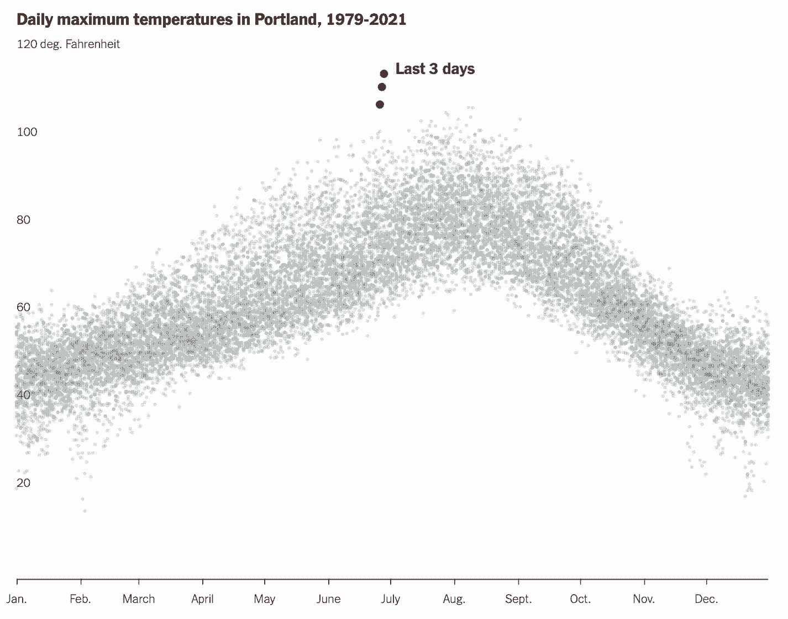

```{r setup, include = FALSE}
library(learnr)
library(tutorial.helpers)

library(tidyverse)
library(tidymodels)
library(hexbin)

knitr::opts_chunk$set(echo = FALSE)
options(tutorial.exercise.timelimit = 60, 
        tutorial.storage = "local") 

smaller <- diamonds |> 
  filter(carat < 3)

p1 <- nycflights13::flights |> 
  mutate(
    cancelled = is.na(dep_time),
    sched_hour = sched_dep_time %/% 100,
    sched_min = sched_dep_time %% 100,
    sched_dep_time = sched_hour + (sched_min / 60)
  ) |> 
  ggplot(aes(x = sched_dep_time)) + 
  geom_freqpoly(aes(color = cancelled), binwidth = 1/4) + 
  labs(title = "Frequency of Cancelled and Non-cancelled Flights for Scheduled Flights",
       subtitle = "There are a lot of non-cancelled flights at 3 PM",
       x = "Scheduled Departure Time",
       y = "Frequency",
       color = "Cancelled or Non-Cancelled")

p2 <- mpg |> 
  ggplot(aes(x = hwy, y = fct_reorder(class, hwy, median))) +
  geom_boxplot() + 
  labs(
    title = "Variation of Highway Mileage over Classes", 
    subtitle = "The compact and midsized cars are tied for the highest highway mileage.",
    x = "Highway Mileage",
    y = "Car Classes"
  )

p3 <- diamonds |> 
  count(color, cut) |>  
  ggplot(aes(x = color, y = cut)) +
  geom_tile(aes(fill = n)) +
  labs(
    title = "Covariation between Diamond Cut and the Color of the Diamond",
    subtitle = "There are more ideally cut diamonds than other cut types of diamonds",
    x = "Color of diamond",
    y = "Cut of diamond"
  )

p4 <- smaller |> 
  ggplot( aes(x = carat, y = price)) + 
  geom_boxplot(aes(group = cut_width(carat, 0.1))) +
  labs(title = "Covariation between Number of Carats and Price of Diamonds",
       subtitle = "As the number of carats of a diamond increases the price also increases",
       x = "Number of Carats",
       y = "Price of the Diamond")
  
diamonds3 <- diamonds |>
  mutate(
    log_price = log(price),
    log_carat = log(carat)
  )

diamonds_fit <- linear_reg() |>
  fit(log_price ~ log_carat, data = diamonds3)

diamonds_aug <- augment(diamonds_fit, new_data = diamonds3) |>
  mutate(.resid = exp(.resid))

p5 <- diamonds_aug |> 
  ggplot(aes(x = cut, y = .resid)) + 
  geom_boxplot() + 
  labs(
    title = "Prediction Model between Carat and Residual Price",
    subtitle = "As the number of carat increases the Residual Price decreases",
    x = "Number of Carats",
    y = "Residual Price"
  )

## Stuff from two fancy plots. Used to be 32 visualization case studies by Heather Li.

library(socviz)
library(ggthemes)

# Portland heatwave. Original source (note that this file is still being
# updated):  https://projects.oregonlive.com/weather/pdx_temps.csv

# But, to save space in the package so that we meet the CRAN 5mb guideline, we
# use a version on Github.

url <- "https://raw.githubusercontent.com/PPBDS/r4ds.tutorials/main/data-raw/portlandtemp.csv"

portland_data <- 
  read_csv(url,
           col_types = cols(date = col_date(format = ""),
                   tmax = col_double(),
                   tmin = col_double())) |> 
  filter(date >= as.Date("1979-01-01")) |> 
  mutate(yday = lubridate::yday(date),
         year = lubridate::year(date),
         recent_high = if_else(tmax > 100 & year == 2021, 
                              TRUE, FALSE))

months <- 
  tibble(yday = c(1, 32, 60, 91, 121, 152, 182, 213, 244, 274, 305, 335),
                 label = c("Jan.", "Feb.", "March", "April", "May", "June", 
                           "July", "Aug.", "Sept.", "Oct.", "Nov.", "Dec."))

```


```{r copy-code-chunk, child = system.file("child_documents/copy_button.Rmd", package = "tutorial.helpers")}
```

```{r info-section, child = system.file("child_documents/info_section.Rmd", package = "tutorial.helpers")}
```

<!-- Do the last two fancy graphics belong here? Not both of them! They are too long, and this is not a short tutorial already. But where to put them? -->


<!-- SG: Add labs() to this area -->

<!-- The below links should be dropped at least once, if not twice. -->

<!-- https://ggplot2.tidyverse.org/ -->
<!-- https://ggplot2-book.org/ -->
<!-- https://socviz.co/ -->
<!-- https://clauswilke.com/dataviz/ -->

<!-- Split up some of these Sections into smaller parts, one for several of the subsections in the chapter, like  A categorical and a numerical variable -->


## Introduction
### 

*This is a ROUGH, UNFINISHED, draft.*

This tutorial covers [Chapter 10: Exploratory data analysis](https://r4ds.hadley.nz/eda.html) from [*R for Data Science (2e)*](https://r4ds.hadley.nz/) by Hadley Wickham, Mine Çetinkaya-Rundel, and Garrett Grolemund. We will be making use of the [**ggplot2**](https://ggplot2.tidyverse.org/) and the [**dplyr**](https://dplyr.tidyverse.org/) packages to learn about variation and patterns. Some key commands include [`coord_cartesian()`](https://ggplot2.tidyverse.org/reference/coord_cartesian.html), [`geom_freqpoly()`](https://ggplot2.tidyverse.org/reference/geom_histogram.html), [`fct_reorder()`](https://forcats.tidyverse.org/reference/fct_reorder.html), [`geom_tile()`](https://ggplot2.tidyverse.org/reference/geom_tile.html), and [`geom_count()`](https://ggplot2.tidyverse.org/reference/geom_count.html). 

## Variation
### 

In this section, we will learn about variation or basically the tendency of values of a variable to change from measurement to measurement. 

### Exercise 1

Load in the **tidyverse** package using `library()`.

```{r variation-1, exercise = TRUE}

```

```{r variation-1-hint-1, eval = FALSE}
library(...)
```

```{r variation-1-test, include = FALSE}
library(tidyverse)
```

### 

In this tutorial, we’ll combine what you’ve learned about the **dplyr** package and the **ggplot2** package to interactively ask questions, answer them with data, and then ask new questions.


### Exercise 2

Type in `diamonds` and hit "Run Code"

```{r variation-2, exercise = TRUE}

```

```{r variation-2-hint-1, eval = FALSE}
diamonds
```

```{r variation-2-test, include = FALSE}
diamonds
```

### 

The `diamonds` dataset contains the prices and other attributes of `r nrow(diamonds)` diamonds, such as the `price`, `carat`, `cut`, `color`, and so on.

### Exercise 3

With a new pipeline, pipe `diamonds` to `ggplot()`.

```{r variation-3, exercise = TRUE}

```

```{r variation-3-hint-1, eval = FALSE}
diamonds |> 
  ...
```

```{r variation-3-test, include = FALSE}
diamonds |>
  ggplot()
```

Note that this plot is blank. `ggplot()` has simply created an empty plot object which, when printed, shows as a blank recatangle.

### 

You can see variation easily in real life; if you measure any continuous variable twice, you will get two different results. Each of your measurements will include a small amount of error that varies from measurement to measurement.

### Exercise 4

Within `ggplot()`, using `aes()`, set the `x` argument to `carat`.

```{r variation-4, exercise = TRUE}

```

<button onclick = "transfer_code(this)">Copy previous code</button>

```{r variation-4-hint-1, eval = FALSE}
diamonds |> 
  ggplot(aes(x = ...))
```

```{r variation-4-test, include = FALSE}
diamonds |>
  ggplot(aes(x = carat))
```

### 

Variables can also vary if you measure across different subjects (e.g., the eye colors of different people) or at different times (e.g., the energy levels of an electron at different moments). 

### Exercise 5

Add `geom_histogram()` to the pipeline.

```{r variation-5, exercise = TRUE}

```

<button onclick = "transfer_code(this)">Copy previous code</button>

```{r variation-5-hint-1, eval = FALSE}
... + 
  geom_histogram()
```

```{r variation-5-test, include = FALSE}
diamonds |>
  ggplot(aes(x = carat)) + 
  geom_histogram()
```

### 

Let's visualize the distribution of the variable's values using the `binwidth` argument to `geom_histogram()`.

### Exercise 6

Within `geom_histogram()`, add the `binwidth` argument and set it equal to `0.5`. 

```{r variation-6, exercise = TRUE}

```

<button onclick = "transfer_code(this)">Copy previous code</button>

```{r variation-6-hint-1, eval = FALSE}
... +
  geom_histogram(binwidth = ...)
```

```{r variation-6-test, include = FALSE}
diamonds |>
  ggplot(aes(x = carat)) + 
  geom_histogram(binwidth = 0.5)
```

### 

This plot is a way to visualize variation. Let's now take a look at the distribution of carat for smaller diamonds.

### Exercise 7

Create a new variable called `smaller` and set it equal to `diamonds`. 

```{r variation-7, exercise = TRUE}

```

<button onclick = "transfer_code(this)">Copy previous code</button>

```{r variation-7-hint-1, eval = FALSE}
smaller <- ...
```

```{r variation-7-test, include = FALSE}
smaller <- diamonds
```

### 

Some valuable questions to ask yourself when dealing with variation are the following:

- Which values are the most common? Why?
- Which values are rare? Why? Does that match your expectations?
- Can you see any unusual patterns? What might explain them?

### Exercise 8

We are still creating the `smaller` tibble. Copy your previous code and create a pipeline with `diamonds`. Pipe `diamonds` with `filter()` and filter out `carat` that are less than `3`. 

```{r variation-8, exercise = TRUE}

```

<button onclick = "transfer_code(this)">Copy previous code</button>

```{r variation-8-hint-1, eval = FALSE}
smaller <- diamonds |> 
  filter(carat < ...)
```

```{r variation-8-test, include = FALSE}
smaller <- diamonds |>
  filter(carat < 3)
```

### 

*“There are no routine statistical questions, only questionable statistical routines.” — Sir David Cox*

### Exercise 9

With a new pipeline, pipe `smaller` to `ggplot()`. 

```{r variation-9, exercise = TRUE}

```

<button onclick = "transfer_code(this)">Copy previous code</button>

```{r variation-9-hint-1, eval = FALSE}
smaller |> 
  ...
```

```{r variation-9-test, include = FALSE}
smaller |>
  ggplot()
```

### 

EDA, or exploratory data analysis, is an iterative cycle. You:

1. Generate questions about your data.

2. Search for answers by visualizing, transforming, and modelling your data.

3. Use what you learn to refine your questions and/or generate new questions.

### Exercise 10

Within `ggplot()`, using `aes()`, set the `x` argument to `carat`. 

```{r variation-10, exercise = TRUE}

```

<button onclick = "transfer_code(this)">Copy previous code</button>

```{r variation-10-hint-1, eval = FALSE}
smaller |> 
  ggplot(aes(x = ...))
```

```{r variation-10-test, include = FALSE}
smaller |>
  ggplot(aes(x = carat))
```

### 

EDA is not a formal process with a strict set of rules. More than anything, EDA is a state of mind. During the initial phases of EDA you should feel free to investigate every idea that occurs to you. Some of these ideas will pan out, and some will be dead ends.

### Exercise 11

Add `geom_histogram()` to the pipeline.

```{r variation-11, exercise = TRUE}

```

<button onclick = "transfer_code(this)">Copy previous code</button>

```{r variation-11-hint-1, eval = FALSE}
... + 
  geom_histogram()
```

```{r variation-11-test, include = FALSE}
smaller |>
  ggplot(aes(x = carat)) +
  geom_histogram()
```

### 

This histogram suggests several interesting questions:

- Why are there more diamonds at whole carats and common fractions of carats?

- Why are there more diamonds slightly to the right of each peak than there are slightly to the left of each peak?

### Exercise 12

Within `geom_histogram()`, set the `binwidth` argument to `0.01`. 

```{r variation-12, exercise = TRUE}

```

<button onclick = "transfer_code(this)">Copy previous code</button>

```{r variation-12-hint-1, eval = FALSE}
... +
  geom_histogram(binwidth = ...)
```

```{r variation-12-test, include = FALSE}
smaller |>
  ggplot(aes(x = carat)) +
  geom_histogram(binwidth = 0.01)
```

### 

This visualization also revealed clusters, which suggest that subgroups exist in your data. To understand the subgroups, ask:

- How are the observations within each subgroup similar to each other?

- How are the observations in separate clusters different from each other?

- How can you explain or describe the clusters?

- Why might the appearance of clusters be misleading?

### Exercise 13

Let's observe and take note of unusual values in the dataset. With a new pipeline, pipe `diamonds` to `ggplot()`. 

```{r variation-13, exercise = TRUE}

```

<button onclick = "transfer_code(this)">Copy previous code</button>

```{r variation-13-hint-1, eval = FALSE}
diamonds |> 
  ...
```

```{r variation-13-test, include = FALSE}
diamonds |> 
  ggplot()
```

### 

Outliers are observations that are unusual; data points that don’t seem to fit the pattern.

### Exercise 14

Within `ggplot()`, using `aes()`, set the `x` argument to `y`. 

```{r variation-14, exercise = TRUE}

```

<button onclick = "transfer_code(this)">Copy previous code</button>

```{r variation-14-hint-1, eval = FALSE}
diamonds |> 
  ggplot(aes(x = ...))
```

### 

Sometimes outliers are data entry errors, sometimes they are simply values at the extremes that happened to be observed in this data collection, and other times they suggest important new discoveries.

### Exercise 15

Add `geom_histogram()` to the pipeline

```{r variation-15, exercise = TRUE}

```

<button onclick = "transfer_code(this)">Copy previous code</button>

```{r variation-15-hint-1, eval = FALSE}
... +
  geom_histogram()
```

### 

When you have a lot of data, outliers are sometimes difficult to see in a histogram.

### Exercise 16

Within `geom_histogram()`, add the `binwidth` argument and set it equal to `0.5`. 

```{r variation-16, exercise = TRUE}

```

<button onclick = "transfer_code(this)">Copy previous code</button>

```{r variation-16-hint-1, eval = FALSE}
... +
  geom_histogram(binwidth = ...)
```

### 

There are so many observations in the common bins that the rare bins are very short, making it very difficult to see them (although maybe if you stare intently at 0 you’ll spot something). To make it easy to see the unusual values, we need to zoom to small values of the y-axis with `coord_cartesian()`.

### Exercise 17

Add `coord_cartesian()` to the pipeline. Within `coord_cartesian()`, add the `ylim` argument and set it equal to `c(0, 50)`. 

```{r variation-17, exercise = TRUE}

```

<button onclick = "transfer_code(this)">Copy previous code</button>

```{r variation-17-hint-1, eval = FALSE}
... + 
  coord_cartesian(ylim = ...)
```

### 

The function, `coord_cartesian()`, also has an `xlim` argument for when you need to zoom into the x-axis. ggplot2 also has `xlim()` and `ylim()` functions that work slightly differently: they throw away the data outside the limits. This allows us to see that there are three unusual values: `0`, `~30`, and `~60`. 

### Exercise 18

Pipe `diamonds` to `filter()` and filter `y` to be less than `3`.


```{r variation-18, exercise = TRUE}

```

```{r variation-18-hint-1, eval = FALSE}
diamonds |> 
  filter(y < ...)
```

```{r variation-18-test, include = FALSE}
diamonds |> 
  filter(y < 3)
```

### 

The `y` variable measures one of the three dimensions of these diamonds, in `mm`. We know that diamonds can’t have a width of 0 mm, so these values must be incorrect. 


### Exercise 19

Modify the pipe by adding, to the `filter()` command,  `|` and `y` greater than `20`.

```{r variation-19, exercise = TRUE}

```

<button onclick = "transfer_code(this)">Copy previous code</button>

```{r variation-19-hint-1, eval = FALSE}
diamonds |> 
  filter(y < 3 | y > ...)
```

```{r variation-19-test, include = FALSE}
diamonds |> 
  filter(y < 3 | y > 20)
```

### 

EDA is an important part of any data analysis, even if the primary research questions are handed to you on a platter, because you always need to investigate the quality of your data.

### Exercise 20

Add `select()` to the pipeline. Within `select()`, select the variables `price`, `x`, `y`, and `z`.

```{r variation-20, exercise = TRUE}

```

<button onclick = "transfer_code(this)">Copy previous code</button>

```{r variation-20-hint-1, eval = FALSE}
... |> 
  select(price, x, ...)
```

### Exercise 21

Add `arrange()` to the pipeline. Within `arrange()`, add the variable `y`  

```{r variation-21, exercise = TRUE}

```

<button onclick = "transfer_code(this)">Copy previous code</button>

```{r variation-21-hint-1, eval = FALSE}
... |> 
  arrange(...)
```

This arranges the data by the width of the diamonds. By doing EDA, we have discovered missing data that was coded as `0`, which we never would have found by simply searching for `NAs`. Going forward we might choose to re-code these values as `NAs` in order to prevent misleading calculations. We might also suspect that measurements of `32mm` and `59mm` are implausible: those diamonds are over an inch long, but don’t cost hundreds of thousands of dollars!


## Unusual Values
### 

In this section we will learn about the ways to deal with unusual values in a dataset.

### 

One way is to drop the entire row with the strange values.

### 

By the end of this section we will be creating the plot below:

```{r}
p1 <- nycflights13::flights |> 
  mutate(
    cancelled = is.na(dep_time),
    sched_hour = sched_dep_time %/% 100,
    sched_min = sched_dep_time %% 100,
    sched_dep_time = sched_hour + (sched_min / 60)
  ) |> 
  ggplot(aes(x = sched_dep_time)) + 
  geom_freqpoly(aes(color = cancelled), binwidth = 1/4) + 
  labs(title = "Frequency of Cancelled and Non-cancelled Flights for Scheduled Flights",
       subtitle = "There are a lot of non-cancelled flights at 3 PM",
       x = "Scheduled Departure Time",
       y = "Frequency",
       color = "Cancelled or Non-Cancelled")

p1
```

### Exercise 1

With a new pipeline, pipe `diamonds` to `filter()`. Within `filter()`, type `between(y, 3, 20)`. 

```{r unusual-values-1, exercise = TRUE}

```

<button onclick = "transfer_code(this)">Copy previous code</button>

```{r unusual-values-1-hint-1, eval = FALSE}

```

### 

This just keeps the rows with the normal values and drops all of the rows with the strange values. We don’t recommend this option because one invalid value doesn’t imply that all the other values for that observation are also invalid. Additionally, if you have low quality data, by the time that you’ve applied this approach to every variable you might find that you don’t have any data left!

### 

### Exercise 2

Create a new variable called `diamonds2` and set it equal to `diamonds`.


```{r unusual-values-2, exercise = TRUE}

```

<button onclick = "transfer_code(this)">Copy previous code</button>

```{r unusual-values-2-hint-1, eval = FALSE}
diamonds2 <- ...
```

### 

The function `if_else()` is a vectorized *if-else*. Compared to the base R equivalent, `ifelse()`, this function allows you to handle missing values in the `condition` with `missing` and always takes `true`, `false`, and `missing` into account when determining what the output type should be.

### Exercise 3

Copy your previous code and pipe `diamonds` to `mutate()`. Within `mutate()`, create a new variable, `y`, and set it equal to `if_else(y < 3 | y > 20, NA, y)`.

```{r unusual-values-3, exercise = TRUE}

```

<button onclick = "transfer_code(this)">Copy previous code</button>

```{r unusual-values-3-hint-1, eval = FALSE}
diamonds2 <- diamonds |> 
  mutate(y_new = ...)
```

### 

Here we replaced the unusual values with missing values. Here, we use the `mutate()` function to replace the variable with a modified copy. We used the `if_else()` function to replace unusual values with `NA`:

### Exercise 4

<!-- DK: Bad directions. -->

Add `ggplot()` to the pipeline.

```{r unusual-values-4, exercise = TRUE}

```

<button onclick = "transfer_code(this)">Copy previous code</button>

```{r unusual-values-4-hint-1, eval = FALSE}
... |> 
  ggplot()
```

### Exercise 5

Within `ggplot()`, using `aes()`, set the `x` argument to `x` and the `y` argument to `y_new`.

```{r unusual-values-5, exercise = TRUE}

```

<button onclick = "transfer_code(this)">Copy previous code</button>

```{r unusual-values-5-hint-1, eval = FALSE}
... +
  ggplot(aes(x = ..., y = ...))
```

### Exercise 6

Add `geom_point()` to the pipeline.

```{r unusual-values-6, exercise = TRUE}

```

<button onclick = "transfer_code(this)">Copy previous code</button>

```{r unusual-values-6-hint-1, eval = FALSE}
... +
  geom_point()
```

### 

It’s not obvious where you should plot missing values, so **ggplot2** doesn’t include them in the plot, but it does warn that they’ve been removed. To suppress that warning, set `na.rm = TRUE`.

### Exercise 7

Within `geom_point()`, add the `na.rm` argument and set it equal to `TRUE`. 

```{r unusual-values-7, exercise = TRUE}

```

<button onclick = "transfer_code(this)">Copy previous code</button>

```{r unusual-values-7-hint-1, eval = FALSE}
... + 
  geom_point(na.rm = ...)
```

### 

### Exercise 8

Add a `title`, `subtitle`, `x` axis title, and a `y` axis title using `labs()`. 

```{r unusual-values-8, exercise = TRUE}

```

<button onclick = "transfer_code(this)">Copy previous code</button>

```{r unusual-values-8-hint-1, eval = FALSE}
... + 
  labs(
    title = ...,
    subtitle = ...,
    x = ...,
    y = ...
    )
```

### 

Other times you want to understand what makes observations with missing values different to observations with recorded values. For example, in `nycflights13::flights`, missing values in the `dep_time` variable indicate that the flight was cancelled. So you might want to compare the scheduled departure times for cancelled and non-cancelled times. You can do this by making a new variable, using `is.na()` to check if `dep_time` is missing. Let's make a plot using `geom_freqpoly()`. 

### Exercise 9

With a new pipeline, pipe `nycflights13::flights` to `mutate()`. Within `mutate()`, create a new variable called `cancelled` and set it equal to `is.na(dep_time)`.

```{r unusual-values-9, exercise = TRUE}

```

```{r unusual-values-9-hint-1, eval = FALSE}
nycflights13::flights |> 
  mutate(
    cancelled = ...
  )
```

### 

In the dataset `nycflights13::flights1`, missing values in the `dep_time` variable indicate that the flight was cancelled. So you might want to compare the scheduled departure times for cancelled and non-cancelled times. You can do this by making a new variable, using `is.na()` to check if `dep_time` is missing.


### Exercise 10

Within `mutate()`, create the `sched_hour` variable and set it equal to `sched_dep_time %/% 100`. 

```{r unusual-values-10, exercise = TRUE}

```

<button onclick = "transfer_code(this)">Copy previous code</button>

```{r unusual-values-10-hint-1, eval = FALSE}
nycflights13::flights |> 
  mutate(
    cancelled = is.na(dep_time),
    sched_hour = ...
  )
```

### 

Data cleaning is just one application of EDA: you ask questions about whether your data meets your expectations or not. To do data cleaning, you’ll need to deploy all the tools of EDA: visualization, transformation, and modelling.

### Exercise 11

<!-- DK: Explain %% and %/%. -->

Within `mutate()`, create the `sched_min` variable and set it equal to `sched_dep_time %% 100`.

```{r unusual-values-11, exercise = TRUE}

```

<button onclick = "transfer_code(this)">Copy previous code</button>

```{r unusual-values-11-hint-1, eval = FALSE}
nycflights13::flights |> 
  mutate(
    cancelled = is.na(dep_time),
    sched_hour = sched_dep_time %/% 100,
    sched_min = ...
  )
```

### 

*“Far better an approximate answer to the right question, which is often vague, than an exact answer to the wrong question, which can always be made precise.” — John Tukey*

### Exercise 12

Within `mutate()`, create the `sched_dep_time` variable and set it equal to `sched_hour` plus `(sched_min / 60)`.

```{r unusual-values-12, exercise = TRUE}

```

<button onclick = "transfer_code(this)">Copy previous code</button>

```{r unusual-values-12-hint-1, eval = FALSE}
nycflights13::flights |> 
  mutate(
    cancelled = is.na(dep_time),
    sched_hour = sched_dep_time %/% 100,
    sched_min = sched_dep_time %% 100,
    sched_dep_time = ...
  )
```

### 

EDA is fundamentally a creative process. And like most creative processes, the key to asking quality questions is to generate a large quantity of questions. It is difficult to ask revealing questions at the start of your analysis because you do not know what insights can be gleaned from your dataset.

### Exercise 13

Add `ggplot()` to the pipeline.

```{r unusual-values-13, exercise = TRUE}

```

<button onclick = "transfer_code(this)">Copy previous code</button>

```{r unusual-values-13-hint-1, eval = FALSE}
... + 
  ggplot()
```

### 

Each new question that you ask will expose you to a new aspect of your data and increase your chance of making a discovery. You can quickly drill down into the most interesting parts of your data—and develop a set of thought-provoking questions—if you follow up each question with a new question based on what you find.

### Exercise 14

Within `ggplot()`, using `aes()`, set the `x` argument to the `sched_dep_time` variable. 

```{r unusual-values-14, exercise = TRUE}

```

<button onclick = "transfer_code(this)">Copy previous code</button>

```{r unusual-values-14-hint-1, eval = FALSE}
... + 
  ggplot(aes(x = ...))
```

### 

There is no rule about which questions you should ask to guide your research. However, two types of questions will always be useful for making discoveries within your data. You can loosely word these questions as:

1. What type of variation occurs within my variables?

2. What type of covariation occurs between my variables?

### Exercise 15

Add `geom_freqpoly()` to the pipeline.

```{r unusual-values-15, exercise = TRUE}

```

<button onclick = "transfer_code(this)">Copy previous code</button>

```{r unusual-values-15-hint-1, eval = FALSE}
... + 
  geom_freqpoly()
```

### Exercise 16

Within `geom_freqpoly()`, using `aes()`, set the `color` argument equal to the `cancelled` variable.

```{r unusual-values-16, exercise = TRUE}

```

<button onclick = "transfer_code(this)">Copy previous code</button>

```{r unusual-values-16-hint-1, eval = FALSE}
... + 
  geom_freqpoly(aes(color = ...))
```

### Exercise 17

Within `geom_freqpoly()`, add the `binwidth` argument and set it equal to `1/4`. 

```{r unusual-values-17, exercise = TRUE}

```

<button onclick = "transfer_code(this)">Copy previous code</button>

```{r unusual-values-17-hint-1, eval = FALSE}
... +
  geom_freqpoly(aes(color = cancelled), binwidth = ...)
```

### Exercise 18

Add a `title`, `subtitle`, `x` axis title, and a `y` axis title by adding `labs()` to the pipeline. 

```{r unusual-values-18, exercise = TRUE}

```

<button onclick = "transfer_code(this)">Copy previous code</button>

```{r unusual-values-18-hint-1, eval = FALSE}
... + 
  labs(
    title = ...,
    subtitle = ...,
    x = ...,
    y = ...
  )
```

### 

However this plot isn’t great because there are many more non-cancelled flights than cancelled flights. In the next section we’ll explore some techniques for improving this comparison.

### 

Reminder: This is what our graph should look like

```{r}
p1

```

## Covariation
### 

In this section we will be learning how to describe the behavior between variables.

### 

By the end of this section we will have made this graph:
```{r}
p2 <- mpg |> 
  ggplot(aes(x = hwy, y = fct_reorder(class, hwy, median))) +
  geom_boxplot() + 
  labs(
    title = "Variation of Highway Mileage over Classes", 
    subtitle = "The compact and midsized cars are tied for the highest highway mileage.",
    x = "Highway Mileage",
    y = "Car Classes"
  )

p2
```

### Exercise 1

With a new pipeline, pipe `diamonds` to `ggplot()`.

```{r covariation-1, exercise = TRUE}

```

<button onclick = "transfer_code(this)">Copy previous code</button>

```{r covariation-1-hint-1, eval = FALSE}
diamonds |> 
  ...
```

```{r covariation-1-test, include = FALSE}

```

### 

Covariation is the tendency for the values of two or more variables to vary together in a related way. The best way to spot covariation is to visualize the relationship between two or more variables.

### Exercise 2

Within `ggplot()`, using `aes()`, set the `x` argument to the variable `price`. 

```{r covariation-2, exercise = TRUE}

```

<button onclick = "transfer_code(this)">Copy previous code</button>

```{r covariation-2-hint-1, eval = FALSE}
diamonds |> 
  ggplot(aes(x = ...))
```

```{r covariation-2-test, include = FALSE}

```

### 

Every variable has its own pattern of variation, which can reveal interesting information about how that it varies between measurements on the same observation as well as across observations. The best way to understand that pattern is to visualize the distribution of the variable’s values.

### Exercise 3

Add `geom_freqpoly()` to the pipeline.

```{r covariation-3, exercise = TRUE}

```

<button onclick = "transfer_code(this)">Copy previous code</button>

```{r covariation-3-hint-1, eval = FALSE}
... + 
  geom_freqpoly()
```

```{r covariation-3-test, include = FALSE}

```

### 

The function, `geom_freqpoly()`, visualizes the distribution of a single continuous variable by dividing the x-axis into bins and counting the number of observations in each bin. Frequency polygons display the counts with lines. Frequency polygons are more suitable when you want to compare the distribution across the levels of a categorical variable.

### Exercise 4

Within `geom_freqpoly()`, using `aes()`, set the `color` argument to the `cut` variable. 

```{r covariation-4, exercise = TRUE}

```

<button onclick = "transfer_code(this)">Copy previous code</button>

```{r covariation-4-hint-1, eval = FALSE}
... + 
  geom_freqpoly(aes(color = ...))
```

```{r covariation-4-test, include = FALSE}

```

### 

Note that ggplot2 uses an ordered color scale for `cut` because it’s defined as an ordered factor variable in the data.

### Exercise 5

Within `geom_freqpoly()`, add the `binwidth` argument and set it equal to `500`. 

```{r covariation-5, exercise = TRUE}

```

<button onclick = "transfer_code(this)">Copy previous code</button>

```{r covariation-5-hint-1, eval = FALSE}
... + 
  geom_freqpoly(aes(color = cut), binwidth = ...)
```

```{r covariation-5-test, include = FALSE}

```

### Exercise 6

Within `geom_freqpoly()`, add the `linewidth` argument and set it equal to `0.75`. 

```{r covariation-6, exercise = TRUE}

```

<button onclick = "transfer_code(this)">Copy previous code</button>

```{r covariation-6-hint-1, eval = FALSE}
... + 
  geom_freqpoly(aes(color = cut), binwidth = 500, linewidth = ...)
```

```{r covariation-6-test, include = FALSE}

```

### 

The default appearance of `geom_freqpoly()` is not that useful here because the height, determined by the overall count, differs so much across `cut`s, making it hard to see the differences in the shapes of their distributions. To make the comparison easier we need to swap what is displayed on the y-axis. Instead of displaying count, we’ll display the **density**, which is the count standardized so that the area under each frequency polygon is one.

### Exercise 7

Within `ggplot()`, within `aes()`, set the `y` argument to `after_stat(density)`. 

```{r covariation-7, exercise = TRUE}

```

<button onclick = "transfer_code(this)">Copy previous code</button>

```{r covariation-7-hint-1, eval = FALSE}
diamonds |> 
  ggplot(aes(x = price, y = ...) + 
  geom_freqpoly(aes(color = cut), binwidth = 500, linewidth = 0.75)
```

```{r covariation-7-test, include = FALSE}

```

### 

Note that we’re mapping the `density` to `y`, but since `density` is not a variable in the `diamonds` dataset, we need to first calculate it. We use the `after_stat()` function to do so.

### Exercise 8

Add a `title`, `subtitle`, `x` axis title, a `y` axis title, and a legend title (`color`) by adding `labs()` to the pipeline. 

```{r covariation-8, exercise = TRUE}

```

<button onclick = "transfer_code(this)">Copy previous code</button>

```{r covariation-8-hint-1, eval = FALSE}
... + 
  labs(
    title = ...,
    subtitle = ...,
    x = ...,
    y = ...
  )
```

```{r covariation-8-test, include = FALSE}

```

### 

There’s something rather surprising about this plot - it appears that fair diamonds (the lowest quality) have the highest average price! But maybe that’s because frequency polygons are a little hard to interpret - there’s a lot going on in this plot. A visually simpler plot for exploring this relationship is using side-by-side boxplots.

### Exercise 9

With a new pipeline, pipe `diamonds` to `ggplot()`. 

```{r covariation-9, exercise = TRUE}

```

```{r covariation-9-hint-1, eval = FALSE}
diamonds |> 
  ggplot()
```

```{r covariation-9-test, include = FALSE}

```


### Exercise 10

Within `ggplot()`, using `aes()`, set the `x` argument to the `cut` variable. 

```{r covariation-10, exercise = TRUE}

```

<button onclick = "transfer_code(this)">Copy previous code</button>

```{r covariation-10-hint-1, eval = FALSE}
diamonds |> 
  ggplot(aes(x = ...))
```

```{r covariation-10-test, include = FALSE}

```

### 

Note that this plot should only have an x-axis labelled.

### Exercise 11

Within `ggplot()`, using `aes()`, set the `y` argument to the `price` variable. 

```{r covariation-11, exercise = TRUE}

```

<button onclick = "transfer_code(this)">Copy previous code</button>

```{r covariation-11-hint-1, eval = FALSE}
diamonds |> 
  ggplot(aes(x = cut, y = ...))
```

```{r covariation-11-test, include = FALSE}

```

### Exercise 12

Add `geom_boxplot()` to the pipeline.

```{r covariation-12, exercise = TRUE}

```

<button onclick = "transfer_code(this)">Copy previous code</button>

```{r covariation-12-hint-1, eval = FALSE}
... +
  geom_boxplot()
```

```{r covariation-12-test, include = FALSE}

```

### 

We see much less information about the distribution, but the boxplots are much more compact so we can more easily compare them (and fit more on one plot). It supports the counter-intuitive finding that better quality diamonds are typically cheaper! In the exercises, you’ll be challenged to figure out why.

### Exercise 13

Add a `title`, `subtitle`, `x` axis title, and a `y` axis title by adding `labs()` to the pipeline. 

```{r covariation-13, exercise = TRUE}

```

<button onclick = "transfer_code(this)">Copy previous code</button>

```{r covariation-13-hint-1, eval = FALSE}
... + 
  labs(
    title = ...,
    subtitle = ...,
    x = ...,
    y = ...
  )
```

```{r covariation-13-test, include = FALSE}

```

### 

`cut` is an ordered factor: fair is worse than good, which is worse than very good and so on. Many categorical variables don’t have such an intrinsic order, so you might want to reorder them to make a more informative display. One way to do that is with `fct_reorder()`. Let's use a new dataset.

### Exercise 14

Type in `mpg` and hit "Run Code". 

```{r covariation-14, exercise = TRUE}

```

<button onclick = "transfer_code(this)">Copy previous code</button>

```{r covariation-14-hint-1, eval = FALSE}
mpg
```

```{r covariation-14-test, include = FALSE}

```

### 

This dataset contains a subset of the fuel economy data that the EPA makes available on https://fueleconomy.gov/. It contains only models which had a new release every year between 1999 and 2008 - this was used as a proxy for the popularity of the car.

### Exercise 15

With a new pipeline, pipe `mpg` to `ggplot()`. 

```{r covariation-15, exercise = TRUE}

```

<button onclick = "transfer_code(this)">Copy previous code</button>

```{r covariation-15-hint-1, eval = FALSE}
mpg |> 
  ggplot()
```

```{r covariation-15-test, include = FALSE}

```


### Exercise 16

Within `ggplot()`, using `aes()`, set the `x` argument to the `class` variable.

```{r covariation-16, exercise = TRUE}

```

<button onclick = "transfer_code(this)">Copy previous code</button>

```{r covariation-16-hint-1, eval = FALSE}
mpg |> 
  ggplot(aes(x = ...))
```

```{r covariation-16-test, include = FALSE}

```

### Exercise 17

Within `ggplot()`, using `aes()`, set the `y` argument to `hwy`.

```{r covariation-17, exercise = TRUE}

```

<button onclick = "transfer_code(this)">Copy previous code</button>

```{r covariation-17-hint-1, eval = FALSE}
mpg |> 
  ggplot(aes(x = class, y = ...))
```

```{r covariation-17-test, include = FALSE}

```

### Exercise 18

Add `geom_boxplot()` to the pipeline.

```{r covariation-18, exercise = TRUE}

```

<button onclick = "transfer_code(this)">Copy previous code</button>

```{r covariation-18-hint-1, eval = FALSE}
... + 
  geom_boxplot()
```

```{r covariation-18-test, include = FALSE}

```

### 

The trend is pretty hard to see, so to make it easier on the eyes, we can reorder `class` based on the `median` value of `hwy`. 

### Exercise 19

Within `ggplot()`, within `aes()`, set the `x` argument to `fct_reorder(class, hwy, median)`.

```{r covariation-19, exercise = TRUE}

```

<button onclick = "transfer_code(this)">Copy previous code</button>

```{r covariation-19-hint-1, eval = FALSE}

```

```{r covariation-19-test, include = FALSE}

```

### 

The function, `fct_reorder()`, is useful for 1d displays where the factor is mapped to position and the function `fct_reorder2()` is for 2d displays where the factor is mapped to a non-position aesthetic. Since we have long variable names, `geom_boxplot()` will work better if you flip it `90°`. You can do that by exchanging the `x` and `y` aesthetic mappings.

### Exercise 20

Within `ggplot()`, within `aes()`, swap the aesthetic mappings of `x` and `y`.

```{r covariation-20, exercise = TRUE}

```

<button onclick = "transfer_code(this)">Copy previous code</button>

```{r covariation-20-hint-1, eval = FALSE}
mpg |> 
  ggplot(aes(x = ..., y = ...)) + 
  ...
```

```{r covariation-20-test, include = FALSE}

```

### 

If you have a small dataset, it’s sometimes useful to use `geom_jitter()` to avoid overplotting to more easily see the relationship between a continuous and categorical variable. The [**ggbeeswarm**](https://r-charts.com/distribution/ggbeeswarm/) package provides a number of methods similar to `geom_jitter()`.

### Exercise 21

Add a `title`, `subtitle`, `x` axis title, and a `y` axis title by adding `labs()` to the pipeline. 

```{r covariation-21, exercise = TRUE}

```

<button onclick = "transfer_code(this)">Copy previous code</button>

```{r covariation-21-hint-1, eval = FALSE}
... + 
  labs(
    title = ...,
    subtitle = ...,
    x = ...,
    y = ...
  )
```

```{r covariation-21-test, include = FALSE}

```

Reminder this is what our plot should look like: 

```{r}
p2
```

## Covariation with two categorical variables
### 

In this section we will learn how to visualize the covariation between categorical variables. 

### 

By the end of this section, we will be creating this plot:

```{r}
p3 <- diamonds |> 
  count(color, cut) |>  
  ggplot(aes(x = color, y = cut)) +
  geom_tile(aes(fill = n)) +
  labs(
    title = "Covariation between Diamond Cut and the Color of the Diamond",
    subtitle = "There are more ideally cut diamonds than other cut types of diamonds",
    x = "Color of diamond",
    y = "Cut of diamond"
  )

p3
```

### Exercise 1

With a new pipeline, pipe the `diamonds` dataset to `ggplot()`.

```{r covariation-with-two-categoric-1, exercise = TRUE}

```

<button onclick = "transfer_code(this)">Copy previous code</button>

```{r covariation-with-two-categoric-1-hint-1, eval = FALSE}
diamonds |> 
  ggplot()
```

```{r covariation-with-two-categoric-1-test, include = FALSE}

```

### Exercise 2

Within `ggplot()`, using `aes()`, set the `x` argument to the `cut` variable.

```{r covariation-with-two-categoric-2, exercise = TRUE}

```

<button onclick = "transfer_code(this)">Copy previous code</button>

```{r covariation-with-two-categoric-2-hint-1, eval = FALSE}
diamonds |> 
  ggplot(aes(x = ...))
```

```{r covariation-with-two-categoric-2-test, include = FALSE}

```

### 

To visualize the covariation between categorical variables, you’ll need to count the number of observations for each combination of levels of these categorical variables.

### Exercise 3

Within `ggplot()`, using `aes()`, set the `y` argument to the `color` variable.

```{r covariation-with-two-categoric-3, exercise = TRUE}

```

<button onclick = "transfer_code(this)">Copy previous code</button>

```{r covariation-with-two-categoric-3-hint-1, eval = FALSE}
diamonds |> 
  ggplot(aes(x = cut, y = ...))
```

```{r covariation-with-two-categoric-3-test, include = FALSE}

```

### 

One way to visualize two categorical variables is by using the function `geom_count()`. This function counts the number of observations at each location.

### Exercise 4

Add `geom_count()` to the pipeline.

```{r covariation-with-two-categoric-4, exercise = TRUE}

```

<button onclick = "transfer_code(this)">Copy previous code</button>

```{r covariation-with-two-categoric-4-hint-1, eval = FALSE}
... + 
  geom_count()
```

```{r covariation-with-two-categoric-4-test, include = FALSE}

```

### 

The size of each circle in the plot displays how many observations occurred at each combination of values. Covariation will appear as a strong correlation between specific x values and specific y values.

### Exercise 5

Let's make our plot fancy by adding a `title`, `subtitle`, `x` axis title, a `y` axis title by adding `labs()` to the pipeline.

```{r covariation-with-two-categoric-5, exercise = TRUE}

```

<button onclick = "transfer_code(this)">Copy previous code</button>

```{r covariation-with-two-categoric-5-hint-1, eval = FALSE}
... + 
  labs(title = ...,
       subtitle = ..., 
       x = ...,
       y = ...)
```

```{r covariation-with-two-categoric-5-test, include = FALSE}

```

### 

Another approach for exploring the relationship between these variables is computing the counts with **dplyr**.

### Exercise 6

With a new pipeline, pipe the `diamonds` dataset to `count()`. Within `count` add the variables `color` and `cut`. 

```{r covariation-with-two-categoric-6, exercise = TRUE}

```

<button onclick = "transfer_code(this)">Copy previous code</button>

```{r covariation-with-two-categoric-6-hint-1, eval = FALSE}
diamonds |> 
  count(color, ...)
```

```{r covariation-with-two-categoric-6-test, include = FALSE}

```

### 

Now, let's visualize this with `geom_tile()` and the fill aesthetic.

### Exercise 7

Add `ggplot()` to the pipeline.

```{r covariation-with-two-categoric-7, exercise = TRUE}

```

<button onclick = "transfer_code(this)">Copy previous code</button>

```{r covariation-with-two-categoric-7-hint-1, eval = FALSE}
... +
  ggplot()
```

```{r covariation-with-two-categoric-7-test, include = FALSE}

```

### Exercise 8

Within `ggplot()`, using `aes()`, set the `x` argument to the `color` variable.

```{r covariation-with-two-categoric-8, exercise = TRUE}

```

<button onclick = "transfer_code(this)">Copy previous code</button>

```{r covariation-with-two-categoric-8-hint-1, eval = FALSE}
... +
  ggplot(aes(x = ...))
```

```{r covariation-with-two-categoric-8-test, include = FALSE}

```

### Exercise 9

Within `ggplot()`, using `aes()`, set the `y` argument to the `cut` variable. 

```{r covariation-with-two-categoric-9, exercise = TRUE}

```

<button onclick = "transfer_code(this)">Copy previous code</button>

```{r covariation-with-two-categoric-9-hint-1, eval = FALSE}
... + 
  ggplot(aes(x = color, y = ...))
```

```{r covariation-with-two-categoric-9-test, include = FALSE}

```

### 

If the categorical variables are unordered, you might want to use the [**seriation**](https://cran.r-project.org/web/packages/seriation/index.html) package to simultaneously reorder the rows and columns in order to more clearly reveal interesting patterns.

### Exercise 10

Add `geom_tile()` to the pipeline.

```{r covariation-with-two-categoric-10, exercise = TRUE}

```

<button onclick = "transfer_code(this)">Copy previous code</button>

```{r covariation-with-two-categoric-10-hint-1, eval = FALSE}
... + 
  geom_tile()
```

```{r covariation-with-two-categoric-10-test, include = FALSE}

```

### Exercise 11

Within `geom_tile()`, using `aes()`, set the `fill` argument to the `n` variable.

```{r covariation-with-two-categoric-11, exercise = TRUE}

```

<button onclick = "transfer_code(this)">Copy previous code</button>

```{r covariation-with-two-categoric-11-hint-1, eval = FALSE}
... + 
  geom_tile(aes(fill = ...))
```

```{r covariation-with-two-categoric-11-test, include = FALSE}

```

### 

For larger plots, you might want to try the [**heatmaply**](https://cran.r-project.org/web/packages/heatmaply/vignettes/heatmaply.html) package, which creates interactive plots.

### Exercise 12

Add a `title`, `subtitle`, `x` axis title, and a `y` axis title by adding `labs()` to the pipeline.

```{r covariation-with-two-categoric-12, exercise = TRUE}

```

<button onclick = "transfer_code(this)">Copy previous code</button>

```{r covariation-with-two-categoric-12-hint-1, eval = FALSE}
... + 
  labs(title = ...,
       subtitle = ...,
       x = ...,
       y = ...)
```

```{r covariation-with-two-categoric-12-test, include = FALSE}

```

Reminder this is what your plot should look like: 

```{r}
p3
```

## Covariation with two numerical variables
### 

In this section, we will learn how to visualize covariation between two numerical variables. 

### 

By the end of this section, we will have created this plot:

```{r}
p4 <- smaller |> 
  ggplot( aes(x = carat, y = price)) + 
  geom_boxplot(aes(group = cut_width(carat, 0.1))) +
  labs(title = "Covariation between Number of Carats and Price of Diamonds",
       subtitle = "As the number of carats of a diamond increases the price also increases",
       x = "Number of Carats",
       y = "Price of the Diamond")

p4
```

### Exercise 1

Type in `smaller` and hit "Run Code".

```{r covariation-with-two-numerical-1, exercise = TRUE}

```

<button onclick = "transfer_code(this)">Copy previous code</button>

```{r covariation-with-two-numerical-1-hint-1, eval = FALSE}
smaller
```

```{r covariation-with-two-numerical-1-test, include = FALSE}

```

### 

This dataframe shows diamonds that only have less than 3 carats. 

### Exercise 2

With a new pipeline, pipe the `smaller` dataset to `ggplot()`. 

```{r covariation-with-two-numerical-2, exercise = TRUE}

```

<button onclick = "transfer_code(this)">Copy previous code</button>

```{r covariation-with-two-numerical-2-hint-1, eval = FALSE}
smaller |> 
  ggplot()
```

```{r covariation-with-two-numerical-2-test, include = FALSE}

```

### Exercise 3

Within `ggplot()`, using `aes()`, set the `x` argument to the `carat` variable.

```{r covariation-with-two-numerical-3, exercise = TRUE}

```

<button onclick = "transfer_code(this)">Copy previous code</button>

```{r covariation-with-two-numerical-3-hint-1, eval = FALSE}
smaller |> 
  ggplot(aes(x = ...))
```

```{r covariation-with-two-numerical-3-test, include = FALSE}

```

### Exercise 4

Within `ggplot()`, using `aes()`, set the `y` argument to the `price` variable.

```{r covariation-with-two-numerical-4, exercise = TRUE}

```

<button onclick = "transfer_code(this)">Copy previous code</button>

```{r covariation-with-two-numerical-4-hint-1, eval = FALSE}
smaller |> 
  ggplot(aes(x = carat, y = ...))
```

```{r covariation-with-two-numerical-4-test, include = FALSE}

```

### 

Scatterplots become less useful as the size of your dataset grows, because points begin to overplot, and pile up into areas of uniform black, making it hard to judge differences in the density of the data across the 2-dimensional space as well as making it hard to spot the trend.

### Exercise 5

Add `geom_point()` to the pipeline.

```{r covariation-with-two-numerical-5, exercise = TRUE}

```

<button onclick = "transfer_code(this)">Copy previous code</button>

```{r covariation-with-two-numerical-5-hint-1, eval = FALSE}
... + 
  geom_point()
```

```{r covariation-with-two-numerical-5-test, include = FALSE}

```

### 

Let's use the `alpha` aesthetic to add transparency to the plot. 

### Exercise 6

Within `geom_point()`, set the `alpha` argument to `0.01`. 

```{r covariation-with-two-numerical-6, exercise = TRUE}

```

<button onclick = "transfer_code(this)">Copy previous code</button>

```{r covariation-with-two-numerical-6-hint-1, eval = FALSE}
... + 
  geom_point(alpha = 0.01)
```

```{r covariation-with-two-numerical-6-test, include = FALSE}

```

### 

But using transparency can be challenging for very large datasets. Another solution is to use bin. Previously you used `geom_histogram()` and `geom_freqpoly()` to bin in one dimension. Now you’ll learn how to use `geom_bin2d()` and `geom_hex()` to bin in two dimensions.

### Exercise 7

Replace `geom_point()` with `geom_bin2d()`.

```{r covariation-with-two-numerical-7, exercise = TRUE}

```

<button onclick = "transfer_code(this)">Copy previous code</button>

```{r covariation-with-two-numerical-7-hint-1, eval = FALSE}
... + 
  geom_bin2d()
```

```{r covariation-with-two-numerical-7-test, include = FALSE}

```

### 

`geom_bin2d()` and `geom_hex()` divide the coordinate plane into 2d bins and then use a fill color to display how many points fall into each bin. `geom_bin2d()` creates rectangular bins.


### Exercise 8

Load in the `hexbin` package using `library()`. 

```{r covariation-with-two-numerical-8, exercise = TRUE}

```

<button onclick = "transfer_code(this)">Copy previous code</button>

```{r covariation-with-two-numerical-8-hint-1, eval = FALSE}
library(...)
```

```{r covariation-with-two-numerical-8-test, include = FALSE}

```

### 

The function `geom_hex()` creates hexagonal bins. You will need to install the [**hexbin**](https://cran.r-project.org/web/packages/hexbin/index.html) package to use `geom_hex()`.

### Exercise 9

Replace `geom_bin2d()` in the pipeline with `geom_hex()`. 

```{r covariation-with-two-numerical-9, exercise = TRUE}

```

<button onclick = "transfer_code(this)">Copy previous code</button>

```{r covariation-with-two-numerical-9-hint-1, eval = FALSE}
smaller |> 
  ggplot(aes(x = carat, y = price)) +
  ...
```

```{r covariation-with-two-numerical-9-test, include = FALSE}

```

### 

Another option is to bin one continuous variable so it acts like a categorical variable. Then you can use one of the techniques for visualizing the combination of a categorical and a continuous variable that you learned about. For example, you could bin carat and then for each group, display a boxplot.


### Exercise 10

Replace `geom_hex()` with `geom_boxplot()` in the previous pipeline.

```{r covariation-with-two-numerical-10, exercise = TRUE}

```

<button onclick = "transfer_code(this)">Copy previous code</button>

```{r covariation-with-two-numerical-10-hint-1, eval = FALSE}
... +
  geom_boxplot()
```

```{r covariation-with-two-numerical-10-test, include = FALSE}

```

### Exercise 11

Within `geom_boxplot()`, using `aes()`, set the `group` argument to `cut_width(carat, 0.1)`. 

```{r covariation-with-two-numerical-11, exercise = TRUE}

```

<button onclick = "transfer_code(this)">Copy previous code</button>

```{r covariation-with-two-numerical-11-hint-1, eval = FALSE}
... +
  geom_boxplot(aes(group = ...))
```

```{r covariation-with-two-numerical-11-test, include = FALSE}

```

### 

`cut_width(x, width)`, as used above, divides x into bins of `width` width. By default, boxplots look roughly the same (apart from number of outliers) regardless of how many observations there are, so it’s difficult to tell that each boxplot summarizes a different number of points.

### Exercise 12

Add a `title`, `subtitle`, `x` axis title, and a `y` axis title by adding `labs()` to the pipeline. 

```{r covariation-with-two-numerical-12, exercise = TRUE}

```

<button onclick = "transfer_code(this)">Copy previous code</button>

```{r covariation-with-two-numerical-12-hint-1, eval = FALSE}
... + 
  labs(
    title = ...,
    subtitle = ...,
    x = ...,
    y = ...,
  )
```

```{r covariation-with-two-numerical-12-test, include = FALSE}

```

This is a reminder that our plot should look like this:

```{r}
p4
```

## Patterns and models
### 

<!-- DK: This is not bad and does a good job of using all the text from the chapter. But is that text well-organized? A lot of the later questions lack knowledge drops. Also, whole thing is sort of disjoint and tough to follow. Do we really expect students to understand this plot? -->

In this section, we will discuss how to find and display patterns in your data. We will create this plot:

```{r}
p5 <- diamonds_aug |> 
  ggplot(aes(x = cut, y = .resid)) + 
  geom_boxplot() + 
  labs(
    title = "Cut Quality and (adjusted) Price",
    subtitle = "A better cut means higher prices, adjusted for the number of carats",
    x = "Quality of the Cut",
    y = "Price (adjusted for carats)"
  )

p5
```

###

If a systematic relationship exists between two variables it will appear as a pattern in the data. If you spot a pattern, you can ask yourself the following questions:

* Could this pattern be due to coincidence (i.e. random chance)?

* How can you describe the relationship implied by the pattern?

### Exercise 1

First, let's load in the `tidymodels` package by using `library()`.

```{r patterns-and-models-1, exercise = TRUE}

```

<button onclick = "transfer_code(this)">Copy previous code</button>

```{r patterns-and-models-1-hint-1, eval = FALSE}
library(...)
```

```{r patterns-and-models-1-test, include = FALSE}
library(tidymodels)
```

### 

Other relevant questions of data patterns include:

* How strong is the relationship implied by the pattern?

* What other variables might affect the relationship?

* Does the relationship change if you look at individual subgroups of the data?

The [**tidymodels**](https://www.tidymodels.org/) package provides tools for answering these questions.

### Exercise 2

Create a new variable `diamonds3` and set it equal to `diamonds`. 

```{r patterns-and-models-2, exercise = TRUE}

```

<button onclick = "transfer_code(this)">Copy previous code</button>

```{r patterns-and-models-2-hint-1, eval = FALSE}
diamonds3 <- diamonds
```

```{r patterns-and-models-2-test, include = FALSE}
diamonds3 <- diamonds
```

### 

Patterns in your data provide clues about relationships, i.e., they reveal covariation. If you think of variation as a phenomenon that creates uncertainty, covariation is a phenomenon that reduces it.

### Exercise 3

Let's manipulate the variables in `diamonds3`.  Retain the code from the previous question, pipe `diamonds` to `mutate()`. Within `mutate()`, create a new variable `log_price` and set it equal to `log(price)`. 

```{r patterns-and-models-3, exercise = TRUE}

```

<button onclick = "transfer_code(this)">Copy previous code</button>

```{r patterns-and-models-3-hint-1, eval = FALSE}
diamonds3 <- diamonds |> 
  mutate(
    log_price = ...
  )
```

```{r patterns-and-models-3-test, include = FALSE}

```

### 

If two variables covary, you can use the values of one variable to make better predictions about the values of the second. If the covariation is due to a causal relationship (a special case), then you can use the value of one variable to control the value of the second.

### Exercise 4

Within `mutate()`, create another variable called `log_carat` and set it equal to `log(carat)`. 

```{r patterns-and-models-4, exercise = TRUE}

```

<button onclick = "transfer_code(this)">Copy previous code</button>

```{r patterns-and-models-4-hint-1, eval = FALSE}
diamonds3 <- diamonds |> 
  mutate(
    log_price = log(price),
    log_carat = ...
  )
```

```{r patterns-and-models-4-test, include = FALSE}

```

### 

We will be using this dataset to make a model that predicts `price` from`carat` and then computes the residuals (the difference between the predicted value and the actual value).

### Exercise 5

Create a new variable called `diamonds_fit` and set it equal to `linear_reg()`. 

```{r patterns-and-models-5, exercise = TRUE}

```

<button onclick = "transfer_code(this)">Copy previous code</button>

```{r patterns-and-models-5-hint-1, eval = FALSE}
diamonds_fit <- ...
```

```{r patterns-and-models-5-test, include = FALSE}

```

### 

Models are a tool for extracting patterns out of data. For example, consider the diamonds data. It’s hard to understand the relationship between cut and price, because cut and carat, and carat and price are tightly related.

### Exercise 6

Using your previous code, pipe `linear_reg()` with the following code `fit(log_price ~ log_carat, data = diamonds3)`.

```{r patterns-and-models-6, exercise = TRUE}

```

<button onclick = "transfer_code(this)">Copy previous code</button>

```{r patterns-and-models-6-hint-1, eval = FALSE}
diamonds_fit <- linear_reg() |> 
  ...
```

```{r patterns-and-models-6-test, include = FALSE}

```

### 

The functon [`linear_reg()`](https://parsnip.tidymodels.org/reference/linear_reg.html) defines a model that can predict numeric values from predictors using a linear function. This function can fit regression models.There are different ways to fit this model, and the method of estimation is chosen by setting the model `engine`.

### Exercise 7

Create a new variable called `diamonds_aug` and set it equal to `augment(diamonds_fit, new_data = diamonds3)`. 

```{r patterns-and-models-7, exercise = TRUE}

```

<button onclick = "transfer_code(this)">Copy previous code</button>

```{r patterns-and-models-7-hint-1, eval = FALSE}
diamonds_aug <- ...
```

```{r patterns-and-models-7-test, include = FALSE}

```

### 

The residuals give us a view of the price of the diamond, once the effect of carat has been removed.

### Exercise 8

Using your previous code, pipe `augment(diamonds_fit, new_data = diamonds3)` with `mutate()`. Within `mutate()`, create a new variable `.resid` and set it equal to `exp(.resid)`. 

```{r patterns-and-models-8, exercise = TRUE}

```

<button onclick = "transfer_code(this)">Copy previous code</button>

```{r patterns-and-models-8-hint-1, eval = FALSE}
diamonds_aug <- augment(diamonds_fit, new_data = diamonds) |>
  ...
```

```{r patterns-and-models-8-test, include = FALSE}

```

### 

Note that instead of using the raw values of `price` and `carat`, we log transform them first, and fit a model to the log-transformed values. Then, we exponentiate the residuals to put them back in the scale of raw prices.

### Exercise 9

With a new pipeline, pipe `diamonds_aug` with `ggplot()`.

```{r patterns-and-models-9, exercise = TRUE}

```

<button onclick = "transfer_code(this)">Copy previous code</button>

```{r patterns-and-models-9-hint-1, eval = FALSE}
diamonds_aug |> 
  ggplot()
```

```{r patterns-and-models-9-test, include = FALSE}

```

Note that this plot is empty.


### Exercise 10

Within `ggplot()`, using `aes()`, set the `x` argument to the `carat` variable.

```{r patterns-and-models-10, exercise = TRUE}

```

<button onclick = "transfer_code(this)">Copy previous code</button>

```{r patterns-and-models-10-hint-1, eval = FALSE}
diamonds_aug |> 
  ggplot(aes(x = ...))
```

```{r patterns-and-models-10-test, include = FALSE}

```

### Exercise 11

Within `ggplot()`, using `aes()`, set the `y` argument to the `.resid` variable.

```{r patterns-and-models-11, exercise = TRUE}

```

<button onclick = "transfer_code(this)">Copy previous code</button>

```{r patterns-and-models-11-hint-1, eval = FALSE}
diamonds_aug |> 
  ggplot(aes(x = carat, y = ...))
```

```{r patterns-and-models-11-test, include = FALSE}

```

### Exercise 12

Add `geom_point()` to the pipeline.

```{r patterns-and-models-12, exercise = TRUE}

```

<button onclick = "transfer_code(this)">Copy previous code</button>

```{r patterns-and-models-12-hint-1, eval = FALSE}
... +
  geom_point()
```

```{r patterns-and-models-12-test, include = FALSE}

```

### 

Once you’ve removed the strong relationship between carat and price, you can see what you expect in the relationship between cut and price: relative to their size, better quality diamonds are more expensive.

### Exercise 13

Replace `geom_point()` from the previous pipeline and change it to `geom_boxplot()`. 

```{r patterns-and-models-13, exercise = TRUE}

```

<button onclick = "transfer_code(this)">Copy previous code</button>

```{r patterns-and-models-13-hint-1, eval = FALSE}

```

```{r patterns-and-models-13-test, include = FALSE}

```

### 

A boxplot is the best way to see the relationship between the type of diamond cut and the price of the diamond. 

### Exercise 14

Add a `title`, `subtitle`, `x` axis title, and a `y` axis title by adding `labs()` to the pipeline.

```{r patterns-and-models-14, exercise = TRUE}

```

<button onclick = "transfer_code(this)">Copy previous code</button>

```{r patterns-and-models-14-hint-1, eval = FALSE}
... +
  labs(
    title = ...,
    subtitle = ...,
    x = ...,
    y = ...
  )
```

```{r patterns-and-models-14-test, include = FALSE}

```

### 

Reminder this is what our plot should look like.

```{r}
p5
```

<!-- The months tibble created above seems like an absurd hack. Can we get rid of it? -->

<!-- Use scale_x_date() to make the x-axis labels in Portland heatwave.  -->

<!-- Takes almost two minutes to build.Too long! -->

<!-- Maybe use 5 or 6 of these plots: -->

<!-- https://www.cedricscherer.com/slides/RLadiesTunis-2021-favorite-ggplot-extensions.pdf -->

<!-- Although we may need to simplify them so that they don't require 30 Exercises. You will often need to find the code elsewhere, often at the Github repo for the package. Example: https://github.com/davidsjoberg/ggstream. I think the movie type graphic works well. -->


<!-- Also, maybe stuff from: https://www.cedricscherer.com/2019/08/05/a-ggplot2-tutorial-for-beautiful-plotting-in-r/.  -->

<!-- This is a cool animation: https://github.com/jschoeley/de0anim Do it here. Or show it somewhere else? Or create an animation tutorial? -->

## More Plots
###

The next two sections help you to create two complex, publication-quality graphics. The first is from [*Data Visualization: A Practical Introduction*](https://socviz.co/) by [Kieran Healy](https://kieranhealy.org/). This freely-available book is a great introduction to using R for data visualization. The second is from the this *New York Times* [article](https://www.nytimes.com/interactive/2021/06/29/upshot/portland-seattle-vancouver-weather.html) about the 2021 heat wave in Portland, Oregon.

## The US Life Expectancy Gap
### 

We will be making this plot here. This section will be 23 exercises long.

```{r fig.width = 10}
final_plot <- 
  oecd_sum |> 
  drop_na() |> 
  ggplot(mapping = aes(x = year, y = diff, fill = hi_lo)) +
      geom_col() + 
      guides(fill = "none") +
      theme_minimal() +
      labs(x = NULL, 
           y = "Difference in Years",
           title = "The US Life Expectancy Gap",
           subtitle = "Difference between US and OECD average life expectancies,\n1960-2015",
           caption = "Data: OECD. After a chart by Christopher Ingraham,\nWashington Post, December 27th 2017.") +
      theme(plot.title = element_text(face = "bold",
                                      size = 20,
                                      margin = margin(b = 5)),
            plot.subtitle = element_text(face = "italic",
                                         size = 15,
                                         margin = margin(b = 10)),
            plot.caption = element_text(face = "italic",
                                        margin = margin(t = 5)),
            axis.title.y = element_text(face = "bold"),
            axis.text = element_text(face = "bold"))

final_plot
```

### Exercise 1

We will first explore the data set we will be using for the first graph. Run `oecd_sum` in the code chunk below.

```{r the-us-life-expectan-1, exercise = TRUE}

```

```{r the-us-life-expectan-1-hint-1, eval = FALSE}
oecd_sum
```

### 

The data set is from the Organisation for Economic Co-operation and Development, otherwise known as OECD. 

### Exercise 2

We will explore the `oecd_sum` data set further. Go onto this website [here](https://kjhealy.github.io/socviz/reference/oecd_sum.html). Copy and paste what the hi_lo and diff variables represent.

```{r the-us-life-expectan-2}
  question_text(NULL,
    answer(NULL, correct = TRUE),
    allow_retry = TRUE,
    try_again_button = "Edit Answer",
    incorrect = NULL,
    rows = 3)
```

### 

This dataset focuses specifically on the USA in relation to OECD stats.

### Exercise 3

We will be building a plot mapping the USA's average life expectancy compared to the OECD's from 1960 to 2015. Start by building a pipe with the data set. Use the function `select()`. Within select, input `-other, -usa`. 

```{r the-us-life-expectan-3, exercise = TRUE}

```

```{r the-us-life-expectan-3-hint-1, eval = FALSE}
oecd_sum |> 
  select(-other, -usa)
```

We do not need to know the life expectancy in OECD countries or in the US. We simply need to know the difference in life expectancy, which is already calculated for us. 

### Exercise 4

Continue the pipe with ggplot. Within `ggplot()`, set the argument `mapping` to equal `aes()`. Within `aes()`, map `year` to the x-axis and `diff` to the y-axis.

```{r the-us-life-expectan-4, exercise = TRUE}

```

<button onclick = "transfer_code(this)">Copy previous code</button>

```{r the-us-life-expectan-4-hint-1, eval = FALSE}
oecd_sum |> 
  select(...) |> 
  ggplot(mapping = aes(x = ...,
                       y = ...))
```

### 

Remember: simply mapping variables to the x and y axis will create an empty plot. You must add a geom layer to visualize the data.

### Exercise 5

Continue building your plot. Reminder, since you are building the plot layer by layer, you must use `+`. Within `aes`, set the `fill` argument to `hi_lo`.

```{r the-us-life-expectan-5, exercise = TRUE}

```

<button onclick = "transfer_code(this)">Copy previous code</button>

```{r the-us-life-expectan-5-hint-1, eval = FALSE}
oecd_sum |> 
  select(...) |> 
  ggplot(mapping = aes(x = ...,
                       y = ...,
                       fill = ...))
```

### 

This will allow the bars to be a different colour if the US' life expectancy is below/above the OECD's.

### Exercise 6

Add the `geom_col()` layer.

```{r the-us-life-expectan-6, exercise = TRUE}

```

<button onclick = "transfer_code(this)">Copy previous code</button>

```{r the-us-life-expectan-6-hint-1, eval = FALSE}
oecd_sum |> 
  select(...) |> 
  ggplot(mapping = aes(x = ...,
                       y = ...,
                       fill = ...)) +
    geom_col()
```

### 

We choose to use `geom_col()` instead of `geom_bar()` since we already have the math done for how big the difference is between the US's life expectancy and OECD's in the `diff` column.

### Exercise 7

Add the layer `guides(fill = "none")`

```{r the-us-life-expectan-7, exercise = TRUE}

```

<button onclick = "transfer_code(this)">Copy previous code</button>

```{r the-us-life-expectan-7-hint-1, eval = FALSE}
oecd_sum |> 
  select(...) |> 
  ggplot(mapping = aes(x = ...,
                       y = ...,
                       fill = ...)) +
    geom_col() +
    guides(fill = "none")
```

### 

`guides(fill = "none")` tells ggplot to drop the legend that would be generated automatically when the `fill` argument is used, when we have no need for it. The other way to accomplish this would be to do `theme(legend.position = "none")`.

### Exercise 8

Add the theme `theme_minimal()`.

```{r the-us-life-expectan-8, exercise = TRUE}

```

<button onclick = "transfer_code(this)">Copy previous code</button>

```{r the-us-life-expectan-8-hint-1, eval = FALSE}
oecd_sum |> 
  select(...) |> 
  ggplot(mapping = aes(x = ...,
                       y = ...,
                       fill = ...)) +
    geom_col() +
    guides(fill = "none") +
    theme_minimal()
```

### 

This is part of the ggplot2 package. Explore the themes on the ggplot2 package [here](https://www.shanelynn.ie/themes-and-colours-for-r-ggplots-with-ggthemr/).

### Exercise 9

Add the `labs()` layer to give your plot the appropriate `title`, `subtitle`, `caption`, etc. Reminder: this is the plot we are trying to create:

```{r}
final_plot
```

```{r the-us-life-expectan-9, exercise = TRUE}

```

<button onclick = "transfer_code(this)">Copy previous code</button>

```{r the-us-life-expectan-9-hint-1, eval = FALSE}
oecd_sum |> 
  select(...) |> 
  ggplot(mapping = aes(x = ...,
                       y = ...,
                       fill = ...)) +
    geom_col() +
    guides(fill = FALSE) +
    theme_minimal() +
    labs(title = ...,
         subtitle = ...,
         caption = ...,
         x = ...,
         y = ...)
```

### Exercise 10

Skim through [this documentation here](https://ggplot2-book.org/themes.html). We will be using these functions to modify the font of the graph and make it bold. What are the four element functions that can be used in `theme()`? 

```{r the-us-life-expectan-10}
question_text(NULL,
	message = "element_text(), element_line(), element_rect(), element_blank()",
	answer(NULL,
	correct = TRUE),
	allow_retry = FALSE,
	incorrect = NULL,
	rows = 6)
```

### 

We will primarily be using `element_text()`.

### Exercise 11

Summarize in your own words what the function `element_text()` does.
```{r the-us-life-expectan-11}
question_text(NULL,
	answer(NULL, correct = TRUE),
	allow_retry = TRUE,
	try_again_button = "Text for button",
	incorrect = NULL)
```

### 

Note: the only family fonts that will reliably work are "serif", "sans", and "mono". The usage of any other is not guaranteed to work.

### Exercise 12

We will now use `theme(plot.title = ...)` to change the plot title. Set the argument `face` to "bold".

```{r the-us-life-expectan-12, exercise = TRUE}

```

<button onclick = "transfer_code(this)">Copy previous code</button>

```{r the-us-life-expectan-12-hint-1, eval = FALSE}
... +
  theme(plot.title = element_text(face ="bold")
```

### Exercise 13

Add the `size` argument within `element_text()`. Set the size to 20.

```{r the-us-life-expectan-13, exercise = TRUE}

```

<button onclick = "transfer_code(this)">Copy previous code</button>

```{r the-us-life-expectan-13-hint-1, eval = FALSE}
... +
  theme(plot.title = element_text(face = "bold",
                                  size = 20)
```

### 

This aligns with the typical font sizes you have on your laptop.

### Exercise 14

We will adjust the margins to increase readability. Margins act as a buffer around each individual text block. Add the argument `margin` and then set it to `margin(b = 5)`

```{r the-us-life-expectan-14, exercise = TRUE}

```

<button onclick = "transfer_code(this)">Copy previous code</button>

```{r the-us-life-expectan-14-hint-1, eval = FALSE}
... +
  theme(plot.title = element_text(face = ...,
                                  size = ...,
                                  margin = margin(b = 5))
```

### 

`b` stands for the "bottom" margin. 

### Exercise 15

We will now format the subtitle. Within the big `theme()` function, add a new argument titled `plot.subtitle`. Set it equal to element_text(). Note: there will be an error if you attempt to run this since there is no arguments within element_text().

```{r the-us-life-expectan-15, exercise = TRUE}

```

<button onclick = "transfer_code(this)">Copy previous code</button>

```{r the-us-life-expectan-15-hint-1, eval = FALSE}
... +
  theme(plot.title = element_text(face = ...,
                                  size = ...,
                                  margin = ...),
        plot.subtitle = element_text())
```


### Exercise 16

Add the argument `face` to element_text(). Set it equal to "italic".

```{r the-us-life-expectan-16, exercise = TRUE}

```

<button onclick = "transfer_code(this)">Copy previous code</button>

```{r the-us-life-expectan-16-hint-1, eval = FALSE}
...,
plot.subtitle = element_text(face = "italic")
```


### Exercise 17

Change the font size to 15.

```{r the-us-life-expectan-17, exercise = TRUE}

```

<button onclick = "transfer_code(this)">Copy previous code</button>

```{r the-us-life-expectan-17-hint-1, eval = FALSE}
...,
plot.subtitle = element_text(face = "italic",
                             size = 15)
```


### Exercise 18

From here, set the bottom margin to 10 to create space between the subtitle and the graph.

```{r the-us-life-expectan-18, exercise = TRUE}

```

<button onclick = "transfer_code(this)">Copy previous code</button>

```{r the-us-life-expectan-18-hint-1, eval = FALSE}
...,
plot.subtitle = element_text(face = "italic",
                             size = 15,
                             margin = margin(b = 10))
```

### 

The margin is measured in pixels.

### Exercise 19

We will now modify the caption to make it italic, and also create some space between the caption and the graph. Add the `plot.caption =` argument within `theme()`. Set it to element_text(). 

```{r the-us-life-expectan-19, exercise = TRUE}

```

<button onclick = "transfer_code(this)">Copy previous code</button>

```{r the-us-life-expectan-19-hint-1, eval = FALSE}
...,
plot.subtitle = element_text(face = "italic",
                             size = 15,
                             margin = margin(b = 10)),
plot.caption = element_text()
```


### Exercise 20

Make the font italic.

```{r the-us-life-expectan-20, exercise = TRUE}

```

<button onclick = "transfer_code(this)">Copy previous code</button>

```{r the-us-life-expectan-20-hint-1, eval = FALSE}
...,
plot.caption = element_text(face = "italic")
```

### Exercise 21

Set the top margin to 5. We do this by using `margin = margin(t = 5)`.

```{r the-us-life-expectan-21, exercise = TRUE}

```

<button onclick = "transfer_code(this)">Copy previous code</button>

```{r the-us-life-expectan-21-hint-1, eval = FALSE}
...,
plot.caption = element_text(face = "italic",
                            margin = margin(t = 5))
```

### 

"t" stands for the top margin.

### Exercise 22

We will now simply set the y-axis title to be bold. Add axis.title.y as an argument to theme(). Set it equal to element_text(), and then face = "bold".

```{r the-us-life-expectan-22, exercise = TRUE}

```

<button onclick = "transfer_code(this)">Copy previous code</button>

```{r the-us-life-expectan-22-hint-1, eval = FALSE}
axis.title.y = element_text(face = "bold")
```

### 

Any code that modifies the axes will have the prefix "axis" instead of "plot".

### Exercise 23

Last but not least, we will modify the axes ticks to be bold, so they are more easily readable. Add `axis.text` to within the `theme()` argument. Set it equal to `element_text()`. Make the font bold.

```{r the-us-life-expectan-23, exercise = TRUE}

```

<button onclick = "transfer_code(this)">Copy previous code</button>

```{r the-us-life-expectan-23-hint-1, eval = FALSE}
axis.text = element_text(face = "bold"))
```

Reminder: your final graph should look like this.

```{r}
final_plot
```


## Portland Heatwave in 2021
### 


<!-- HL: I also have no idea why the colour of the dots won't change -->

In July 2021, the US Pacific Northwest and some of Canada's west coast faced some of the most devastating heat they'd seen in history. Over 200 people died due to the extreme heat. You can read more about it in [this Guardian article.](https://www.theguardian.com/us-news/2021/jul/08/pacific-northwest-heatwave-deaths)

### 

The inspiration for this exercise was taken from [this New York Times article](https://www.nytimes.com/interactive/2021/06/29/upshot/portland-seattle-vancouver-weather.html).

```{r}

```

Credits to Cédric Scherer on Twitter for providing the code breakdown of a slightly modified graph. You can find the GitHub code [here](https://gist.github.com/z3tt/275e6cffa5933c85332bacfad717eb88).

###

This section will be 31 exercises long.

### 

The plot that we will be designing is shown below.

```{r}
portland_1 <- ggplot(data = portland_data, 
         mapping = aes(x = yday, 
                       y = tmax)) +
  geom_point(alpha = .05, size = .9) +
  geom_point(data = filter(portland_data, 
                    recent_high != FALSE), 
             mapping = aes(color = "#C1392B"),
             alpha = 1,
             size = 2.3) +
  guides(color = "none") +
  scale_x_continuous(breaks = months$yday,
                     labels = months$label,
                     expand = c(.01, .01)) +
  scale_y_continuous(labels = function(x) paste0(x, "°F"), 
                     breaks = seq(from = 20, 
                                  to = 120, 
                                  by = 20)) +
  theme_minimal() +
  labs(x = NULL, 
       y = NULL, 
       title = "Daily maximum temperatures in Portland, 1979–2021",
       caption = "Data: National Oceanic and Atmospheric Administration via Oregon Live. \nGraphic: Cédric Scherer.") +
  theme(plot.title = element_text(face ="bold"),
        panel.grid.minor = element_blank(),
        panel.grid.major.x = element_blank(),
        axis.line.x = element_line(size = 0.2),
        axis.ticks.x = element_line())

portland_final <- portland_1 + annotate("text",
                                        x = 210,
                                        y = 118,
                                        label = "Last 3 days",
                                        fontface = "bold",
                                        color = "#C1392B")
portland_final
```

### Exercise 1

We will be using the `portland_data` tibble, taken from [Oregon Live Data](https://www.oregonlive.com/data/). The data has been prepared for you. Run `portland_data` in the code chunk below to explore the data set.

```{r portland-heatwave-in-1, exercise = TRUE}

```

```{r portland-heatwave-in-1-hint-1, eval = FALSE}
portland_data
```

### 

Good! Note: the temperatures are all in Fahrenheit, and `tmax` and `tmin` represent the highest temperature and the lowest temperature for that day.

### Exercise 2

Run `glimpse()` on the portland_data tibble.

```{r portland-heatwave-in-2, exercise = TRUE}

```

<button onclick = "transfer_code(this)">Copy previous code</button>

```{r portland-heatwave-in-2-hint-1, eval = FALSE}
glimpse(portland_data)
```

### 

Take a look at the `recent_high` column. It's a logical column that we will later use to filter the data to get the three dots.

### Exercise 3

Take a look at the `months` tibble, we will use it to create breaks on the x-axis. Run `months` in the code chunk below. 

```{r portland-heatwave-in-3, exercise = TRUE}

```

<button onclick = "transfer_code(this)">Copy previous code</button>

```{r portland-heatwave-in-3-hint-1, eval = FALSE}
months
```

### 

This `months` tibble contains column `yday`, which indicates what day of the year the months change. The `label` column contains the month name, which we will use to create the breaks in the x-axis. We will use this later on to change the breaks from numbers to months.


### Exercise 4

Let's start building the plot! First, let's use the function `ggplot()`. Within the function, set the argument `data` equal to `portland_data`.

```{r portland-heatwave-in-4, exercise = TRUE}

```

```{r portland-heatwave-in-4-hint-1, eval = FALSE}
ggplot(data = portland_data)
```

### 

Good! This merely tells the plot what dataset to use. We have not told it what to plot yet.

### Exercise 5

Next, let's assign the `x` and `y` variables. Within ggplot, set the `x` variable to `yday` and the `y` variable to `tmax`. Remember to set this within `mapping = aes()` in ggplot. 

```{r portland-heatwave-in-5, exercise = TRUE}

```

<button onclick = "transfer_code(this)">Copy previous code</button>

```{r portland-heatwave-in-5-hint-1, eval = FALSE}
ggplot(data = portland_data,
       mapping = aes(x = yday,
                     y = tmax))
```

### 

Good! The original plot by the New York Times mapped maximum temperature, so we will use the `tmax` column.

### Exercise 6

Next, we will start adding the scatterplot. Add the layer `geom_point`. Remember to use a `+` sign after the `ggplot` layer.

```{r portland-heatwave-in-6, exercise = TRUE}

```

<button onclick = "transfer_code(this)">Copy previous code</button>

```{r portland-heatwave-in-6-hint-1, eval = FALSE}
... +
  geom_point()
```

### 

You may notice there's a significant degree of overplotting. We will rectify this in the next exercise. 

### Exercise 7

Within `geom_point`, add the argument alpha and set it to .05. Furthermore, set the argument `size` (still within geom_point) to .9. 

```{r portland-heatwave-in-7, exercise = TRUE}

```

<button onclick = "transfer_code(this)">Copy previous code</button>

```{r portland-heatwave-in-7-hint-1, eval = FALSE}
... +
  geom_point(alpha = .05,
             size = .9)
```

### 

Since there is around 40 years of data, there will be a significant degree of overplotting. We fixed this by reducing the size of each point and changing the alpha.

### Exercise 8

Now, we want to get the 3 dots that the NYT graphic highlights. We will add another geom_point layer to create those three dots. 

```{r portland-heatwave-in-8, exercise = TRUE}

```

<button onclick = "transfer_code(this)">Copy previous code</button>

```{r portland-heatwave-in-8-hint-1, eval = FALSE}
... +
  geom_point()
```

### 

Right now, we have simply added another layer which was the exact same as the layer in Exercise 6. We will filter the data specifically for those 3 dots.

### Exercise 9

Within the second `geom_point`, we must filter the data. First, use the argument `data = ...`. Next, within that argument, use `filter()`. The first argument should be `portland_data` (since we are filtering that data set), and then the second argument should be `recent_high != FALSE``.

```{r portland-heatwave-in-9, exercise = TRUE}

```

<button onclick = "transfer_code(this)">Copy previous code</button>

```{r portland-heatwave-in-9-hint-1, eval = FALSE}
... +
  geom_point(data = filter(portland_data, 
                    recent_high != FALSE))
```

### 

The `recent_high` column has been modified so that `TRUE` columns are true for the recent three temperatures we want to highlight. Therefore, we use != to filter out the rows that have nothing.

### Exercise 10

We will now change the color of those three dots. Within `geom_point()`, add a new argument which set `color` to "#C1392B". 

```{r portland-heatwave-in-10, exercise = TRUE}

```

<button onclick = "transfer_code(this)">Copy previous code</button>

```{r portland-heatwave-in-10-hint-1, eval = FALSE}
... +
  geom_point(data = filter(portland_data, 
                    recent_high != FALSE),
                    color = "#C1392B")
```

### 

You can use HEX codes in the `color` argument to change it to whatever colour you would like.

### Exercise 11

Next, we'll change the size of these dots to make them stand out more. Set the argument `size` to 2.3.

```{r portland-heatwave-in-11, exercise = TRUE}

```

<button onclick = "transfer_code(this)">Copy previous code</button>

```{r portland-heatwave-in-11-hint-1, eval = FALSE}
...+
  geom_point(data = filter(portland_data, 
                    recent_high != FALSE),
             mapping = aes(color = "#C1392B"),
             size = 2.3)
```

### 

Good! Now you can clearly see these three dots distinct from the other dots in the graph.

### Exercise 12

You may have noticed a legend popping up on the side of your graph. We don't need it, since these three dots don't indicate anything in particular. Add a new layer, `guides()`. Within `guides()`, set `color = "none"`.

```{r portland-heatwave-in-12, exercise = TRUE}

```

<button onclick = "transfer_code(this)">Copy previous code</button>

```{r portland-heatwave-in-12-hint-1, eval = FALSE}
... +
  guides(color = "none")
```

### 

The `guides` function allows you to get rid of legends just like an argument within `theme()` would as well.


### Exercise 13

Copy and paste your code from Exercise 12. Add another layer, `scale_x_continuous`. We want to first change the break intervals on the x-axis. Set the argument `breaks` to `months$yday`.

```{r portland-heatwave-in-13, exercise = TRUE}

```

<button onclick = "transfer_code(this)">Copy previous code</button>

```{r portland-heatwave-in-13-hint-1, eval = FALSE}
... +
  scale_x_continuous(breaks = months$yday)
```

### 

Remember, the `$` operator pulls a vector from a tibble. Since we only care about the `yday` column, we pull that vector from the tibble.

### Exercise 14

Next, we want to change the labels so they display the names of the months. Still within `scale_x_continuous`, add the argument `labels` and set it to `months$label`.

```{r portland-heatwave-in-14, exercise = TRUE}

```

<button onclick = "transfer_code(this)">Copy previous code</button>

```{r portland-heatwave-in-14-hint-1, eval = FALSE}
... +
  scale_x_continuous(breaks = months$yday,
                     labels = months$label)
```

### 

You may see that it's a little crowded in the axis labels. We will fix that in the next exercise.

### Exercise 15

Still within `scale_x_continuous`, add the argument `expand =`. Set it equal to `c(.01,.01)`

```{r portland-heatwave-in-15, exercise = TRUE}

```

<button onclick = "transfer_code(this)">Copy previous code</button>

```{r portland-heatwave-in-15-hint-1, eval = FALSE}
...+
  scale_x_continuous(breaks = months$yday,
                     labels = months$label,
                     expand = c(.01, .01))
```

### 

The `expand` argument adds padding around the data to ensure they're placed away from the axes. We added 1% padding. 

### Exercise 16

Now let's fix the y-axis. In the NYT graphic, there are breaks every 20 degrees. Let's make our graph the same way. In `scale_y_continuous`, set the `break` argument equal to `seq(from = 20, to = 120, by = 20)`.

```{r portland-heatwave-in-16, exercise = TRUE}

```

<button onclick = "transfer_code(this)">Copy previous code</button>

```{r portland-heatwave-in-16-hint-1, eval = FALSE}
...+
  scale_y_continuous(breaks = seq(from = 20, to = 120, by = 20))
```

### 

`seq()` is a function that allows you to generate regular sequences. The first argument, `from` indicates what number the sequence starts from, `to` indicates the last number of the sequence, and `by` indicates the interval of the sequence.

### Exercise 17

Next, we want to add °F to each of the breaks. Including units is important! Within scale_y_continuous, add the `labels` argument.Set the labels argument equal to `function(x) paste0(x, "°F")`.

```{r portland-heatwave-in-17, exercise = TRUE}

```

<button onclick = "transfer_code(this)">Copy previous code</button>

```{r portland-heatwave-in-17-hint-1, eval = FALSE}
... +
  scale_y_continuous(breaks = seq(from = 20, to = 120, by = 20),
                     labels = function(x) paste0(x, "°F"))
```

### 

When you want to add text to your axis labels without changing the data itself, you can use `labels = function(x)`. The `paste0` function allows you to add strings together. In this case, we asked it to add the temperature and then °F.

### Exercise 18

To simplify the plot, add the layer `theme_minimal()`.

```{r portland-heatwave-in-18, exercise = TRUE}

```

<button onclick = "transfer_code(this)">Copy previous code</button>

```{r portland-heatwave-in-18-hint-1, eval = FALSE}
...+
  theme_minimal()
```

### 

Our plot still doesn't look exactly like the New York Times plot. We will modify it to get as close as we can. But first, let's add a title and a caption.

### Exercise 19

Add the `labs()` layer to add a title and a caption. Remember, use `\n` to add a line break. Reminder: the final plot we're aiming for should look like this:

```{r}
portland_final
```

```{r portland-heatwave-in-19, exercise = TRUE}

```

<button onclick = "transfer_code(this)">Copy previous code</button>

```{r portland-heatwave-in-19-hint-1, eval = FALSE}
... +
  labs(title = ...,
       subtitle = ...,
       y = ...,
       x = ...)
```

### 

Remember, to get rid of the x and y axis labels, set them equal to `NULL`. 

### Exercise 20

The first thing to fix is the title. We should make it bold, just like we did in the previous exercise. Add the `theme()` layer, and within it set the argument `plot.title` equal to `element_text()`. Within `element_text()`, set `face = "bold"`.

```{r portland-heatwave-in-20, exercise = TRUE}

```

<button onclick = "transfer_code(this)">Copy previous code</button>

```{r portland-heatwave-in-20-hint-1, eval = FALSE}
...+
  theme(plot.title = element_text(face = "bold"))
```

### 

Good! Remember "face" changes the font to be either plain, italic, bold, or bold.italic.

### Exercise 21

Next, let's get rid of some grid lines to make it much cleaner. Within theme() still, set `panel.grid.minor` equal to `element_blank()`.

```{r portland-heatwave-in-21, exercise = TRUE}

```

<button onclick = "transfer_code(this)">Copy previous code</button>

```{r portland-heatwave-in-21-hint-1, eval = FALSE}
... +
  theme(plot.title = element_text(face = "bold"),
        panel.grid.minor = element_blank())
```

### 

Minor grid lines are those that do not have a label attached to them. We got rid of them using `element_blank()`, which causes that particular aspect of the theme to disappear.

### Exercise 22

You may also have noticed that there are no vertical lines running across the graph at all. We will get rid of the x-axis major labels by setting `panel.grid.major.x` equal to `element_blank()`. 

```{r portland-heatwave-in-22, exercise = TRUE}

```

<button onclick = "transfer_code(this)">Copy previous code</button>

```{r portland-heatwave-in-22-hint-1, eval = FALSE}
...+
  theme(plot.title = element_text(face = "bold"),
        panel.grid.minor = element_blank(),
        panel.grid.major.x = element_blank()) 
```

### 

Somewhat confusingly, "x-axis" lines run vertically, and "y-axis" lines run horizontally. 

### Exercise 23

You may have noticed that when we set `panel.grid.minor` to `element_blank()` the x-axis line disappeared. This is because we have no label at 0 degrees. However, we want an x-axis. Within `theme()` set the argument `axis.line.x` equal to `element_line()`.

```{r portland-heatwave-in-23, exercise = TRUE}

```

<button onclick = "transfer_code(this)">Copy previous code</button>

```{r portland-heatwave-in-23-hint-1, eval = FALSE}
... +
  theme(plot.title = element_text(face = "bold"),
        panel.grid.minor = element_blank(),
        panel.grid.major.x = element_blank(),
        axis.line.x = element_line()) 
```

### 

Remember: `element_line` is one of the four elements in modifying themes, along with `element_text`, `element_blank`, and `element_rect`.

### Exercise 24

The x-axis is a bit too thick and bold. We can reduce the size of the line. Within `element_line()` set the argument `size` equal to 0.2. 

```{r portland-heatwave-in-24, exercise = TRUE}

```

<button onclick = "transfer_code(this)">Copy previous code</button>

```{r portland-heatwave-in-24-hint-1, eval = FALSE}
...+
  theme(plot.title = element_text(face = "bold"),
        panel.grid.minor = element_blank(),
        panel.grid.major.x = element_blank(),
        axis.line.x = element_line(size = 0.2)) 
```

### 

Good! You can modify the size of lines just like you can modify the size of points in geom_point().

### Exercise 25

In the NYT graphic, each month has a little tick on the x-axis. Let's create those! Still within `theme()`, set `axis.ticks.x` equal to element_line(). 

```{r portland-heatwave-in-25, exercise = TRUE}

```

<button onclick = "transfer_code(this)">Copy previous code</button>

```{r portland-heatwave-in-25-hint-1, eval = FALSE}
...+
  theme(plot.title = element_text(face = "bold"),
        panel.grid.minor = element_blank(),
        panel.grid.major.x = element_blank(),
        axis.line.x = element_line(size = 0.2),
        axis.ticks.x = element_line()) 
```

### 

Good! Since the ticks are a line, we use `element_line` to create them.

### Exercise 26

You may notice there is one key element missing, that being the annotation on the plot that has "Last 3 days". We will create this soon. But first, assign your code to a plot object called `portland_graph`. 

```{r portland-heatwave-in-26, exercise = TRUE}

```

<button onclick = "transfer_code(this)">Copy previous code</button>

```{r portland-heatwave-in-26-hint-1, eval = FALSE}
portland_graph <- ggplot(...)
```

### 

Good! Now we can add the annotation layer.

### Exercise 27

Add the function `annotate()` to your plot object `portland_graph`. 

```{r portland-heatwave-in-27, exercise = TRUE}

```

<button onclick = "transfer_code(this)">Copy previous code</button>

```{r portland-heatwave-in-27-hint-1, eval = FALSE}
...

portland_graph + annotate()
```

### 

Note: you will get an error if you attempt to run this. We have not put everything necessary to create an annotation.

### Exercise 28

Within annotate, put "text". This tells R that you want to annotate the plot with text.

```{r portland-heatwave-in-28, exercise = TRUE}

```

<button onclick = "transfer_code(this)">Copy previous code</button>

```{r portland-heatwave-in-28-hint-1, eval = FALSE}
portland_graph + annotate("text")
```

### 

You could also annotate a graph with a rectangle (`"rect"`), a line segment (`"segment"`), or a range (`"pointrange"`).

### Exercise 29

Next, we will set the x and y coordinates for where this label should go. Set the argument `x` equal to 210 and `y` equal to 118.

```{r portland-heatwave-in-29, exercise = TRUE}

```

<button onclick = "transfer_code(this)">Copy previous code</button>

```{r portland-heatwave-in-29-hint-1, eval = FALSE}
portland_graph + annotate("text",
                          x = 210,
                          y = 118)
```

### 

These coordinates are based off the values of the x and y axes. July is roughly around the 200th day of the year, and the top temperature is roughly around 110 degrees Fahrenheit.

### Exercise 30

You may have noticed we don't have any text yet. Within annotate, set the `label` argument equal to "Last 3 days".

```{r portland-heatwave-in-30, exercise = TRUE}

```

<button onclick = "transfer_code(this)">Copy previous code</button>

```{r portland-heatwave-in-30-hint-1, eval = FALSE}
portland_graph + annotate("text",
                          x = 210,
                          y = 118,
                          label = "Last 3 days")
```

### 

Good! Now you should see text.

### Exercise 31

The NYT plot has bold text and the colour of the text matches the colour of the dots. Let's do the same. Within annotate, set `fontface` equal to "bold". Then, set `color` equal to the HEX code you used prior, "#C1392B".

### 

As a reminder, this is what your final plot should look like.

```{r}
portland_final
```

```{r portland-heatwave-in-31, exercise = TRUE}

```

<button onclick = "transfer_code(this)">Copy previous code</button>

```{r portland-heatwave-in-31-hint-1, eval = FALSE}
portland_graph + annotate("text",
                          x = 210,
                          y = 118,
                          label = "Last 3 days",
                          fontface = "bold",
                          color = "#C1392B")
```

### 

These arguments, `fontface` and `color` are the same aesthetic arguments you would use with other geoms in ggplot.


## Summary
### 

This tutorial covered [Chapter 10: Exploratory data analysis](https://r4ds.hadley.nz/eda.html) from [*R for Data Science (2e)*](https://r4ds.hadley.nz/) by Hadley Wickham, Mine Çetinkaya-Rundel, and Garrett Grolemund. We made use of the [**ggplot2**](https://ggplot2.tidyverse.org/) and the [**dplyr**](https://dplyr.tidyverse.org/) packages to learn about variation and patterns. Some key commands included [`coord_cartesian()`](https://ggplot2.tidyverse.org/reference/coord_cartesian.html), [`geom_freqpoly()`](https://ggplot2.tidyverse.org/reference/geom_histogram.html), [`fct_reorder()`](https://forcats.tidyverse.org/reference/fct_reorder.html), [`geom_tile()`](https://ggplot2.tidyverse.org/reference/geom_tile.html), and [`geom_count()`](https://ggplot2.tidyverse.org/reference/geom_count.html).


```{r download-answers, child = system.file("child_documents/download_answers.Rmd", package = "tutorial.helpers")}
```
