```{r setup, include = FALSE}
library(learnr)
library(tutorial.helpers)
library(knitr)
library(dplyr)
library(babynames)
library(lubridate)

knitr::opts_chunk$set(echo = FALSE)
knitr::opts_chunk$set(out.width = '90%')
options(tutorial.exercise.timelimit = 60, 
        tutorial.storage = "local") 

library(nycflights13)

flights2 <- flights |> 
  select(year, time_hour, origin, dest, tailnum, carrier)
flights2

x <- tribble(
  ~key, ~val_x,
     1, "x1",
     2, "x2",
     3, "x3"
)
y <- tribble(
  ~key, ~val_y,
     1, "y1",
     2, "y2",
     4, "y3"
)

df <- tibble(name = c("John", "Simon", "Tracy", "Max"))

df1 <- tibble(key = c(1, 2, 3), val_x = c("x1", "x2", "x3"))
df2 <- tibble(key = c(1, 2, 2), val_y = c("y1", "y2", "y3"))

df3 <- tibble(key = c(1, 2, 2), val_x = c("x1", "x2", "x3"))
df4 <- tibble(key = c(1, 2, 2), val_y = c("y1", "y2", "y3"))

parties <- tibble(
  q = 1:4,
  party = ymd(c("2022-01-10", "2022-04-04", "2022-07-11", "2022-10-03"))
)

employees <- tibble(
  name = sample(babynames::babynames$name, 100),
  birthday = ymd("2022-01-01") + (sample(365, 100, replace = TRUE) - 1)
)

parties2 <- tibble(
  q = 1:4,
  party = ymd(c("2022-01-10", "2022-04-04", "2022-07-11", "2022-10-03")),
  start = ymd(c("2022-01-01", "2022-04-04", "2022-07-11", "2022-10-03")),
  end = ymd(c("2022-04-03", "2022-07-11", "2022-10-02", "2022-12-31"))
)

parties3 <- tibble(
  q = 1:4,
  party = ymd(c("2022-01-10", "2022-04-04", "2022-07-11", "2022-10-03")),
  start = ymd(c("2022-01-01", "2022-04-04", "2022-07-11", "2022-10-03")),
  end = ymd(c("2022-04-03", "2022-07-10", "2022-10-02", "2022-12-31"))
)

```

```{r copy-code-chunk, child = system.file("child_documents/copy_button.Rmd", package = "tutorial.helpers")}
```

```{r info-section, child = system.file("child_documents/info_section.Rmd", package = "tutorial.helpers")}
```

<!-- DK: This tutorial is one of the worst in the package. -->

## Introduction
### 

This tutorial covers [Chapter 19: Joins](https://r4ds.hadley.nz/joins.html) from [*R for Data Science (2e)*](https://r4ds.hadley.nz/) by Hadley Wickham, Mine Çetinkaya-Rundel, and Garrett Grolemund. 

It’s rare that a data analysis involves only a single data frame. Typically you have many data frames, and you must **join** them together to answer the questions that you’re interested in. This chapter will introduce you to two important types of joins:

-Mutating joins, which add new variables to one data frame from matching observations in another.

-Filtering joins, which filter observations from one data frame based on whether or not they match an observation in another.

You will also learn about basic joins, keys, foreign keys and more which is basically like creating a relational database in SQL.


## Primary and foreign keys
### 

To understand joins, you need to first understand how two tables can be connected through a pair of keys, within each table. In this section, you’ll learn about the two types of key and see examples of both in the datasets of the ["nycflights13"](https://www.rdocumentation.org/packages/nycflights13/versions/1.0.1) package. You’ll also learn how to check that your keys are valid, and what to do if your table lacks a key.

### Exercise 1

Every join involves a pair of keys: a **primary key** and a foreign key. A primary key is a variable or set of variables that uniquely identifies each observation.

As a example run `airlines`.

```{r primary-and-foreign-keys-1, exercise = TRUE}

```

```{r primary-and-foreign-keys-1-hint-1, eval = FALSE}
airlines
```

### 

`airlines` records two pieces of data about each airline: its `carrier` code and its full `name`. You can identify an airline with its two letter carrier code, making `carrier` the primary key.

### Exercise 2

Run `airports`.

```{r primary-and-foreign-keys-2, exercise = TRUE}

```

```{r primary-and-foreign-keys-2-hint-1, eval = FALSE}
airports
```

```{r primary-and-foreign-keys-2-test, include = FALSE}
airports
```

### 

`airports` records data about each airport. You can identify each airport by its three letter airport code, making `faa` the primary key.

### Exercise 3

Run `planes`.

```{r primary-and-foreign-keys-3, exercise = TRUE}

```

```{r primary-and-foreign-keys-3-hint-1, eval = FALSE}
planes
```

```{r primary-and-foreign-keys-3-test, include = FALSE}
planes
```

### 

`planes` records data about each plane. You can identify a plane by its tail number, making `tailnum` the primary key.

### Exercise 4

When more than one variable is needed, the key is called a `compound key`.

Run `weather`.

```{r primary-and-foreign-keys-4, exercise = TRUE}

```

```{r primary-and-foreign-keys-4-hint-1, eval = FALSE}
weather
```

```{r primary-and-foreign-keys-4-test, include = FALSE}
weather
```

### 

`weather` records data about the weather at the origin airports. You can identify each observation by the combination of location and time, making `origin` and `time_hour` the compound primary key.

### Exercise 5

Now that we have seen couple of examples of what `primary keys` are, let's explore what a `foreign key` is. A `foreign key` is a variable (or set of variables) that corresponds to a `primary key` in another table.

Run `flights$tailnum`.

```{r primary-and-foreign-keys-5, exercise = TRUE}

```

```{r primary-and-foreign-keys-5-hint-1, eval = FALSE}
flights$tailnum
```

```{r primary-and-foreign-keys-5-test, include = FALSE}
flights$tailnum
```

### 

`flights$tailnum` is a foreign key that corresponds to the primary key, `planes$tailnum`, which is `tailnum` in the `planes` tibble. The keys are from different tibbles, but, the values returned are of the same type, they both return a tail number. But, `tailnum` is not the primary key in `flights` because multiple flights can have the same `tailnum`.

### Exercise 6

Run `flights$carrier`.

```{r primary-and-foreign-keys-6, exercise = TRUE}

```

```{r primary-and-foreign-keys-6-hint-1, eval = FALSE}
flights$carrier
```

```{r primary-and-foreign-keys-6-test, include = FALSE}
flights$carrier
```

### 

`flights$carrier` is a foreign key that corresponds to the primary key, `airlines$carrier`, which is `carrier` in the `airlines` tibble. Once again, both of these keys return a `carrier`, but, `carrier` cannot be the primary key in `flights` because multiple flights can have the same `carrier`.

### Exercise 7

Run `flights$origin-flights$time_hour`. You will get an error but just ignore it.

```{r primary-and-foreign-keys-7, exercise = TRUE}

```

```{r primary-and-foreign-keys-7-hint-1, eval = FALSE}
flights$origin-flights$time_hour
```

```{r primary-and-foreign-keys-7-test, include = FALSE}
# flights$origin-flights$time_hour
```

### 

`flights$origin-flights$time_hour` is a compound foreign key that corresponds to the compound primary key `weather$origin-weather$time_hour`. This is a compound key because multiple variables are required to identify each observation.

### 

The relationships which we saw can be visualized like:

```{r}
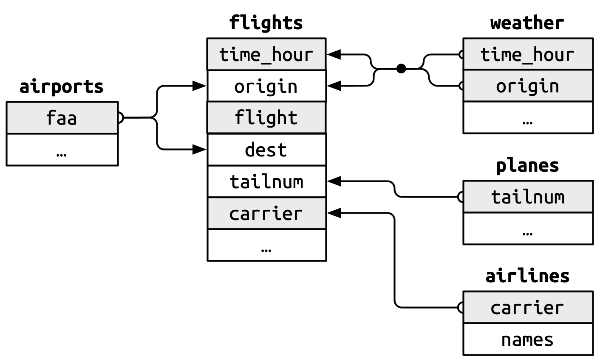
```

You’ll notice a nice feature in the design of these keys: the primary and foreign keys almost always have the same names, which, as you’ll see shortly, will make your joining life much easier. It’s also worth noting the opposite relationship: almost every variable name used in multiple tables has the same meaning in each place. There’s only one exception: `year` means year of departure in `flights` and year of manufacturer in `planes.` This will become important when we start actually joining tables together.

## Checking Primary Keys
### 

Now that that we’ve identified the primary keys in each table, it’s good practice to verify that they do indeed uniquely identify each observation. One way to do that is to `count()` the primary keys and look for entries where `n` is greater than one.

### Exercise 1

Start a pipe with `planes` to the `count()` function and within count set the argument as `tailnum`. Continue the pipe to the `filter()` function, setting `n > 1`. This will filter out any elements where the number of flights for a given `tailnum` is not greater than 1.

```{r checking-primary-keys-1, exercise = TRUE}

```

```{r checking-primary-keys-1-hint-1, eval = FALSE}
... |> 
  count(tailnum) |> 
  filter(...)
```

```{r checking-primary-keys-1-test, include = FALSE}
planes |> 
  count(tailnum) |> 
  filter(n > 1)
```

### 

The pipe returns no observations, thereby demonstrating that `tailnum` is good primary key.

### Exercise 2

Let's perform a similar check using `weather` data. Please replicate the previous code and modify the dataset to `weather`, while adjusting the `count()` argument to include `time_hour` and `origin` only.

```{r checking-primary-keys-2, exercise = TRUE}

```

<button onclick = "transfer_code(this)">Copy previous code</button>

```{r checking-primary-keys-2-hint-1, eval = FALSE}
... |> 
  count(time_hour, ...) |> 
  filter(n > 1)
```

```{r checking-primary-keys-2-test, include = FALSE}
weather |> 
  count(time_hour, origin) |> 
  filter(n > 1)
```

### 

There are also no records when we run the previous code which verifies that `time_hour` and `origin` are good primary keys. But what if there were some missing values with the primary keys?

### Exercise 3

Start a pipe with `planes` to `filter()` and set `is.na(tailnum)` as the argument.

```{r checking-primary-keys-3, exercise = TRUE}

```

```{r checking-primary-keys-3-hint-1, eval = FALSE}
planes |> 
  filter(is.na(...))
```

```{r checking-primary-keys-3-test, include = FALSE}
planes |> 
  filter(is.na(tailnum))
```

### 

You should also check for missing values in your primary keys — if a value is missing then it can’t identify an observation!

### Exercise 4

Let's perform a similar check using `weather` data. Replicate the previous code and modify the data set to `weather`, while adjusting the `is.na()` argument to include `time_hour`and a `|` or operator then pass `origin` for another `is.na()` argument.

```{r checking-primary-keys-4, exercise = TRUE}

```

<button onclick = "transfer_code(this)">Copy previous code</button>

```{r checking-primary-keys-4-hint-1, eval = FALSE}
... |> 
  filter(is.na(time_hour) | is.na(...))
```

```{r checking-primary-keys-4-test, include = FALSE}
weather |> 
  filter(is.na(time_hour) | is.na(origin))
```

### 

For `weather`, we use `|` to symbolize either. If either one of these values is `NA`, we must either drop it or modify it. 


<!-- TJ: Is this a good knowledge drop? -->

## Surrogate Keys
### 

So far we haven’t talked about the primary key for `flights`. It’s not super important here, because there are no data frames that use it as a foreign key, but it’s still useful to consider because it’s easier to work with observations if we have some way to describe them to others.

### Exercise 1

After a little thinking and experimentation, we determined that there are three variables that together uniquely identify each flight: `time_hour`, `carrier` and `flight`.

Let's verify if the following variables can be used a primary keys, start a pipe with `flights` to `count()` with the three variables we talked about earlier and then pipe that to `filter()` and set n to be greater than 1 .

```{r surrogate-keys-1, exercise = TRUE}

```

```{r surrogate-keys-1-hint-1, eval = FALSE}
... |> 
  count(time_hour, ..., flight) |> 
  ...
```

```{r surrogate-keys-1-test, include = FALSE}
flights |> 
  count(time_hour, carrier, flight) |> 
  filter(n>1)
```

### 

Does the absence of duplicates automatically make `time_hour`-`carrier`-`flight` a primary key? It’s certainly a good start, but it doesn’t guarantee it. For example, are altitude and latitude a good primary key for airports?

### Exercise 2

Let's check if altitude and latitude are good primary keys for airports. Copy the previous code and change the dataset to `airports` and change the argument within `count()` to `alt, lat`.

```{r surrogate-keys-2, exercise = TRUE}

```

<button onclick = "transfer_code(this)">Copy previous code</button>

```{r surrogate-keys-2-hint-1, eval = FALSE}
... |> 
  count(..., ...) |> 
  filter(...)
```

```{r surrogate-keys-2-test, include = FALSE}
airports |> 
  count(alt, lat) |> 
  filter(n > 1)
```

### 

Identifying an airport by its altitude and latitude is clearly a bad idea, and in general it’s not possible to know from the data alone whether or not a combination of variables makes a good a primary key. But for flights, the combination of `time_hour`, `carrier`, and `flight` seems reasonable because it would be really confusing for an airline and its customers if there were multiple flights with the same flight number in the air at the same time.

### Exercise 3

That said, we might be better off introducing a simple numeric surrogate key using the row number instead of confusing the airlines and customers tables by using three columns as primary keys. 

Let's make a new primary key `id` for `flights` by using row numbers. Start a pipe with `flights` and use `mutate()` function. Within `mutate()` assign `row_number()` function to the `id` column and set `.before` to 1.

```{r surrogate-keys-3, exercise = TRUE}

```

```{r surrogate-keys-3-hint-1, eval = FALSE}
flights |> 
  mutate(id = ..., .before = ...)
```

```{r surrogate-keys-3-test, include = FALSE}
flights |> 
  mutate(id = row_number(), .before = 1)
```

### 

This code adds a new column `id` with row numbers to the `flights` dataset, positioning it as the first column. Surrogate keys can be particular useful when communicating to other humans. It’s much easier to tell someone to take a look at flight 2001 than to say look at UA430 which departed at 9:00 am on 2013-01-03.

## Mutating Joins
### 

Now that you understand how data frames are connected via keys, we can start using joins to better understand the flights dataset. dplyr provides six join functions: `left_join()`, `inner_join()`, `right_join()`, `full_join()`, `semi_join()`, and `anti_join()`. They all have the same interface: they take a pair of data frames (`x` and `y`) and return a data frame. The order of the rows and columns in the output is primarily determined by `x`.

### 

In this section, you’ll learn how to use one mutating join, `left_join()`, and two filtering joins, `semi_join()` and `anti_join()`. In the next section, you’ll learn exactly how these functions work, and about the remaining `inner_join()`, `right_join()` and `full_join()`.

### Exercise 1

Start a pipe with `flights` to `select()` where you will select the following variables: `year, time_hour, origin, dest, tailnum, carrier` and then assign the whole code to `flights2` and run `flights2` on a new line.

```{r mutating-joins-1, exercise = TRUE}

```

```{r mutating-joins-1-hint-1, eval = FALSE}
flights2 <- ... |> 
 ...(year, ..., origin, dest, ....,...)
flights2
```

```{r mutating-joins-1-test, include = FALSE}
flights2 <- flights |> 
select(year, time_hour, origin, dest, tailnum,carrier)
flights2
```

### 

A **mutating join** allows you to combine variables from two data frames: it first matches observations by their keys, then copies across variables from one data frame to the other. Like `mutate()`, the join functions add variables to the right, so if your dataset has many variables, you won’t see the new ones. For these examples, we’ll make it easier to see what’s going on by creating a narrower dataset with just six variables.

### Exercise 2

To add full airline name to the `flights2` data, start a pipe with `flights2` to `left_join()` and pass in `airlines` as the argument.

```{r mutating-joins-2, exercise = TRUE}

```

```{r mutating-joins-2-hint-1, eval = FALSE}
... |>
  left_join(...)
```

```{r mutating-joins-2-test, include = FALSE}
flights2 |>
  left_join(airlines)
```

### 

Like `mutate()`, the join functions add variables to the right, so if your dataset has many variables, you won’t see the new ones as we saw in the previous code.

There are four types of mutating join, but there’s one that you’ll use almost all of the time: `left_join()`. It’s special because the output will always have the same rows as `x`, the data frame you’re joining to. The primary use of `left_join()` is to add in additional metadata. For example, we use `left_join()` to add the full airline name to the `flights2` data


### Exercise 3

Or we could find out the temperature and wind speed when each plane departed

Copy the previous code, modifying the argument for `left_join()` to `weather |> select(origin, time_hour, temp, wind_speed)`. 

```{r mutating-joins-3, exercise = TRUE}

```

<button onclick = "transfer_code(this)">Copy previous code</button>

```{r mutating-joins-3-hint-1, eval = FALSE}
... |> 
  ...(weather |> select(origin, time_hour, temp, wind_speed))
```

```{r mutating-joins-3-test, include = FALSE}
flights2 |> 
  left_join(weather |> select(origin, time_hour, temp, wind_speed))
```

### 

Here, we select the variables necessary from `weather` and add specifically those to the `flights2` tibble.

If you want to explore `left_join()` more in depth, check out this [website](https://dplyr.tidyverse.org/reference/mutate-joins.html).


### Exercise 4

What if we want to know the size of the plane? 

Copy the previous code and modify the argument in `left_join()` to `planes |> select(tailnum, type, engines, seats)` which selects the variable which are associated with a size of a plane.

```{r mutating-joins-4, exercise = TRUE}

```

<button onclick = "transfer_code(this)">Copy previous code</button>

```{r mutating-joins-4-hint-1, eval = FALSE}
... |> 
  ...(...)
```

```{r mutating-joins-4-test, include = FALSE}
flights2 |> 
  left_join(planes |> select(tailnum, type, engines, seats))
```

### 

What happens when `left_join()` fails to find a match for a row in x?

### Exercise 5

Start a pipe with `flights2` to `filter()` where you only select the records where the `tailnum` is equal to `"N3ALAA"` (which doesn't exist) and then continue the pipe to `left_join()` and pass in `planes |> select(tailnum, type, engines, seats)` as the argument.

```{r mutating-joins-5, exercise = TRUE}

```

```{r mutating-joins-5-hint-1, eval = FALSE}
flights2 |> 
  filter(...) |>
  left_join(...)
```

```{r mutating-joins-5-test, include = FALSE}
flights2 |> 
  filter(tailnum == "N3ALAA") |> 
  left_join(planes |> select(tailnum, type, engines, seats))
```

### 

When `left_join()` fails to find a match for a row in `x`, it fills in the new variables with missing values. For example, there’s no information about the plane with tail number `N3ALAA` so the `type`, `engines`, and `seats` will be missing, as indicated by `NA`.

### 

We’ll come back to this problem a few times in the rest of the chapter.


## Specifying join keys
### 

By default, `left_join()` will use all variables that appear in both data frames as the join key, the so called **natural** join. This is a useful heuristic, but it doesn’t always work. For example, what happens if we try to join `flights2` with the complete `planes` dataset?

### Exercise 1

To demonstrate the flaw, join the `flights2` with the `planes` dataset using `left_join()`. Start off by creating pipe with `flights2` to `left_join()` and pass in `planes` as the argument.

```{r specifying-join-keys-1, exercise = TRUE}

```

```{r specifying-join-keys-1-hint-1, eval = FALSE}
... |>
  left_join(...)
```

```{r specifying-join-keys-1-test, include = FALSE}
flights2 |>
  left_join(planes)
```

### 

We get a lot of missing matches because our join is trying to use `tailnum` and `year` as a compound key. Both `flights` and `planes` have a year column but they mean different things: `flights$year` is the year the flight occurred and `planes$year` is the year the plane was built. We only want to join on `tailnum` so we need to provide an explicit specification with `join_by()`.

### Exercise 2

Copy the previous code and within `left_join()`, add `join_by()` and pass in `tailnum` as the argument.

```{r specifying-join-keys-2, exercise = TRUE}

```

<button onclick = "transfer_code(this)">Copy previous code</button>

```{r specifying-join-keys-2-hint-1, eval = FALSE}
... |> 
  ...(planes, join_by(...))
```

```{r specifying-join-keys-2-test, include = FALSE}
flights2 |>
  left_join(planes, join_by(tailnum))
```

### 

Note that the year variables are disambiguated in the output with a suffix (`year.x` and `year.y`), which tells you whether the variable came from the `x` or `y` argument. You can override the default suffixes with the suffix argument.

`join_by(tailnum)` is short for `join_by(tailnum == tailnum)`. It’s important to know about this fuller form for two reasons. Firstly, it describes the relationship between the two tables: the keys must be equal. That’s why this type of join is often called an **equi join**. We'll learn more about these later.

### Exercise 3

`join_by()` gives us the flexibility to join based on the variables we want. For example we know that we can join `flights2` and `airports` by `dest` or `origin`.

Copy the previous code, changing `planes` to `airports` and, in, `join_by()` setting `dest == faa`.

```{r specifying-join-keys-3, exercise = TRUE}

```

<button onclick = "transfer_code(this)">Copy previous code</button>

```{r specifying-join-keys-3-hint-1, eval = FALSE}
... |> 
  ...(airports, join_by(...))
```

```{r specifying-join-keys-3-test, include = FALSE}
flights2 |>
  left_join(airports, join_by(dest == faa))
```

### 

<!-- DK: Lousy knowledge drop. This whole tutorial should be made much smoother.  -->

<!-- Now let's change `join_by()` to change the tables to join by `origin`. -->

We see that in the fourth row, the joined data is all `NA`. This is because the Aeropuerto Internacional Rafael Hernández, indicated by the `BQN` code in the `dest` column, is not found in the `airports` tibble. 

It’s how you specify different join keys in each table. For example, there are two ways to join the `flight2` and `airports` table: either by `dest` or `origin`, which we will do in the next exercise.

<!-- TJ: Are these knowledge drops better? -->


### Exercise 4

Copy the previous code and change `join_by()` argument to `origin == faa`.

```{r specifying-join-keys-4, exercise = TRUE}

```

<button onclick = "transfer_code(this)">Copy previous code</button>

```{r specifying-join-keys-4-hint-1, eval = FALSE}
... |> 
  ...(airports, join_by(...== ...))
```

```{r specifying-join-keys-4-test, include = FALSE}
flights2 |>
  left_join(airports, join_by(origin == faa))
```

### 

If we compare both the tibbles we can see the difference in the `name` variable. When we joined them by `dest`, we get the name of the destination, but when we joined them by `origin`, we get the name of the origin.

## Basic Filtering joins
### 

As you might guess the primary action of a **filtering join** is to filter the rows. There are two types: semi-joins and anti-joins. **Semi-joins** keep all rows in x that have a match in y. For example, we could use a semi-join to filter the airports dataset to show just the origin airports.

### Exercise 1

Start a pipe with `airports` to `semi_join()` and for the table which we will join, pass in `flights2` and also pass in `join_by(faa == origin)` which will collect all the rows that match in both tibbles.

```{r basic-filtering-joins-1, exercise = TRUE}

```

```{r basic-filtering-joins-1-hint-1, eval = FALSE}
... |> 
  ...(flights2, join_by(faa == ...))
```

```{r basic-filtering-joins-1-test, include = FALSE}
airports |> 
  semi_join(flights2, join_by(faa == origin))
```

### 

We only have three airports, `EWR`, `JFK` and `LGA`. With `semi_join`, we are now able to view the airport data for these three all in one tibble.

### Exercise 2

Copy your previous code but change `origin` to `dest`

```{r basic-filtering-joins-2, exercise = TRUE}

```

<button onclick = "transfer_code(this)">Copy previous code</button>

```{r basic-filtering-joins-2-hint-1, eval = FALSE}
airports |> 
  semi_join(flights2, join_by(faa == ...))
```

```{r basic-filtering-joins-2-test, include = FALSE}
airports |> 
  semi_join(flights2, join_by(faa == dest))
```

### 

Now, this shows just the destination airports.

### Exercise 3

Let's find rows that are missing from `airports` by looking for flights that don’t have a matching destination airport using `anti_join()`. First start a pipe with `flights2` to `anti_join()` which takes in `airports` as the joining tibble and we will tell it to join by `dest == faa`.
 
```{r basic-filtering-joins-3, exercise = TRUE}

```

```{r basic-filtering-joins-3-hint-1, eval = FALSE}
... |> 
  ...(airports, join_by(... == faa)
```

```{r basic-filtering-joins-3-test, include = FALSE}
flights2 |> 
  anti_join(airports, join_by(dest == faa)) |> 
  distinct(dest)
```

### 

**Anti-joins** are the opposite: they return all rows in x that don’t have a match in y. They’re useful for finding missing values that are **implicit** in the data. Implicitly missing values don’t show up as `NA`s but instead only exist as an absence.

We found four rows that are missing from `airports` but not in `flights`, you may notice one of them, `BQN`, which we talked about earlier.

### Exercise 4

Let's now find which `tailnums` are missing from planes. Copy the previous code, change the the table we will join from `airports` to `planes` and then modify `join_by()` argument to `tailnum`. Continue the pipe to `distinct()` and add `tailnum` as an argument.

```{r basic-filtering-joins-4, exercise = TRUE}

```

<button onclick = "transfer_code(this)">Copy previous code</button>

```{r basic-filtering-joins-4-hint-1, eval = FALSE}
... |>
  anti_join(..., join_by(tailnum)) |> 
  ...(tailnum)
```

```{r basic-filtering-joins-4-test, include = FALSE}
flights2 |> 
  anti_join(planes, join_by(tailnum)) |> 
  distinct(tailnum)
```

### 

These `tailnum`s are all in `flights2`, but, they are not present in `planes`. `anti_join()` helps us find these.

<!-- DK: Knowledge drop. -->

## How do joins work?
### 

<!-- DK: Rewrite this topic to ask questions! -->

Now that you’ve used joins a few times it’s time to learn more about how they work, focusing on how each row in `x` matches rows in `y`. We’ll begin by introducing a visual representation of joins, using the simple tibbles defined below  In these examples we’ll use a single key called `key` and a single value column (`val_x` and `val_y`), but the ideas all generalize to multiple keys and multiple values.

### Exercise 1

Our example tibbles:

```{r how-do-joins-work-1}
x <- tribble(
  ~key, ~val_x,
     1, "x1",
     2, "x2",
     3, "x3"
)
y <- tribble(
  ~key, ~val_y,
     1, "y1",
     2, "y2",
     4, "y3"
)
```

### Exercise 2

Print out `x` and `y` on separate lines

```{r how-do-joins-work-2, exercise = TRUE}

```

```{r how-do-joins-work-2-hint-1, eval = FALSE}
x
y
```

```{r how-do-joins-work-2-test, include = FALSE}
x
y
```

### 

Here is another graphical representation of the `x` and `y` tibbles:

```{r}
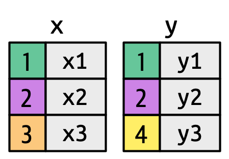
```

The colored key columns map background color to `key` value. The grey columns represent the “value” columns that are carried along for the ride.


### 

```{r}
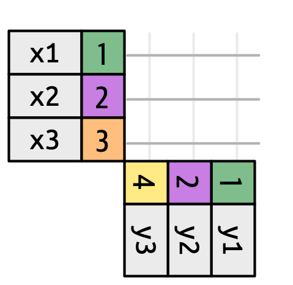
```

Now we are going to try to join these tibbles together. The image above depicts the foundation of our visual representation, showing potential matches between `x` and `y` as intersecting lines. The output's rows and columns align with the horizontal `x` table.

### Exercise 3

Pipe `x` to `inner_join()` with `y` as the argument.


```{r how-do-joins-work-3, exercise = TRUE}

```

```{r how-do-joins-work-3-hint-1, eval = FALSE}
x |>
  inner_join(...)
```

```{r how-do-joins-work-3-test, include = FALSE}
x |>
  inner_join(y)
```

### 

To describe a specific type of join, we indicate matches with dots. The matches determine the rows in the output, a new data frame that contains the key, the x values, and the y values. For example, the output above and the figure below show an inner join, where rows are retained if and only if the keys are equal. That is why we do not see `x3` or `y3`.

```{r}
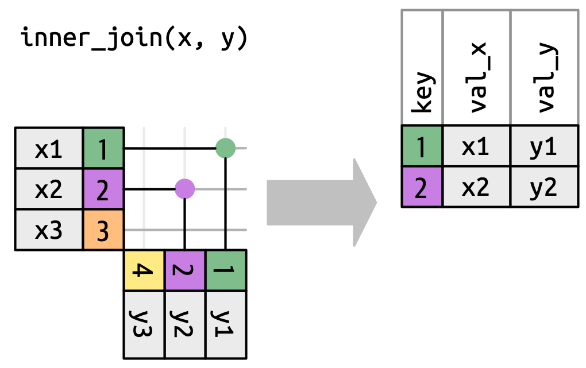
```

An inner join matches each row in `x` to the row in `y` that has the same value of `key`. Each match becomes a row in the output. We can apply the same principles to explain the outer joins, which keep observations that appear in at least one of the data frames. 

### Exercise 4

We can apply the same principles to explain the **outer joins**, which keep observations that appear in at least one of the data frames. These joins work by adding an additional “virtual” observation to each data frame. This observation has a key that matches if no other key matches, and values filled with `NA.` There are three types of outer joins:

### 

Pipe `x` to `left_join()` with the argument `y`


```{r how-do-joins-work-4, exercise = TRUE}

```

```{r how-do-joins-work-4-hint-1, eval = FALSE}
x |>
  left_join(...)
```

```{r how-do-joins-work-4-test, include = FALSE}
x |>
  left_join(y)
```

### 

The image below is a visual representation of the left join where every row in `x` appears in the output.

```{r}
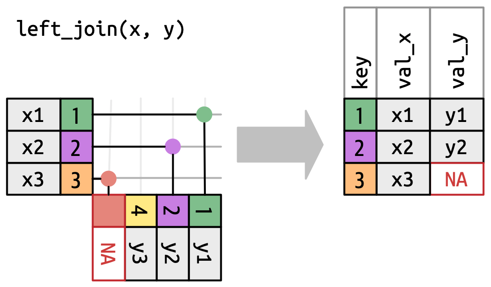
```

### 

A **left join** keeps all observations in `x`, like in the image below. Every row of `x` is preserved in the output because it can fall back to matching a row of `NAs` in `y`.

### Exercise 5

Copy the previous code but change `left_join()` to `right_join()``

```{r how-do-joins-work-5, exercise = TRUE}

```

<button onclick = "transfer_code(this)">Copy previous code</button>

```{r how-do-joins-work-5-hint-1, eval = FALSE}
x |>
  ...(y)
```

```{r how-do-joins-work-5-test, include = FALSE}
x |>
  right_join(y)
```

### 

The image below is a visual representation of the right join where every row of `y` appears in the output.

```{r}
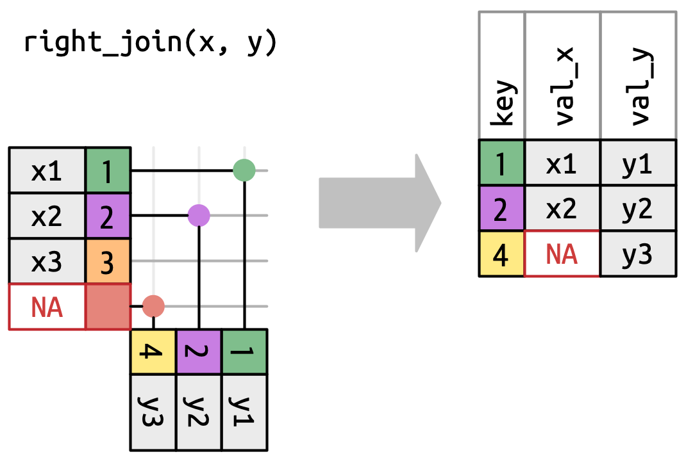
```

### 

A **right join** keeps all observations in `y`, like the image above. Every row of y is preserved in the output because it can fall back to matching a row of `NAs` in `x`. The output still matches `x` as much as possible; any extra rows from `y` are added to the end.

### Exercise 6

Copy the code again but run `full_join()` this time

```{r how-do-joins-work-6, exercise = TRUE}

```

<button onclick = "transfer_code(this)">Copy previous code</button>

```{r how-do-joins-work-6-hint-1, eval = FALSE}
x |>
  ...(y)
```

```{r how-do-joins-work-6-test, include = FALSE}
x |>
  full_join(y)
```

### 

The image below is  a visual representation of the full join where every row in `x` and `y` appears in the output.

```{r}
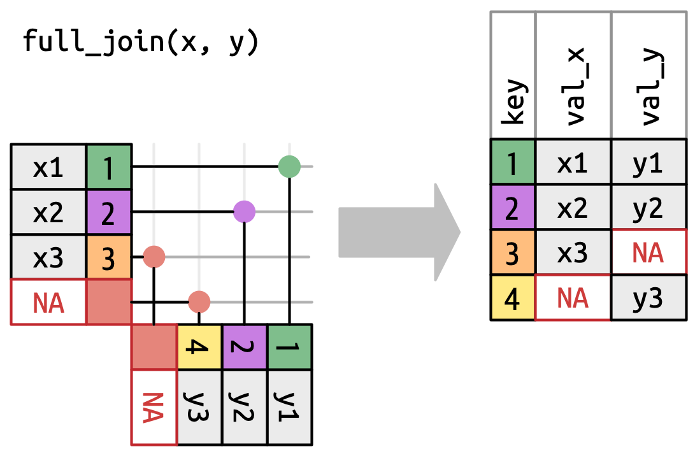
```

### 

A **full join** keeps all observations that appear in `x` or `y`, like the image above. Every row of x and y is included in the output because both `x` and `y` have a fall back row of `NAs`. Again, the output starts with all rows from `x`, followed by the remaining unmatched `y` rows.

### Exercise 7

Imagine we are using a Venn diagram to visualize the four types of joins that we have just gone over, describe how each join would be represented. 

<!-- TJ: Is this a good activity? -->


```{r how-do-joins-work-7}
question_text(NULL,
	answer(NULL, correct = TRUE),
	allow_retry = TRUE,
	try_again_button = "Edit Answer",
	incorrect = NULL,
	rows = 3)
```

### 

The image below is a visual representation Venn diagrams showing the difference between inner, left, right, and full joins. However, this is not a great representation because while it might jog your memory about which rows are preserved, it fails to illustrate what’s happening with the columns.

```{r}
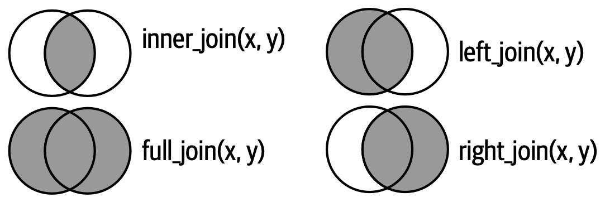
```

### 

The joins shown here are the so-called equi joins, where rows match if the keys are equal. Equi joins are the most common type of join, so we’ll typically omit the equi prefix, and just say “inner join” rather than “equi inner join”.

## Row Matching
### 

So far we’ve explored what happens if a row in `x` matches zero or one rows in `y`. What happens if it matches more than one row?

### Exercise 1

Run `df1` and `df2` on separate lines.

```{r row-matching-1, exercise = TRUE}


```

```{r row-matching-1-hint-1, eval = FALSE}
df1
df2
```

```{r row-matching-1-test, include = FALSE}
df1
df2
```

### 

You can see that the key `2` is repeated twice in `df2`.

### Exercise 2

Pipe `df1` to `inner_join()` with the argument `df2`.

```{r row-matching-2, exercise = TRUE}

```

```{r row-matching-2-hint-1, eval = FALSE}
df1 |>
  inner_join(...)
```

```{r row-matching-2-test, include = FALSE}
df1 |>
  inner_join(df2)
```

### 

The three ways a row in `x` can match. `x1` matches one row in `y`, `x2` matches two rows in `y`, `x3` matches zero rows in y. Note that while there are three rows in `x` and three rows in the output, there isn’t a direct correspondence between the rows.

```{r}
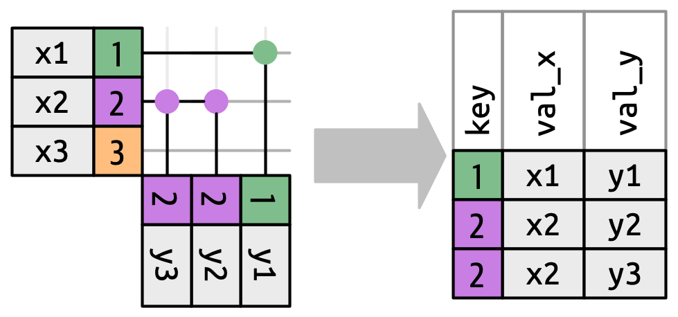
```

### 

There are three possible outcomes for a row in x:

If it doesn’t match anything, it’s dropped.
If it matches 1 row in y, it’s preserved.
If it matches more than 1 row in y, it’s duplicated once for each match.

### Exercise 3

Print out `df3` and `df4` on separate lines

```{r row-matching-3, exercise = TRUE}

```

```{r row-matching-3-hint-1, eval = FALSE}
df3
df4
```

```{r row-matching-3-test, include = FALSE}
df3
df4
```

### 

In principle, this means that there’s no guaranteed correspondence between the rows in the output and the rows in `x`, but in practice, this rarely causes problems. There is, however, one particularly dangerous case which can cause a combinatorial explosion of rows. Imagine joining these two tables

### Exercise 4

<!-- DK: It might be missing images of the tables? Or is it just supposed to be like that? -->

<!-- TJ: There is no image in the textbook -->

Pipe `df3` to `inner_join()` with `df4` as the argument. Add the `join_by(key)` argument.

```{r row-matching-4, exercise = TRUE}

```

```{r row-matching-4-hint-1, eval = FALSE}
df3 |>
  inner_join(..., join_by(...))
```

```{r row-matching-4-test, include = FALSE}
df3 |>
  inner_join(df4, join_by(key))
```

### 

While the first row in `df3` only matches one row in `df3`, the second and third rows both match two rows. This is sometimes called a `many-to-many` join, and will cause dplyr to emit a warning.

### Exercise 5

Add the `relationship` argument and set it equal to `"many-to-many"`

```{r row-matching-5, exercise = TRUE}

```

<button onclick = "transfer_code(this)">Copy previous code</button>

```{r row-matching-5-hint-1, eval = FALSE}

```

```{r row-matching-5-test, include = FALSE}
df3 |>
  inner_join(df4, join_by(key), relationship = "many-to-many")
```

### 

If you are doing this deliberately, you can set `relationship = "many-to-many"`, as the warning suggests. This will silence the warning and allow you to see the tibble.


## Filtering Joins
### 

The number of matches also determines the behavior of the filtering joins.

### Exercise 1

Pipe `x` to `semi_join()` with the argument `y`.

```{r filtering-joins-1, exercise = TRUE}

```

```{r filtering-joins-1-hint-1, eval = FALSE}
x |>
  semi_join(...)
```

```{r filtering-joins-1-test, include = FALSE}
x |>
  semi_join(y)
```

### 

The semi-join keeps rows in `x` that have one or more matches in `y`, as shown in the image below.

```{r}
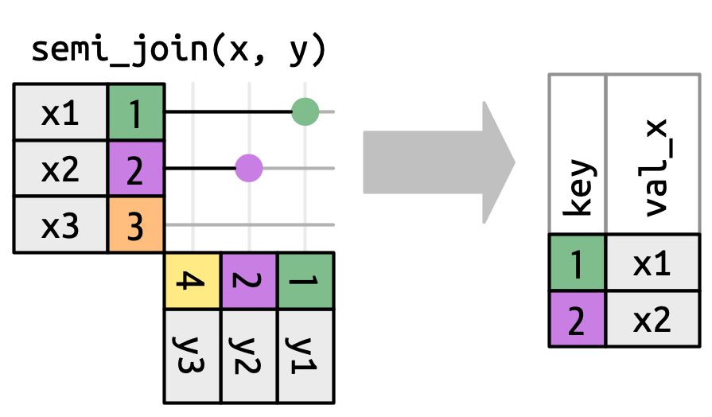
```

### 

In a semi-join it only matters that there is a match; otherwise values in `y` don’t affect the output.

### Exercise 2

Copy the previous code but change `semi_join()` to `anti_join()`

```{r filtering-joins-2, exercise = TRUE}

```

<button onclick = "transfer_code(this)">Copy previous code</button>

```{r filtering-joins-2-hint-1, eval = FALSE}
x |>
  ...(y)
```

```{r filtering-joins-2-test, include = FALSE}
x |>
  anti_join(y)
```

### 

The anti-join keeps rows in x that match zero rows in y, as shown in the image below. 

```{r}
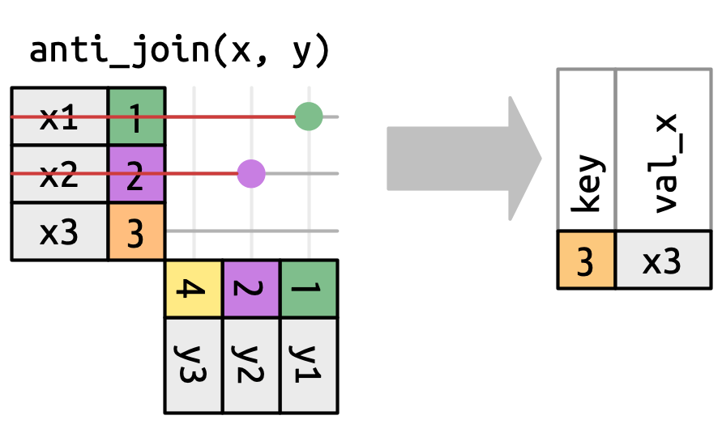
```

### 

An anti-join is the inverse of a semi-join, dropping rows from `x` that have a match in `y`.

### 

In both cases, only the existence of a match is important; it doesn’t matter how many times it matches. This means that filtering joins never duplicate rows like mutating joins do.


## Non-equi joins
### 

So far you’ve only seen equi joins, joins where the rows match if the `x` key equals the `y` key. Now we’re going to relax that restriction and discuss other ways of determining if a pair of rows match.

### 

Recall the `x` and `y` tibbles we used earlier

```{r}
#| echo: FALSE
x
y
```

<!-- DK: A lot of this is very sloppy. Need to create permanent objects in the setup chunk and inform students about them. -->

### Exercise 1

Pipe `x` to `inner_join()`. Add the arguments `y`, `join_by(key == key)` and `keep = TRUE`.

```{r nonequi-joins-1, exercise = TRUE}

```

```{r nonequi-joins-1-hint-1, eval = FALSE}
x |> 
  left_join(..., ... = "key", keep = ...)
```

```{r nonequi-joins-1-test, include = FALSE}
x |> 
  left_join(y, by = "key", keep = TRUE)
```

### 

But before we can do that, we need to revisit a simplification we made above. In equi joins the `x` keys and `y` are always equal, so we only need to show one in the output. We can request that `dplyr` keep both keys with `keep = TRUE`, leading to the code above and the re-drawn `inner_join()` in the image below.

```{r}
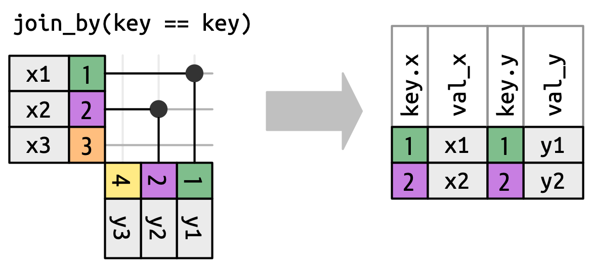
```

### Exercise 2

Copy/Paste the previous code but change `key == key` to `key >= key` inside of `join_by()`.

```{r nonequi-joins-2, exercise = TRUE}

```

<button onclick = "transfer_code(this)">Copy previous code</button>

```{r nonequi-joins-2-hint-1, eval = FALSE}
x |> inner_join(y, join_by(...), keep = TRUE)
```

```{r nonequi-joins-2-test, include = FALSE}
x |> inner_join(y, join_by(key >= key), keep = TRUE)
```

### 

When we move away from equi joins we’ll always show the keys, because the key values will often be different. For example, instead of matching only when the `x$key` and `y$key` are equal, we could match whenever the `x$key` is greater than or equal to the `y$key`, leading to the image below. dplyr’s join functions understand this distinction equi and non-equi joins so will always show both keys when you perform a non-equi join.


```{r}
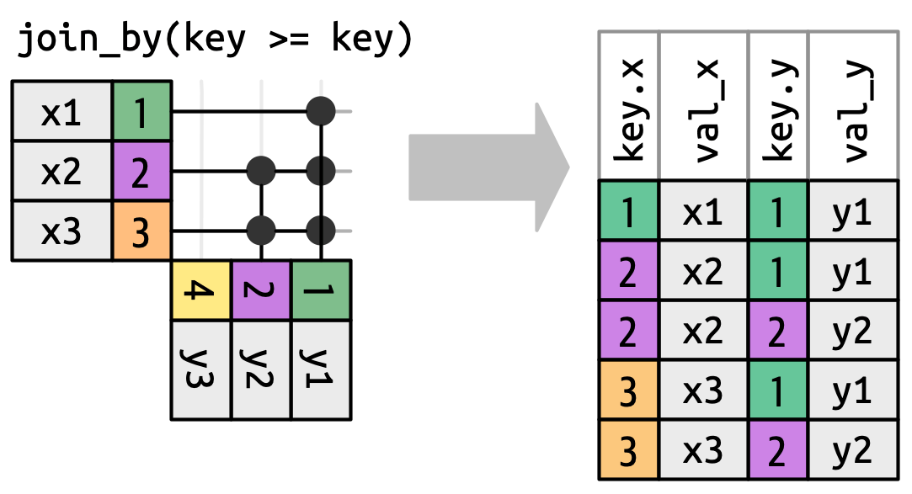
```

### 

Non-equi join isn’t a particularly useful term because it only tells you what the join is not, not what it is. dplyr helps by identifying four particularly useful types of non-equi join: 


**- Cross joins** match every pair of rows.
**- Inequality joins** use `<`, `<=`, `>`, and `>=` instead of `==`.
**- Rolling joins** are similar to inequality joins but only find the closest match.
**- Overlap joins** are a special type of inequality join designed to work with ranges.

Each of these is described in more detail in the following sections.

## Cross Joins
### 

A cross join matches everything, as in the image below, generating the Cartesian product of rows. This means the output will have `nrow(x) * nrow(y)` rows.

```{r}
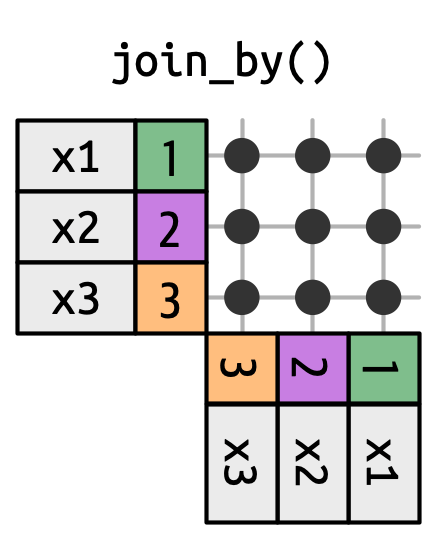
```

### 

The image above demonstrates a cross join matching each row in `x` with every row in `y`. Looking at the image we can see that cross joins are useful when generating permutations.

### Exercise 1

To make use of the permutations skills that this function has, let's first create a tibble `df` and assign `tibble(name = c("John", "Simon", "Tracy", "Max"))` to it.

```{r cross-joins-1, exercise = TRUE}

```

```{r cross-joins-1-hint-1, eval = FALSE}
df <- tibble(name = ...(...))
```

```{r cross-joins-1-test, include = FALSE}
df <- tibble(name = c("John", "Simon", "Tracy", "Max"))
```

### 

Using this tibble, we will be generating all the possible name combinations.

### Exercise 2

Pipe `df` to `cross_join()` and pass in `df` as the argument.

```{r cross-joins-2, exercise = TRUE}

```

```{r cross-joins-2-hint-1, eval = FALSE}
df |> 
  cross_join(...)
```

```{r cross-joins-2-test, include = FALSE}
df |> 
  cross_join(df)
```

### 

Cross joins are useful when generating permutations. For example, the code above generates every possible pair of names. Since we’re joining df to itself, this is sometimes called a **self-join**. Cross joins use a different join function because there’s no distinction between inner/left/right/full when you’re matching every row. 

## Inequality Joins
### 

Inequality joins use `<, <=, >=, or >` to restrict the set of possible matches. Below is what it looks like visually.

```{r}
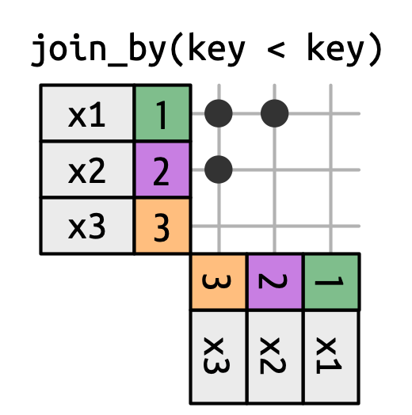
```

### 

An inequality join where `x` is joined to `y` on rows where the key of `x` is less than the key of `y`. This makes a triangular shape in the top-left corner.

### Exercise 1

Pipe `df` to `inner_join()` with the arguments `df` and `join_by(id < id)`

```{r inequality-joins-1, exercise = TRUE}

```

```{r inequality-joins-1-hint-1, eval = FALSE}
df |>
  join_by(...)
```

```{r inequality-joins-1-test, include = FALSE}
df |>
  join_by(id<id)
```

### 

Inequality joins are extremely general, so general that it’s hard to come up with meaningful specific use cases. One small useful technique is to use them to restrict the cross join so that instead of generating all permutations, we generate all combinations.

Compared to cross joins, we can see that with the inequality join, we were able to stop the names from being duplicated and instead got combinations.

## Rolling Joins
### 

Rolling joins are a special type of inequality join where instead of getting every row that satisfies the inequality, you get just the closest row, as in The figure below. You can turn any inequality join into a rolling join by adding `closest()`. For example `join_by(closest(x <= y))` matches the smallest y that’s greater than or equal to `x`, and `join_by(closest(x > y))` matches the biggest `y` that’s less than `x`.

```{r}
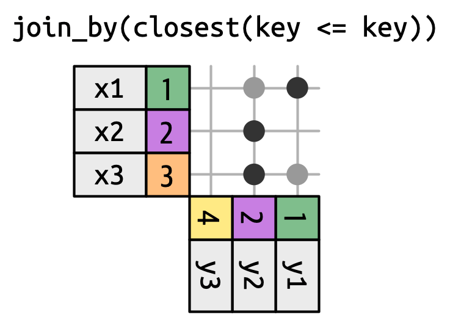
```

### 

Rolling joins are particularly useful when you have two tables of dates that don’t perfectly line up and you want to find (e.g.) the closest date in table 1 that comes before (or after) some date in table 2.

### Exercise 1

To demonstrate a use case of rolling joins, let's imagine that as the party planning commission for your office, you're responsible for organizing quarterly parties due to budget constraints. The rules for determining the party dates are as follows: parties are held on Mondays, the first week of January is skipped, and the first Monday of Q3 2022 falls on July 4, which needs to be postponed by a week. Here are the resulting party days: `2022-01-10`, `2022-04-04`, `2022-07-11`, `2022-10-03`.

### 

Create a tibble `parties` and add column `q`, pass in `1:4` for it. Then add another column `party` and pass in `ymd(c("2022-01-10", "2022-04-04", "2022-07-11", "2022-10-03"))`.

```{r rolling-joins-1, exercise = TRUE}

```

```{r rolling-joins-1-hint-1, eval = FALSE}
parties <- tibble(q = ..., party = ymd(c(...)))
```

```{r rolling-joins-1-test, include = FALSE}
parties <- tibble(q = 1:4, 
                  party = ymd(c("2022-01-10", 
                                "2022-04-04", 
                                "2022-07-11", 
                                "2022-10-03")))
```

### 

Now that we have the party dates, we need to have employee birthdays.

### Exercise 2

Let's now create a new tibble `employees` using `tibble()`. Make the first column, `name`, equal to `sample(babynames::babynames$name, 100)`

```{r rolling-joins-2, exercise = TRUE}

```

```{r rolling-joins-2-hint-1, eval = FALSE}
... <- tibble(
  name = sample(babynames::...$name, 100)
)
```

```{r rolling-joins-2-test, include = FALSE}
employees <- tibble(
  name = sample(babynames::babynames$name, 100)
)
```

### 

We are taking a sample of 100 random names from the `babynames` dataset.

### Exercise 3

Add a new column `birthday` and set it equal to `ymd("2022-01-01") + (sample(365, 100, replace = TRUE) - 1)`

```{r rolling-joins-3, exercise = TRUE}

```

<button onclick = "transfer_code(this)">Copy previous code</button>

```{r rolling-joins-3-hint-1, eval = FALSE}
... <- tibble( 
  ...,
  birthday = ...
)
```

```{r rolling-joins-3-test, include = FALSE}
employees <- tibble(
  name = sample(babynames::babynames$name, 100),
 birthday = ymd("2022-01-01") + (sample(365, 100, replace = TRUE) - 1)
)
```

### 

Now, we make 100 sample birthdays. Recall from the Dates and Times tutorial how we make a new date using `ymd`. We add any number from 1 to 365 and that becomes our new, random birth date. If you forgot, check out ["Chapter 17: Dates and Times from R for Data Science"](https://r4ds.hadley.nz/datetimes).

### Exercise 4

Print out `employees` to view the data

```{r rolling-joins-4, exercise = TRUE}

```

```{r rolling-joins-4-hint-1, eval = FALSE}
employees
```

```{r rolling-joins-4-test, include = FALSE}
employees
```

### 

We see that each employee has a name and birthday and there are 100 total employees.

### Exercise 5

To join the `employees` and `parties` tables, pipe `employees` to `left_join()`. Use `join_by()` to find the closest party dates after the birthday by applying `closest(birthday >= party)`.

```{r rolling-joins-5, exercise = TRUE}

```

```{r rolling-joins-5-hint-1, eval = FALSE}
... |> 
  left_join(..., join_by(...(birthday >= party)))
```

```{r rolling-joins-5-test, include = FALSE}
employees |> 
  left_join(parties, join_by(closest(birthday >= party)))
```

### 

There is, however, one problem with this approach.

### Exercise 6

Pipe `employees` to `anti_join()` with the arguments `parties` and `join_by(closest(birthday >= party))`

```{r rolling-joins-6, exercise = TRUE}

```

```{r rolling-joins-6-hint-1, eval = FALSE}

```

```{r rolling-joins-6-test, include = FALSE}

```

### 

This approach only looks for birthdays after January 10th and leaves out birthdays before that date, as shown above.

### Exercise 7

Copy the previous code and change the join from `left_join()` to `right_join()`.

```{r rolling-joins-7, exercise = TRUE}

```

<button onclick = "transfer_code(this)">Copy previous code</button>

```{r rolling-joins-7-hint-1, eval = FALSE}
employees |> 
  ...(parties, join_by(closest(birthday >= party)))
```

```{r rolling-joins-7-test, include = FALSE}
employees |> 
  right_join(parties, join_by(closest(birthday >= party)))
```

### 

To resolve that issue we’ll need to tackle the problem a different way, with overlap joins.

## Overlap Joins
### 

Let’s continue the birthday example to see how you might use them. There’s one problem with the strategy we used above: there’s no party preceding the birthdays on January 1 through 9. So it might be better to be explicit about the date ranges that each party spans, and make a special case for those early birthdays.

### Exercise 1

<!-- DK: These and other instructions are way too complex. Instead, build this tibble over the course of several exercises. This is good because it makes things possible for students to do easily and because it allows for lots of useful knowledge drops. -->

Make a new tibble, `parties2` using `tibble()`. Make the first column `q` equal to all consecutive integers from 1-4 using `:`. Next, make a new column called `party` and set it equal to `ymd()` with the argument `c("2022-01-10", "2022-04-04", "2022-07-11", "2022-10-03")`

```{r overlap-joins-1, exercise = TRUE}

```

```{r overlap-joins-1-hint-1, eval = FALSE}
parties2 <- tibble(
  q = ...,
  party = ymd(...)
)
```

```{r overlap-joins-1-test, include = FALSE}
parties2 <- tibble(
  q = 1:4,
  party = ymd(c("2022-01-10", "2022-04-04", "2022-07-11", "2022-10-03"))
)
```

### 

Overlap joins provide three helpers that use inequality joins to make it easier to work with intervals:

**-** `between(x, y_lower, y_upper)` is short for `x >= y_lower, x <= y_upper`.
`within(x_lower, x_upper, y_lower, y_upper)` is short for `x_lower >= y_lower, x_upper **-** <= y_upper`.
**-** `overlaps(x_lower, x_upper, y_lower, y_upper)` is short for `x_lower <= y_upper, x_upper >= y_lower`.

### Exercise 2

Make a new column `start` and set it equal to `ymd()` with the argument `c("2022-01-01", "2022-04-04", "2022-07-11", "2022-10-03")`.

```{r overlap-joins-2, exercise = TRUE}

```

<button onclick = "transfer_code(this)">Copy previous code</button>

```{r overlap-joins-2-hint-1, eval = FALSE}
... <- tibble(
  ...,
  ...,
  start = ymd(...)
)
```

```{r overlap-joins-2-test, include = FALSE}
parties2 <- tibble(
  q = 1:4,
  party = ymd(c("2022-01-10", "2022-04-04", "2022-07-11", "2022-10-03")),
  start = ymd(c("2022-01-01", "2022-04-04", "2022-07-11", "2022-10-03"))
)
```

### 

We are going to use ranges to figure out who gets what party. Now that we just made the `start` of the range, next we will make the `end` of the range.

### Exercise 3

Make a new column `end` and set it equal to `ymd()` with the argument `c("2022-04-03", "2022-07-11", "2022-10-02", "2022-12-31")`. Print `parties2` on a new line.

```{r overlap-joins-3, exercise = TRUE}

```

<button onclick = "transfer_code(this)">Copy previous code</button>

```{r overlap-joins-3-hint-1, eval = FALSE}
... <- tibble(
  ...,
  ...,
  ...,
  end = ymd(...)
)

...
```

```{r overlap-joins-3-test, include = FALSE}
parties2 <- tibble(
  q = 1:4,
  party = ymd(c("2022-01-10", "2022-04-04", "2022-07-11", "2022-10-03")),
  start = ymd(c("2022-01-01", "2022-04-04", "2022-07-11", "2022-10-03")),
  end = ymd(c("2022-04-03", "2022-07-11", "2022-10-02", "2022-12-31"))
)

parties2
```

### 

For each `party`, there is a `start` and `end` of the range. Anyone who's birthday falls into this range gets that party.

### Exercise 4

Hadley is hopelessly bad at data entry so he also wanted to check that the party periods don’t overlap. One way to do this is by using a self-join to check if any start-end interval overlap with another.

Start a pipe with `parties2` to `inner_join()` with the argument `parties2`.

```{r overlap-joins-4, exercise = TRUE}

```

```{r overlap-joins-4-hint-1, eval = FALSE}
... |> 
  inner_join(...)
```

```{r overlap-joins-4-test, include = FALSE}
parties2 |> 
  inner_join(parties2)
```

### 

If you want to explore move about overlap joins, check out [dplyr](https://dplyr.tidyverse.org/reference/join_by.html#overlap-joins).

### Exercise 5

Add the arguments `inner_join(parties, join_by(overlaps(start, end, start, end)` and `q < q`.

```{r overlap-joins-5, exercise = TRUE}

```

<button onclick = "transfer_code(this)">Copy previous code</button>

```{r overlap-joins-5-hint-1, eval = FALSE}
parties2 |>
  inner_join(parties2,
             ...)
```

```{r overlap-joins-5-test, include = FALSE}
# parties |> 
#   inner_join(parties, join_by(overlaps(start, end, start, end), q < q))
```

### 

You should get an error, but, do not worry since we will fix it.

### Exercise 6

Continue the pipe from `inner_join()` to `select()` and only select the `start.x, end.x, start.y, end.y`.

```{r overlap-joins-6, exercise = TRUE}

```

<button onclick = "transfer_code(this)">Copy previous code</button>

```{r overlap-joins-6-hint-1, eval = FALSE}
parties2 |> 
  inner_join(parties2, join_by(overlaps(start, end, start, end), q < q)) |> 
  select(..., ..., ..., ...)
```

```{r overlap-joins-6-test, include = FALSE}
parties2 |> 
  inner_join(parties2, join_by(overlaps(start, end, start, end), q < q)) |>
  select(start.x, end.x, start.y, end.y)
```

### 

Oops, there is an overlap, so let’s fix that problem and continue:

### Exercise 7

Go back to exercise 3 and copy your answer from there and paste it here, change the name of the tibble to `parties3` and change the 2nd data in `end` to `"2022-07-10"`.

```{r overlap-joins-7, exercise = TRUE}

```

```{r overlap-joins-7-hint-1, eval = FALSE}
... <- tibble(
  ...,
  party = ymd(c("2022-01-10", "2022-04-04", "2022-07-11", "2022-10-03")),
  ... = ymd(c("2022-01-01", "2022-04-04", ..., "2022-10-03")),
  end = ymd(c(..., "2022-07-10", ..., "2022-12-31"))
)
```

```{r overlap-joins-7-test, include = FALSE}
parties3 <- tibble(
  q = 1:4,
  party = ymd(c("2022-01-10", "2022-04-04", "2022-07-11", "2022-10-03")),
  start = ymd(c("2022-01-01", "2022-04-04", "2022-07-11", "2022-10-03")),
  end = ymd(c("2022-04-03", "2022-07-10", "2022-10-02", "2022-12-31"))
)
parties3
```

### 

Lets double check again to make sure.

### Exercise 8

Copy/Paste your code from exercise 6 but change the dataset to `parties3` from `parties2`

```{r overlap-joins-8, exercise = TRUE}

```

```{r overlap-joins-8-hint-1, eval = FALSE}

```

```{r overlap-joins-8-test, include = FALSE}

```

### 

There should be no rows in this tibble, which means that we have all of our dates correct. Now we can match each employee to their party.

### Exercise 9

Pipe `employees` to `inner_join()` with the first argument as `parties` and the second as `join_by(between(birthday, start, end))`. 

```{r overlap-joins-9, exercise = TRUE}

```

```{r overlap-joins-9-hint-1, eval = FALSE}
... |> 
      inner_join(parties3, ...(between(birthday, start, end)))
```

```{r overlap-joins-9-test, include = FALSE}
employees |> 
      inner_join(parties3, 
                 join_by(between(birthday, start, end)))
```

### 

Cool! It seems as if everyone has been given a party, but, we can't be so sure yet.

### Exercise 10

Add the argument `unmatched = "error"` at the end of `join_by()`

```{r overlap-joins-10, exercise = TRUE}

```

<button onclick = "transfer_code(this)">Copy previous code</button>

```{r overlap-joins-10-hint-1, eval = FALSE}
employees |> 
      inner_join(parties3, 
                 join_by(between(birthday, start, end)),
                 ...)
```

```{r overlap-joins-10-test, include = FALSE}
employees |> 
  inner_join(parties3, 
             join_by(between(birthday, start, end)), 
             unmatched = "error")

```

### 

The reason we added `unmatched = "error"` is because we want to quickly find out if any employees didn’t get assigned a party.

## Summary
### 

This tutorial covered [Chapter 19: Joins](https://r4ds.hadley.nz/joins.html) from [*R for Data Science (2e)*](https://r4ds.hadley.nz/) by Hadley Wickham, Mine Çetinkaya-Rundel, and Garrett Grolemund. 
This chapter introduced you to two important types of joins:
Mutating joins, which add new variables to one data frame from matching observations in another.

Filtering joins, which filter observations from one data frame based on whether or not they match an observation in another.

You also learned about basic joins, keys, foreign keys and more which is basically like creating a relational database in SQL.


```{r download-answers, child = system.file("child_documents/download_answers.Rmd", package = "tutorial.helpers")}
```
