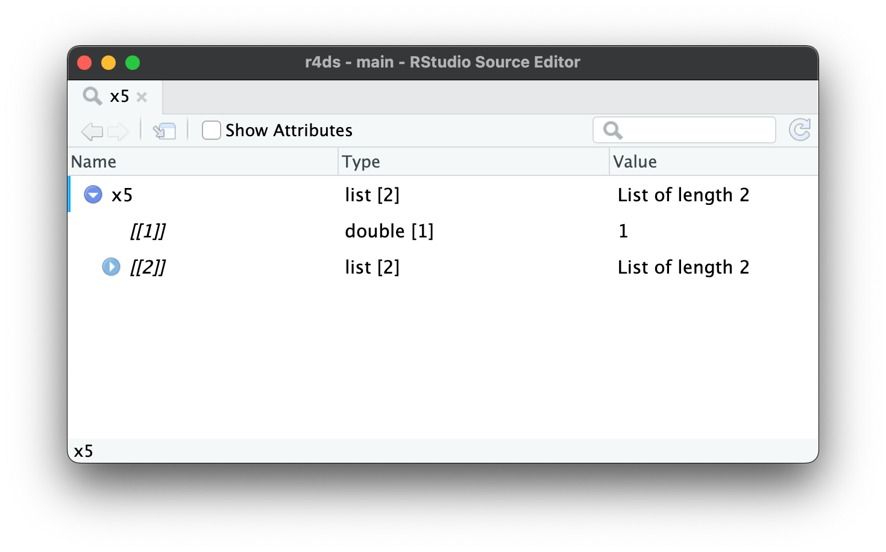
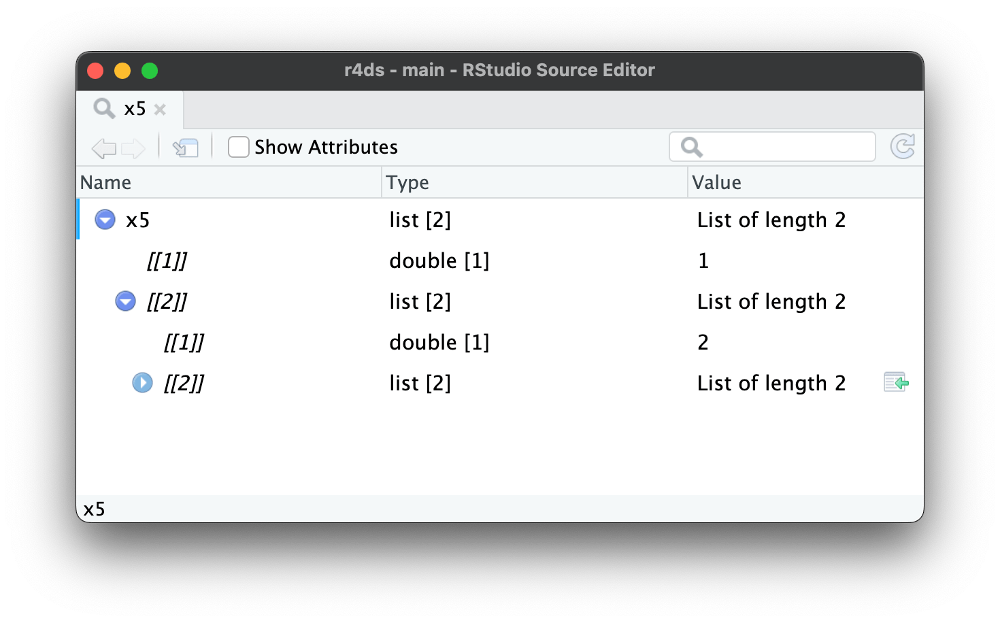
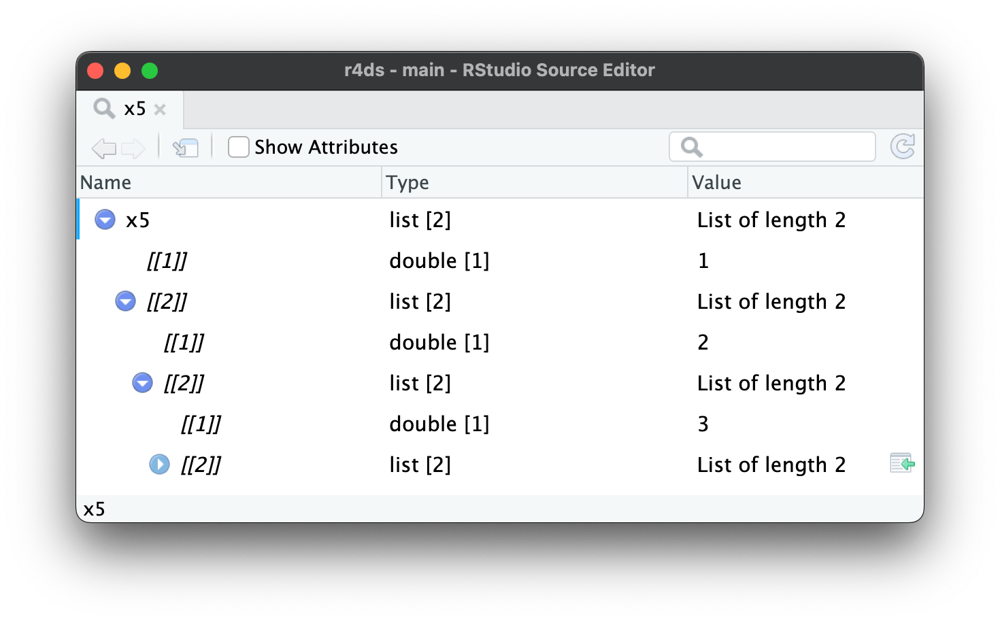

```{r setup, include = FALSE}
library(learnr)
library(tutorial.helpers)
library(tidyverse)
library(tidyverse)
library(repurrrsive)
library(jsonlite)
knitr::opts_chunk$set(echo = FALSE)
options(tutorial.exercise.timelimit = 60, 
        tutorial.storage = "local") 
x1 <- list(1:4, "a", TRUE)
x2 <- list(a = 1:2, b = 1:3, c = 1:4)
x5 <- list(1, list(2, list(3, list(4, list(5)))))
df <- tibble(
  x = 1:2, 
  y = c("a", "b"),
  z = list(list(1, 2), list(3, 4, 5))
)
df1 <- tribble(
  ~x, ~y,
  1, list(a = 11, b = 12),
  2, list(a = 21, b = 22),
  3, list(a = 31, b = 32)
)
df2 <- tribble(
  ~x, ~y,
  1, list(11, 12, 13),
  2, list(21),
  3, list(31, 32)
)
df6 <- tribble(
  ~x, ~y,
  "a", list(1, 2),
  "b", list(3),
  "c", list()
)

gh_users2 <- read_json(gh_users_json())

json <- '[
  {"name": "John", "age": 34},
  {"name": "Susan", "age": 27}
]'
json1 <- '{
  "status": "OK", 
  "results": [
    {"name": "John", "age": 34},
    {"name": "Susan", "age": 27}
 ]
}
'
df3 <- tibble(json = parse_json(json))
df4 <- tibble(json1 = list(parse_json(json1)))
```

```{r copy-code-chunk, child = system.file("child_documents/copy_button.Rmd", package = "tutorial.helpers")}
```

```{r info-section, child = system.file("child_documents/info_section.Rmd", package = "tutorial.helpers")}
```

## Introduction
### 

This tutorial covers [Chapter 24: Hierarchical data](https://r4ds.hadley.nz/rectangling.html) from [*R for Data Science (2e)*](https://r4ds.hadley.nz/) by Hadley Wickham, Mine Çetinkaya-Rundel, and Garrett Grolemund. You will learn how to work with non-rectanglar data using packages like [**jsonlite**](https://cran.r-project.org/web/packages/jsonlite/vignettes/json-aaquickstart.html). 


## Lists
### 

So far you’ve worked with data frames that contain simple vectors like integers, numbers, characters, date-times, and factors. These vectors are simple because they’re homogeneous: every element is of the same data type.If you want to store elements of different types in the same vector, you’ll need a list, which you create with `list()`.

### Exercise 1

To create our first list, let's create a variable x1 and assign the list() function to it. We will pass in three different data types within list(): the range of integers 1:4 to generate four integers, the string "a", and the Boolean value TRUE. On a new line, we'll call the variable x1. 

```{r lists-1, exercise = TRUE}

```

```{r lists-1-hint-1, eval = FALSE}
x1 <- list(...,"a",...)
x1
```

### 

When you run x1, you will get all the data types that were passed in, along with their corresponding indices. If you want to access a specific data type by its index, such as finding the element in the first index of x1, you can use the square brackets notation: x1[1]. This will return the integers. 

### Exercise 2

It's indeed convenient to name the components, or children, of a list. To accomplish this, let's create a new variable `x2` and assign the `list()` function to it. Within `list()`, we'll define three columns named `a`, `b`, and `c`. We'll assign `1:2` to `a`, `1:3` to `b`, and `1:4` to `c`. On a new line call `x2`.

```{r lists-2, exercise = TRUE}

```

```{r lists-2-hint-1, eval = FALSE}
... <- list(a = ..., b = ...,... = 1:4)
x2
```

### 

When you run `x2`, you will see that each column contains different values. To access individual columns of the list, you can use the `$` operator since we have named the columns. For example, to access the column a from `x2`, you can use `x2$a`. 

### Exercise 3

Even for these very simple lists, printing takes up quite a lot of space. A useful alternative is `str()`, which generates a compact display of the structure, de-emphasizing the contents.

Run `str()` and pass in `x1` and on a new line run `str()` again and pass in `x2`.

```{r lists-3, exercise = TRUE}

```

```{r lists-3-hint-1, eval = FALSE}
str(...)
str(...)
```

### 

As you can see, str() displays each child of the list on its own line. It displays the name, if present, then an abbreviation of the type, then the first few values.

### Exercise 4

Lists can contain any type of object, including other lists. This makes them suitable for representing hierarchical (tree-like) structures.

To create a representation of hierarchical structures, let's create a variable `x3` and assign `list()` to it. Within `list()`, we will pass in `list(1,2)` and `list(3,4)`. This means we will have two lists nested inside a single list. Then on a new line run `str()` and pass in `x3`.

```{r lists-4, exercise = TRUE}

```

```{r lists-4-hint-1, eval = FALSE}
... <- list(list(...), ...(3, 4))
str(...)
```

### 

This is notably different to `c()`, which generates a flat vector like when we run `c(c(1, 2), c(3, 4))`, we get `#> [1] 1 2 3 4` which is flat.

### Exercise 5

Now what if we pass in two list in a vector, will we get a heirichal vector or a flat vector?

To find out, create a new variable `x4` and assign it to vector function `c()`. Within `c()` pass in `list(1,2)` and pass in `list(3,4)`. On a new line, run `str()` and pass in `x4`.

```{r lists-5, exercise = TRUE}

```

```{r lists-5-hint-1, eval = FALSE}
... <- c(list(...), ...(3, ...))
str(...)
```

### 

Even when we pass in lists, we get no hierarchical data and just get the numbers in row like order.

### Exercise 6

As lists get more complex, `str()` gets more useful, as it lets you see the hierarchy at a glance.

Run `x5` which is very complex list.

```{r lists-6, exercise = TRUE}

```

```{r lists-6-hint-1, eval = FALSE}
x5
```

### 

when we ran `x5` we get some many duplicate numbers in brackets and it's all confusing and complex. This is where `str()` comes to shine.

### Exercise 7

Now run `str(x5)`.

```{r lists-7, exercise = TRUE}

```

<button onclick = "transfer_code(this)">Copy previous code</button>

```{r lists-7-hint-1, eval = FALSE}
str(x5)
```

### 

Now this dosen't mean in you should always use `str()` to visualize because as lists get even larger and more complex, `str()` eventually starts to fail, and you’ll need to switch to `View()`.

### Exercise 8

The image below show the result of calling `view(x5)`.

```{r}

```

### 

The RStudio view lets you interactively explore a complex list. The viewer opens showing only the top level of the list.

### Exercise 9

Clicking on the rightward facing triangle expands that component of the list so that you can also see its children like the image below.

```{r}

```

### 

You can repeat this operation as many times as needed to get to the data you’re interested in. Note the bottom-left corner: if you click an element of the list, RStudio will give you the sub-setting code needed to access it, in this case `x5[[2]][[2]][[2]]`

### Exercise 10

Like said previously, the image below is what it looks like if we repeat the operation.

```{r}

```

### 

Now that's we have knowledge of Hierarchy data, let's move on to List-columns.

### Exercise 11

Lists can also live inside a tibble, where we call them list-columns. List-columns are useful because they allow you to place objects in a tibble that wouldn’t usually belong in there.

To demonstrate a simple example of list-column, create a variable `df` and assign `tibble()` to it. Within `df` we will have three columns: `x`, `y`, `z`. Pass in `1:2` for `x`, `c("a","b")` for `y`, and `list(list(1,2),list(3,4,5))` for `z`. On a new line run `df`.

```{r lists-11, exercise = TRUE}

```

```{r lists-11-hint-1, eval = FALSE}
... <- tibble(
  ... = 1:2, 
  y = c("a", "b"),
 ... = list(list(1,...), ...(3, ..., 5))
)
df
```

### 

In particular, list-columns are used a lot in the tidymodels ecosystem, because they allow you to store things like model outputs or resamples in a data frame.

### Exercise 12

There’s nothing special about lists in a tibble; they behave like any other column. To show this, start a pipe with `df`  to `filter()` and we want all values where `x == 1` only.

```{r lists-12, exercise = TRUE}

```

```{r lists-12-hint-1, eval = FALSE}
df |> 
  filter(x == 1)
```

### 

Computing with list-columns is harder, but that’s because computing with lists is harder in general.

Good Work on finishing this section, next up , we'll be focusing on unnesting list-columns into regular variables.

<!-- AB: Should i add the base r thing that the book shows  -->

## Unnesting
### 

Now that you’ve learned the basics of lists and list-columns, let’s explore how you can turn them back into regular rows and columns. Here we’ll use very simple sample data so you can get the basic idea; in the next section we’ll switch to real data.

### Exercise 1

To generate simple sample data for this section, let's create a variable named `df1` and assign `tribble()` to it. Within `tribble()`, we will define the columns `~x` and `~y`. Now, to arrange the data in a specific order, follow these steps:

Set the value as 1 for `~x` and the list as list(a = 11, b = 12) for `~y`.
Repeat the above steps as needed for the rest.
Set the value as 2 and the list as list(a = 21, b = 22).
Set the value as 3 and the list as list(a = 31, b = 32).

```{r unnesting-1, exercise = TRUE}

```

<button onclick = "transfer_code(this)">Copy previous code</button>

```{r unnesting-1-hint-1, eval = FALSE}
... <- tribble(
  ~x, ~y,
  1, ...,
  ..., list(a = 21,...),
  3, list(..., b = 32),
)
```

### 

List-columns tend to come in two basic forms: named and unnamed. When the children are named, they tend to have the same names in every row. For example, in `df1`, every element of list-column y has two elements named a and b. Named list-columns naturally unnest into columns: each named element becomes a new named column.

### Exercise 2

Let's now create our second simple dataset. Copy the previous code and chnage the variable name to `df2` and the other thing we will change is `~y`. Remove all the old ones and insert the follwoing values:
`list(11, 12, 13)`, 
`list(21)`, and 
`list(31, 32)`.

```{r unnesting-2, exercise = TRUE}

```

<button onclick = "transfer_code(this)">Copy previous code</button>

```{r unnesting-2-hint-1, eval = FALSE}
df2 <- tribble(
  ~x, ...,
  ..., list(..., 12, 13),
  2, list(...),
  ..., list(31, ...),
)
```

### 

When the children are unnamed, the number of elements tends to vary from row-to-row. For example, in `df2`, the elements of list-column y are unnamed and vary in length from one to three. Now tidyr provides two functions for these two cases: `unnest_wider()` and `unnest_longer()`, which will help us explore the two sample data sets which we created.

### Exercise 3

Let's explore what `unnest_wider()` does, so start a pipe with `df1` to `unnest_wider()` and pass in the column `y` as the argument.

```{r unnesting-3, exercise = TRUE}

```

<button onclick = "transfer_code(this)">Copy previous code</button>

```{r unnesting-3-hint-1, eval = FALSE}
df1 |> 
  unnest_wider(...)
```

### 

When each row has the same number of elements with the same names, like `df1`, it’s natural to put each component into its own column with `unnest_wider()`.

### Exercise 4

By default, the names of the new columns come exclusively from the names of the list elements, but you can use the `names_sep` argument to request that they combine the column name and the element name. Copy the previous code and within `unnest_wider()` add `names_sep` and set it equal to `"_"`

```{r unnesting-4, exercise = TRUE}

```

<button onclick = "transfer_code(this)">Copy previous code</button>

```{r unnesting-4-hint-1, eval = FALSE}
... |> 
  unnest_wider(y, ... = "_")
```

### 

Compared to just passing in `y` in `unnest_wider()`, we can see the column name plus with the element name and that is how `unnest_wider()` works, now we will move into `unnest_longer()` which is more useful for data sample with different amount of data for record.

### Exercise 5

Start a pipe with `df2` to `unnest_longer()` and pass in `y` as the argument.

```{r unnesting-5, exercise = TRUE}

```

<button onclick = "transfer_code(this)">Copy previous code</button>

```{r unnesting-5-hint-1, eval = FALSE}
... |> 
  unnest_longer(y)
```

### 

When each row contains an unnamed list, it’s most natural to put each element into its own row with `unnest_longer()` which is what happend in the code above. Also note how `x` is duplicated for each element inside of `y`: we get one row of output for each element inside the list-column.

### Exercise 6

But what happens if one of the elements is empty? To see what happens, let's first create another sample of data, so create a new variable `df6` and assign it to `tribble()`. Within `tribble()`, we will define the columns `~x` and `~y`. Now, to arrange the data in a specific order, follow these steps:

Set the value as `"a"` for `~x` and the list as list(1,2) for `~y`.
Repeat the above steps as needed for the rest.
Set the value as `"b"` and the list as list(3).
Set the value as `"c"` and the list as list().

```{r unnesting-6, exercise = TRUE}

```

<button onclick = "transfer_code(this)">Copy previous code</button>

```{r unnesting-6-hint-1, eval = FALSE}
... <- tribble(
  ~x, ~y,
  "...", list(..., 2),
  "b", list(3),
  ..., ...
)
```

### 

As you can see we have a empty list for record `"c"`, next up we use `unnest_longer()` to test it out.


### Exercise 7

Start a pipe with `df6` to `unnest_longer()` and pass in the `y` column as the arguemnt for `unnest_longer()`.

```{r unnesting-7, exercise = TRUE}

```

<button onclick = "transfer_code(this)">Copy previous code</button>

```{r unnesting-7-hint-1, eval = FALSE}
... |> 
  unnest_longer(y)
```

### 

We get zero rows in the output, so the row effectively disappears. If you want to preserve that row, adding NA in y, set `keep_empty = TRUE`.

Good Work finishing unnesting section.


## Case Studies
### 

The main difference between the simple examples we used above and real data is that real data typically contains multiple levels of nesting that require multiple calls to `unnest_longer()` and/or `unnest_wider()`. To show that in action, this section works through three real rectangling challenges using datasets from the "repurrrsive" package.


### Exercise 1

```{r case-studies-1, exercise = TRUE}

```

<button onclick = "transfer_code(this)">Copy previous code</button>

```{r case-studies-1-hint-1, eval = FALSE}

```

### 

### Exercise 2

```{r case-studies-2, exercise = TRUE}

```

<button onclick = "transfer_code(this)">Copy previous code</button>

```{r case-studies-2-hint-1, eval = FALSE}

```

### 

### Exercise 3

```{r case-studies-3, exercise = TRUE}

```

<button onclick = "transfer_code(this)">Copy previous code</button>

```{r case-studies-3-hint-1, eval = FALSE}

```

### 

### Exercise 4

```{r case-studies-4, exercise = TRUE}

```

<button onclick = "transfer_code(this)">Copy previous code</button>

```{r case-studies-4-hint-1, eval = FALSE}

```

### 

### Exercise 5

```{r case-studies-5, exercise = TRUE}

```

<button onclick = "transfer_code(this)">Copy previous code</button>

```{r case-studies-5-hint-1, eval = FALSE}

```

### 

### Exercise 6

```{r case-studies-6, exercise = TRUE}

```

<button onclick = "transfer_code(this)">Copy previous code</button>

```{r case-studies-6-hint-1, eval = FALSE}

```

### 

### Exercise 7

```{r case-studies-7, exercise = TRUE}

```

<button onclick = "transfer_code(this)">Copy previous code</button>

```{r case-studies-7-hint-1, eval = FALSE}

```

### 

### Exercise 8

```{r case-studies-8, exercise = TRUE}

```

<button onclick = "transfer_code(this)">Copy previous code</button>

```{r case-studies-8-hint-1, eval = FALSE}

```

### 

### Exercise 9

```{r case-studies-9, exercise = TRUE}

```

<button onclick = "transfer_code(this)">Copy previous code</button>

```{r case-studies-9-hint-1, eval = FALSE}

```

### 

### Exercise 10

```{r case-studies-10, exercise = TRUE}

```

<button onclick = "transfer_code(this)">Copy previous code</button>

```{r case-studies-10-hint-1, eval = FALSE}

```

### 

### Exercise 11

```{r case-studies-11, exercise = TRUE}

```

<button onclick = "transfer_code(this)">Copy previous code</button>

```{r case-studies-11-hint-1, eval = FALSE}

```

### 

### Exercise 12

```{r case-studies-12, exercise = TRUE}

```

<button onclick = "transfer_code(this)">Copy previous code</button>

```{r case-studies-12-hint-1, eval = FALSE}

```

### 

### Exercise 13

```{r case-studies-13, exercise = TRUE}

```

<button onclick = "transfer_code(this)">Copy previous code</button>

```{r case-studies-13-hint-1, eval = FALSE}

```

### 

### Exercise 14

```{r case-studies-14, exercise = TRUE}

```

<button onclick = "transfer_code(this)">Copy previous code</button>

```{r case-studies-14-hint-1, eval = FALSE}

```

### 

### Exercise 15

```{r case-studies-15, exercise = TRUE}

```

<button onclick = "transfer_code(this)">Copy previous code</button>

```{r case-studies-15-hint-1, eval = FALSE}

```

### 

### Exercise 16

```{r case-studies-16, exercise = TRUE}

```

<button onclick = "transfer_code(this)">Copy previous code</button>

```{r case-studies-16-hint-1, eval = FALSE}

```

### 

### Exercise 17

```{r case-studies-17, exercise = TRUE}

```

<button onclick = "transfer_code(this)">Copy previous code</button>

```{r case-studies-17-hint-1, eval = FALSE}

```

### 


## JSON
### 

All of the case studies in the previous section were sourced from wild-caught JSON. JSON is short for javascript object notation and is the way that most web APIs return data. It’s important to understand it because while JSON and R’s data types are pretty similar, there isn’t a perfect 1-to-1 mapping, so it’s good to understand a bit about JSON if things go wrong.

<!-- SOmehow add the theoretical stuff baout json -->

### Exercise 1

To convert JSON into R data structures, we recommend the "jsonlite" package, by Jeroen Ooms. We’ll use only two jsonlite functions: `read_json()` and `parse_json()`. The "repurrsive" package also provides the source for `gh_user` as a JSON file and you can read it with `read_json()`.

Run `gh_users_json()` which gives you the path to the json file.

```{r json-1, exercise = TRUE}

```

<button onclick = "transfer_code(this)">Copy previous code</button>

```{r json-1-hint-1, eval = FALSE}
gh_users_json()
```

### 

Next up we will read the json file.

### Exercise 2

Create a new variable `gh_user2` and assign it to `read_json()` function and pass in the `gh_users_json()` function as argument.

```{r json-2, exercise = TRUE}

```

<button onclick = "transfer_code(this)">Copy previous code</button>

```{r json-2-hint-1, eval = FALSE}
gh_users2 <- read_json(...)
```

### 

JSON is a simple format designed to be easily read and written by machines, not humans. It has six key data types. Four of them are scalars:
1.Null Type : plays the same role as NA in R.
2.String :  much like a string in R, but must always use double quotes.
3.Number : similar to R’s numbers: they can use integer (e.g., 123), decimal (e.g., 123.45), or scientific (e.g., 1.23e3) notation. JSON doesn’t support `Inf`, `-Inf`, or `NaN`
4.Boolean: similar to R’s `TRUE` and `FALSE`, but uses lowercase `true` and `false`.


### Exercise 3

Run `identical()` and pass in `gh_users` and `gh_users2`.

```{r json-3, exercise = TRUE}

```

<button onclick = "transfer_code(this)">Copy previous code</button>

```{r json-3-hint-1, eval = FALSE}
identical(gh_users, gh_users2)
```

### 

In this course, we’ll also use `parse_json()`, since it takes a string containing JSON, which makes it good for generating simple examples.

### Exercise 4

To get started, let's parse string which contains the number 1. So run `str()` since we want a string output, then pass in `parse_json()` and within that pass in the string with number one.

```{r json-4, exercise = TRUE}

```

<button onclick = "transfer_code(this)">Copy previous code</button>

```{r json-4-hint-1, eval = FALSE}
str(..._...("1"))
```

### 

What will the output look like if i have multiple numbers in an array?

### Exercise 5

Copy the previous code, and change the argument within `parse_join()` to a string which contains the array `[1,2,3]`.

```{r json-5, exercise = TRUE}

```

<button onclick = "transfer_code(this)">Copy previous code</button>

```{r json-5-hint-1, eval = FALSE}
str(..._join("[...,...,...]"))
```

### 

The way we get the output is like a list. Now what happens if we mapped a variable to the array?

### Exercise 6

Copy the previous code, and within `parse_join()` change the arguemnt to a string which looks like `{"x": [1,2,3]}`.

```{r json-6, exercise = TRUE}

```

<button onclick = "transfer_code(this)">Copy previous code</button>

```{r json-6-hint-1, eval = FALSE}
...(parse_json('{"...": [1, 2, 3]}'))
```

### 

JSON’s strings, numbers, and booleans are pretty similar to R’s character, numeric, and logical vectors. The main difference is that JSON’s scalars can only represent a single value. To represent multiple values you need to use one of the two remaining types: arrays and objects.


### Exercise 7

In most cases, JSON files contain a single top-level array, because they’re designed to provide data about multiple “things”, e.g., multiple pages, or multiple records, or multiple results. In this case, you’ll start your rectangling with `tibble(json)` so that each element becomes a row.

Run `json` to have a quick look at the data before we dive in to parsing it and unnesting it.

```{r json-7, exercise = TRUE}

```

<button onclick = "transfer_code(this)">Copy previous code</button>

```{r json-7-hint-1, eval = FALSE}
json
```

### 

Jsonlite has another important function called `fromJSON()`. We don’t use it here because it performs automatic simplification `(simplifyVector = TRUE)`. This often works well, particularly in simple cases, but we think you’re better off doing the rectangling yourself so you know exactly what’s happening and can more easily handle the most complicated nested structures.

### Exercise 8

Now, let's transform the JSON to a list and store it within a tibble(). Create a variable called `df3` and assign it a `tibble()`. Within the `tibble()`, we will have a json column where `parse_json(json)` is set equal to `json`.

```{r json-8, exercise = TRUE}

```

<button onclick = "transfer_code(this)">Copy previous code</button>

```{r json-8-hint-1, eval = FALSE}
df3 <- tibble(... = parse_json(...))
```

### 

Yes , we have the data in tibble but we want to see the actual values instead of just seeing the amount of data in list being shown.

### Exercise 9

To make the names and age visible, we will start a pipe with `df3` to `unnest_wider()` and pass in `json` as the argument.

```{r json-9, exercise = TRUE}

```

<button onclick = "transfer_code(this)">Copy previous code</button>

```{r json-9-hint-1, eval = FALSE}
df3 |> 
  unnest_...(json)
```

### 

In rarer cases, the JSON file consists of a single top-level JSON object, but what do we do to explore the data if we have many top level objects?

### Exercise 10

Run `json1` to explore the dataset.

```{r json-10, exercise = TRUE}

```

<button onclick = "transfer_code(this)">Copy previous code</button>

```{r json-10-hint-1, eval = FALSE}
json1
```

### 

Compared to the json file we explored previously, we have two levels: `status` and `results`.


### Exercise 11

Let's now parse the `json1` and put it in a tibble. Create a variable `df4` and assign it to `tibble()`. Within `tibble(), set the column `json1` equal to `list(parse_join(json1))`. On a new line call `df4`.

```{r json-11, exercise = TRUE}

```

<button onclick = "transfer_code(this)">Copy previous code</button>

```{r json-11-hint-1, eval = FALSE}
df4 <- ...(json ... list(parse_json(...)))
```

### 

Both arrays and objects are similar to lists in R; the difference is whether or not they’re named. An array is like an unnamed list, and is written with []. For example [1, 2, 3] is an array containing 3 numbers, and [null, 1, "string", false] is an array that contains a null, a number, a string, and a boolean.

### Exercise 12

Start a pipe with `df4` to `unnest_wider()` and pass in `json` as the argument which will unnest the top level objects `status` and `results`. 

```{r json-12, exercise = TRUE}

```

<button onclick = "transfer_code(this)">Copy previous code</button>

```{r json-12-hint-1, eval = FALSE}
... |>
  unnest_wider(...)
```

### 

An object is like a named list, and is written with `{}`. The names (keys in JSON terminology) are strings, so must be surrounded by quotes. For example, `{"x": 1, "y": 2}` is an object that maps `x to 1` and `y to 2`.

### Exercise 13

Copy the previous code and continue the pipe from `unnest_wider()` to `unnest_longer()`. Within `unnest_longer()` pass in `results` which will unnest the columns `name` and `age` in `results`. 

```{r json-13, exercise = TRUE}

```

<button onclick = "transfer_code(this)">Copy previous code</button>

```{r json-13-hint-1, eval = FALSE}
... |>
  unnest_wider(...) |>
  unnest_...(...)
```

### 

If you want to explore more about "jsonlite" check out their [website](https://cran.r-project.org/web/packages/jsonlite/vignettes/json-aaquickstart.html).

### Exercise 14

Copy the previous code and continue the pipe from `unnest_longer()` to `unnest_wider()` and within it pass in `results` as the argument which will reveal the value within results.

```{r json-14, exercise = TRUE}

```

<button onclick = "transfer_code(this)">Copy previous code</button>

```{r json-14-hint-1, eval = FALSE}
... |>
  unnest_wider(...) |>
  unnest_...(...)|>
  ..._wider(...)
```

### 

Alternatively, you can reach inside the parsed JSON and start with the bit that you actually care about.

### Exercise 15

To do it faster, all we had to is the following:

```{r}
df4 <- tibble(results = parse_json(json1)$results)
df4 |> 
  unnest_wider(results)
```

### 

Good Work on finishing the tutorial!


## Summary
### 

This tutorial covered [Chapter 24: Hierarchical data](https://r4ds.hadley.nz/rectangling.html) from [*R for Data Science (2e)*](https://r4ds.hadley.nz/) by Hadley Wickham, Mine Çetinkaya-Rundel, and Garrett Grolemund. You learned how to work with non-rectanglar data using packages like [**jsonlite**](https://cran.r-project.org/web/packages/jsonlite/vignettes/json-aaquickstart.html).

```{r download-answers, child = system.file("child_documents/download_answers.Rmd", package = "tutorial.helpers")}
```
