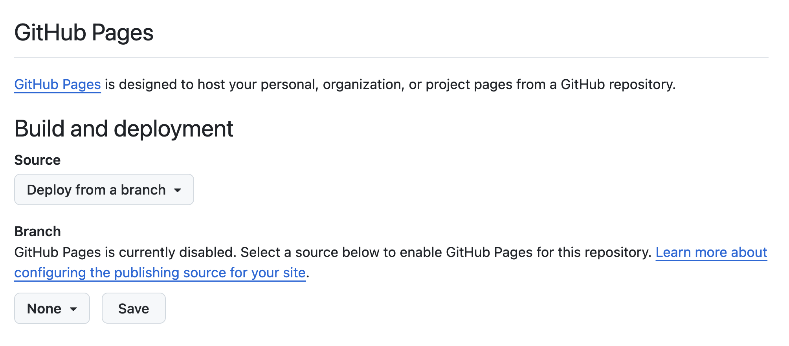

```{r setup, include = FALSE}
knitr::opts_chunk$set(echo = FALSE)
knitr::opts_chunk$set(out.width = '90%')
options(tutorial.exercise.timelimit = 240, 
        tutorial.storage = "local") 

library(learnr)
library(tutorial.helpers)
library(tidyverse)
library(quarto)
library(usethis)
```

```{r copy-code-chunk, child = system.file("child_documents/copy_button.Rmd", package = "tutorial.helpers")}
```

```{r info-section, child = system.file("child_documents/info_section.Rmd", package = "tutorial.helpers")}
```

<!-- Consider adding a Quarto 30 tutorial which would cover the material from chapter 29. Stuff like html widgets are interesting! Or maybe, since html widgets is the only really useful thing for websites, we just add that one example.  -->

<!-- Windows seems to make the creation of websites more difficult than it is on the Mac, especially with commands like quarto publish. See: https://discord.com/channels/1066524559240597595/1066524726278762608/1252099440496476190 and the following discussion for an example. -->

<!-- Perhaps related to the above:  https://discord.com/channels/1066524559240597595/1066524726278762608/1252082790585991238 -->

<!-- This of interest? Video: https://www.youtube.com/watch?v=uimdXPZc40I -->


<!-- Might be nice to have some actual testing, and some clean up of the files thereby created. -->

<!-- When using Quarto Pub, a _publish.yml file is created. I don't see that file when using GitHub Pages. That is too bad because, I think, without a _publish.yml we need to confirm the use of GitHub Pages each time. We can't just say `quarto publish`. -->


## Introduction
### 

This tutorial covers material from [Chapter 28 Quarto](https://r4ds.hadley.nz/quarto.html) and [Chapter 29 Quarto formats](https://r4ds.hadley.nz/quarto-formats.html) in [*R for Data Science (2e)*](https://r4ds.hadley.nz/quarto.html) by Hadley Wickham, Mine Çetinkaya-Rundel, and Garrett Grolemund, although much of the information from Chapter 28 has already appeared in the "RStudio and Github Introduction" tutorial in this package. You will
learn the process of creating and organizing the [Quarto websites](https://quarto.org/docs/websites/) using the [Quarto CLI](https://quarto.org/docs/get-started/) (command line interface) and commands like `quarto create project`, `quarto render`, `quarto preview` and `quarto publish`.

## Creating files
### 

Let's make a [Quarto website](https://quarto.org/docs/websites/).

### Exercise 1

Run `quarto --version` from the Terminal. CP/CR.

```{r creating-files-1}
question_text(NULL,
	answer(NULL, correct = TRUE),
	allow_retry = TRUE,
	try_again_button = "Edit Answer",
	incorrect = NULL,
	rows = 3)
```

### 

My answer:

```
Davids-MBP:r4ds.tutorials dkane$ quarto --version
bash: quarto: command not found
```

If it works for you --- i.e., if this command returns a Quarto version number --- then don't worry.

This failure is somewhat surprising since RStudio comes bundled with a version of Quarto, but that version is tucked away in a hard-to-use location, usually (on a Mac) something like:

```
/Applications/RStudio.app/Contents/Resources/app/quarto/bin/quarto
```

<!-- DK: Awkward: Perhaps run library(quarto) first to ensure that it is there.  -->

You can see the location on your machine by running `quarto::quarto_path()` at the R Console. Instead of installing a second version of Quarto --- and having to deal with all the weird problems which can arise from that --- we might just add this location to our PATH. But that can be tricky, so we just install another version of Quarto which will appear on the PATH by default.


### Exercise 2

If `quarto --version` failed in the previous Exercise, install [Quarto CLI](https://quarto.org/docs/get-started/) on your computer. Then, run `quarto --version` again from the Terminal. CP/CR. (You may need to restart RStudio after installing Quarto.)

```{r creating-files-2}
question_text(NULL,
	answer(NULL, correct = TRUE),
	allow_retry = TRUE,
	try_again_button = "Edit Answer",
	incorrect = NULL,
	rows = 3)
```

### 

My answer:

```
Davids-MBP:r4ds.tutorials dkane$ quarto --version
1.4.554
Davids-MBP:r4ds.tutorials dkane$ 
```

As long as the version is at least 1.4, you are OK. Again, having Quarto installed in two separate locations is a bit hacky, especially if they are different versions. But this seems a better approach then messing with your PATH.

### Exercise 3

On Github create a new public Github repo (called "first-website"). Make sure to click the "Add a README file" check box. Copy/paste the URL for its Github location.

```{r creating-files-3}
question_text(NULL,
	answer(NULL, correct = TRUE),
	allow_retry = TRUE,
	try_again_button = "Edit Answer",
	incorrect = NULL,
	rows = 3)
```

### 

Your answer should look something like:

```
https://github.com/davidkane9/first-website
```

Always start a new data science project with a new Github repo.


### Exercise 4

Connect the `first-website` Github repo to an R project on your computer. Name the R project `first-website` also. Keeping the names of repos/projects aligned makes organization simpler.

You will need to "Terminate Jobs" this tutorial to make the new project, and you will be placed into it after RStudio restarts as usual. Just restart the tutorial after this happens.

From the Terminal, run `ls`. CP/CR.

```{r creating-files-4}
question_text(NULL,
	answer(NULL, correct = TRUE),
	allow_retry = TRUE,
	try_again_button = "Edit Answer",
	incorrect = NULL,
	rows = 3)
```

### 

Your answer should look something like this:

```
Davids-MBP:first-website dkane$ ls
README.md               first-website.Rproj
Davids-MBP:first-website dkane$ 
```

The default README has an "md" suffix to indicate that it is a **M**ark**d**own document.


### Exercise 5

In the Terminal, run `quarto create project website .`.  Don't forget the `.` at the end of the command. This indicates that the new files should be placed in the current working directory. 

<!-- DK: Should make this more clear, even screen shots. -->

Depending on your computer setup, this command will generate require you to answer some questions. Do so as best you can. 

If you are asked for a "Title," use `A New Website`.

If given a choice, choose "rstudio" rather than "vscode." 

This command will usually result in a restart of your RStudio instance. Or it might create a second R instance, also located in the `first-website` directory. If so, close one of the instances. It does not matter which.

<!-- DK: The above is hacky! Is there a better approach? -->

CP/CR.

```{r creating-files-5}
question_text(NULL,
	answer(NULL, correct = TRUE),
	allow_retry = TRUE,
	try_again_button = "Edit Answer",
	incorrect = NULL,
	rows = 3)
```

### 

Your answer should look like this:

````
Davids-MacBook-Pro-2:first-website dkane$ quarto create project website .
? Title (website) › A New Website
Creating project at /Users/dkane/Desktop/projects/first-website:
  - Created _quarto.yml
  - Created .gitignore
  - Created index.qmd
  - Created about.qmd
  - Created styles.css
Davids-MacBook-Pro-2:first-website dkane$ 
````

Quarto is telling you what it did: creating 5 new files and placing them in the *current* directory. Recall that, on the command line, a `.` refers to the current directory. 

### Exercise 6

In the Console, run `list.files()`. CP/CR.

```{r creating-files-6}
question_text(NULL,
	answer(NULL, correct = TRUE),
	allow_retry = TRUE,
	try_again_button = "Edit Answer",
	incorrect = NULL,
	rows = 3)
```

### 

Your answer should look like:

````
> list.files()
[1] "_quarto.yml"         "about.qmd"           "first-website.Rproj" "index.qmd"          
[5] "README.md"           "styles.css"         
````

The basic set of files necessary for making a Quarto website has been added to the current directory. Note how we can work with the current directory either from the Terminal, with commands like `ls`, or from the Console, with commands like `list.files()`. It is important for you to be comfortable with both approaches, so we intermix them in this tutorial.


### Exercise 7

In the Console, run `list.files(all.files = TRUE)`. CP/CR. 

```{r creating-files-7}
question_text(NULL,
	answer(NULL, correct = TRUE),
	allow_retry = TRUE,
	try_again_button = "Edit Answer",
	incorrect = NULL,
	rows = 3)
```

### 

Your answer should look something like:

```
> list.files(all.files = TRUE)
 [1] "_quarto.yml"         "."                   ".."                       ".git"            
 [5] ".gitignore"          ".Rhistory"           ".Rproj.user"              "about.qmd"          
 [9] "first-website.Rproj" "index.qmd"           "README.md"                "styles.css"         
> 
```

### 

You would get the same set of files if, in the Terminal, you ran `ls -a`. The `-a` ensures that **a**ll the files are listed, included the "hidden" ones which begin with a dot. Recall that `..` means the directory one level above the current one.

### 

In general, we do not touch/manipulate "dot" directories, meaning directories whose names begin with a period. Such directories are meant to be used by the operating system and other programs. For example, the program Git uses the `.git` directory to store information about changes in all the files in the project. 


## Examining files
### 

Now that we have created the necessary files, it is useful to examine them one-by-one. The goal is to provide you with a good introductory lesson about how websites are put together.

### Exercise 1

In the Console, run:

````
show_file("_quarto.yml")
````

CP/CR.

Did you get an error when you ran this? Something about 'could not find function "show_file"'? This is because you need to `library(tutorial.helpers)` to have direct acccess to `show_file()`, which is a function in the **tutorial.helpers** package. Of course, you could use the double colon notation --- `tutorial.helpers::show_file("_quarto.yml")` --- as we did in previous tutorials. But, at this stage in your R education, we want you to become more comfortable with packages, and knowing yourself when they need to be loaded.


```{r examining-files-1}
question_text(NULL,
	answer(NULL, correct = TRUE),
	allow_retry = TRUE,
	try_again_button = "Edit Answer",
	incorrect = NULL,
	rows = 10)
```

### 

YAML files are how [Quarto projects](https://quarto.org/docs/projects/quarto-projects.html) tell the world what they are. You can tell that `_quarto.yml` is a YAML file by both its `yml` file name suffix and by its content. The initial lines specify that this is a website.

````
project:                                   
  type: website
````

But other values for `type` are possible.

### Exercise 2

In the Console, run:

````
show_file("_quarto.yml", start = 4, end = 10)
````

CP/CR.

```{r examining-files-2}
question_text(NULL,
	answer(NULL, correct = TRUE),
	allow_retry = TRUE,
	try_again_button = "Edit Answer",
	incorrect = NULL,
	rows = 3)
```

### 

These lines provide meta-information about the website and its organization. 

````
website:
  title: "A New Website"
  navbar:
    left:
      - href: index.qmd
        text: Home
      - about.qmd
````

Indents and other whitespace matter in the interpretation of a YAML file.

### Exercise 3

In the Source pane, open the `_quarto.yml` file by navigating to the file pane and pressing `_quarto.yml`. If the `title` field is not correct, often because it just contains a `.`, replace `title: "."` with `title: "A New Website"`. Save the file. 

In the Console, run:

````
show_file("_quarto.yml", start = 4, end = 10)
````

CP/CR.


```{r examining-files-3}
question_text(NULL,
	answer(NULL, correct = TRUE),
	allow_retry = TRUE,
	try_again_button = "Edit Answer",
	incorrect = NULL,
	rows = 3)
```

### 

The indentation before `title` should match that for`navbar` below it.

<!-- DK: I don't think that the below makes sense any more. Delete it? -->

<!-- With luck, future versions of `quarto create project` will use a `dir` argument to specify the location of the new files, thereby allowing the `name` argument to be used for a sensible title for a newly-created project. In the meantime, we need to set our title by hand. -->

### Exercise 4

In the Console, run:

````
show_file("_quarto.yml", start = 12, end = 16)
````

CP/CR.

```{r examining-files-4}
question_text(NULL,
	answer(NULL, correct = TRUE),
	allow_retry = TRUE,
	try_again_button = "Edit Answer",
	incorrect = NULL,
	rows = 3)
```

### 

These lines provide formatting information about the pages of the website. 

````
format:                                       
  html:
    theme: cosmo
    css: styles.css
    toc: true
````

The `css` line tells Quarto to use the `styles.css` file, located in the same directory, for the "style" of the pages.

### Exercise 5

In the Console, run:

````
show_file("index.qmd")
````

CP/CR.


```{r examining-files-5}
question_text(NULL,
	answer(NULL, correct = TRUE),
	allow_retry = TRUE,
	try_again_button = "Edit Answer",
	incorrect = NULL,
	rows = 3)
```

### 

The answer should look like:

````
> show_file("index.qmd")
---
title: "A New Website"
---

This is a Quarto website.

To learn more about Quarto websites visit <https://quarto.org/docs/websites>.
> 
````

Whenever a web browser goes to a directory on the internet, it looks for an `index.html` file. If found, that file is displayed. So, the `index.qmd` file, which we will soon render as `index.html`, is important.

### 

Note that the `title` (`"A New Website"`) in `_quarto.yml` has no necessary connection to the `title` (`"A New Website"`) in `index.qmd`. The former is the title for the entire website. The latter is the title for just the (yet-to-be-created) `index.html` page. They are set to the same values by default when we use `quarto create project website .` and answer the question about the title. 

If you do not answer the question or if you are using an old version of Quarto which does not ask the question, then the title will be `.` in both locations.

### Exercise 6

In the Console, run:

````
show_file(".gitignore")
````

CP/CR.


```{r examining-files-6}
question_text(NULL,
	answer(NULL, correct = TRUE),
	allow_retry = TRUE,
	try_again_button = "Edit Answer",
	incorrect = NULL,
	rows = 3)
```

### 

Your answer should look like this:

```
> show_file(".gitignore")
.Rproj.user
.Rhistory
.RData
.Ruserdata

/.quarto/
> 
```

Note that `.gitignore` contains a new line: `/.quarto/`. This was added when we ran `quarto create project`.  The leading `/` escapes the `.`. In other words, we need the leading `/` if we want to ignore the files in a dotted directory.

In fact, the `.quarto` directory does not yet exist. But the `quarto create project` command wanted to ensure that, once it does, Git would ignore it and its contents.


### Exercise 7

We don't want to put all the files on Github. So, let's make two changes to the `.gitignore` file: 

* Add `*Rproj` to exclude the `first-website.Rproj` file.
* Add an empty last line.

Save the file. 

In the Console, run:

````
show_file(".gitignore")
````

CP/CR.

```{r examining-files-7}
question_text(NULL,
    answer(NULL, correct = TRUE),
    allow_retry = TRUE,
    try_again_button = "Edit Answer",
    incorrect = NULL,
    rows = 6)
```

### 

Good data scientists believe in transparency and reproducibility. We want people --- include "future" us --- to be able to reproduce our work. By default, almost every file belongs on Github. But settings for R projects are both not necessary for replication and often specific to each individual. 


### Exercise 8

Commit and push all the files in the project. Run `git log` in the Terminal. CP/CR.

```{r examining-files-8}
question_text(NULL,
    answer(NULL, correct = TRUE),
    allow_retry = TRUE,
    try_again_button = "Edit Answer",
    incorrect = NULL,
    rows = 3)
```

### 

The output from the `git log` command is too complex for us to fully parse. If you want to learn more about how to work with Git/Github and R, check out [Happy Git with R](https://happygitwithr.com/existing-github-last.html), a very useful resource.


## Rendering and previewing
### 

We now have the infrastructure for our website. We want to create (or "render") the webpages themselves and then "preview" them to see what they will look like when we place them on the web.

### Exercise 1

From the Terminal, run `quarto render`. CP/CR.

```{r rendering-and-previewing-1}
question_text(NULL,
	answer(NULL, correct = TRUE),
	allow_retry = TRUE,
	try_again_button = "Edit Answer",
	incorrect = NULL,
	rows = 6)
```

### 

Your answer should look something like:

````
Davids-MBP:first-website dkane$ quarto render
[1/2] index.qmd
[2/2] about.qmd

Output created: _site/index.html

Davids-MBP:first-website dkane$ 
````

Quarto reports to us what it has done, working on our two QMD files and creating a new directory, `_site`, in which it has placed an `index.html` file. 


### 

If you look at the `_site` directory in the Files tab, you will see lots of new files, including `about.hmtl`. Quarto just tells you about the home page for the site, which is `index.html` by default, since that is the file that browsers like Google Chrome always look for.


### Exercise 2

From the Console, run `list.files("_site")`. CP/CR.


```{r rendering-and-previewing-2}
question_text(NULL,
	answer(NULL, correct = TRUE),
	allow_retry = TRUE,
	try_again_button = "Edit Answer",
	incorrect = NULL,
	rows = 3)
```

### 

Your answer will probably look something like:

````
> list.files("_site")
[1] "about.html"  "index.html"  "search.json" "site_libs"   "styles.css" 
>
````

The `about.html` and `index.html` files are simply the rendered `about.qmd` and `index.qmd` input files. They are placed into the `_site` directory because the convention, when constructing websites and other large projects, is to separate out the outputs from the inputs.

### 

The webpages which make up a website are often placed in a directory named either `_site` or `docs`, depending on the setup of your web hosting service.

We won't discuss the `search.json` and `styles.css` files. The `site_libs` directory includes many files beyond the scope of this tutorial. The basic idea is that the entire `_site` directory is a functioning website, ready to be deployed.

### Exercise 3

Add `/_site` to the `.gitignore`. Don't forget that the last line of a `.gitignore` should always be blank. Save the file. 

In the Console, run:

````
show_file(".gitignore")
````

CP/CR.

```{r rendering-and-previewing-3}
question_text(NULL,
	answer(NULL, correct = TRUE),
	allow_retry = TRUE,
	try_again_button = "Edit Answer",
	incorrect = NULL,
	rows = 3)
```

### 

This command is [convenient](https://quarto.org/docs/publishing/github-pages.html) because the `_site` directory contains of lot of weird files that change often enough to annoy. We don't create any of them directly, so we don't really need to back them up. Moreover, they will still get published directly to the web from our computer.

### 

The initial backslash in `/_site` allows Git to interpret `_site` correctly. The `/` escapes the `_`, allowing it to be treated as a literal, rather than special, character. See the "Regular expressions" tutorial in this package for more information. `_site` is a directory, so we could end the expression with a backslash, but Git, like most programs interpret `_site` and `_site/` to refer to the same thing, which they do.


### Exercise 4

From the Terminal, run `quarto preview`. CP/CR.

```{r rendering-and-previewing-4}
question_text(NULL,
	answer(NULL, correct = TRUE),
	allow_retry = TRUE,
	try_again_button = "Edit Answer",
	incorrect = NULL,
	rows = 3)
```

### 

Your answer should look something like this:

````
Davids-MBP:first-website dkane$ quarto preview
Preparing to preview
[1/1] index.qmd

Watching files for changes
Browse at http://localhost:7412/
GET: /
````

The `quarto preview` command does two things. First, it renders the QMD files, just like `quarto render` does. Second, it sets up a viewer --- probably your default web browser but possibly the "Viewer" tab in the Output pane  --- so that you can see what the website looks like. Click around and check it out!

The message at the end indicates that Quarto is now "watching" your files to see if you make any changes. If you do, it will automatically update the website.

### Exercise 5

Look at your website in the browser. (You might need to enter the URL by hand. It is `http://localhost:7412/` in my case, but yours will be different.) Click on the "About" link. 

Now, go to the Terminal. Copy-and-paste everything from the previous invocation of `quarto preview`.

```{r rendering-and-previewing-5}
question_text(NULL,
	answer(NULL, correct = TRUE),
	allow_retry = TRUE,
	try_again_button = "Edit Answer",
	incorrect = NULL,
	rows = 3)
```

### 

Your answer should look like this:

````
Davids-MBP:first-website dkane$ quarto preview
Preparing to preview

Watching files for changes
Browse at http://localhost:7193/
GET: /
GET: /about.html
````

Quarto is hanging out, still running in the background, monitoring your website. So, when you clicked the "About" link, it went to "GET" the `about.html` page to show to you.


### Exercise 6

Look again at your website in the browser. Click on the "Home" link and then copy/paste the entire screen.


```{r rendering-and-previewing-6}
question_text(NULL,
	answer(NULL, correct = TRUE),
	allow_retry = TRUE,
	try_again_button = "Edit Answer",
	incorrect = NULL,
	rows = 3)
```

### 

Your answer should look something like:

````
A New Website

Home
About
A New Website
This is a Quarto website.

To learn more about Quarto websites visit https://quarto.org/docs/websites.
````

The title of the entire project ("A New Website"), taken from the `_quarto.yml` file, appears in the upper left hand corner. The title of the main home page ("A New Website"), taken from the `index.qmd` file, appears at the top of the Home page, which, by default, is always the `index.html` file. 

(Depending on your browser and other settings, the copy/paste might also capture the "Home" and "About" links. No worry either way.)


### Exercise 7

Copy/paste the URL for your previewed website.

```{r rendering-and-previewing-7}
question_text(NULL,
	answer(NULL, correct = TRUE),
	allow_retry = TRUE,
	try_again_button = "Edit Answer",
	incorrect = NULL,
	rows = 3)
```

### 

Your answer should be something like:

````
http://localhost:7193/
````

The website is being "hosted" on your computer. That is what the word "localhost" refers to. It is not available on the web.


### Exercise 8

The advantage of using `quarto preview` is that the website is automatically updated whenever you edit and save the underlying QMD file. Try it by changing the `about.qmd` file, replacing "About this site" with your name. Save the file. 

At the Terminal, you should see a new message. Copy and paste it here.

```{r rendering-and-previewing-8}
question_text(NULL,
	answer(NULL, correct = TRUE),
	allow_retry = TRUE,
	try_again_button = "Edit Answer",
	incorrect = NULL,
	rows = 3)
```

### 

Your answer should look something like this:

````
pandoc 
  to: html
  output-file: about.html
  standalone: true
  title-prefix: A New Website
  section-divs: true
  html-math-method: mathjax
  wrap: none
  default-image-extension: png
  css:
    - styles.css
  toc: true
  
metadata
  document-css: false
  link-citations: true
  date-format: long
  lang: en
  theme: cosmo
  title: About
  
GET: /about.html

````

Quarto has noticed that you changed/saved the `about.qmd` file. It rendered the new version, creating a new `about.html` which it has now *gotten* and is displaying.

### Exercise 9

Copy/paste the About page from the Viewer pane or your browser. (We will just say "browser" going forward, but we mean wherever your website appears.)

```{r rendering-and-previewing-9}
question_text(NULL,
	answer(NULL, correct = TRUE),
	allow_retry = TRUE,
	try_again_button = "Edit Answer",
	incorrect = NULL,
	rows = 5)
```

### 

Your answer should look like this, except with your name instead of mine!

````
A New Website

Home
About
About
David Kane
````

If you want to stop `quarto preview` you can cancel the command by hitting the red stop sign which is located in the upper right of the Terminal tab. (If the red stop sign is not visible, you can also stop `quarto preview` by typing `Ctrl + c`.)

## Publishing
### 

To make your website publicly visible, you need to "publish" it to the web. The Quarto documentation provides a [thorough discussion](https://quarto.org/docs/publishing/).  We will be using [GitHub Pages](https://quarto.org/docs/publishing/github-pages.html). 


### Exercise 1

Go to your `first-website` Github repository. 

Click on the "Settings" option on the right side of the top menu.

Click on the "Pages" option on the lefthand side menu.  

Copy/paste the resulting URL.

```{r publishing-1}
question_text(NULL,
	answer(NULL, correct = TRUE),
	allow_retry = TRUE,
	try_again_button = "Edit Answer",
	incorrect = NULL,
	rows = 3)
```

### 

Your answer should look like:

````
https://github.com/davidkane9/first-website/settings/pages
````

This page shows the settings which control the behavior of Github pages. It should look something like this:

```{r echo = FALSE}

```

Sam Csik provides an [excellent overview](https://ucsb-meds.github.io/creating-quarto-websites/) of the entire process of creating Quarto websites. 

### Exercise 2

To use Github pages, we need to complete some set up work. The **[usethis](https://usethis.r-lib.org/)** package is designed to make this sort of work easier. 

In the Console, run `library(usethis)`. CP/CR.

```{r publishing-2}
question_text(NULL,
	answer(NULL, correct = TRUE),
	allow_retry = TRUE,
	try_again_button = "Edit Answer",
	incorrect = NULL,
	rows = 3)
```

### 

There are other free services you can use for hosting your websites, including [Quarto Pub](https://quarto.org/docs/publishing/quarto-pub.html) and [Posit Cloud](https://quarto.org/docs/publishing/posit-cloud.html).


### Exercise 3

At the Console, run `use_github_pages()`. CP/CR.

```{r publishing-3}
question_text(NULL,
	answer(NULL, correct = TRUE),
	allow_retry = TRUE,
	try_again_button = "Edit Answer",
	incorrect = NULL,
	rows = 3)
```

### 

You answer should look like:

````
> use_github_pages()
✔ Setting active project to '/Users/dkane/Desktop/projects/first-website'
✔ Initializing empty, orphan 'gh-pages' branch in GitHub repo 'davidkane9/first-website'
✔ GitHub Pages is publishing from:
• URL: 'https://davidkane9.github.io/first-website/'
• Branch: 'gh-pages'
• Path: '/'
> 
````

`use_github_pages()` has completed the set up for using Github pages. If you refresh the "Pages" page for your repo, it should look more like this:

```{r echo = FALSE}

```

Understanding the details of what these changes mean is beyond the scope of this tutorial.

<!-- DK: But we ought to explain it in the advanced tutorial, spreadout in various knowledge drops. -->

### Exercise 4

As the "Pages" page indicates, you now have a website. Copy/paste its URL. You may have to refresh a couple of times.

```{r publishing-4}
question_text(NULL,
	answer(NULL, correct = TRUE),
	allow_retry = TRUE,
	try_again_button = "Edit Answer",
	incorrect = NULL,
	rows = 3)
```

### 

The URL should be something like this:


````
https://davidkane9.github.io/first-website/
````

But, if you go to the URL, you will get an error message because you have not uploaded any of the necessary files.


### Exercise 5

Ensure that all the files in the project have been committed and pushed. (Recall that you have, at least, edited `about.qmd` and that doing so has caused changes in other downstream files.)

At the Terminal, run: 

`quarto publish gh-pages` 

You will then need to select "Yes" to accept the default settings. 

CP/CR the first few lines of the output.


```{r publishing-5}
question_text(NULL,
	answer(NULL, correct = TRUE),
	allow_retry = TRUE,
	try_again_button = "Edit Answer",
	incorrect = NULL,
	rows = 10)
```

### 

Your answer should look like this:

````
Davids-MacBook-Pro-2:first-website dkane$ quarto publish gh-pages
? Update site at https://davidkane9.github.io/first-website/? (Y/n) › Yes
From https://github.com/davidkane9/first-website
 * branch            gh-pages   -> FETCH_HEAD
 * [new branch]      gh-pages   -> origin/gh-pages
Rendering for publish:

[1/2] index.qmd
[2/2] about.qmd

Preparing worktree (new branch 'gh-pages')
branch 'gh-pages' set up to track 'origin/gh-pages'.
HEAD is now at 897554b Remove temp file
fatal: pathspec '.' did not match any files
[gh-pages 55c1b2a] Built site for gh-pages
 23 files changed, 6027 insertions(+)
 
...

origin  https://github.com/davidkane9/first-website (push)
To https://github.com/davidkane9/first-website
   897554b..55c1b2a  HEAD -> gh-pages

NOTE: GitHub Pages sites use caching so you might need to click the refresh
button within your web browser to see changes after deployment.

[✓] Deploying gh-pages branch to website (this may take a few minutes)
[✓] Published to https://davidkane9.github.io/first-website/

Davids-MacBook-Pro-2:first-website dkane$ 
````

`quarto publish`, like `quarto preview`, first renders all the files on the project. Note the phrase "Rendering for publish" in the output. The URL for the website is provided at the end.

### Exercise 6

A link to your new website should be brought up in a browser. Copy/paste the URL for your website. (It is the same URL which produced an error when we used it earlier.)

```{r publishing-6}
question_text(NULL,
	answer(NULL, correct = TRUE),
	allow_retry = TRUE,
	try_again_button = "Edit Answer",
	incorrect = NULL,
	rows = 3)
```

### 

It should look like:

````
https://davidkane9.github.io/first-website/
````

When using GitHub Pages, the URL will always have the same base: your GitHub user name followed by `github.io`. The second part of the URL will be the name of the repo. So, use non-stupid names for your repos.


### Exercise 7

If you look closely in the Files tab, you will see a new directory, `.quarto`, in the Files tab. Neither this directory, nor any of the files within it, appear in the Git tab because of the `/.quarto/` line in the `.gitignore` file.

From the Console, run `list.files(".quarto")`. CP/CR.

```{r publishing-7}
question_text(NULL,
	answer(NULL, correct = TRUE),
	allow_retry = TRUE,
	try_again_button = "Edit Answer",
	incorrect = NULL,
	rows = 3)
```

### 

The `.quarto` directory is like the `.git` and `.Rproj.user` directories. We will never look at or change the files inside of them. Only the relevant programs --- Quarto, Git and RStudio --- should work with the contents of these directories. 


### Exercise 8

Open the `_quarto.yml` file in the Source pane. Change `title: "A New Website"` to `title: "A New Website, second edition"`. Save the file.

In the Console, run:

````
show_file("_quarto.yml", start = 4, end = 5)
````

CP/CR.


```{r publishing-8}
question_text(NULL,
	answer(NULL, correct = TRUE),
	allow_retry = TRUE,
	try_again_button = "Edit Answer",
	incorrect = NULL,
	rows = 3)
```

### 

Your answer should look like:

````
> show_file("_quarto.yml", start = 4, end = 5)
website:                                 
  title: "A New Website, second edition"
>
````

Keep track of the three different places that the title of our project now exists. First, it is present in `_quarto.yml`. We have changed it there. But we have not changed it in the `_site` files which constitute the website nor in files uploaded to Github Pages.


### Exercise 9

From the Terminal, run `quarto preview`. Copy and paste the text from the home page once it comes up on your browser.

```{r publishing-9}
question_text(NULL,
	answer(NULL, correct = TRUE),
	allow_retry = TRUE,
	try_again_button = "Edit Answer",
	incorrect = NULL,
	rows = 3)
```

### 

Your answer should look like:

````
A New Website, second edition

Home
About
A New Website
This is a Quarto website.

To learn more about Quarto websites visit https://quarto.org/docs/websites.
````

But, if you look at the Github Pages version of your website, it still uses the "A New Website" title because we have not (yet) published our new version. We have, however, changed the files in the `_site` directory.

### Exercise 10

Stop the `quarto preview` command by hitting the red stop sign on the upper right of the Terminal tab. From the Terminal, run `quarto publish`. You may need to hit `return/enter` to confirm that you still want to use GitHub Pages. Refresh once after you are on yout website.

CP/CR.


```{r publishing-10}
question_text(NULL,
	answer(NULL, correct = TRUE),
	allow_retry = TRUE,
	try_again_button = "Edit Answer",
	incorrect = NULL,
	rows = 6)
```

### 

Your answer should look like:

````
Davids-MacBook-Pro-2:first-website dkane$ quarto publish
? Publish update to: › https://davidkane9.github.io/first-website/ (GitHub Pages)
From https://github.com/davidkane9/first-website
 * branch            gh-pages   -> FETCH_HEAD
Rendering for publish:

[1/2] index.qmd
[2/2] about.qmd

Preparing worktree (resetting branch 'gh-pages'; was at 2576ffd)
branch 'gh-pages' set up to track 'origin/gh-pages'.
HEAD is now at 2576ffd Built site for gh-pages
[gh-pages f262006] Built site for gh-pages
 3 files changed, 5 insertions(+), 5 deletions(-)
origin  https://github.com/davidkane9/first-website (fetch)
origin  https://github.com/davidkane9/first-website (push)
To https://github.com/davidkane9/first-website
   2576ffd..f262006  HEAD -> gh-pages

NOTE: GitHub Pages sites use caching so you might need to click the refresh
button within your web browser to see changes after deployment.

[✓] Deploying gh-pages branch to website (this may take a few minutes)
[✓] Published to https://davidkane9.github.io/first-website/

Davids-MacBook-Pro-2:first-website dkane$ 
````

<!-- DK: Drop some knowledge about gh-pages branch stuff. -->


### Exercise 11

Commit and push all the files in the project. Run `git log -n 2` in the Terminal. CP/CR. 

The `-n 2` option causes Git to just provide the information on the last two commits.

```{r publishing-11}
question_text(NULL,
	answer(NULL, correct = TRUE),
	allow_retry = TRUE,
	try_again_button = "Edit Answer",
	incorrect = NULL,
	rows = 3)
```

### 

Note both the simplicity *and* the complexity of your project. It is simple in that, even if our computer blew up we would be able to recreate everything from the files on Github. It is complex in that there are a lot of files, interacting in a fairly sophisticated fashion.


## Summary
### 

This tutorial covered material from [Chapter 28 Quarto](https://r4ds.hadley.nz/quarto.html) and [Chapter 29 Quarto formats](https://r4ds.hadley.nz/quarto-formats.html) in [*R for Data Science (2e)*](https://r4ds.hadley.nz/quarto.html) by Hadley Wickham, Mine Çetinkaya-Rundel, and Garrett Grolemund, although much of the information from Chapter 28 has already appeared in the "RStudio and Github" tutorial in this package. You have
learned the process of creating and organizing the [Quarto websites](https://quarto.org/docs/websites/) using the [Quarto CLI](https://quarto.org/docs/get-started/) (command line interface) and commands like `quarto create project`, `quarto render`, `quarto preview` and `quarto publish`.

Sam Csik provides an [excellent overview](https://ucsb-meds.github.io/creating-quarto-websites/) of the entire process of creating Quarto websites.


```{r download-answers, child = system.file("child_documents/download_answers.Rmd", package = "tutorial.helpers")}
```
